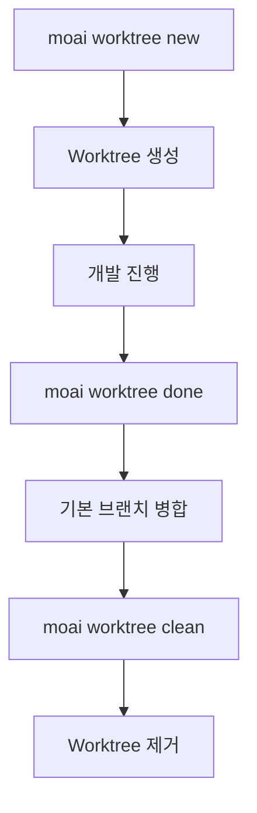

MoAI-ADK 명령줄 인터페이스의 모든 명령어와 옵션을 참조하세요.

## 명령어 목록

```bash
moai --help
```

**출력 예시:**

```
MoAI-ADK - Agentic Development Kit for Claude Code

Usage:
  moai [command]

Available Commands:
  init        Interactive project setup (auto-detects language/framework/methodology)
  doctor      System health diagnosis and environment verification
  status      Project status summary including Git branch, quality metrics, etc.
  update      Update to the latest version (with automatic rollback support)
  worktree    Manage Git worktrees for parallel SPEC development
  hook        Claude Code hook dispatcher
  profile     Manage Claude Code configuration profiles
  glm         Switch to GLM backend (cost-effective) or update API key
  claude      Switch to Claude backend (Anthropic API)
  version     Display version, commit hash, and build date

Flags:
  -h, --help      help for moai
  -v, --version   version for moai
```

| 명령어 | 설명 |
|--------|------|
| `moai init` | 프로젝트 초기화 (언어/프레임워크/방법론 자동 감지) |
| `moai doctor` | 시스템 진단 및 환경 검증 |
| `moai status` | 프로젝트 상태 요약 (Git 브랜치, 품질 메트릭 등) |
| `moai update` | 최신 버전 업데이트 (자동 롤백 지원) |
| `moai worktree` | Git worktree 관리 (병렬 SPEC 개발) |
| `moai hook` | Claude Code 훅 디스패처 |
| `moai profile` | Profile 관리 (list, setup, current, delete) |
| `moai glm` | GLM 백엔드 전환 (`--team`: GLM Worker 모드) |
| `moai claude`, `moai cc` | Claude 백엔드 전환 |
| `moai cg` | CG 모드 활성화 — Claude 리더 + GLM 팀원 (tmux 필수) |
| `moai version` | 버전, 커밋 해시, 빌드 날짜 표시 |

---

## moai init

프로젝트를 초기화합니다.

```bash
moai init [PATH] [OPTIONS]
```

### 옵션

| 옵션 | 설명 |
|------|------|
| `-y, --non-interactive` | 비대화형 모드 (기본값 사용) |
| `--mode [personal\|team]` | 프로젝트 모드 |
| `--locale [ko\|en\|ja\|zh]` | 선호 언어 (기본값: en) |
| `--language TEXT` | 프로그래밍 언어 (지정 시 자동 감지) |
| `--force` | 확인 없이 강제 재초기화 |

### 예시

```bash
# 새 프로젝트 초기화
moai init my-project

# 한국어, 팀 모드
moai init my-project --locale ko --mode team

# Python 프로젝트
moai init --language python
```

---

## moai update

MoAI-ADK를 최신 버전으로 업데이트합니다.

```bash
moai update [OPTIONS]
```

### 옵션

| 옵션 | 설명 |
|------|------|
| `--path PATH` | 프로젝트 경로 (기본값: 현재 디렉토리) |
| `--force` | 백업 없이 강제 업데이트 |
| `--check` | 버전 확인만 (업데이트 안 함) |
| `--project` | 프로젝트 템플릿만 동기화 |
| `--templates-only` | 템플릿만 동기화 (패키지 업그레이드 건너뜀) |
| `--yes` | 자동 확인 (CI/CD 모드) |
| `-c, --config` | 프로젝트 설정 편집 (초기 설정 마법사와 동일) |
| `--merge` | 자동 병합 (사용자 변경 보존) |
| `--manual` | 수동 병합 (가이드 생성) |

### 예시

```bash
# 업데이트 확인
moai update --check

# 강제 업데이트
moai update --force

# 자동 병합
moai update --merge
```


**중요:** `--force` 옵션은 백업을 생성하지 않습니다. 사용자 변경 사항이 손실될 수 있습니다.


---

## moai doctor

시스템 진단을 실행합니다.

```bash
moai doctor [OPTIONS]
```

### 옵션

| 옵션 | 설명 |
|------|------|
| `-v, --verbose` | 상세 도구 버전 및 언어 감지 표시 |
| `--fix` | 누락 도구 수정 제안 |
| `--export PATH` | JSON 파일로 내보내기 |
| `--check TEXT` | 특정 도구만 확인 |
| `--check-commands` | 슬래시 명령어 로딩 문제 진단 |
| `--shell` | 쉘 및 PATH 구성 진단 (WSL/Linux) |

### 예시

```bash
# 전체 진단
moai doctor

# 상세 진단
moai doctor --verbose

# 수정 제안
moai doctor --fix
```

---

## moai profile

Profile을 관리합니다. Profile은 독립된 Claude Code 구성 환경을 제공합니다.

### Profile 하위 명령어

| 명령어 | 설명 |
|--------|------|
| `moai profile list` | 사용 가능한 모든 Profile 목록 표시 |
| `moai profile setup` | 대화형 마법사로 새 Profile 생성 |
| `moai profile current` | 현재 활성 Profile 정보 표시 |
| `moai profile delete <name>` | 지정된 Profile 삭제 |

### moai profile list

```bash
moai profile list
```

사용 가능한 모든 Profile과 현재 활성 Profile을 표시합니다.

### moai profile setup

```bash
moai profile setup
```

대화형 마법사가 새 Profile을 생성합니다:

1. **Profile 이름**: 고유 식별자 (예: `work`, `personal`)
2. **사용자 이름**: Claude Code가 사용자를 지칭할 이름
3. **언어 설정**:
   - 대화 언어 (conversation_language)
   - Git 커밋 언어 (git_commit_lang)
   - 코드 주석 언어 (code_comment_lang)
   - 문서 언어 (doc_lang)
4. **모델 설정**:
   - 모델 정책 (model_policy): high, medium, low
   - 기본 모델 (model): inherit, opus, sonnet, haiku, 1M context 모델
5. **실행 설정**:
   - 권한 모드 (permission_mode): default, acceptEdits
6. **표시 설정**:
   - 상태줄 모드 (statusline_mode): off, basic, full
   - 상태줄 테마 (statusline_theme): auto, light, dark, monokai, nord, dracula
   - 팀원 표시 (teammate_display): auto, in-process, tmux

### moai profile current

```bash
moai profile current
```

현재 활성화된 Profile 정보를 표시합니다.

### moai profile delete

```bash
moai profile delete <name>
```

지정된 Profile과 해당 디렉토리를 삭제합니다.

### Profile 실행

Profile을 사용하여 MoAI 명령을 실행하려면 `-p` 플래그를 사용합니다:

```bash
# Claude 모드에서 특정 Profile 사용
moai cc -p work

# GLM 모드에서 특정 Profile 사용
moai glm -p personal

# CG 모드에서 특정 Profile 사용
moai cg -p team-project
```

Profile의 Claude Code 설정이 해당 세션에 적용됩니다.

### Profile vs MoAI Worktree

| 기능 | Profile | Worktree |
|------|---------|----------|
| **목적** | Claude Code 구성 격리 | 프로젝트 파일 격리 |
| **경로** | `~/.moai/claude-profiles/<name>/` | `~/.moai/worktrees/<project>/<spec>/` |
| **용도** | 다른 환경 설정 관리 | SPEC 개발용 워크스페이스 |

---

## moai glm

GLM 백엔드로 전환하거나 API 키를 업데이트합니다.

```bash
moai glm [OPTIONS] [API_KEY]
```

### 옵션

| 옵션 | 설명 |
|------|------|
| `-p, --profile TEXT` | 사용할 Profile 이름 |
| `--team` | GLM Worker 모드 시작 (Opus 리더 + GLM-5 팀원) |
| `--help` | 도움말 표시 |

### 사용법

```bash
# GLM 백엔드 전환
moai glm

# API 키 업데이트
moai glm <api-key>

# Profile 지정 실행
moai glm -p work

# GLM Worker 모드 시작 (비용 효율적 팀 개발)
moai glm --team

# z.ai에서 API 키 발급받기
# https://z.ai/subscribe?ic=1NDV03BGWU
```

### GLM Worker 모드

`--team` 옵션을 사용하면 비용 효율적인 GLM Worker 모드가 시작됩니다:

- **구성**: Opus 모델의 리더 에이전트 + GLM-5 모델의 팀원 에이전트
- **장점**: Claude 대비 70% 비용 절감, 동등한 성능
- **용도**: 대규모 팀 기반 개발 시 토큰 비용 최적화

### Profile 기반 설정 (v2.7.0+)

`moai glm`, `moai cc`, `moai cg`는 이제 영구 Profile을 지원하는 로그인 명령어입니다. Profile은 `~/.moai/claude-profiles/`에 저장됩니다.

- 최초 실행 시 대화형 Profile 설정 마법사 제공
- Profile이 세션 간 유지됨
- `moai glm`에서 `moai cg`로 전환 시 GLM 설정 자동 초기화

---

## moai claude

Claude 백엔드(Anthropic API)로 전환합니다.

```bash
$ moai claude [OPTIONS]
# 또는 단축어
$ moai cc [OPTIONS]
```

### 옵션

| 옵션 | 설명 |
|------|------|
| `-p, --profile TEXT` | 사용할 Profile 이름 |

### 사용법

```bash
# Claude 백엔드 전환
moai cc

# Profile 지정 실행
moai cc -p work
```

---

## moai cg

CG 모드 (Claude + GLM 하이브리드) 를 활성화합니다. 리더는 Claude API를, 팀원은 GLM API를 사용하며 tmux 세션 레벨 환경 변수 격리로 구현됩니다.

```bash
moai cg [OPTIONS]
```

### 옵션

| 옵션 | 설명 |
|------|------|
| `-p, --profile TEXT` | 사용할 Profile 이름 |

### 작동 방식

1. GLM 설정을 tmux 세션 환경에 주입
2. settings에서 GLM 환경 제거 — 리더 창은 Claude API 사용
3. `CLAUDE_CODE_TEAMMATE_DISPLAY=tmux` 설정 — 팀원은 새 창에서 GLM 환경 상속

### 사용법

```bash
# 1. GLM API 키 저장 (최초 1회)
moai glm sk-your-glm-api-key

# 2. CG 모드 활성화 (tmux 내에서 실행)
moai cg

# 3. 같은 창에서 Claude Code 시작
claude

# 4. 팀 워크플로우 실행
/moai --team "작업 설명"

# Profile 지정 실행
moai cg -p team-project
```

### 주의사항

| 항목 | 설명 |
|------|------|
| **tmux 필수** | tmux 세션 내에서 실행해야 합니다. VS Code 터미널 기본을 tmux로 설정하면 편리합니다. |
| **리더 시작 위치** | `moai cg`를 실행한 **같은 창**에서 Claude Code를 시작해야 합니다. |
| **세션 종료** | session_end 훅이 자동으로 tmux 세션 환경을 정리합니다. |

### 모드 비교

| 명령어 | 리더 | 워커 | tmux 필수 | 비용 절감 | 용도 |
|--------|------|------|-----------|-----------|------|
| `moai cc` | Claude | Claude | 아니오 | - | 최고 품질 |
| `moai glm` | GLM | GLM | 권장 | ~70% | 비용 최적화 |
| `moai cg` | Claude | GLM | **필수** | **~60%** | 품질 + 비용 균형 |

### 디스플레이 모드

| 모드 | 설명 | 통신 | 리더/워커 분리 |
|------|------|------|----------------|
| `in-process` | 기본 모드 | SendMessage | 동일 환경 |
| `tmux` | 분할 창 표시 | SendMessage | 세션 환경 격리 |


**v2.7.1 변경**: CG 모드가 이제 **기본** 팀 모드입니다. `--team` 사용 시 별도 설정 없이 CG 모드로 실행됩니다.


---

## moai status

프로젝트 상태를 확인합니다.

```bash
moai status
```

**출력 예시:**

```
╭────── Project Status ──────╮
│   Mode          personal   │
│   Locale        unknown    │
│   SPECs         1          │
│   Branch        main       │
│   Git Status    Modified   │
╰────────────────────────────╯
```

**출력 정보:**
- **Mode**: 작업 모드 (personal, team, manual)
- **Locale**: 언어 설정
- **SPECs**: 활성 SPEC 개수
- **Branch**: 현재 브랜치
- **Git Status**: Git 상태 (Clean, Modified)

---

## moai worktree

Git worktree를 관리하여 병렬 SPEC 개발을 수행합니다.

```bash
moai worktree [OPTIONS] COMMAND [ARGS]...
```

### 하위 명령어

| 명령어 | 설명 |
|--------|------|
| `moai worktree new` | 새 worktree 생성 |
| `moai worktree list` | 활성 worktree 목록 |
| `moai worktree switch` | worktree로 전환 |
| `moai worktree go` | worktree 디렉토리로 이동 |
| `moai worktree sync` | 업스트림과 동기화 |
| `moai worktree remove` | worktree 제거 |
| `moai worktree clean` | 오래된 worktree 정리 |
| `moai worktree recover` | 기존 디렉토리에서 복구 |

### moai worktree new

새 worktree를 생성합니다.

```bash
moai worktree new [OPTIONS] SPEC_ID
```

#### 옵션

| 옵션 | 설명 |
|------|------|
| `-b, --branch TEXT` | 사용자 브랜치 이름 |
| `--base TEXT` | 기본 브랜치 (기본값: main) |
| `--repo PATH` | 저장소 경로 |
| `--worktree-root PATH` | worktree 루트 경로 |
| `-f, --force` | 존재해도 강제 생성 |
| `--glm` | GLM LLM 설정 사용 |
| `--llm-config PATH` | 사용자 LLM 설정 파일 경로 |

#### 예시

```bash
# SPEC-001을 위한 worktree 생성
moai worktree new SPEC-001

# 사용자 브랜치 지정
moai worktree new SPEC-001 --branch feature-auth

# 기본 브랜치 변경
moai worktree new SPEC-001 --base develop
```

### moai worktree list

활성 worktree 목록을 표시합니다.

```bash
moai worktree list [OPTIONS]
```

#### 옵션

| 옵션 | 설명 |
|------|------|
| `--format [table\|json]` | 출력 형식 |
| `--repo PATH` | 저장소 경로 |
| `--worktree-root PATH` | worktree 루트 경로 |

### moai worktree remove

worktree를 제거합니다.

```bash
moai worktree remove [OPTIONS] SPEC_ID
```

#### 옵션

| 옵션 | 설명 |
|------|------|
| `-f, --force` | 커밋되지 않은 변경 사항 강제 제거 |
| `--repo PATH` | 저장소 경로 |
| `--worktree-root PATH` | worktree 루트 경로 |

### worktree 워크플로우



---

## moai hook

MoAI-ADK 이벤트를 위한 Claude Code 훅 디스패처입니다.

```bash
moai hook <event>
```

### 지원 이벤트 (16개)

| 이벤트 | 설명 |
|-------|------|
| `PreToolUse` | 도구 실행 전 |
| `PostToolUse` | 도구 실행 후 |
| `Notification` | 시스템 알림 |
| `Stop` | 세션 종료 |
| `SubagentStop` | 서브에이전트 종료 |
| `UserPromptSubmit` | 사용자 프롬프트 제출 |
| `PreCompact` | 컨텍스트 압축 전 |
| `PostCompact` | 컨텍스트 압축 후 |
| `PermissionRequest` | 권한 요청 |
| `PostToolFailure` | 도구 실행 실패 후 |
| `SubagentStart` | 서브에이전트 시작 |
| `TeammateIdle` | 팀원 유휴 상태 |
| `TaskCompleted` | 작업 완료 |
| `WorktreeCreate` | 워크트리 생성 |
| `WorktreeRemove` | 워크트리 제거 |
| `model` | 모델 선택 |

### 예시

```bash
# PreToolUse 훅 실행
moai hook PreToolUse

# PostToolUse 훅 실행
moai hook PostToolUse

# 사용자 프롬프트 제출 훅
moai hook UserPromptSubmit
```

---

## Statusline v3

MoAI Statusline v3는 Claude Code 상태줄에 실시간 API 사용량을 표시합니다.

### v3 새로운 기능

| 기능 | 설명 |
|------|------|
| **RGB Gradient 색상** | 사용량 비율에 따른 부드러운 색상 변화 |
| **5H/7D API 사용량** | 5시간/7일 누적 사용량 표시 |
| **rate_limits 필드 파싱** | Claude API 응답의 정확한 제한 정보 |

### 색상 그라데이션

사용량 비율에 따라 색상이 부드럽게 변합니다:

- **0-30%**: Green → Yellow (안전)
- **31-70%**: Yellow → Orange (주의)
- **71-100%**: Orange → Red (한계 근접)

### API 사용량 표시

```
5H: 45K/200K (22%) | 7D: 180K/500K (36%)
```

- **5H**: 최근 5시간 사용량
- **7D**: 최근 7일 사용량
- **비율**: 현재 할당량 대비 사용 비율

### 설정 방법

Profile 설정 마법사(`moai profile setup`)에서 다음 옵션을 선택:

1. **statusline_mode**: `off`, `basic`, `full`
2. **statusline_theme**: `auto`, `light`, `dark`, `monokai`, `nord`, `dracula`

### 사용법

```bash
# Profile 생성 시 Statusline 설정
moai profile setup
# → statusline_mode: full 선택
# → statusline_theme: auto 선택

# Profile과 함께 실행
moai cc -p my-profile
```

---

## Task 메트릭 로깅

MoAI-ADK는 개발 세션 중 Task 도구 메트릭을 자동으로 캡처합니다.

### 로그 파일

- **위치**: `.moai/logs/task-metrics.jsonl`
- **형식**: JSONL (JSON Lines)

### 캡처 메트릭

| 메트릭 | 설명 |
|--------|------|
| 토큰 사용량 | 입력/출력 토큰 수 |
| 도구 호출 | 사용된 도구 목록 및 호출 횟수 |
| 소요 시간 | 작업 실행 시간 |
| 에이전트 타입 | 실행된 에이전트 유형 |

### 활용

- 세션 분석 및 성능 최적화
- 에이전트 효율성 분석
- 토큰 소비 추적 및 비용 관리

Task 도구 완료 시 PostToolUse 훅이 메트릭을 자동으로 로깅합니다.

---

## 모델 정책 설정

MoAI-ADK는 Claude Code 구독 요금제에 맞춰 에이전트에 최적의 AI 모델을 할당합니다.

### 정책 티어

| 정책 | 요금제 | 🟣 Opus | 🔵 Sonnet | 🟡 Haiku |
|------|--------|------|--------|-------|
| **High** | Max $200/월 | 23 | 1 | 4 |
| **Medium** | Max $100/월 | 4 | 19 | 5 |
| **Low** | Plus $20/월 | 0 | 12 | 16 |

### 설정 방법

```bash
# 프로젝트 초기화 시 (대화형 마법사)
moai init my-project

# 기존 프로젝트 재설정
moai update -c

# 수동 설정 (.moai/config/sections/user.yaml)
# model_policy: high | medium | low
```

> **참고**: 기본 정책은 `High`입니다. `moai update` 실행 후 `moai update -c`로 설정을 구성하세요.

### 1M 컨텍스트 모델

Profile 설정 중 **기본 모델** 선택 시 1M 컨텍스트 모델을 선택할 수 있습니다:

- `claude-opus-4-6 1M context`
- `claude-sonnet-4-6 1M context`

이 모델들은 대용량 코드베이스 분석이나 긴 문서 작업에 적합합니다.

---

## 환경 변수

| 변수 | 설명 |
|------|------|
| `MOAI_API_KEY` | API 키 (Claude/GLM) |
| `MOAI_MODE` | 실행 모드 (개발/프로덕션) |
| `MOAI_LOCALE` | 언어 설정 (ko/en/ja/zh) |
| `MOAI_WORKTREE_ROOT` | worktree 루트 경로 |

---

## 참고

- [빠른 시작](./quickstart)
- [설치](./installation)
- [업데이트](./update)
- [Profile](./profile)
