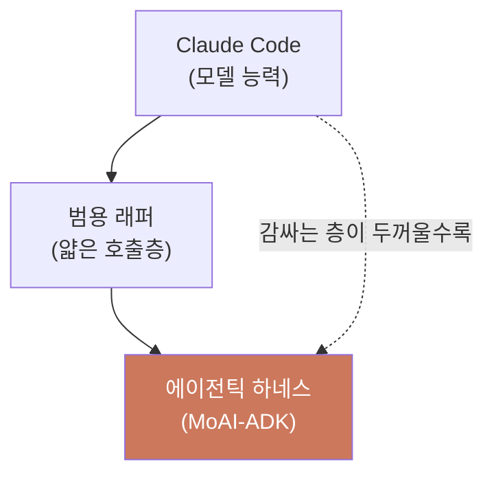
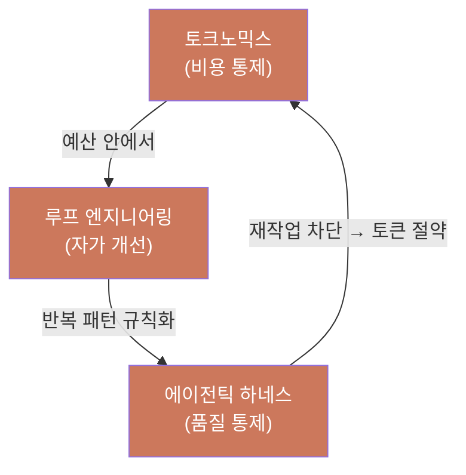

# 무엇이 다른가 — 세 가지 활용 형태 비교

Claude Code 를 에이전틱 개발에 쓰는 방법은 크게 세 가지입니다. (1) Claude Code 를 있는 그대로 쓰기, (2) 범용 래퍼(wrapper) 로 감싸기, (3) MoAI-ADK 처럼 에이전틱 하네스(harness, 모델을 감싸는 실행 환경) 로 감싸기. 이 페이지는 세 형태가 어디서 같고 어디서 갈리는지를 한눈에 정리합니다. 평가 기준은 README 가 강조하는 세 가지 핵심 — 비용(토크노믹스), 자가 개선(루프 엔지니어링), 품질 통제(에이전틱 하네스) — 입니다.

세 형태의 가장 큰 차이는 "책임이 어디에 있느냐" 입니다. Claude Code 단독은 사용자가 모델의 동작을 매번 감시해야 하고, 범용 래퍼는 도구마다 제각각인 품질 기준을 사용자가 다시 손으로 맞춰야 하며, 에이전틱 하네스는 비용·품질·학습을 시스템이 책임집니다. 아래 다이어그램은 세 형태를 겹으로 나누어 봅니다 — Claude Code 라는 모델 능력 위에 얼마나 많은 구조가 더해지는지가 세 형태를 가릅니다.

## 세 가지 활용 형태

| | Claude Code 단독 | 범용 래퍼 | MoAI-ADK (에이전틱 하네스) |
|---|---|---|---|
| **정체** | 공식 모델·도구 그 자체 | 모델 호출을 감싸는 얇은 층 | 모델을 감싸는 실행 환경(하네스) |
| **배포 단위** | 공식 설치 | 도구마다 제각각 | 단일 Go 바이너리 (Python·런타임 불필요) |
| **비용 통제** | 모델이 스스로 쓰는 대로 | 보통 없음 | 작업마다 모델·추론 깊이 배정 + 예산 가드 |
| **품질 게이트** | 사용자가 매번 확인 | 도구마다 제각각 | SPEC 3-단계 + TRUST 5, 자동 검증 |
| **학습 루프** | 세션마다 새 출발 | 보통 없음 | 관찰을 규칙으로 축적하는 자가 진화 |
| **세션 연속성** | `/clear` 마다 끊김 | 도구마다 제각각 | paste-ready 이력 + 자동 주입 |
| **에이전트 편성** | 단일 세션 | 단일 세션 | 12-에이전트 카탈로그 + 3-단계 워크플로우 |

Claude Code 단독이 나쁘다는 뜻이 아닙니다. 오히려 MoAI-ADK는 Claude Code 를 대체하지 않고, **감싸서 (wrap)** 그 위에 구조를 더합니다. 모델 라우팅과 품질 게이트, 비용 통제, 학습 루프, 세션 연속성 — Claude Code 가 사용자에게 맡겨 둔 부분을 하네스가 시스템으로 책임집니다.

## 왜 세 가지 핵심인가

하나만 밀어붙이면 함정에 빠집니다. README 가 세 가지 핵심을 함께 세우는 이유입니다.


- **비용만 최적화**하면 품질이 몰래 무너집니다. 뒤따르는 재작업과 디버그 루프가 가장 비싼 토큰 지출이 됩니다.
- **품질 게이트만 세우고 학습 루프가 없**으면 같은 실수를 매 세션마다 되풀이합니다.
- **자율 루프만 돌리고 비용 한도가 없**으면 한 번의 과잉 실행이 할당량을 통째로 삼킵니다.


세 가지 핵심은 서로를 떠받칩니다. 비용은 품질이 재작업을 막아 경제적이고, 품질은 루프가 무엇이 통했는지 잡아내서 강제 가능해지며, 루프는 비용 게이트가 초과 전에 멈춰줘야 감당할 수 있습니다. MoAI-ADK 의 모든 설계 결정은 이 셋 중 하나를 섭니다.

셋 중 하나가 빠지면 나머지 둘도 흔들립니다. 비용 통제가 없는 루프는 한 번의 과잉 실행으로 예산을 통째로 삼키고, 루프가 없는 하네스는 같은 실수를 매 세션마다 되풀이하며, 하네스 없는 비용 통제는 품질이 몰래 무너진 채로 청구서만 줄입니다. 그래서 세 가지 핵심은 개별 기능이 아니라 하나의 계통 안에서만 작동합니다.

## 비용 — 토크노믹스

단가는 3년 새 98% 내렸지만 (Linux Foundation), 같은 기간 기업 AI 지출은 320% 올랐습니다. 단가 하락을 사용량 증가가 덮은 것입니다. 에이전트가 한 작업을 끝내려면 수십에서 수백 단계를 돌며 토큰을 비례로 태웁니다.

 **Claude Code 단독 / 범용 래퍼** — 모델이 스스로 단계를 정하고, 사용자가 비용을 감시합니다. 단가는 낮아도 단계가 많아지면 청구서는 계속 큽니다.

 **MoAI-ADK** — 비용을 가르는 것은 단가가 아니라 **배정** 임을 전제합니다. DeepSWE 벤치마크에서 Opus 5 의 가장 낮은 추론이 가장 높은 추론의 Sonnet 5 보다 점수가 높으면서 과제당 비용은 16분의 1 이었습니다. 재시도 루프가 청구서를 쓰지, 토큰 단가가 아닙니다. 그래서 작업마다 맞는 모델과 추론 깊이를 배정하고, 컨텍스트를 다이어트하고, 예산 초과 전에 멈춥니다. `moai cg` 의 클로드+GLM 혼합 모드는 구현 위주 작업에서 60-70% 비용 절감을 가져옵니다.

[토크노믹스 개요](/ko/advanced/tokenomics-overview/) 와 [비용 최적화](/ko/cost-optimization/) 에서 자세히 다룹니다.

## 자가 개선 — 에이전틱 루프 엔지니어링

가장 싼 세션은 지난 세션의 실수를 되풀이하지 않는 세션입니다.

 **Claude Code 단독 / 범용 래퍼** — 세션이 끝나면 관찰도 함께 사라집니다. 다음 세션은 매번 영에서 출발합니다.

 **MoAI-ADK** — 각 실행이 다음 실행의 재료가 됩니다. 라우팅 결정과 게이트 증거를 기록하고, 반복되는 패턴을 규칙으로 만들고, 선언된 목표(`/moai goal`) 가 조건을 만족할 때까지 세션을 밀어붙입니다. 관찰된 실패 패턴은 규칙 변경 제안으로 올라와, 몰래 적용되지 않고 승인을 받습니다. 모델 가중치가 아니라 **모델을 감싼 하네스를 재귀적으로 개선** 하는 것이 현실적인 단기 자가 개선 경로입니다.

[자가 진화 시스템](/ko/advanced/self-evolving/), [자율 연속 루프](/ko/advanced/autonomous-loops/), [의사결정 메모리](/ko/advanced/decision-memory/) 에서 자세히 다룹니다.

## 품질 통제 — 에이전틱 하네스

재작업이 가장 큰 토큰 낭비입니다. 한 번 나간 버그가 돌아오면, 모든 라우팅 최적화를 합친 것보다 비쌉니다.

 **Claude Code 단독** — "다 됐다" 는 사용자가 매번 직접 확인해야 합니다.

 **범용 래퍼** — 도구마다 품질 기준이 제각각이거나 아예 없습니다.

 **MoAI-ADK** — "완료" 를 *검증된 완료* 로 바꿉니다. SPEC 3-단계 (plan → run → sync) 와 TRUST 5 게이트(테스트됨·읽기 쉬움·통일됨·안전함·추적 가능) 가 매 변경에 적용됩니다. 게이트는 에이전트가 아니라 검증을 심판합니다. 12-에이전트 카탈로그는 계획과 감사를 처음부터 분리해, 짜는 쪽이 자기 일을 매기지 못하게 합니다. [검증 주장 무결성](/ko/core-concepts/verification-claim-integrity/) 규칙이 관찰하지 않은 "통과" 가 빈칸으로 지나가는 것을 막습니다.

[하네스 엔지니어링](/ko/core-concepts/harness-engineering/), [TRUST 5 품질](/ko/core-concepts/trust-5/), [SPEC 기반 개발](/ko/core-concepts/spec-based-dev/) 에서 자세히 다룹니다.

## 어떤 형태를 고를까

세 형태는 "얼마나 자주 에이전트를 돌리느냐" 와 "세션이 끝난 뒤 무엇이 남아야 하느냐" 라는 두 축에서 갈립니다. 한두 번의 짧은 세션으로 끝난다면 Claude Code 단독으로 충분합니다. 하루에도 여러 차례 에이전트를 돌리며, 세션이 끝나도 학습과 검증 증거가 다음 세션으로 넘어가야 한다면 하네스가 그 지속성을 책임집니다.

- **Claude Code 단독** 이 충분할 때 — 탐색적 코딩, 한두 파일의 단순 수정, 비용과 품질을 직접 감시하는 짧은 세션. 모델의 한 번 응답이 곧 결과인 자리에서는 사용자가 직접 보는 편이 오히려 빠릅니다.
- **범용 래퍼** 가 어울릴 때 — 특정 워크플로우 하나만 자동화하고 싶고, 그 이상의 구조는 필요 없을 때. 래퍼는 얇은 호출층만 더할 뿐 비용·품질·학습까지 책임지지는 않습니다.
- **MoAI-ADK** 가 필요할 때 — 매 세션 비용과 품질을 시스템이 책임져야 할 때, 에이전트가 평행하게 일해도 서로를 밟지 않아야 할 때, 지난 세션의 학습이 다음 세션으로 이어져야 할 때. 이 세 조건 중 하나라도 매번 반복된다면, 하네스가 그 반복을 시스템으로 흡수합니다.

세 형태는 배타적이지 않습니다. MoAI-ADK 는 Claude Code 를 대체하지 않고 감쌉니다. 단일 Go 바이너리 하나로 macOS·Linux·Windows 에서 추가 의존성 없이 실행됩니다.

## 다음 단계

- [설치](/ko/getting-started/installation/) — 단일 바이너리 설치
- [MoAI-ADK 란?](/ko/core-concepts/what-is-moai-adk/) — 정체와 철학
- [하네스 엔지니어링](/ko/core-concepts/harness-engineering/) — 세 가지 핵심이 만나는 지점
