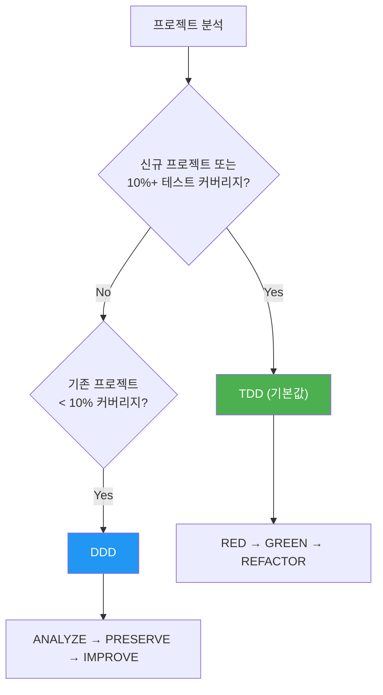

MoAI-ADK 사용 중 자주 묻는 질문과 답변입니다.

---

## Q: statusline의 버전 표시는 무엇을 의미하나요?

MoAI statusline은 버전 정보와 업데이트 알림을 함께 표시합니다:

```
🗿 v2.2.2 ⬆️ v2.2.5
```

- **`v2.2.2`**: 현재 설치된 버전
- **`⬆️ v2.2.5`**: 업데이트 가능한 새 버전

최신 버전을 사용 중일 때는 버전 번호만 표시됩니다:

```
🗿 v2.2.5
```

**업데이트 방법**: `moai update` 실행 시 업데이트 알림이 사라집니다.


**참고**: Claude Code의 빌트인 버전 표시(`🔅 v2.1.38`)와는 다릅니다. MoAI 표시는 MoAI-ADK 버전을 추적하며, Claude Code는 자체 버전을 별도로 표시합니다.


---

## Q: statusline에 표시되는 세그먼트를 커스터마이징하려면?

statusline은 4가지 디스플레이 프리셋과 커스텀 설정을 지원합니다:

| 프리셋 | 설명 |
|--------|------|
| **Full** (기본값) | 모든 8개 세그먼트 표시 |
| **Compact** | Model + Context + Git Status + Branch만 표시 |
| **Minimal** | Model + Context만 표시 |
| **Custom** | 개별 세그먼트 선택 |

`moai init` 또는 `moai update -c` 마법사에서 설정하거나, `.moai/config/sections/statusline.yaml`을 직접 편집합니다:

```yaml
statusline:
  preset: compact  # 또는 full, minimal, custom
  segments:
    model: true
    context: true
    output_style: false
    directory: false
    git_status: true
    claude_version: false
    moai_version: false
    git_branch: true
```


자세한 내용은 [SPEC-STATUSLINE-001](https://github.com/modu-ai/moai-adk/blob/main/.moai/specs/SPEC-STATUSLINE-001/spec.md)을 참조하세요.


---

## Q: 모델 정책을 어떻게 선택하나요?

MoAI-ADK는 Claude Code 구독 요금제에 맞춰 28개 에이전트에 최적의 AI 모델을 할당합니다. 요금제의 사용량 제한 내에서 품질을 극대화합니다.

### 정책 티어 비교

| 정책 | 요금제 | 🟣 Opus | 🔵 Sonnet | 🟡 Haiku | 용도 |
|------|--------|------|--------|-------|------|
| **High** | Max $200/월 | 23 | 1 | 4 | 최고 품질, 최대 처리량 |
| **Medium** | Max $100/월 | 4 | 19 | 5 | 품질과 비용의 균형 |
| **Low** | Plus $20/월 | 0 | 12 | 16 | 경제적, Opus 미포함 |


**왜 중요한가요?** Plus $20 요금제는 Opus를 포함하지 않습니다. `Low`로 설정하면 모든 에이전트가 Sonnet과 Haiku만 사용하여 사용량 제한 오류를 방지합니다. 상위 요금제에서는 핵심 에이전트(보안, 전략, 아키텍처)에 Opus를, 일반 작업에 Sonnet/Haiku를 배분합니다.


### 티어별 에이전트 모델 배정

#### Manager Agents

| 에이전트 | High | Medium | Low |
|---------|------|--------|-----|
| manager-spec | 🟣 opus | 🟣 opus | 🔵 sonnet |
| manager-strategy | 🟣 opus | 🟣 opus | 🔵 sonnet |
| manager-ddd | 🟣 opus | 🔵 sonnet | 🔵 sonnet |
| manager-tdd | 🟣 opus | 🔵 sonnet | 🔵 sonnet |
| manager-project | 🟣 opus | 🔵 sonnet | 🟡 haiku |
| manager-docs | 🔵 sonnet | 🟡 haiku | 🟡 haiku |
| manager-quality | 🟡 haiku | 🟡 haiku | 🟡 haiku |
| manager-git | 🟡 haiku | 🟡 haiku | 🟡 haiku |

#### Expert Agents

| 에이전트 | High | Medium | Low |
|---------|------|--------|-----|
| expert-backend | 🟣 opus | 🔵 sonnet | 🔵 sonnet |
| expert-frontend | 🟣 opus | 🔵 sonnet | 🔵 sonnet |
| expert-security | 🟣 opus | 🟣 opus | 🔵 sonnet |
| expert-debug | 🟣 opus | 🔵 sonnet | 🔵 sonnet |
| expert-refactoring | 🟣 opus | 🔵 sonnet | 🔵 sonnet |
| expert-devops | 🟣 opus | 🔵 sonnet | 🟡 haiku |
| expert-performance | 🟣 opus | 🔵 sonnet | 🟡 haiku |
| expert-testing | 🟣 opus | 🔵 sonnet | 🟡 haiku |

### 설정 방법

```bash
# 프로젝트 초기화 시
moai init my-project          # 대화형 마법사에서 모델 정책 선택

# 기존 프로젝트 재설정
moai update -c                # 설정 마법사 재실행
```


기본 정책은 `High`입니다. `moai update` 실행 후, `moai update -c`로 이 설정을 구성하도록 안내가 표시됩니다.


---

## Q: "Allow external CLAUDE.md file imports?" 경고가 나타납니다

프로젝트를 열 때 Claude Code가 외부 파일 import에 대한 보안 프롬프트를 표시할 수 있습니다:

```
External imports:
  /Users/<user>/.moai/config/sections/quality.yaml
  /Users/<user>/.moai/config/sections/user.yaml
  /Users/<user>/.moai/config/sections/language.yaml
```


**권장 조치:** **"No, disable external imports"** 선택 ✅


**이유:**
- 프로젝트의 `.moai/config/sections/`에 이미 이 파일들이 존재합니다
- 프로젝트별 설정이 전역 설정보다 우선 적용됩니다
- 필수 설정은 이미 CLAUDE.md 텍스트에 포함되어 있습니다
- 외부 import를 비활성화하는 것이 더 안전하며 기능에 영향을 주지 않습니다

**파일 설명:**
- `quality.yaml`: TRUST 5 프레임워크 및 개발 방법론 설정
- `language.yaml`: 언어 설정 (대화, 코멘트, 커밋)
- `user.yaml`: 사용자 이름 (선택 사항, Co-Authored-By 표시용)

---

## Q: TDD와 DDD 방법론의 차이는 무엇인가요?

MoAI-ADK v2.5.0+는 **이진 방법론 선택** (TDD 또는 DDD만)을 사용합니다. 명확성과 일관성을 위해 hybrid 모드는 제거되었습니다.

### 방법론 선택 가이드



### TDD 방법론 (기본값)

신규 프로젝트와 기능 개발에 권장되는 기본 방법론입니다. 테스트를 먼저 작성합니다.

| 단계 | 설명 |
|------|------|
| **RED** | 기대 동작을 정의하는 실패 테스트 작성 |
| **GREEN** | 테스트를 통과하는 최소 코드 작성 |
| **REFACTOR** | 테스트를 유지하면서 코드 품질 개선 |

브라운필드 프로젝트(기존 코드베이스)에서는 **RED 전 분석 단계**가 추가됩니다: 테스트 작성 전에 기존 코드를 읽어 현재 동작을 파악합니다.

### DDD 방법론 (테스트 커버리지 < 10% 기존 프로젝트)

테스트 커버리지가 최소인 기존 프로젝트에서 안전하게 리팩토링하기 위한 방법론입니다.

```
ANALYZE   → 기존 코드와 의존성 분석, 도메인 경계 식별
PRESERVE  → 특성 테스트 작성, 현재 동작 스냅샷 캡처
IMPROVE   → 테스트로 보호된 상태에서 점진적 개선
```

### 방법론 선택 표

| 프로젝트 상태 | 테스트 커버리지 | 권장 방법론 | 이유 |
|--------------|---------------|-------------|------|
| 신규 프로젝트 | N/A | TDD | 테스트 우선 개발 |
| 기존 프로젝트 | 50%+ | TDD | 테스트 기반이 있음 |
| 기존 프로젝트 | 10-49% | TDD | 테스트 확장 가능 |
| 기존 프로젝트 | < 10% | DDD | 점진적 특성 테스트 필요 |

### 설정 방법

```bash
# 프로젝트 초기화 시 자동 감지
moai init my-project          # --mode <ddd|tdd> 플래그로 지정 가능

# 수동 설정
# .moai/config/sections/quality.yaml 편집
development_mode: tdd         # 또는 ddd
```


**참고:** v2.5.0 이전의 hybrid 모드는 제거되었습니다. 이제는 TDD 또는 DDD 중 하나를 명확하게 선택해야 합니다.


---

## Q: 내 코드에 @MX 태그가 없는 이유는?

이것은 **완전히 정상** 입니다. @MX 태그 시스템은 AI가 먼저 주목해야 할 가장 위험하고 중요한 코드만 표시하도록 설계되었습니다.

| 질문 | 답변 |
|------|------|
| 태그가 없으면 문제인가요? | **아닙니다.** 대부분의 코드에는 태그가 필요 없습니다. |
| 태그는 언제 추가되나요? | **높은 fan_in** (호출자 >= 3), **복잡한 로직** (복잡도 >= 15), **위험 패턴** (context 없는 고루틴) 에만 추가됩니다. |
| 모든 프로젝트가 비슷한가요? | **네.** 모든 프로젝트에서 대부분의 코드에는 태그가 없습니다. |

### 태그 우선순위

| 우선순위 | 조건 | 태그 유형 |
|---------|------|----------|
| **P1 (치명적)** | fan_in >= 3 | `@MX:ANCHOR` |
| **P2 (위험)** | 고루틴, 복잡도 >= 15 | `@MX:WARN` |
| **P3 (컨텍스트)** | 매직 상수, godoc 없음 | `@MX:NOTE` |
| **P4 (누락)** | 테스트 파일 없음 | `@MX:TODO` |

코드베이스를 @MX 태그로 스캔하려면:

```bash
/moai mx --all        # 전체 스캔
/moai mx --dry        # 미리보기
/moai mx --priority P1  # 치명적 항목만
```

---

## 더 많은 질문이 있으신가요?

- [GitHub Discussions](https://github.com/modu-ai/moai-adk/discussions) — 질문, 아이디어, 피드백
- [Issues](https://github.com/modu-ai/moai-adk/issues) — 버그 리포트, 기능 요청
- [Discord 커뮤니티](https://discord.gg/moai-adk) — 실시간 소통, 팁 공유
