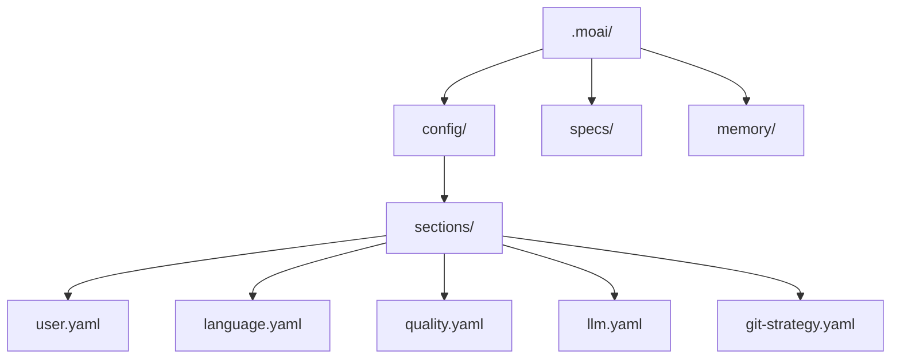

MoAI-ADK의 인터랙티브 설정 마법사로 첫 설정을 완료하세요. 언어, Git 자동화 범위, 모델 정책, 하네스 프로필을 개발 환경에 맞게 구성합니다. 여기서 정한 값은 전부 `.moai/config/sections/` 아래 YAML 파일로 저장되므로, 나중에 언제든 파일을 직접 고치거나 마법사를 다시 실행해 바꿀 수 있습니다.

## 설정 마법사 시작

### 신규 프로젝트 생성

새로운 프로젝트를 생성하면서 초기화하려면:

```bash
moai init my-project
```

이 명령은 `my-project` 폴더를 생성하고 MoAI-ADK를 초기화합니다.

### 기존 폴더에 설치

기존 프로젝트에 MoAI-ADK를 설치하려면 해당 폴더로 이동 후 실행하세요:

```bash
cd my-existing-project
moai init
```


`moai init`은 현재 폴더에 바로 설치합니다. 신규 프로젝트는 `moai init <프로젝트명>`으로 생성하세요.


## 마법사 모드

초기화 마법사는 질문의 깊이에 따라 세 모드로 동작합니다.

| 모드 | 플래그 | 질문 범위 |
|------|--------|----------|
| **Quick** (기본값) | (없음) | 핵심 설정만 — 언어, 이름, Git, 모델 정책 |
| **Standard** | `--standard` | Quick + Phase 1 질문 (project mode, harness profile, LSP, quality, design) |
| **Advanced** | `--advanced` | Standard + Phase 2 질문 (선행 조건 충족 시만) |

```bash
# 기본 마법사 (Quick)
moai init my-project

# Phase 1 질문 포함
moai init my-project --standard

# Phase 1 + Phase 2 질문 포함
moai init my-project --advanced
```

## Quick 모드 (기본)

플래그 없이 실행하면 핵심 설정만 묻습니다. 대부분의 사용자에게 충분합니다.

### 1단계: 대화 언어 선택

Claude가 응답할 언어를 선택합니다.

```bash
? 대화 언어를 선택하세요:
▸ English
  Korean (한국어)
  Japanese (日本語)
  Chinese (中文)
```

이 설정은 `.moai/config/sections/language.yaml` 에 저장됩니다.

### 2단계: 이름 입력

설정 파일에 사용될 사용자 이름입니다. Enter를 눌러 건너뛸 수 있습니다.

```bash
? 이름 입력: [이름]
```

### 3단계: Git 자동화 모드 선택

Claude가 수행할 수 있는 Git 작업 범위를 설정합니다.

```bash
? Git 자동화 모드 선택:
▸ Manual - AI가 커밋이나 푸시를 하지 않음
  Personal - AI가 브랜치 생성 및 커밋 가능
  Team - AI가 브랜치 생성, 커밋, PR 생성 가능
```

- **Manual**: AI가 Git 작업을 수행하지 않습니다. 모든 커밋과 푸시는 사용자가 직접 실행합니다.
- **Personal**: AI가 브랜치를 생성하고 커밋할 수 있습니다. 개인 프로젝트에 적합합니다.
- **Team**: AI가 브랜치 생성, 커밋, PR 생성까지 수행합니다. 팀 협업 워크플로우에 최적화되어 있습니다.


Git 설정은 `.moai/config/sections/git-strategy.yaml` 파일에 저장됩니다.


### 4단계: Git 프로바이더 선택

프로젝트의 Git 호스팅 플랫폼을 선택합니다.

```bash
? Git 프로바이더 선택:
▸ GitHub - GitHub.com
  GitLab - GitLab.com 또는 자체 호스팅 GitLab
```

### 5단계: 커밋 메시지 언어

커밋 메시지 작성에 사용할 언어를 선택합니다. 코드 주석 언어와 다르게 설정할 수 있습니다.

### 6단계: 코드 주석 언어

코드 주석에 사용할 언어를 선택합니다. 대부분의 프로젝트에서는 영어를 권장합니다.

### 7단계: 문서 언어

문서 파일에 사용할 언어를 선택합니다.

### 8단계: 성능 티어 (모델 정책)

에이전트에 할당할 AI 모델 티어를 선택합니다 — 토크노믹스의 핵심 설정입니다.

```bash
? 성능 티어 선택:
▸ medium (권장) - 품질과 비용의 균형
  max - 최고 품질, 계획·감사에 Opus 배정
  low - 경제적, Sonnet 중심 배분
```

| 티어 | 특징 |
|------|------|
| **max** | 최고 품질 — 계획·감사에 Opus 배정, 최대 추론 깊이 |
| **medium** (기본값) | 품질과 비용의 균형 |
| **low** | 경제적 — Sonnet 중심 배분 |

이 설정은 `.moai/config/sections/llm.yaml` 의 `performance_tier` 필드에 저장됩니다.

### 9단계: 요금제 유형 (plan_type)

과금 방식에 따른 모델 배정 프로필을 선택합니다.

```bash
? 요금제 유형 선택:
▸ subscription (권장) - 구독 요금제 (주간 할당량 최적화)
  api - API 사용량 기반 과금 (태스크별 비용 최적화)
```

이 설정은 `.moai/config/sections/llm.yaml` 의 `plan_type` 필드에 저장됩니다. 같은 성능 티어라도 요금제 유형에 따라 모델 배정이 달라집니다.

## Standard 모드 (Phase 1 질문)

`--standard` 플래그를 주면 Quick 모드의 모든 질문에 추가로 Phase 1 질문이 표시됩니다.

### project mode

프로젝트 협업 모드를 선택합니다.

```bash
? Select project mode:
▸ Personal (Recommended) - Solo developer
  Team - Multi-developer setup
```

### harness evaluator profile

품질 평가자의 기본 프로필을 선택합니다.

```bash
? Select default harness evaluator profile:
▸ default
  strict
  lenient
  frontend
```

### LSP integration

run 단계에서 언어 서버 진단을 활성화할지 선택합니다. 기본값은 비활성화 (opt-in) 입니다.

### quality gates

TRUST 5 품질 게이트 강제 여부와 커버리지 예외 허용 여부를 선택합니다.

- **Enforce quality gates** (기본값: Yes) — 품질 게이트 실패 시 구현 진행 차단
- **Allow coverage exemptions** (기본값: No) — 특정 파일/패키지를 커버리지 대상에서 제외

### design workflow

MoAI 디자인 파이프라인과 Claude Design 연동을 활성화할지 선택합니다.

- **Enable design workflow** (기본값: Yes)
- **Enable Claude Design integration** (기본값: Yes, design 활성화 시만 표시)

## Advanced 모드 (Phase 2 질문)

`--advanced` 플래그는 `--standard` 를 포함하며, 추가로 Phase 2 질문을 표시합니다. Phase 2 질문은 run 단계 완료 등 선행 조건이 충족된 경우에만 표시되고, 조건이 없으면 자동으로 건너뛰며 안내 메시지가 출력됩니다.

## 비대화형 모드 (CI/CD)

플래그로 모든 값을 지정하면 마법사 없이 초기화할 수 있습니다:

```bash
moai init my-project \
  --non-interactive \
  --project-mode personal \
  --model-policy medium \
  --plan-type subscription \
  --harness-profile default \
  --enable-lsp=false \
  --enforce-quality
```

## 설정 완료

모든 단계를 완료하면 설정 파일이 생성됩니다:



## 설정 수정

### 수동 수정

```bash
# 사용자 설정
vim .moai/config/sections/user.yaml

# 언어 설정
vim .moai/config/sections/language.yaml

# 모델 정책 (성능 티어)
vim .moai/config/sections/llm.yaml

# 품질 설정
vim .moai/config/sections/quality.yaml
```

### 재설정

설정 마법사를 다시 실행하여 구성을 변경할 수 있습니다:

```bash
# 설정 마법사 다시 실행 (권장)
moai update -c
```


`moai update -c` 명령은 기존 설정을 유지하면서 변경하고 싶은 항목만 선택적으로 재설정할 수 있습니다.


## 설정 검증

설정이 올바르게 구성되었는지 확인하세요:

```bash
moai doctor
```

이 명령은 Git 설치 여부, 프로젝트 구조 (`.moai/` 폴더), 설정 파일, 언어별 개발 도구를 검증합니다. `--verbose` 로 상세를 확인할 수 있습니다.

## 다음 단계

설정이 완료되면 [빠른 시작](./quickstart) 가이드를 따라 첫 프로젝트를 생성해보세요.

```bash
moai --help
```
