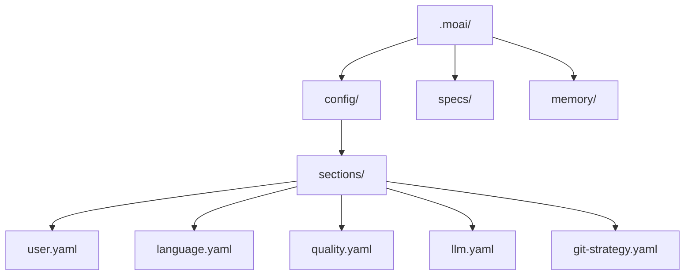

MoAI-ADK의 인터랙티브 설정 마법사로 처음 설정을 마쳐 보세요. 마법사는 꼭 사람이 골라야 하는 다섯 가지만 묻습니다 — 대화 언어, 이름, 배포할 에이전트 하니스, 세션 권한 모드, Jev 판정 기능 사용 여부입니다. 나머지 설정(모델 정책, 리포트 형식, 품질 게이트, 디자인 워크플로우 등)은 권장 기본값으로 저장되고, 필요하면 나중에 바꿀 수 있습니다.

설정은 대부분 `.moai/config/sections/` 아래 YAML 파일로 저장됩니다. 파일마다 하나의 관심사(언어, 모델, 품질, 디자인 등)만 담당하므로, 한 값을 바꿀 때 해당 파일만 열면 되고 git diff 도 한 영역씩 깔끔하게 나옵니다. 세션 권한 모드만은 예외로, 사용자 수준의 Claude Code 설정에 기록됩니다(아래 3단계 참고).

## 1단계 — 마법사 시작

### 신규 프로젝트 생성

새로운 프로젝트를 생성하면서 초기화하려면:

```bash
moai init my-project
```

이 명령은 `my-project` 폴더를 생성하고 MoAI-ADK를 초기화합니다.

### 기존 폴더에 설치

기존 프로젝트에 MoAI-ADK를 설치하려면 해당 폴더로 이동 후 실행하세요:

```bash
cd my-existing-project
moai init
```


`moai init`은 현재 폴더에 바로 설치합니다. 신규 프로젝트는 `moai init <프로젝트명>`으로 생성하세요.


**마법사 구조** — 초기화 마법사는 모드 선택 없이 항상 같은 흐름으로 동작합니다. 질문은 다섯 개이고 세 페이지로 나뉘며, 누구에게나 같은 질문을 보여 줍니다. 화면 위쪽의 진행 표시(`● ● ● ○ ○ 3 / 5`)는 페이지가 아니라 질문 수를 셉니다.

| 페이지 | 질문 |
|--------|------|
| **Page 1 — 기본** | 대화 언어, 이름 |
| **Page 2 — 에이전트와 자율성** | 배포할 에이전트 하니스, 세션 권한 모드 |
| **Page 3 — 판정 기능** | Jev 판정 기능 사용 여부 |

```bash
moai init my-project
```


Git 자동화 모드·프로바이더는 마법사에서 묻지 않습니다. `moai init`이 저장소에 이미 설정된 Git 원격(remote)을 보고 알아서 판단합니다. 나중에 Git 설정을 바꾸려면 `moai update -c` (`--config`) 를 실행하세요. Git 관련 질문(자동화 모드, 프로바이더, 인증 정보)은 이 경로에서만 나옵니다.


## 2단계 — 기본 설정 (Page 1)

두 가지 기본 값을 정합니다. 대화 언어와 사용자 이름입니다. 둘 다 기본값이 채워져 있어 Enter 만 눌러도 넘어갈 수 있습니다.

**대화 언어** — MoAI 가 대화할 언어를 선택합니다. 고르는 즉시 마법사 화면도 그 언어로 바뀝니다.

```bash
? 대화 언어 선택
▸ English
  Korean (한국어)
  Japanese (日本語)
  Chinese (中文)
```

이 설정은 `.moai/config/sections/language.yaml` 에 저장됩니다.

**이름** — MoAI 가 사용자를 부를 이름입니다. 비워 두면 건너뜁니다.

```bash
? 이름 입력: [이름]
```

이 설정은 `.moai/config/sections/user.yaml` 의 `user.name` 필드에 저장됩니다.


프로젝트 이름은 묻지 않습니다. `moai init <프로젝트명>` 에 준 이름을 쓰고, 이름 없이 실행하면 현재 폴더 이름을 씁니다. `--name` 플래그로 직접 지정할 수도 있습니다.


## 3단계 — 에이전트와 자율성 (Page 2)

### 에이전트 하니스

이 프로젝트에 어떤 에이전트 하니스를 배포하고 연결할지 고릅니다. 선택에 따라 프로젝트 루트에 놓이는 파일이 달라집니다.

```bash
? 배포하고 연결할 에이전트 하니스 선택
▸ Claude 단독 (권장) - .claude/ 표면과 AGENTS.md를 배포합니다 (지금까지의 기본 동작)
  Codex 단독         - AGENTS.md와 Codex 표면만 배포합니다 — .claude/ 디렉터, CLAUDE.md, .mcp.json이 생기지 않습니다
  Claude + Codex     - 동일한 .claude/ 배포에 .codex/ 연결을 더하고 .mcp.json 프로비저닝을 강제로 켭니다
```

`--llm claude|gpt|both` 플래그를 주면 이 답보다 플래그가 우선합니다.

### 세션 권한 모드

Claude Code 세션이 어떤 권한 모드로 시작할지 고릅니다.

```bash
? 세션 권한 모드 선택
▸ 편집 자동 수락 (권장) - 파일 편집은 자동 수락; 다른 도구는 확인
  자동 모드             - 분류기 안전 검사 하에 도구 호출 자동 승인
  권한 우회             - 모든 프롬프트 생략; 샌드박스 증명 필요 (Docker/gVisor 등)
```

이 설정은 프로젝트 YAML 이 아니라 사용자 수준의 Claude Code 설정(`defaultMode`)에 기록됩니다. 기본값인 편집 자동 수락은 `defaultMode: acceptEdits` 가 됩니다. 권한 우회는 샌드박스 증명이 있고 킬 스위치가 꺼져 있을 때만 적용되며, 그렇지 않으면 자동 모드로 낮춰 적용됩니다. `--autonomy-tier semi-auto|automatic|fully-autonomous` 플래그를 주면 이 답보다 플래그가 우선합니다.

## 4단계 — 판정 기능 (Page 3)

### Jev 판정 기능

Jev 는 건네받은 상태에 대해 정해진 형태의 질문에 답하고 확률을 돌려주는 기능입니다. 스스로 결정하지는 않습니다.

```bash
? Jev 판정 기능을 켤까요? (선택, 기본은 꺼짐)
```

기본값은 **꺼짐** 입니다. 켜면 카드 본문이나 요청 본문이 외부 업체 서버로 전송되므로, 그 점을 확인한 뒤 고르세요. 이 설정은 `.moai/config/sections/workflow.yaml` 의 `workflow.jev.enabled` 필드에 저장됩니다.


이 질문은 `moai init` 에서만 나옵니다. `moai update -c` 에서는 묻지 않으므로, 나중에 바꾸려면 `moai web` 설정 화면을 여세요.


## 마법사가 묻지 않는 설정

아래 값은 묻지 않고 기본값으로 저장됩니다. 바꾸려면 플래그를 주거나, 설치 뒤 `moai update -c` 또는 `moai web` 을 쓰세요.

| 항목 | 기본값 | 바꾸는 방법 |
|------|--------|-------------|
| 성능 티어 (모델 정책) | Medium | `--model-policy` 또는 `--profile`, `moai update -c` |
| 리포트 형식 | HTML + Markdown | `moai update -c` |
| LSP 통합 | 켜짐 | `--enable-lsp` |
| 품질 게이트 강제 | 켜짐 | `--enforce-quality` |
| 디자인 워크플로우·Claude Design 연동 | 켜짐 | `--enable-design` |
| Git 자동화 모드·프로바이더 | 원격 저장소 설정에서 판단 | `--git-mode`, `--git-provider`, `moai update -c` |

성능 티어별 에이전트 model+effort 매핑은 [프로필 매트릭스](/ko/advanced/profile-matrix/) 페이지를 참조하세요.

## 비대화형 모드 (CI/CD)

플래그로 모든 값을 지정하면 마법사 없이 초기화할 수 있습니다:

```bash
moai init my-project \
  --non-interactive \
  --llm claude \
  --autonomy-tier semi-auto \
  --profile medium \
  --enable-lsp=false \
  --enforce-quality
```

## 설정 완료

모든 단계를 완료하면 설정 파일이 생성됩니다:



설치가 스킬 미러를 배포할 때는 심볼릭 링크를 우선합니다. 링크를 만들 수 없는 환경에서는 복사로 대체 배포되며, 그때는 `moai init` 완료 요약에 대체 사실이 함께 표시됩니다 — 복사본은 원본이 바뀌어도 스스로 따라가지 않는다는 점만 알아 두면 됩니다.

## 설정 수정

### 수동 수정

```bash
# 사용자 설정
vim .moai/config/sections/user.yaml

# 언어 설정
vim .moai/config/sections/language.yaml

# 모델 정책 (성능 티어)
vim .moai/config/sections/llm.yaml

# 품질 설정
vim .moai/config/sections/quality.yaml
```

### 재설정

설정 마법사를 다시 실행하여 구성을 변경할 수 있습니다:

```bash
# 설정 마법사 다시 실행 (권장)
moai update -c
```


`moai update -c` 는 기존 설정을 그대로 두고, 바꾸고 싶은 항목만 골라 다시 설정할 수 있습니다.


## 설정 검증

설정이 올바르게 구성되었는지 확인하세요:

```bash
moai doctor
```

이 명령은 Git 설치 여부, 프로젝트 구조 (`.moai/` 폴더), 설정 파일, 언어별 개발 도구를 검사합니다. `--verbose` 를 붙이면 자세한 내용까지 볼 수 있습니다.

## 다음 단계

설정이 완료되면 [빠른 시작](/ko/getting-started/quickstart) 가이드를 따라 첫 프로젝트를 생성해보세요.

```bash
moai --help
```
