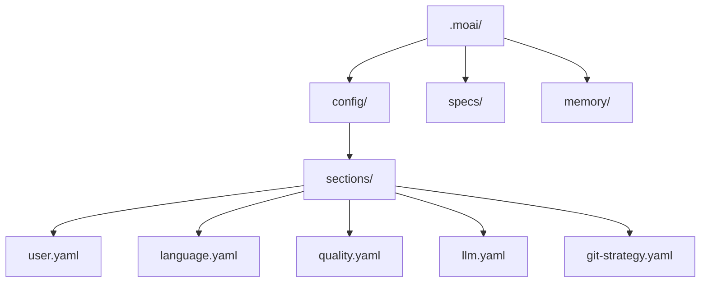

MoAI-ADK의 인터랙티브 설정 마법사로 처음 설정을 마쳐 보세요. 언어, 모델 정책, 리포트 형식, 품질/워크플로우 설정을 개발 환경에 맞게 잡아 줍니다. 여기서 정한 값은 전부 `.moai/config/sections/` 아래 YAML 파일로 저장되므로, 나중에 언제든 파일을 직접 고치거나 마법사를 다시 실행해 바꿀 수 있습니다.

## 설정 마법사 시작

### 신규 프로젝트 생성

새로운 프로젝트를 생성하면서 초기화하려면:

```bash
moai init my-project
```

이 명령은 `my-project` 폴더를 생성하고 MoAI-ADK를 초기화합니다.

### 기존 폴더에 설치

기존 프로젝트에 MoAI-ADK를 설치하려면 해당 폴더로 이동 후 실행하세요:

```bash
cd my-existing-project
moai init
```


`moai init`은 현재 폴더에 바로 설치합니다. 신규 프로젝트는 `moai init <프로젝트명>`으로 생성하세요.


## 마법사 구성

초기화 마법사는 모드 선택 없이 항상 같은 3-페이지 흐름으로 동작합니다. 별도 플래그로 질문 범위를 늘리거나 줄이지 않고, 누구에게나 같은 질문을 보여 줍니다.

| 페이지 | 질문 |
|--------|------|
| **Page 1 — 기본** | 대화 언어, 이름, 프로젝트 이름 |
| **Page 2 — 모델 및 리포트** | 성능 티어 (모델 정책), 리포트 형식 |
| **Page 3 — 품질 및 워크플로우** | LSP 통합, 품질 게이트 강제, 프로젝트 모드, 디자인 워크플로우, Claude Design 연동 |

```bash
moai init my-project
```


Git 자동화 모드·프로바이더는 마법사에서 묻지 않습니다. `moai init`이 저장소에 이미 설정된 Git 원격(remote)을 보고 알아서 판단합니다. 나중에 Git 설정을 바꾸려면 `moai update -c` (또는 `moai update --config`)를 실행해 마법사를 다시 돌리세요. Git 관련 질문(자동화 모드, 프로바이더, 인증 정보)은 이 경로에서만 나옵니다.


## Page 1 — 기본

### 1단계: 대화 언어 선택

Claude가 응답할 언어를 선택합니다. 이후 모든 질문도 이 언어로 표시됩니다.

```bash
? 대화 언어를 선택하세요:
▸ English
  Korean (한국어)
  Japanese (日本語)
  Chinese (中文)
```

이 설정은 `.moai/config/sections/language.yaml` 에 저장됩니다.

### 2단계: 이름 입력

설정 파일에 사용될 사용자 이름입니다. Enter를 눌러 건너뛸 수 있습니다.

```bash
? 이름 입력: [이름]
```

이 설정은 `.moai/config/sections/user.yaml` 의 `user.name` 필드에 저장됩니다.

### 3단계: 프로젝트 이름

프로젝트 이름입니다. 기본값은 현재 디렉터리 이름입니다.

```bash
? 프로젝트 이름 입력: [my-project]
```

## Page 2 — 모델 및 리포트

### 성능 티어 (모델 정책)

에이전트에 할당할 AI 모델 티어를 선택합니다 — 토크노믹스의 핵심 설정입니다.

```bash
? 성능 티어 선택:
▸ Medium - Opus 5 (high~low) + Sonnet (low, single-shot rows only)
  High - Opus 5 (max~medium) + Sonnet (low, single-shot rows only)
  Low - Opus 5 (medium~low) + Sonnet (low, docs/e2e/single-shot rows)
```

| 티어 | 특징 |
|------|------|
| **High** | 최고 품질 — 호출 빈도가 가장 낮은 두 에이전트에 `max` 추론 깊이 |
| **Medium** (기본값) | 품질과 비용의 균형 — 비용/점수 곡선의 무릎 |
| **Low** | 작업당 최저 비용 — 에이전틱 에이전트는 Opus `low` effort로 내려갑니다 |

이 설정은 `.moai/config/sections/llm.yaml` 의 `performance_tier` 필드에 저장되며, `profile` 필드(프로필 매트릭스 열)의 legacy 별칭으로 읽힙니다. `--profile high|medium|low` 플래그로 직접 지정하면 `profile` 필드에 저장됩니다 (legacy `max` 도 입력으로 받아 `high` 로 정규화). 프로필별 에이전트 model+effort 매핑은 [프로필 매트릭스](/ko/advanced/profile-matrix/) 페이지를 참조하세요.

### 리포트 형식

리포트를 HTML+Markdown으로 생성할지, Markdown만 생성할지 선택합니다.

```bash
? 리포트 형식 선택:
▸ HTML + Markdown (권장) - 브라우저에서 볼 수 있는 HTML 리포트와 Markdown을 함께 생성
  Markdown만 - Markdown 리포트만 생성 (가볍고 diff 친화적)
```

이 설정은 `.moai/config/sections/report.yaml` 의 `report.format` 필드에 저장됩니다.

## Page 3 — 품질 및 워크플로우

### LSP integration

run 단계에서 언어 서버 진단을 활성화할지 선택합니다. 기본값은 **활성화(Yes)** 이며, 원치 않으면 No를 선택해 끌 수 있습니다.

이 설정은 `.moai/config/sections/lsp.yaml` 의 `lsp.enabled` 필드에 저장됩니다.

### quality gates

TRUST 5 품질 게이트 강제 여부를 선택합니다.

- **Enforce quality gates** (기본값: Yes) — 품질 게이트 실패 시 구현 진행 차단

이 설정은 `.moai/config/sections/quality.yaml` 의 `constitution.enforce_quality` 필드에 저장됩니다.

### project mode

프로젝트 협업 모드를 선택합니다.

```bash
? Select project mode:
▸ Personal (Recommended) - Solo developer
  Team - Multi-developer setup
```

이 설정은 `.moai/config/sections/project.yaml` 의 `project.mode` 필드에 저장됩니다.

### design workflow

MoAI 디자인 파이프라인과 Claude Design 연동을 활성화할지 선택합니다.

- **Enable design workflow** (기본값: Yes)
- **Enable Claude Design integration** (기본값: Yes, design 활성화 시만 표시)

이 설정들은 `.moai/config/sections/design.yaml` 의 `design.enabled` / `design.claude_design.enabled` 필드에 저장됩니다.

## 비대화형 모드 (CI/CD)

플래그로 모든 값을 지정하면 마법사 없이 초기화할 수 있습니다:

```bash
moai init my-project \
  --non-interactive \
  --project-mode personal \
  --profile medium \
  --enable-lsp=false \
  --enforce-quality
```

## 설정 완료

모든 단계를 완료하면 설정 파일이 생성됩니다:



## 설정 수정

### 수동 수정

```bash
# 사용자 설정
vim .moai/config/sections/user.yaml

# 언어 설정
vim .moai/config/sections/language.yaml

# 모델 정책 (성능 티어)
vim .moai/config/sections/llm.yaml

# 품질 설정
vim .moai/config/sections/quality.yaml
```

### 재설정

설정 마법사를 다시 실행하여 구성을 변경할 수 있습니다:

```bash
# 설정 마법사 다시 실행 (권장)
moai update -c
```


`moai update -c` 는 기존 설정을 그대로 두고, 바꾸고 싶은 항목만 골라 다시 설정할 수 있습니다.


## 설정 검증

설정이 올바르게 구성되었는지 확인하세요:

```bash
moai doctor
```

이 명령은 Git 설치 여부, 프로젝트 구조 (`.moai/` 폴더), 설정 파일, 언어별 개발 도구를 검사합니다. `--verbose` 를 붙이면 자세한 내용까지 볼 수 있습니다.

## 다음 단계

설정이 완료되면 [빠른 시작](/ko/getting-started/quickstart) 가이드를 따라 첫 프로젝트를 생성해보세요.

```bash
moai --help
```
