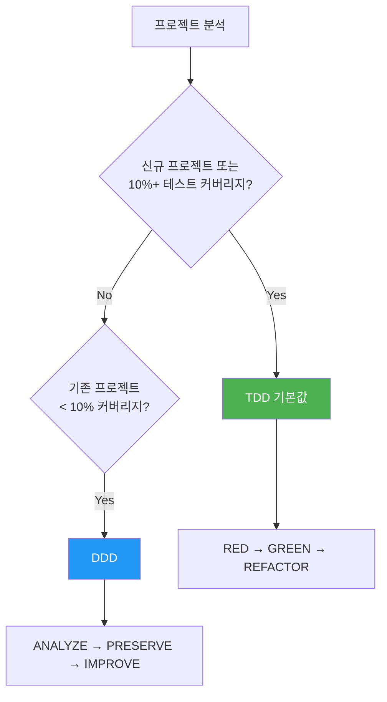
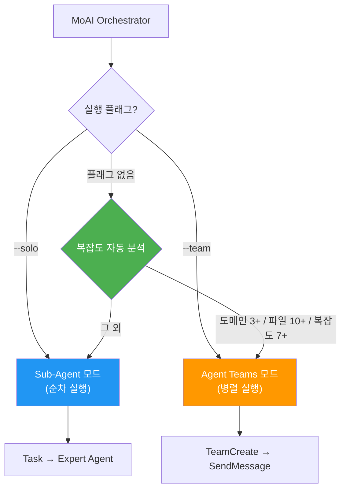
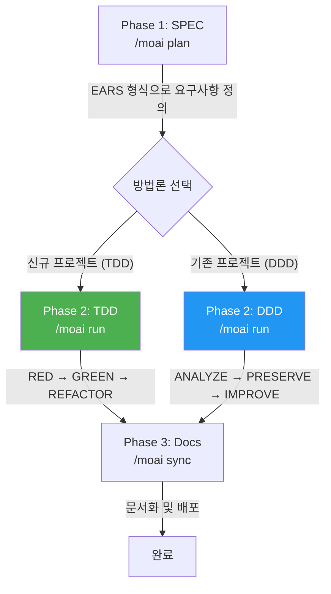

MoAI-ADK는 AI 기반 개발 환경으로, 고품질 코드를 효율적으로 생성하기 위한 포괄적인 도구 모음입니다.

## 표기법 안내

이 문서에서 코드 블록의 접두사는 실행 환경을 나타냅니다:

- **Claude Code** 대화창에서 입력하는 명령어
  ```bash
  > /moai plan "기능 설명"
  ```

- **터미널** (Terminal)에서 입력하는 명령어
  ```bash
  moai init my-project
  ```

## 핵심 개념

MoAI-ADK는 **SPEC 기반 TDD/DDD** 방법론을 기반으로 하며, **TRUST 5** 품질 프레임워크를 통해 코드 품질을 보장합니다.

### SPEC이란? (쉽게 이해하기)

**SPEC** (Specification)은 "AI와 나눈 대화를 문서로 남기는 것"입니다.

**바이브코딩** (Vibe Coding)의 가장 큰 문제는 **맥락 유실**입니다:
- 😰 AI와 1시간 동안 논의한 내용이 세션 끊기면 **사라집니다**
- 😰 다음 날 이어서 작업하려면 **처음부터 다시 설명**해야 합니다
- 😰 복잡한 기능일수록 **의도와 다른 결과**가 나옵니다

**SPEC이 이 문제를 해결합니다:**
- ✅ 요구사항을 **파일로 저장**하여 영구 보존
- ✅ 세션이 끊겨도 SPEC만 읽으면 **이어서 작업** 가능
- ✅ EARS 형식으로 **모호함 없이** 명확하게 정의


**한 줄 요약:** 어제 AI와 논의한 "JWT 인증 + 1시간 만료 + 리프레시 토큰"을 오늘 다시 설명할 필요 없이, `/moai run SPEC-AUTH-001` 한 줄로 바로 구현을 시작합니다!


### TDD란? (쉽게 이해하기)

**TDD** (Test-Driven Development)는 "테스트를 먼저 작성하고 개발하는 방법"입니다.

시험 문제 만들기에 비유하면:
- 📝 **채점 기준 (테스트)을 먼저 작성합니다** — 기능이 없으니 당연히 실패
- 💡 **기준을 통과하는 최소한의 코드를 작성합니다** — 딱 필요한 만큼만
- ✨ **더 좋은 코드로 다듬습니다** — 테스트가 통과하는 상태를 유지하며 개선

MoAI-ADK는 **RED-GREEN-REFACTOR** 사이클로 이 과정을 자동화합니다:

| 단계 | 의미 | 하는 일 |
|------|------|--------|
| 🔴 **RED** | 실패 | 아직 없는 기능의 테스트를 먼저 작성 |
| 🟢 **GREEN** | 통과 | 테스트를 통과하는 최소한의 코드 작성 |
| 🔵 **REFACTOR** | 개선 | 테스트를 유지하면서 코드 품질 향상 |

### DDD란? (쉽게 이해하기)

**DDD** (Domain-Driven Development)는 "안전한 코드 개선 방법"입니다.

집 리모델링에 비유하면:
- 🏠 **기존 집을 부수지 않고** 방 하나씩 개선합니다
- 📸 **리모델링 전에 현재 상태를 기록합니다** (= 특성화 테스트)
- 🔧 **한 방씩 작업하고, 매번 확인합니다** (= 점진적 개선)

MoAI-ADK는 **ANALYZE-PRESERVE-IMPROVE** 사이클로 이 과정을 자동화합니다:

| 단계 | 의미 | 하는 일 |
|------|------|--------|
| **ANALYZE** | 분석 | 현재 코드 구조와 문제점 파악 |
| **PRESERVE** | 보존 | 테스트로 현재 동작 기록 (안전망) |
| **IMPROVE** | 개선 | 테스트 통과하면서 조금씩 개선 |

### 개발 방법론 선택

MoAI-ADK는 프로젝트 상태에 따라 최적의 개발 방법론을 자동 선택합니다.



| 방법론 | 대상 | 사이클 |
|--------|------|--------|
| **TDD** | 신규 프로젝트 또는 10%+ 커버리지 | RED → GREEN → REFACTOR |
| **DDD** | 10% 미만 커버리지 기존 프로젝트 | ANALYZE → PRESERVE → IMPROVE |


MoAI-ADK v2.5.0+는 이진 방법론 선택(TDD 또는 DDD만)을 사용합니다. 명확성과 일관성을 위해 hybrid 모드는 제거되었습니다. 방법론은 `moai init` 시 자동 선택되며, `.moai/config/sections/quality.yaml`의 `development_mode`에서 변경할 수 있습니다.


### TRUST 5 품질 프레임워크

TRUST 5는 다음 5가지 핵심 원칙을 기반으로 합니다:

| 원칙 | 설명 |
|------|------|
| **T**ested | 85% 커버리지, 특성화 테스트, 동작 보존 |
| **R**eadable | 명확한 명명 규칙, 일관된 포맷팅 |
| **U**nified | 통합된 스타일 가이드, 자동 포맷팅 |
| **S**ecured | OWASP 준수, 보안 검증, 취약점 분석 |
| **T**rackable | 구조화된 커밋, 변경 이력 추적 |

## Go Edition 특징

MoAI-ADK 2.5는 Python Edition을 Go로 완전히 재작성하여 성능과 효율성을 극대화했습니다.

| 항목 | Python Edition | Go Edition |
|------|---------------|------------|
| 배포 | pip + venv + 의존성 | **단일 바이너리**, 의존성 없음 |
| 시작 시간 | ~800ms 인터프리터 부팅 | **~5ms** 네이티브 실행 |
| 동시성 | asyncio / threading | **네이티브 goroutines** |
| 타입 안전성 | 런타임 (mypy 선택) | **컴파일 타임 강제** |
| 크로스 플랫폼 | Python 런타임 필요 | **프리빌트 바이너리** (macOS, Linux, Windows) |

### 핵심 수치

- **34,220줄** Go 코드, **32개** 패키지
- **85-100%** 테스트 커버리지
- **28개** 전문 AI 에이전트 + **52개** 스킬
- **18개** 프로그래밍 언어 지원
- **16개** Claude Code 훅 이벤트

## 시스템 요구사항

| 플랫폼 | 지원 환경 | 비고 |
|--------|----------|------|
| macOS | Terminal, iTerm2 | 완전 지원 |
| Linux | Bash, Zsh | 완전 지원 |
| Windows | **WSL (권장)**, PowerShell 7.x+ | 네이티브 cmd.exe 미지원 |

**필수 조건:**
- **Git**이 모든 플랫폼에 설치되어 있어야 합니다
- **Windows 사용자**: 최상의 경험을 위해 WSL (Windows Subsystem for Linux) 사용을 권장합니다

## 핵심 가치

MoAI-ADK는 다음과 같은 핵심 가치를 제공합니다:

- **SPEC 기반 TDD/DDD**: 요구사항을 문서화하고 점진적으로 개발하는 구조화된 방법론 (신규 프로젝트는 TDD, 레거시 코드는 DDD)
- **TRUST 5 품질 프레임워크**: 테스트, 가독성, 통합, 보안, 추적성을 보장하는 5가지 원칙
- **28개 전문 에이전트**: 각 개발 단계에 특화된 AI 에이전트 팀
- **52개 스킬**: 다양한 개발 시나리오를 지원하는 확장 가능한 스킬 라이브러리
- **다국어 지원**: 한국어, 영어, 일본어, 중국어 4개 언어 지원
- **Sequential Thinking MCP**: 단계별 추론을 통한 구조화된 문제 해결
- **Ralph-Style LSP Integration**: LSP 기반 자율 워크플로우와 실시간 품질 피드백

## 주요 기능

MoAI-ADK는 28개의 전문화된 AI 에이전트와 52개의 스킬을 제공하여 개발 워크플로우 전반을 자동화하고 최적화합니다.

### 에이전트 카테고리

| 카테고리 | 수량 | 주요 에이전트 |
|----------|------|--------------|
| **Manager** | 8개 | spec, ddd, tdd, docs, quality, project, strategy, git |
| **Expert** | 8개 | backend, frontend, security, devops, performance, debug, testing, refactoring |
| **Builder** | 3개 | agent, skill, plugin |
| **Team** | 8개 | researcher, analyst, architect, designer, backend-dev, frontend-dev, tester, quality |

### 모델 정책 (토큰 최적화)

MoAI-ADK는 Claude Code 구독 요금제에 맞춰 28개 에이전트에 최적의 AI 모델을 할당합니다. 요금제의 사용량 제한 내에서 품질을 극대화합니다.

| 정책 | 요금제 | 🟣 Opus | 🔵 Sonnet | 🟡 Haiku | 용도 |
|------|--------|------|--------|-------|------|
| **High** | Max $200/월 | 23 | 1 | 4 | 최고 품질, 최대 처리량 |
| **Medium** | Max $100/월 | 4 | 19 | 5 | 품질과 비용의 균형 |
| **Low** | Plus $20/월 | 0 | 12 | 16 | 경제적, Opus 미포함 |


Plus $20 요금제는 Opus를 포함하지 않습니다. **Low** 정책을 설정하면 모든 에이전트가 Sonnet과 Haiku만 사용하여 사용량 제한 오류를 방지합니다. 상위 요금제에서는 핵심 에이전트(보안, 전략, 아키텍처)에 Opus를, 일반 작업에 Sonnet/Haiku를 배분합니다.


#### 주요 에이전트 모델 배정

| 에이전트 | High | Medium | Low |
|---------|------|--------|-----|
| manager-spec, manager-strategy, expert-security | 🟣 opus | 🟣 opus | 🔵 sonnet |
| manager-ddd/tdd, expert-backend/frontend | 🟣 opus | 🔵 sonnet | 🔵 sonnet |
| manager-quality, team-researcher | 🟡 haiku | 🟡 haiku | 🟡 haiku |

### 이중 실행 모드

`--solo` (Sub-Agent 모드) 와 `--team` (Agent Teams 모드) 두 가지 실행 모드를 제공합니다. 두 모드 모두 순차 또는 병렬 실행을 자율 판단하며, 플래그 없이 실행하면 작업 복잡도를 분석해 최적 모드를 자동으로 선택합니다.



| 플래그 | 모드 | 실행 방식 |
|--------|------|-----------|
| `--solo` | Sub-Agent 모드 | 전문가 에이전트에게 순차 위임 |
| `--team` | Agent Teams 모드 | 팀원 에이전트들이 병렬 협업 |
| (없음) | 자동 선택 | 복잡도 기준으로 자율 판단 |

```bash
/moai run SPEC-AUTH-001          # 자동 선택
/moai run SPEC-AUTH-001 --team    # Agent Teams 강제 (병렬)
/moai run SPEC-AUTH-001 --solo    # Sub-Agent 강제 (순차)
```

### SPEC-First 워크플로우

MoAI-ADK는 3단계 개발 워크플로우를 따릅니다. Run 단계의 방법론은 프로젝트 상태에 따라 자동 선택됩니다:



### 권장 워크플로우 체인

**신규 기능 개발:**
```
/moai plan → /moai run SPEC-XXX → /moai sync SPEC-XXX
```

**버그 수정:**
```
/moai fix (또는 /moai loop) → /moai review → /moai sync
```

**리팩토링:**
```
/moai plan → /moai clean → /moai run SPEC-XXX → /moai review → /moai coverage → /moai codemaps
```

**문서 업데이트:**
```
/moai codemaps → /moai sync
```

## 다국어 지원

MoAI-ADK는 다음 4가지 언어를 지원합니다:

- 🇰🇷 **한국어** (Korean)
- 🇺🇸 **영어** (English)
- 🇯🇵 **일본어** (Japanese)
- 🇨🇳 **중국어** (Chinese)

설치 마법사에서 선호하는 언어를 선택하거나, 설정 파일에서 직접 변경할 수 있습니다.

## LSP 통합

**LSP** (Language Server Protocol)는 코드 편집기와 언어 도구 사이의 표준 통신 프로토콜입니다. 코드 오류, 타입 오류, 린트 결과를 실시간으로 감지하여 즉각적인 피드백을 제공합니다.

**Ralph-Loop Style**은 LSP 진단 결과를 피드백 루프로 활용하는 자율 워크플로우입니다. 품질 문제가 감지되면 수정 에이전트를 자동 호출하고, 품질 기준을 달성할 때까지 반복합니다.

MoAI-ADK는 Ralph-Loop Style LSP 통합을 통해 자율 워크플로우를 제공합니다:

- **LSP 기반 완료 마커 자동 감지**: 코드 품질 상태를 실시간으로 모니터링
- **실시간 회귀 탐지**: 변경 사항이 기존 기능에 미치는 영향을 즉시 감지
- **자동 완료 조건**: 0 에러, 0 타입 에러, 85% 커버리지 달성 시 자동으로 완료 처리


Ralph-Loop Style LSP 통합은 개발 워크플로우의 품질 게이트를 자동화하여, 수동 개입 없이도 높은 코드 품질을 유지할 수 있게 합니다.


## 💡 GLM으로 토큰 절약 (50~70%)

GLM은 Claude Code와 완전 호환되는 AI 모델입니다. **CG 모드**에서 Claude Opus 리더와 GLM-5 팀원을 조합하면, 구현 작업에서 **50~70% 토큰을 절약**할 수 있습니다.

### CG 모드: Claude + GLM 에이전트 팀

CG 모드는 Claude Opus가 전체 워크플로우를 오케스트레이션하고, 구현 작업은 비용이 낮은 GLM-5 팀원이 병렬로 처리하는 방식입니다.

| 역할 | 모델 | 담당 작업 |
|------|------|---------|
| **리더** | Claude Opus | 오케스트레이션, 아키텍처 결정, 코드 리뷰 |
| **팀원** | GLM-5 | 코드 구현, 테스트 작성, 문서화 |

| 작업 유형 | 권장 모드 | 절약 효과 |
|----------|----------|---------|
| 구현 중심 SPEC (`/moai run`) | CG 모드 | **50~70% 절약** |
| 코드 생성, 테스트, 문서화 | CG 모드 | **50~70% 절약** |
| 아키텍처 설계, 보안 리뷰 | Claude 전용 | Opus 추론 필요 |

### GLM 전환 명령어

```bash
# GLM 백엔드로 전환
moai glm

# GLM Worker 모드 시작 (Opus 리더 + GLM-5 팀원)
moai glm --team

# CG 모드 (Claude 리더 + GLM 팀원, tmux 필수)
moai cg

# Claude 백엔드로 복귀
moai cc
```


GLM 계정이 없다면 [z.ai 가입하기 (추가 10% 할인)](https://z.ai/subscribe?ic=1NDV03BGWU)에서 가입하세요. 가입 링크를 통한 보상은 **MoAI 오픈소스 개발**에 사용됩니다. 🙏


## 시작하기

MoAI-ADK 여정을 시작하려면 다음 단계를 따르세요:

1. **[설치](/getting-started/installation)** - 시스템에 MoAI-ADK 설치
2. **[초기 설정](/getting-started/installation)** - 인터랙티브 설정 마법사 실행
3. **[빠른 시작](/getting-started/quickstart)** - 첫 프로젝트 생성
4. **[핵심 개념](/core-concepts/what-is-moai-adk)** - MoAI-ADK 심화 이해

## 핵심 장점

| 장점 | 설명 |
|------|------|
| **품질 보장** | TRUST 5 프레임워크로 일관된 품질 유지 |
| **생산성 향상** | AI 에이전트 자동화로 개발 시간 단축 |
| **비용 효율** | GLM 5로 70% 비용 절감 |
| **확장 가능** | 모듈형 아키텍처로 유연한 확장 |
| **다국어** | 4개 언어 지원 |

## 추가 리소스

- [GitHub 저장소](https://github.com/modu-ai/moai-adk)
- [문서 사이트](https://adk.mo.ai.kr)
- [커뮤니티 포럼](https://github.com/modu-ai/moai-adk/discussions)

---

## 다음 단계

[설치 가이드](./installation)에서 MoAI-ADK 설치 방법을 알아보세요.
