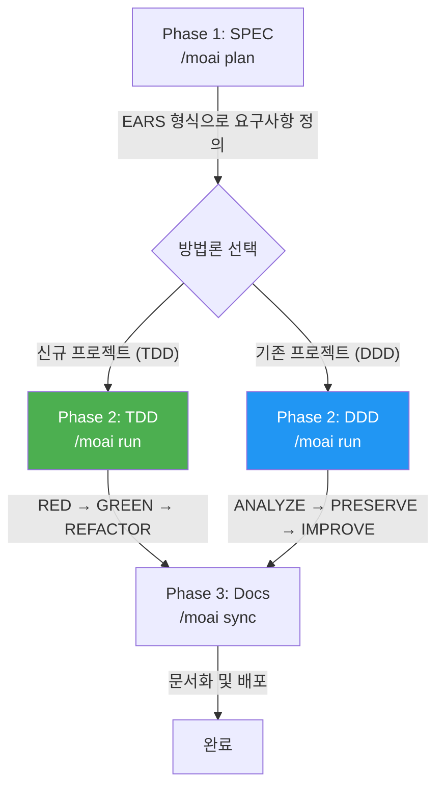

MoAI-ADK는 **비용 (토크노믹스) · 자기 개선 (에이전틱 루프 엔지니어링) · 품질 통제 (에이전틱 하네스)** 세 가지로 Claude Code를 감싸는 Agentic Development Kit입니다. 같은 품질의 코드를 더 적은 토큰으로 만듭니다. 완료 조건만 선언하면 루프가 알아서 일하고, 그 과정에서 쌓인 관찰은 하네스 학습의 원료가 됩니다. '끝'은 SPEC 3단계와 TRUST 5 게이트가 증거로 판정합니다. 모델 선택도, 추론 깊이도, 컨텍스트 사용량도 시스템이 관리합니다. Go로 작성된 단일 바이너리라 의존성 없이 바로 실행됩니다.

이 페이지는 MoAI-ADK 가 무엇이고, 왜 이런 모양을 하고 있는지를 한 흐름에 소개합니다. 세 가지 핵심이 각각 어떤 문제에 대답하는지, SPEC · TRUST 5 · CG 모드 같은 용어가 이 안에서 어디에 서 있는지, 그리고 처음 시작할 때 어디로 가면 되는지까지를 다룹니다. 설치 절차와 첫 프로젝트 실행은 [설치](/ko/getting-started/installation) 와 [빠른 시작](/ko/getting-started/quickstart) 페이지에 맡기고, 여기서는 "왜" 에 집중합니다.


## 표기법 안내

이 문서에서 코드 블록의 접두사는 실행 환경을 나타냅니다:

- **Claude Code** 대화창에서 입력하는 명령어
  ```bash
  > /moai plan "기능 설명"
  ```

- **터미널** (Terminal)에서 입력하는 명령어
  ```bash
  moai init my-project
  ```

## 세 가지 핵심 가치

MoAI-ADK v3.0이 내세우는 가치는 다음 세 가지로 요약됩니다.

| 핵심 | 한 줄 설명 | 대표 도구 |
|------|-----------|----------|
| **토크노믹스** | 비용 대비 품질을 극대화하는 지능적 자원 분배 | 3-계층 모델 정책 · CG 모드 · Token Circuit Breaker |
| **에이전틱 루프 엔지니어링** | 루프가 스스로 일하고, 관찰이 쌓여 하네스가 학습 | `/moai goal` · `/moai loop` · Analyze-First 라우팅 |
| **에이전틱 하네스** | 코드를 직접 쓰는 대신 에이전트가 일할 환경을 설계 | 11개 에이전트 · SPEC 3-phase · TRUST 5 |

각 핵심의 자세한 내용은 [핵심 개념](/ko/core-concepts/) 섹션에서 다룹니다. 이 문서에서는 시작에 필요한 만큼만 살펴봅니다.

## 핵심 개념

MoAI-ADK는 **SPEC 기반 TDD/DDD** 방법론을 따르며, **TRUST 5** 품질 프레임워크로 코드 품질을 보장합니다.

### SPEC이란? (쉽게 이해하기)

**SPEC**(Specification)은 "AI와 나눈 대화를 문서로 남기는 것"입니다.

**바이브코딩**(Vibe Coding)의 가장 큰 문제는 **맥락 유실**입니다:

- AI와 1시간 동안 논의한 내용이 세션이 끊기면 **사라집니다**
- 다음 날 이어서 작업하려면 **처음부터 다시 설명**해야 합니다
- 복잡한 기능일수록 **의도와 다른 결과**가 나옵니다

**SPEC이 이 문제를 해결합니다:**

- 요구사항을 **파일로 저장**하여 영구 보존
- 세션이 끊겨도 SPEC만 읽으면 **이어서 작업** 가능
- EARS 형식으로 **모호함 없이** 명확하게 정의
- 같은 설명을 반복하지 않으니 **토큰도 절약**됩니다


**한 줄 요약:** 어제 AI와 논의한 "JWT 인증 + 1시간 만료 + 리프레시 토큰"을 오늘 다시 설명할 필요 없이, `/moai run SPEC-AUTH-001` 한 줄로 바로 구현을 시작합니다!


### 방법론과 품질 기준

구현 방식은 프로젝트 상태에 따라 둘 중 하나가 자동으로 배정되고, 결과물은 공통된 품질 기준으로 검증됩니다.

| 이름 | 언제 쓰나 | 자세히 |
|------|-----------|--------|
| **TDD** (Test-Driven Development) | 신규 프로젝트 또는 테스트 커버리지 10% 이상 (기본값) | [SPEC 기반 개발](/ko/core-concepts/spec-based-dev) |
| **DDD** (Domain-Driven Development) | 테스트 커버리지 10% 미만인 기존 프로젝트 | [DDD](/ko/core-concepts/ddd) |
| **TRUST 5** | 방법론과 무관하게 모든 코드 변경에 적용 | [TRUST 5](/ko/core-concepts/trust-5) |


MoAI-ADK v2.5.0+는 TDD와 DDD 중 하나만 고릅니다. 명확성과 일관성을 위해 hybrid 모드는 없앴습니다. 방법론은 `moai init` 시 자동으로 정해지며, `.moai/config/sections/quality.yaml`의 `development_mode`에서 변경할 수 있습니다.


## Go Edition 특징

MoAI-ADK는 Python Edition을 Go로 완전히 재작성하여 성능과 효율성을 극대화했습니다.

| 항목 | Python Edition | Go Edition |
|------|---------------|------------|
| 배포 | pip + venv + 의존성 | **단일 바이너리**, 의존성 없음 |
| 시작 시간 | ~800ms 인터프리터 부팅 | **~5ms** 네이티브 실행 |
| 동시성 | asyncio / threading | **네이티브 goroutines** |
| 타입 안전성 | 런타임 (mypy 선택) | **컴파일 타임 강제** |
| 크로스 플랫폼 | Python 런타임 필요 | **프리빌트 바이너리** (macOS, Linux, Windows) |

### 핵심 수치 (v3.0 기준)

- **11개** 에이전트 카탈로그 (10 MoAI 커스텀 + 1 Anthropic 빌트인 `Explore`)
- **31개** 스킬 (template-managed)
- **36개** 터미널 CLI 명령 · **16종** `/moai` 슬래시 서브커맨드
- **16개** 프로그래밍 언어 지원
- **543개** SPEC 문서 기반으로 개발된 코드베이스

## 시스템 요구사항

| 플랫폼 | 지원 환경 | 비고 |
|--------|----------|------|
| macOS | Terminal, iTerm2 | 완전 지원 |
| Linux | Bash, Zsh | 완전 지원 |
| Windows | **WSL (권장)**, PowerShell 7.x+ | 네이티브 cmd.exe 미지원 |

**필수 조건:**
- **Git**이 모든 플랫폼에 설치되어 있어야 합니다
- **Windows 사용자**: 가장 매끄럽게 쓰려면 WSL (Windows Subsystem for Linux) 을 권장합니다

## 주요 기능

### 에이전트 카탈로그 (11개)

MoAI 오케스트레이터는 직접 구현하지 않고 11개의 전문 에이전트에게 작업을 위임합니다. 계획과 감사는 분리되어 있습니다. 만든 사람이 검사하지 않습니다.

| 카테고리 | 수량 | 주요 에이전트 |
|----------|------|--------------|
| **Manager** | 5개 | manager-spec, manager-develop, manager-docs, manager-git, manager-design |
| **Evaluator** | 2개 | plan-auditor, sync-auditor |
| **Builder** | 1개 | builder-harness |
| **Advisor** | 1개 | super-advisor (고추론 자문) |
| **Specialist** | 1개 | e2e-tester (웹/모바일/데스크탑 E2E 테스트 실행) |
| **빌트인** | 1개 | Explore (Anthropic 내장, 읽기 전용 코드 분석) |

### 모델 정책 (토크노믹스)

MoAI-ADK는 각 에이전트에 최적의 모델과 추론 깊이를 할당합니다. 목표는 요금제의 사용량 한도 안에서 품질을 최대한 끌어올리는 것입니다. 그래서 모델 클래스를 더 약한 쪽으로 바꾸는 대신, 같은 Opus 안에서 각 에이전트의 추론 깊이만 조절합니다. 오래 이어지는 에이전틱 작업에서는 약한 모델이 스텝을 더 많이 소모해 작업당 비용이 오히려 올라가기 때문입니다.

| 티어 | 특징 |
|------|------|
| **high** | 최고 품질 — 호출 빈도가 가장 낮은 두 에이전트에 `max` 추론 깊이 |
| **medium** (기본값) | 품질과 비용의 균형 |
| **low** | 작업당 최저 비용 — 에이전틱 에이전트는 Opus `low` effort로 내려가고, Sonnet은 단발성 행에만 |


기본 티어는 **medium** 입니다. 티어를 조절해도 모델 클래스는 그대로이고, 각 에이전트의 Opus 추론 깊이만 달라집니다. `low`는 에이전틱 행을 모두 Opus `low` effort로 두고 단발성 행에서만 Sonnet을 쓰며, `high`는 호출 빈도가 가장 낮은 두 에이전트를 `max` effort로 올립니다. `--model-policy` 플래그 또는 초기화 마법사에서 설정합니다.


### 실행 모드와 오케스트레이션

자연어 요청은 **Analyze-First** 라우팅을 거칩니다. 어떤 언어로 요청하든 의도를 먼저 분석해 알맞은 워크플로우로 연결합니다. 오케스트레이터는 작업 복잡도에 따라 순차 서브에이전트 (기본), 병렬 서브에이전트 팬아웃, 동적 워크플로우 중 하나를 선택합니다.

```bash
/moai run SPEC-AUTH-001           # 복잡도 기반 자동 선택
/moai run SPEC-AUTH-001 --solo    # 순차 서브에이전트 강제
```


**v3.0 변경**: 과거의 Agent Teams 정적 오케스트레이션 계층은 폐지되었습니다. `--team`을 강제해도 서브에이전트 모드로 폴백합니다. Claude Code의 네이티브 teammate 런타임(`moai cg`의 tmux 분할 창)은 그대로 유지됩니다.


### SPEC-First 워크플로우

MoAI-ADK는 3단계 개발 워크플로우를 따릅니다. Run 단계의 방법론은 프로젝트 상태에 따라 자동 선택됩니다:


```mermaid
flowchart TD
    A["Phase 1: SPEC<br/>/moai plan"] -->|"EARS 형식으로 요구사항 정의"| B{"방법론 선택"}
    B -->|"신규 프로젝트 (TDD)"| C["Phase 2: TDD<br/>/moai run"]
    B -->|"기존 프로젝트 (DDD)"| D["Phase 2: DDD<br/>/moai run"]
    C -->|"RED → GREEN → REFACTOR"| E["Phase 3: Docs<br/>/moai sync"]
    D -->|"ANALYZE → PRESERVE → IMPROVE"| E
    E -->|"문서화 및 배포"| F["완료"]

    style C fill:#4CAF50,color:#fff
    style D fill:#2196F3,color:#fff
```

### 에이전틱 루프

완료 조건을 선언하면 루프가 스스로 일합니다:

```text
/moai goal "모든 테스트가 통과하고 lint가 깨끗할 때까지"   # 조건 선언형 루프
/moai loop                                              # 진단 기반 반복 수정 (loop_prevention 기본 100회)
/moai fix                                               # 단일 패스 자동 수정
```

`/moai loop`는 goal 엔진 위의 프리셋입니다. 진단 도구가 찾은 이슈 큐를 다 비울 때까지 반복 수정합니다.

반복 한도는 서로 다른 층위를 맡는 두 설정이 각각 정합니다. `workflow.loop_prevention.max_iterations` (기본값 **100**) 는 개별 작업의 진단 수정 루프 한도이고, `workflow.agentic_loop.max_iterations` (기본값 **10**) 는 파이프라인 전체의 완료 루프 상한입니다. 둘은 별개의 설정이므로 값이 서로 달라도 정상입니다.

### 권장 워크플로우 체인

**신규 기능 개발:**
```
/moai plan → /moai run SPEC-XXX → /moai sync SPEC-XXX
```

**버그 수정:**
```
/moai fix (또는 /moai loop) → /moai review → /moai sync
```

**리팩토링:**
```
/moai plan → /moai clean → /moai run SPEC-XXX → /moai review → /moai codemaps
```

**문서 업데이트:**
```
/moai codemaps → /moai sync
```

## 다국어 지원

MoAI-ADK는 다음 4가지 언어를 지원합니다:

- **한국어** (Korean)
- **영어** (English)
- **일본어** (Japanese)
- **중국어** (Chinese)

설치 마법사에서 선호하는 언어를 선택하거나, 설정 파일에서 직접 변경할 수 있습니다.

## LSP 통합

**LSP**(Language Server Protocol)는 코드 편집기와 언어 도구 사이의 표준 통신 프로토콜입니다. 코드 오류, 타입 오류, 린트 결과를 실시간으로 감지해 곧바로 알려 줍니다.

**Ralph-Loop Style**은 LSP 진단 결과를 피드백 루프로 활용하는 자율 워크플로우입니다. 품질 문제가 감지되면 수정 에이전트를 자동 호출하고, 품질 기준을 달성할 때까지 반복합니다.

MoAI-ADK의 Ralph-Loop Style LSP 통합은 다음과 같이 동작합니다:

- **LSP 기반 완료 자동 감지**: 코드 품질 상태를 실시간으로 모니터링
- **실시간 회귀 탐지**: 변경 사항이 기존 기능에 미치는 영향을 즉시 감지
- **자동 완료 조건**: 0 에러, 0 타입 에러, 85% 커버리지 달성 시 자동으로 완료 처리


Ralph-Loop Style LSP 통합은 개발 워크플로우의 품질 게이트를 자동화해, 사람이 일일이 손대지 않아도 코드 품질을 높게 유지해 줍니다.


## CG 모드로 토큰 절약 (50~70%)


**비용 (토크노믹스) 의 실전 도구:** z.ai GLM은 Claude Code와 완전 호환되는 AI 백엔드입니다. **CG 모드** (`moai cg`, tmux 필수) 에서 Claude 리더가 오케스트레이션·아키텍처 결정·코드 리뷰를 맡고, GLM 팀원이 구현·테스트·문서화를 병렬로 처리해 구현 중심 작업에서 **50~70% 토큰을 절약**합니다. 아키텍처 설계나 보안 리뷰처럼 깊은 추론이 필요할 때는 Claude 전용 (`moai cc`) 을 씁니다.

```bash
moai cc            # Claude 전용
moai glm           # GLM 전용
moai cg            # CG 하이브리드 (Claude 리더 + GLM 팀원, tmux 필수)
```

GLM 계정이 없다면 [z.ai 가입하기 (추가 10% 할인)](https://z.ai/subscribe?ic=1NDV03BGWU)에서 가입하세요. 가입 링크를 통한 보상은 **MoAI 오픈소스 개발**에 사용됩니다. 상세 아키텍처와 모델 정책은 [멀티 LLM](/ko/multi-llm/) 섹션을 참조하세요.


## 자기 개선 — 루프가 스스로 일하고 하네스가 학습합니다


**자기 개선 (에이전틱 루프 엔지니어링) 의 실전 도구:** 완료 조건을 선언하면 조건이 충족될 때까지 세션이 스스로 일합니다. `/moai goal "<조건>"`은 조건 선언형 자율 루프, `/moai loop`는 LSP 진단·AST-grep·린터가 찾은 이슈 큐를 다 비울 때까지 반복 수정 (파이프라인 완료 루프 기본 10회 — `agentic_loop.max_iterations`), `/moai fix`는 단일 패스 자동 수정입니다. 루프가 남긴 관찰 (사용자 교정, 실패 패턴, 라우팅 결정) 은 4단계 학습 사다리 (관찰 → 휴리스틱 → 규칙 → 자동 업데이트, 사용자 승인 게이트 아래) 를 거쳐 하네스 지침으로 쌓입니다. 그래서 다음 세션은 이전 세션의 실수를 되풀이하지 않습니다.


## 시작하기

MoAI-ADK를 시작하려면 다음 순서로 진행하세요:

1. **[설치](/ko/getting-started/installation)** - 시스템에 MoAI-ADK 설치
2. **[초기 설정](/ko/getting-started/init-wizard)** - 인터랙티브 설정 마법사 실행
3. **[빠른 시작](/ko/getting-started/quickstart)** - 첫 프로젝트 생성
4. **[핵심 개념](/ko/core-concepts/what-is-moai-adk)** - MoAI-ADK 심화 이해

## 핵심 장점

| 장점 | 설명 |
|------|------|
| **품질 보장** | TRUST 5 프레임워크로 일관된 품질 유지 |
| **토큰 효율** | 모델 정책 + CG 모드 + Token Circuit Breaker로 비용을 시스템이 관리 |
| **생산성 향상** | AI 에이전트 자동화로 개발 시간 단축 |
| **확장 가능** | 모듈형 아키텍처와 하네스 빌더로 유연하게 확장 |
| **다국어** | 4개 언어 지원 |

## 추가 리소스

- [GitHub 저장소](https://github.com/modu-ai/moai-adk)
- [문서 사이트](https://adk.mo.ai.kr)
- [커뮤니티 포럼](https://github.com/modu-ai/moai-adk/discussions)

---

## 다음 단계

[설치 가이드](/ko/getting-started/installation)에서 MoAI-ADK 설치 방법을 알아보세요.
