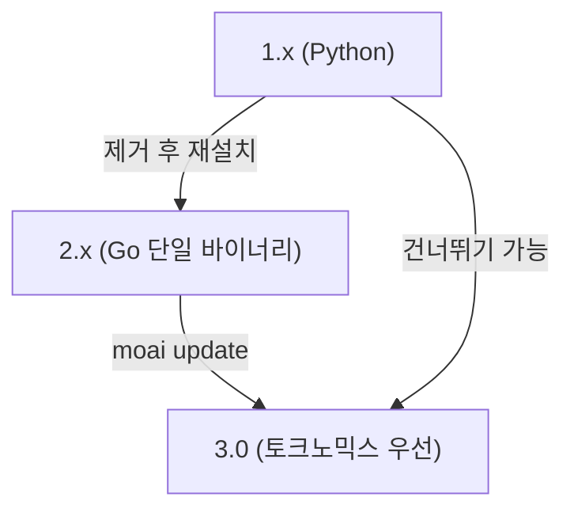

# 마이그레이션 가이드

MoAI-ADK 는 두 번의 큰 전환을 거쳤습니다. (1) 1.x(Python) 에서 2.x(Go 단일 바이너리), (2) 2.x 에서 3.0(토크노믹스 우선 에이전트 워크플로우). 이 페이지는 두 전환을 한 흐름으로 정리합니다. 어디서 왔는지에 따라 해당 단락으로 건너뛰세요.

마이그레이션의 큰 원칙은 "사용자가 만든 자산은 보존하고, 하네스가 제공하는 자산은 교체한다" 입니다. `.claude/` 와 `.moai/project/`, `.moai/specs/` 아래 사용자가 직접 쓴 내용은 업그레이드를 거쳐도 자동으로 남습니다. 반면 하네스가 배포한 템플릿·규칙·에이전트 정의는 최신 버전으로 덮어쓰기 때문에, 사용자가 손으로 고친 템플릿이 있다면 `moai update` 가 백업을 남기므로 그 백업에서 복구할 수 있습니다.

## 전체 흐름



1.x 사용자는 2.x 를 거치지 않고 바로 3.0 으로 올 수 있습니다. 아래 1.x 단락의 제거 절차를 밟은 뒤, [3.0 설치](#30-설치) 단락으로 바로 가면 됩니다.

## 1.x (Python) 사용자 — 2.x 로


**MoAI-ADK 1.x (Python 버전) 사용자는 반드시 먼저 기존 버전을 제거하세요.** 1.x 와 2.x 는 같은 `moai` 명령어를 쓰기 때문에, 기존 버전이 남아 있으면 서로 충돌합니다.


## 1단계 — 기존 1.x 제거

```bash
# uv 로 설치한 경우
uv tool uninstall moai-adk

# pip 로 설치한 경우
pip uninstall moai-adk
```

## 2단계 — 기존 설정 백업 (선택)

```bash
# 기존 설정을 백업하고 싶다면
cp -r ~/.moai ~/.moai-v1-backup
```

## 3단계 — 2.x 설치

```bash
curl -fsSL https://adk.mo.ai.kr/install.sh | bash
```

## 4단계 — 설치 확인

```bash
moai version
```

이 단계를 마치면 Python 런타임과 가상환경이 더 이상 필요 없습니다. 2.x 는 단일 Go 바이너리라 시작 시간이 약 800ms 에서 5ms 로 줄고, 라이선스도 GPL-3.0 에서 Apache-2.0 으로 바뀝니다.


**라이선스 변경**: MoAI-ADK 1.x(Python) 은 GPL-3.0, 2.x(Go) 부터는 Apache-2.0 입니다. 상업적 사용·수정·배포가 자유롭고 소스 코드 공개 의무가 없습니다.


### pip / uv 충돌 해결

pip 와 uv 는 패키지를 서로 다른 위치에 설치합니다. 두 도구를 섞어 쓰면 `moai` 명령이 엉뚱한 버전을 실행할 수 있습니다. 증상이 나타나면 완전히 지우고 다시 깔라:

```bash
# 1. 모든 기존 버전 제거
uv tool uninstall moai-adk 2>/dev/null || true
pip uninstall moai-adk -y 2>/dev/null || true

# 2. 남은 바이너리 확인 및 삭제
which moai && rm $(which moai) 2>/dev/null || true

# 3. 재설치
curl -fsSL https://adk.mo.ai.kr/install.sh | bash

# 4. 확인
moai version
```

## 2.x 사용자 — 3.0 으로

3.0 은 2.x 와 호환성을 유지하면서 토크노믹스 우선으로 전환한 정식(GA) 릴리스입니다. 사용자 파일(`.claude/`, `.moai/project/`, `.moai/specs/`) 은 자동으로 보존됩니다.

### 3.0 설치

기존 프로젝트는 템플릿 동기화를 먼저 돌리고, 그 다음 바이너리를 올립니다.

```bash
# 1. v3.0.0 템플릿 동기화 (사용자 파일 보존)
moai update

# 2. CLI 바이너리 업그레이드
moai update --binary

# 3. 확인
moai version    # v3.0.0 보고
```

새 프로젝트나 깨끗한 환경에서는 설치 스크립트 한 줄이면 충분합니다.

```bash
curl -fsSL https://adk.mo.ai.kr/install.sh | bash
```

Go 가 이미 설치되어 있다면 `go install` 도 가능합니다.

```bash
go install github.com/modu-ai/moai-adk/cmd/moai@latest
```

### 3.0 의 주요 변화

3.0 으로 올라오며 에이전트 카탈로그·자율 루프·비용 통제가 다시 짜였습니다. 마이그레이션에서 가장 자주 마주치는 변화를 정리합니다.

#### 에이전트 카탈로그 11개로 통합

archived 에이전트 이름(`manager-strategy`, `expert-backend`, `researcher` 등) 이 **spawn 시 거부** 됩니다. 대신 (a) 11개 유지 에이전트 중 하나를 쓰거나, (b) 도메인 허용 목록을 넣은 `Agent(general-purpose)` 를 자리마다 spawn 하는 패턴으로 바꿉니다.

#### Agent Teams 정적 편성 계층 은퇴

강제 `--team` / `--mode team` 은 `MODE_TEAM_UNAVAILABLE` 을 내고 서브에이전트 모드로 폴백합니다. 네이티브 Claude Code 팀메이트 런타임(`moai cg` GLM 페이스, `worktree --team`) 은 영향을 받지 않습니다.

#### Context7 MCP 의존성 은퇴

`mcp__context7__*` 가 모든 `allowed-tools` 와 설정 ask-list 에서 제거되었습니다. 라이브러리 문서 조회는 WebSearch/WebFetch 폴백 전략을 씁니다.

#### `/moai e2e` 다목적화

웹 전용이던 E2E 서브커맨드가 폐기되고, 웹·모바일·데스크톱을 아우르는 다중 플랫폼 서브시스템(`e2e-tester` 에이전트 주도) 로 다시 만들어졌습니다.

#### 프로필 매트릭스 도입 (3.0.1)

`plan_type × performance_tier` 두 축 설계가 **에이전트 그룹별 단일 프로필 매트릭스** (`max`/`medium`/`low`) 로 바뀌었습니다. `moai init --plan-type` 은 은퇴하고 `moai init --profile <max|medium|low>` 로 대체되었습니다. 기존 `llm.yaml`(`plan_type` + `claude_models` + `performance_tier`) 은 오류 없이 로드되고 올바른 프로필로 귀결됩니다 — 다음 저장 시 은퇴한 키가 정리됩니다.


**설정 마이그레이션은 자동입니다.** legacy `llm.yaml` 이 그대로 읽혀 올바른 프로필로 변환되므로, 설정 파일을 손으로 고칠 필요가 없습니다.


### v2 → v3 클린 재설치 관련 알려진 이슈

2.x 에서 3.0 으로 넘어가는 길에 보고된 두 가지 regression 이 3.0.0 발표 전후로 모두 수리되었습니다.

- **설정 무한 루프 (#1084)** — 사용자가 고친 `language.yaml` / `design.yaml` 이 매 실행마다 기본값으로 되돌아가던 문제. `system.yaml` 의 `v3.*` 버전이 v2 지문을 우회하도록 고쳐졌습니다.
- **템플릿 충돌 루프** — `.claude/rules/moai/design` 이 동시에 은퇴 경로와 v3 템플릿에 들어 있어 깨끗한 재설치가 끝없이 도는 문제. 은퇴 목록에서 해당 항목을 빼고, 빌드 타임 회귀 가드를 추가했습니다.
- **은퇴한 v2 권한 deny 규칙 (#1101)** — v2 시절 `deny` 항목 12개가 업그레이드를 거치며 살아남아 매 세션 시작 경고를 냈던 문제. 3.0.1 에서 한 번의 마이그레이션으로 정리됩니다.

최신 3.0.x 바이너리를 쓰고 있다면 이 문제들은 이미 해결되어 있습니다.

## 건너뛰기 — 1.x 에서 3.0 으로

1.x 사용자는 2.x 를 거칠 필요 없이 3.0 으로 바로 올 수 있습니다.

```bash
# 1. 기존 Python 버전 제거
uv tool uninstall moai-adk 2>/dev/null || true
pip uninstall moai-adk -y 2>/dev/null || true
which moai && rm $(which moai) 2>/dev/null || true

# 2. (선택) 백업
cp -r ~/.moai ~/.moai-v1-backup 2>/dev/null || true

# 3. 3.0 설치
curl -fsSL https://adk.mo.ai.kr/install.sh | bash

# 4. 확인
moai version
```

라이선스는 GPL-3.0(1.x) 에서 Apache-2.0(2.x 이상) 으로 바뀝니다. 상업적 사용에 제약이 사라집니다.

## 업그레이드 후 확인

버전을 올린 뒤에는 다음을 확인하세요.

```bash
moai version      # 예상 버전 표시
moai doctor       # 하네스·훅·설정 건강 점검
```

`moai doctor` 가 빨간 항목을 보이면 보통 템플릿 동기화가 덜 끝난 것입니다. `moai update` 를 한 번 더 돌리면 대부분 해결됩니다.

## 제거

완전히 지우려면 바이너리와 설정 디렉터리를 삭제하세요.

```bash
# 바이너리 삭제
rm "$(which moai)"

# 설정 디렉토리 삭제 (선택사항)
rm -rf "$HOME/.moai"
```

## 다음 단계

- [설치](/ko/getting-started/installation/) — 운영체제별 설치 세부 사항
- [초기 설정 마법사](/ko/getting-started/init-wizard/) — 프로젝트 초기화
- [CLI 개요](/ko/getting-started/cli/) — 자주 쓰는 명령어 둘러보기
