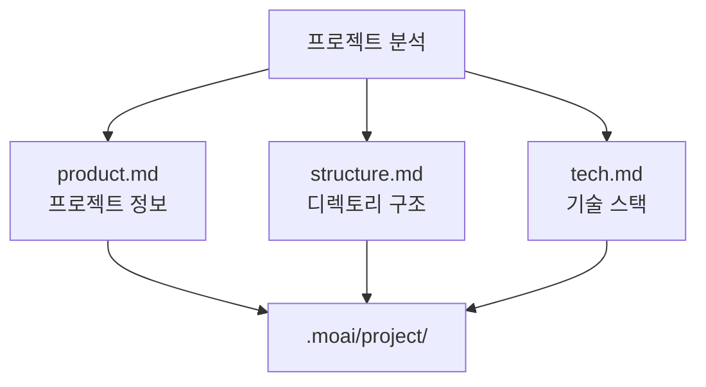
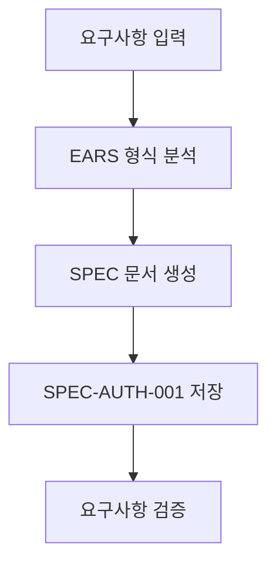
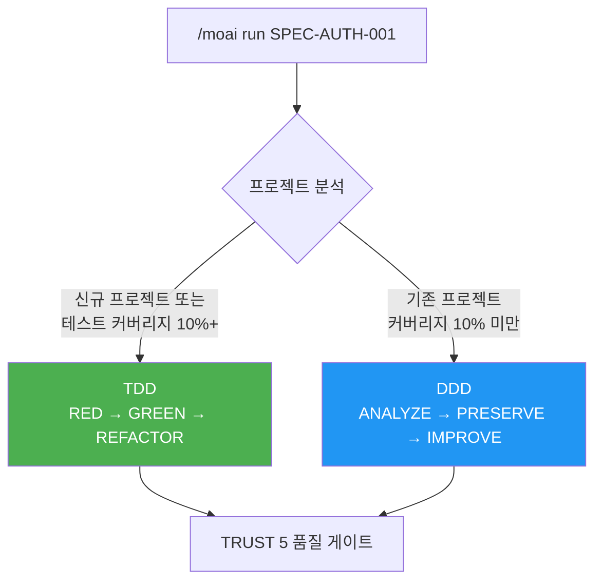
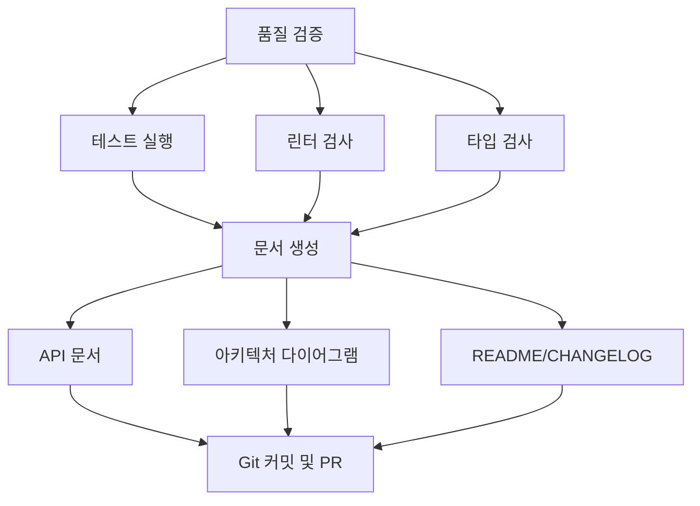
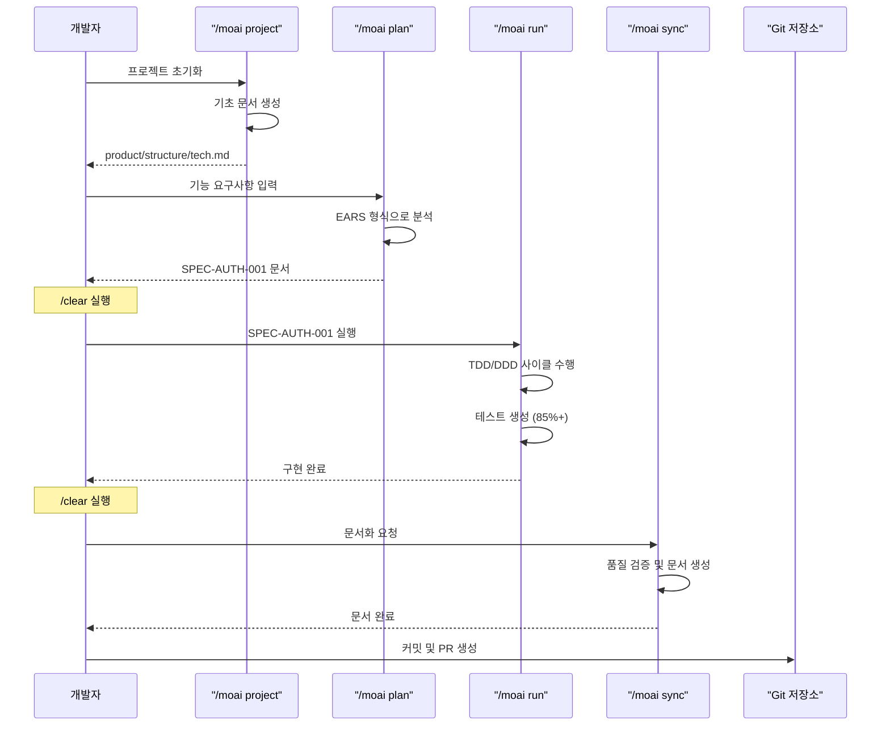
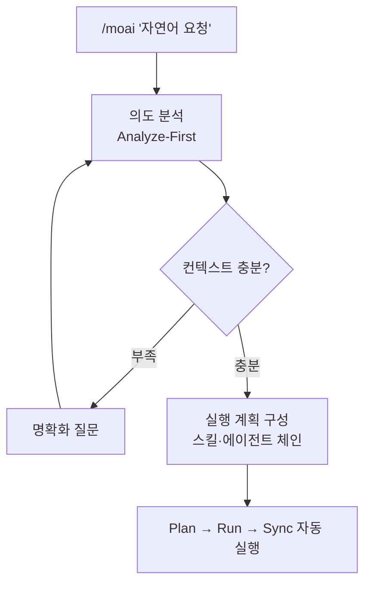
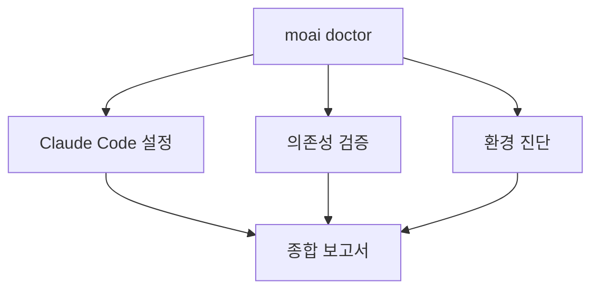

MoAI-ADK로 첫 프로젝트를 만들면서 개발 워크플로우를 직접 겪어 보세요. 이 문서를 따라가면 SPEC 작성부터 구현, 문서화까지 한 사이클을 끝까지 돌게 됩니다.

MoAI-ADK의 개발 사이클은 "쓰고, 돌리고, 맺는" 세 마당으로 이루어집니다. 먼저 요구사항을 SPEC 문서로 쓰고(`/moai plan`), 그 문서를 바탕으로 구현을 돌리고(`/moai run`), 마지막으로 품질 검증과 문서화로 결과를 맺습니다(`/moai sync`). 각 단계 사이에 `/clear` 로 대화 기록을 비우면 토큰이 절약됩니다 — 결정 사항은 파일에 남아 있으니 대화 기록을 가둬 둘 이유가 없기 때문입니다.

## 사전 준비

시작하기 전에 다음이 완료되어야 합니다:

- [x] MoAI-ADK 설치 ([설치 가이드](/ko/getting-started/installation))
- [x] 초기 설정 완료 ([초기 설정](/ko/getting-started/init-wizard))
- [ ] GLM API 키 획득 (선택 — CG 모드로 토큰 비용을 절감하려는 경우)

## 1단계 — 프로젝트 초기화

새로운 프로젝트를 생성하려면 `moai init` 명령어를 사용하세요:

```bash
moai init my-first-project
cd my-first-project
```

기존 프로젝트에 MoAI-ADK를 초기화하려면 해당 폴더로 이동 후 실행하세요:

```bash
cd existing-project
moai init
```

## 2단계 — 프로젝트 문서 생성

프로젝트의 기초 문서를 만듭니다. Claude Code가 프로젝트를 파악하려면 반드시 거쳐야 하는 단계입니다. 세션마다 프로젝트 구조를 설명하는 대신, 에이전트가 이 문서를 읽습니다.

```bash
> /moai project
```

이 명령은 프로젝트를 분석하여 다음 3개 파일을 자동 생성합니다:



| 파일 | 내용 |
|------|------|
| **product.md** | 프로젝트 이름, 설명, 타겟 사용자, 핵심 기능 |
| **structure.md** | 디렉토리 트리, 주요 폴더 목적, 모듈 구성 |
| **tech.md** | 사용 기술, 프레임워크, 개발 환경, 빌드/배포 설정 |


`/moai project`는 프로젝트를 처음 설정한 뒤, 또는 구조가 크게 바뀐 뒤에 실행하세요. 프로젝트 문서와 함께 프로젝트 전용 하네스도 자동으로 구성됩니다.


## 3단계 — SPEC 문서 생성

첫 기능의 SPEC 문서를 만듭니다. EARS (Easy Approach to Requirements Syntax) 형식으로 요구사항을 명확하게 정의합니다.


**SPEC이 왜 필요한가요?**

**바이브코딩**(Vibe Coding)의 가장 큰 문제는 **맥락 유실**입니다:

- AI와 대화하며 코딩하다 보면 "아까 뭘 하려고 했더라?" 하는 순간이 옵니다
- 세션이 끊기거나 컨텍스트가 초기화되면 **앞서 논의한 요구사항이 사라집니다**
- 결국 같은 설명을 되풀이하거나, 의도와 다른 코드가 나옵니다

**SPEC 문서가 이 문제를 해결합니다:**

| 문제 | SPEC의 해결 방법 |
|------|-----------------|
| 맥락 유실 | 요구사항을 **파일로 저장**하여 영구 보존 |
| 모호한 요구사항 | **EARS 형식**으로 명확하게 구조화 |
| 커뮤니케이션 오류 | **인수 기준**으로 완료 조건 명시 |
| 진행 상황 추적 불가 | **SPEC ID**로 작업 단위 관리 |

**한 줄 요약:** SPEC은 "AI와 나눈 대화를 문서로 남기는 것"입니다. 세션이 끊겨도 SPEC 문서만 읽으면 하던 일을 그대로 이어갈 수 있습니다. 같은 설명을 되풀이하지 않으니 토큰도 아낍니다.


```bash
> /moai plan "사용자 인증 기능 구현"
```

이 명령은 다음을 수행합니다:



생성된 SPEC 문서는 `.moai/specs/SPEC-AUTH-001/spec.md`에 저장됩니다 (SPEC ID는 `SPEC-<도메인>-<번호>` 형식).


SPEC 생성 후 `/clear` 명령으로 컨텍스트를 비우세요. 결정 사항은 이미 SPEC 파일에 남아 있으므로 대화 기록을 유지할 이유가 없습니다. 토큰 절약의 기본기입니다.


## 4단계 — TDD/DDD 개발 실행

SPEC 문서를 바탕으로 구현을 진행합니다.

```bash
> /clear
> /moai run SPEC-AUTH-001
```

MoAI-ADK는 프로젝트 상태에 따라 최적의 개발 방법론을 자동으로 선택합니다.



---

#### TDD 모드 (신규 프로젝트 / 테스트 커버리지 10%+)

테스트를 먼저 쓰고 그 테스트를 통과시키는 RED-GREEN-REFACTOR 사이클로 구현합니다. 사이클의 각 단계가 무엇을 뜻하는지는 [SPEC 기반 개발](/ko/core-concepts/spec-based-dev)에서 다룹니다.

#### DDD 모드 (기존 프로젝트 / 테스트 커버리지 10% 미만)

기존 동작을 특성화 테스트로 붙잡아 둔 뒤 조금씩 개선하는 ANALYZE-PRESERVE-IMPROVE 사이클로 진행합니다. 자세한 내용은 [DDD](/ko/core-concepts/ddd)에서 다룹니다.

---


`/moai run`은 테스트 커버리지 85% 이상을 목표로 개발합니다. 개발 방법론은 `.moai/config/sections/quality.yaml`의 `development_mode`에서 직접 바꿀 수 있습니다.


**완료 조건:**
- 테스트 커버리지 >= 85%
- 0 errors, 0 type errors
- LSP 베이스라인 달성

완료 판정은 느낌이 아니라 증거로 내립니다. 인수 기준 하나하나가 태스크로 등록되고, 테스트가 통과해야 체크됩니다.

## 5단계 — 문서 동기화

개발이 끝나면 품질을 검증하고 문서를 자동으로 생성합니다.

```bash
> /clear
> /moai sync SPEC-AUTH-001
```

이 명령은 다음을 수행합니다:



## 전체 개발 워크플로우



## 통합 자동화: /moai

모든 단계를 한 번에 자동 실행하려면 자연어로 요청하세요:

```bash
> /moai "사용자 인증 기능 구현"
```

요청은 **Analyze-First** 라우팅을 거칩니다. 어떤 언어로 요청하든 의도부터 분석하고, 컨텍스트가 부족하면 되물어 채웁니다. 그런 다음 Plan → Run → Sync 파이프라인을 자동으로 실행합니다.



## 워크플로우 선택 가이드

| 상황 | 권장 명령어 | 이유 |
|------|-----------|------|
| 신규 프로젝트 | `/moai project` 먼저 실행 | 기초 문서 필수 |
| 단순 기능 | `/moai plan` + `/moai run` | 빠른 실행 |
| 복잡한 기능 | `/moai` | 자동 최적화 |
| 병렬 개발 | `moai cc -w <이름>`으로 워크트리 진입 | 독립 환경 보장 |

## 실전 예제

### 예제 1: 간단한 API 엔드포인트

```bash
# 1. 프로젝트 문서 생성 (최초 1회)
> /moai project

# 2. SPEC 생성
> /moai plan "사용자 목록 조회 API 엔드포인트 구현"
> /clear

# 3. 구현
> /moai run SPEC-AUTH-001
> /clear

# 4. 문서화 및 PR
> /moai sync SPEC-AUTH-001
```

### 예제 2: 복잡한 기능 (자연어 자동화)

```bash
# 프로젝트 문서가 이미 있다면 자연어로 한 번에 실행
> /moai "JWT 인증 미들웨어 구현"
```

### 예제 3: 병렬 개발 (Worktree 사용)

```bash
# 워크트리에 먼저 들어간 뒤 계획합니다
$ moai cc -w payment
> /moai plan "결제 시스템 구현"
```

## 파일 구조 이해하기

MoAI-ADK 프로젝트의 표준 구조:

```
my-first-project/
├── CLAUDE.md                        # Claude Code 프로젝트 지침서
├── CLAUDE.local.md                  # 프로젝트 로컬 설정 (개인용)
├── .mcp.json                        # MCP 서버 설정
├── .claude/
│   ├── agents/                      # Claude Code 에이전트 정의
│   ├── commands/                    # 슬래시 명령어 정의
│   ├── hooks/                       # 훅 스크립트
│   ├── skills/                      # 재사용 가능한 스킬
│   └── rules/                       # 프로젝트 규칙
├── .moai/
│   ├── config/
│   │   └── sections/
│   │       ├── user.yaml            # 사용자 정보
│   │       ├── language.yaml        # 언어 설정
│   │       ├── quality.yaml         # 품질 게이트 설정
│   │       └── git-strategy.yaml    # Git 전략 설정
│   ├── project/
│   │   ├── product.md               # 프로젝트 개요
│   │   ├── structure.md             # 디렉토리 구조
│   │   └── tech.md                  # 기술 스택
│   ├── specs/
│   │   └── SPEC-AUTH-001/
│   │       └── spec.md              # 요구사항 명세서
│   └── memory/
│       └── checkpoints/             # 세션 체크포인트
├── src/
│   └── [프로젝트 소스 코드]
├── tests/
│   └── [테스트 파일]
└── docs/
    └── [생성된 문서]
```

## 품질 확인

개발 중 언제든지 품질을 확인할 수 있습니다:

```bash
moai doctor
```

이 명령은 다음을 확인합니다:

- Claude Code 설정
- 의존성 검증 (git, go 등 도구 설치 여부)
- 환경 진단

세부 진단은 하위 명령어로 실행합니다 — `moai doctor config` (설정), `moai doctor hook` (훅 커버리지), `moai doctor permission` (권한), `moai doctor sandbox` (샌드박스).



## 유용한 팁

### 토큰 관리

단계를 하나 마칠 때마다 `/clear`로 컨텍스트를 비우세요. 결정 사항은 SPEC과 `progress.md`에 파일로 남아 있으니, 대화 기록 없이도 다음 단계를 이어갈 수 있습니다:

```bash
> /moai plan "복잡한 기능 구현"
> /clear  # 세션 초기화
> /moai run SPEC-AUTH-001
> /clear
> /moai sync SPEC-AUTH-001
```

### 버그 수정 및 자동화

```bash
# 자동 수정 (단일 패스)
> /moai fix "테스트에서 발생하는 TypeError 수정"

# 반복 수정 (완료될 때까지)
> /moai loop "모든 린터 경고 수정"

# 완료 조건 선언형 루프
> /moai goal "go test ./... exits 0; 모든 린트 경고 해소"
```

---

## 다음 단계

[핵심 개념](/ko/core-concepts/what-is-moai-adk)에서 MoAI-ADK의 심화 기능을 알아보세요.
