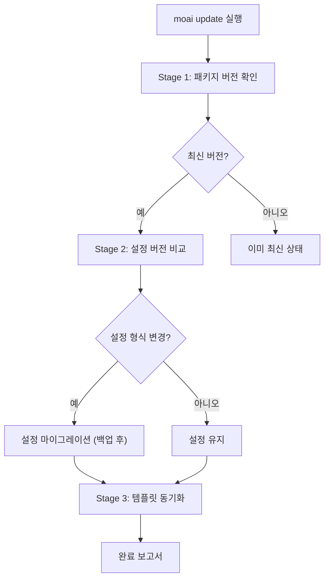
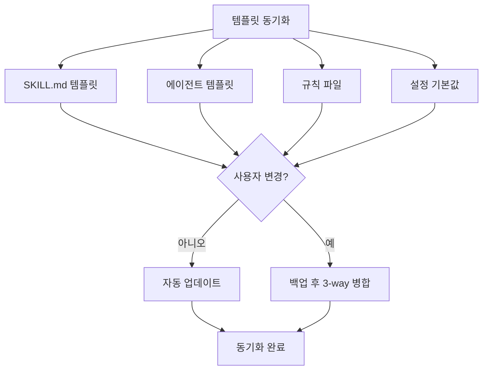

MoAI-ADK를 최신 버전으로 유지하는 방법을 안내합니다. `moai update` 하나로 바이너리와 템플릿이 함께 갱신되며, 사용자가 만든 커스텀 자산은 자동으로 보존됩니다.

## 업데이트 명령

플래그 없이 실행하면 바이너리와 템플릿을 모두 갱신합니다 — 이것이 기본 동작입니다.

```bash
moai update
```

### 3단계 스마트 업데이트



### Stage 1: 패키지 버전 확인

현재 설치된 버전과 GitHub Releases의 최신 버전을 비교합니다.

```bash
# 현재 버전 확인
moai --version

# 사용 가능한 업데이트만 확인 (실제 업데이트 안 함)
moai update --check
```

### 체크섬 의무 검증 (Mandatory Checksum Verification) {#checksum-verification}

`moai update` 의 binary 다운로드는 **checksum 검증을 우회할 수 없습니다**. release 의 `checksums.txt` 다운로드가 실패하거나 파싱이 실패하면 업데이트 흐름을 **abort** 합니다 — binary 다운로드를 시도하지 않습니다.

#### Retry 정책

`checksums.txt` 다운로드는 **3회 retry** 를 지수 백오프로 시도합니다:

| 시도 | 대기 시간 |
|------|-----------|
| 1차 (즉시) | 0s |
| 2차 retry | 2s 대기 |
| 3차 retry | 4s 대기 |
| 추가 retry 없음 | 합계 ~6s 대기 후 실패 |

모든 retry 가 실패하면 다음과 같은 메시지가 출력됩니다:

```
error: checksum unavailable: persistent retry failure after 3 attempts
```

**`--skip-checksum` 같은 우회 옵션은 존재하지 않습니다** (CWE-345 의도된 정책).

#### 실패 시 복구 절차

1. **네트워크 연결 확인**:
   ```bash
   curl -I https://github.com/modu-ai/moai-adk/releases/latest
   ```
2. **Proxy / firewall 확인** — GitHub release asset 도메인 (`github.com`, `objects.githubusercontent.com`) 허용 여부
3. **일시적 GitHub CDN 장애 가능성** — 잠시 후 재시도
4. **수동 binary 설치** (영구 차단 시):
   ```bash
   curl -fsSL https://raw.githubusercontent.com/modu-ai/moai-adk/main/install.sh | bash
   ```
   수동 설치 시 GitHub Release 의 `checksums.txt` 를 별도로 확인하는 것을 권장합니다.

자세한 위협 모델은 [보안 노트 — CWE-345](/ko/advanced/security-notes/#cwe-345) 를 참조하세요.

### Stage 2: 설정 버전 비교

설정 파일의 형식과 호환성을 검사합니다. 형식이 변경된 경우 자동으로 백업 후 마이그레이션합니다.

**검사 파일:**

- `.moai/config/sections/` 하위 YAML 파일들


설정 마이그레이션 전에 항상 `.moai/config/` 디렉터리가 백업됩니다.


### Stage 3: 템플릿 동기화

프로젝트 템플릿과 기본 파일을 최신 버전으로 동기화합니다. 사용자가 수정한 파일은 보존되며, 새 버전과의 충돌 시 백업 후 병합됩니다.



## 플래그 레퍼런스

| 플래그 | 설명 |
|--------|------|
| `--check` | 새 버전이 있는지만 확인 (업데이트 안 함) |
| `-c, --config` | 설정 마법사 다시 실행 (템플릿 동기화 안 함) |
| `--force` | 강제 업데이트 (버전 일치 스킵, 백업+병합 강제) |
| `--yes` | 모든 확인 자동 승인 (CI/CD 모드) |
| `--templates-only` | 바이너리 업데이트 건너뛰고 템플릿만 동기화 |
| `--binary` | 템플릿 동기화 건너뛰고 바이너리만 업데이트 |
| `--dry-run` | 파일시스템 변경 없이 계획된 작업만 표시 |
| `--no-hooks` | Git 훅 설치 건너뛰기 |
| `--verbose` | 모든 경고 표시 (진단 모드) |
| `--shell-env` | Claude Code 용 셸 환경변수 구성 |
| `--plan-type <api\|subscription>` | 요금제 유형 덮어쓰기 |

### 동작 방식

| 명령어 | 바이너리 업데이트 | 템플릿 동기화 |
|--------|-------------------|---------------|
| `moai update` |  |  |
| `moai update --binary` |  |  |
| `moai update --templates-only` |  |  |
| `moai update --check` |  |  (버전 확인만) |

### 바이너리 전용 업데이트

바이너리만 업데이트하고 템플릿은 동기화하지 않습니다:

```bash
moai update --binary
```

### 템플릿 전용 동기화

템플릿만 동기화하고 바이너리는 업데이트하지 않습니다:

```bash
moai update --templates-only
```

### 설정 마법사 재실행

설정 마법사를 다시 실행하여 프로젝트 구성을 변경합니다 (템플릿 동기화는 수행하지 않습니다):

```bash
moai update -c
# 또는
moai update --config
```

### Dry Run

실제 변경 없이 계획된 아카이브와 설치 작업을 미리 확인합니다:

```bash
moai update --dry-run
```

### CI/CD 모드

모든 확인을 자동 승인합니다:

```bash
moai update --yes
```

## 업데이트 후 절차

### 1단계: 버전 확인

```bash
moai --version
```

### 2단계: 설정 검증

```bash
moai doctor
```

### 3단계: 새로운 기능 확인

```bash
moai --help
```

## 개인 설정 관리

MoAI-ADK 업데이트 시 **CLAUDE.md**와 `settings.json`은 새 버전으로 동기화됩니다. 개인적인 수정 사항은 별도 파일에 보관하세요.

| 파일 | 위치 | 업데이트 영향 |
|------|------|--------------|
| `CLAUDE.md` | 프로젝트 루트 |  업데이트 시 변경됨 (MoAI-ADK 관리) |
| `settings.json` | `.claude/` |  업데이트 시 변경됨 (MoAI-ADK 관리) |
| `CLAUDE.local.md` | 프로젝트 루트 |  영향 없음 (개인 설정) |
| `.claude/settings.local.json` | 프로젝트 |  영향 없음 (개인 설정) |


**설정 우선순위:** Local > Project > User > Enterprise<br />
`settings.local.json` 이 프로젝트 설정을 오버라이드합니다.


### moai 폴더 구조

MoAI-ADK는 다음 폴더에서만 파일을 관리합니다:

```
.claude/
├── agents/
│   ├── moai/                # MoAI-ADK 에이전트 (업데이트 대상)
│   └── harness/             # 사용자 하네스 에이전트 (업데이트 제외, 보존)
│
├── hooks/
│   └── moai/                # MoAI-ADK 훅 스크립트 (업데이트 대상)
│
├── skills/
│   ├── moai-*               # MoAI-ADK 스킬 (moai- 접두사, 업데이트 대상)
│   └── hns-*                # 사용자 생성 스킬 (업데이트 제외, 보존)
│
└── rules/
    └── moai/                # 규칙 파일 (moai 관리)
```

| 유형 | 위치 | 업데이트 영향 |
|------|------|--------------|
| **에이전트** | `agents/moai/` |  업데이트 시 변경됨 |
| **훅** | `hooks/moai/` |  업데이트 시 변경됨 |
| **스킬** | `skills/moai-*` |  업데이트 시 변경됨 |
| **규칙** | `rules/moai/` |  업데이트 시 변경됨 |
| **사용자 에이전트** | `agents/harness/` |  업데이트 영향 없음 (보존) |
| **사용자 스킬** | `skills/hns-*` (레거시 `harness-*`, `my-*` 포함) |  업데이트 영향 없음 (보존) |


**중요:** <code>moai-*</code> 접두사를 가진 스킬은 MoAI-ADK가 관리하며 업데이트 시 덮어 쓰입니다. 직접 만든 스킬은 <code>hns-*</code> 접두사 (사용자 소유 네임스페이스) 를, 에이전트는 <code>.claude/agents/harness/</code> 디렉터리를 사용하세요.


## 롤백

업데이트 후 문제가 발생하면 이전 버전으로 롤백할 수 있습니다:

```bash
# 수동 재설치로 특정 버전 복원
curl -fsSL https://raw.githubusercontent.com/modu-ai/moai-adk/main/install.sh | bash -s -- --version <릴리스-태그>

# 백업에서 설정 복원
cp -r .moai/config.bak .moai/config
```


롤백 전에 현재 작업을 커밋하세요.


## 문제 해결

### 업데이트 실패

```bash
# 네트워크 확인
curl -I https://github.com/modu-ai/moai-adk/releases/latest

# 수동 재설치
curl -fsSL https://raw.githubusercontent.com/modu-ai/moai-adk/main/install.sh | bash
```

### 설정 마이그레이션 오류

```bash
# 백업에서 복원
cp -r .moai/config.bak .moai/config

# 설정 검증
moai doctor
```

### 템플릿 충돌

사용자가 수정한 템플릿 파일은 자동으로 백업 후 3-way 병합됩니다. 충돌이 발생하면 `--verbose` 로 상세 경고를 확인하세요:

```bash
moai update --verbose
```

강제로 덮어쓰려면 `--force` 를 사용합니다 (기존 사용자 변경 사항은 `.moai/archive/` 에 백업됩니다):

```bash
moai update --force
```

## 다음 단계

1. **[변경 로그 확인](https://github.com/modu-ai/moai-adk/releases)** — 새로운 기능 학습
2. **[핵심 개념](/ko/core-concepts/what-is-moai-adk)** — 새로운 에이전트 및 기능 숙달
3. **[빠른 시작](./quickstart)** — 프로젝트에 새로운 기능 적용
