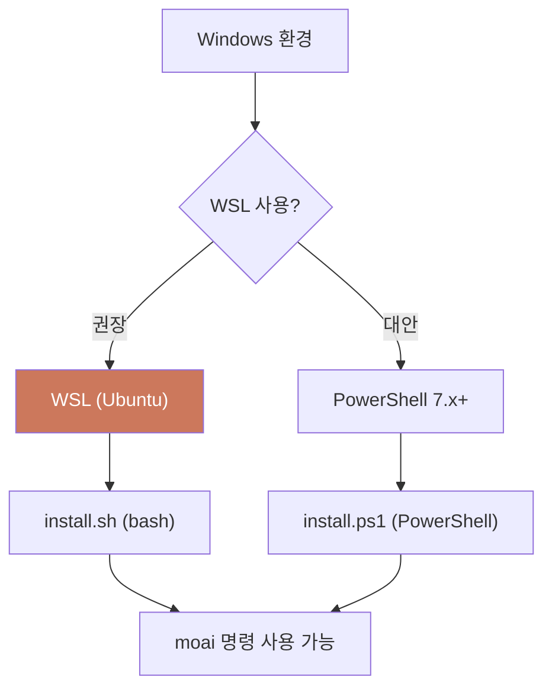

Windows에서 MoAI-ADK를 사용할 때 알아야 할 환경 요구사항과 흔한 함정을 정리했습니다. 결론부터 말하면 **WSL 이 가장 편합니다**. 네이티브 Windows 환경에서 겪는 경로·권한 문제 대부분이 WSL 에서는 발생하지 않습니다.

MoAI-ADK 는 단일 Go 바이너리라 Windows 에서도 바로 실행되지만, Claude Code 가 다루는 셸 스크립트·경로 구분자·문자 인코딩은 Linux/macOS 의 관행을 따릅니다. 그래서 Windows 명령 프롬프트(cmd.exe) 나 레거시 PowerShell 5.x 에서는 경로 처리가 어긋나거나 훅 스크립트가 실패하기 쉽습니다. WSL 은 Windows 안에서 Linux 환경을 그대로 쓰게 해 주어, 이런 간극을 한 번에 없애 줍니다.

이 페이지는 WSL 설치부터 프로젝트 열기, (선택) CG 모드 구성까지를 한 흐름으로 안내합니다. 이미 WSL 을 쓰고 있다면 [2단계](#2단계--wsl-에-moai-adk-설치)부터 바로 시작해도 됩니다.



## 지원 환경

| 환경 | 지원 여부 | 비고 |
|------|----------|------|
| **WSL (권장)** |  완전 지원 | 최적의 경험 |
| **PowerShell 7.x+** |  지원 | 대안 환경 |
| PowerShell 5.x (레거시) |  미지원 | Windows PowerShell |
| cmd.exe |  미지원 | 명령 프롬프트 |

**필수 요구사항:**
- [Git for Windows](https://gitforwindows.org/) 설치 필수
- WSL 또는 PowerShell 7.x 이상

## 1단계 — WSL 설치

WSL 은 Windows 안에서 Linux 환경을 그대로 쓰게 해 주며, MoAI-ADK 의 모든 기능을 완벽하게 지원합니다. 관리자 권한으로 연 PowerShell 에서 한 줄만 실행하면 됩니다. WSL 을 쓰는 가장 큰 이유는 Claude Code 와 MoAI-ADK 가 밟는 셸 스크립트·경로 규칙·문자 인코딩이 Linux 관행을 따르기 때문입니다 — WSL 은 이 관행을 Windows 안에서 그대로 가져와, 네이티브에서 흔히 발생하는 경로·인코딩 함정을 한 번에 없애 줍니다.

```powershell
# 관리자 PowerShell에서 실행
wsl --install

# 기본 배포판: Ubuntu (권장)
# 재시작 후 사용자명 및 비밀령 설정
```

설치가 끝나면 재시작 메시지가 나옵니다. 재시작 후 Ubuntu 가 자동으로 열리고, Linux 사용자명과 비밀번호를 정합니다. 이 사용자명은 Windows 계정과 별개이므로 한글 Windows 사용자명 때문에 겪던 경로 문제가 여기서는 발생하지 않습니다.

PowerShell 7.x 이상을 대안으로 쓸 수도 있지만, WSL 이 훨씬 더 적은 함정을 겪습니다. 네이티브 PowerShell 은 경로 구분자와 셸 문법 차이 때문에 훅 스크립트가 예상과 다르게 동작하거나, 설치 스크립트가 남겨야 하는 파일을 예상과 다른 위치에 두는 일이 잦습니다. WSL 을 쓰면 Linux 버전과 같은 명령·같은 파일 경로·같은 동작을 그대로 가져올 수 있습니다.

## 2단계 — WSL 에 MoAI-ADK 설치

WSL 터미널(Ubuntu) 을 열고 설치 스크립트를 실행합니다. macOS/Linux 와 같은 한 줄 명령입니다. WSL 안에서는 Windows 쪽 PATH 나 레지스트리를 건드릴 필요 없이, Linux 홈 디렉터리 기준으로 단일 바이너리가 설치됩니다.

```bash
# WSL 내에서 MoAI-ADK 설치
curl -fsSL https://adk.mo.ai.kr/install.sh \
  | bash
```

설치가 끝나면 버전을 확인합니다. 명령이 보이지 않으면 셸을 다시 열어 PATH 를 다시 읽어들이는 것으로 대부분 해결됩니다.

```bash
moai version
```

PowerShell 7.x+ 만 쓰는 경우에는 전용 설치 스크립트를 씁니다. PowerShell 경로는 WSL 과 달리 Windows 파일시스템 위에 설치되므로, 한글 사용자명 경로나 권한 문제를 만날 가능성이 조금 더 높습니다.

```powershell
irm https://adk.mo.ai.kr/install.ps1 | iex
```

> **참고**: 되도록 WSL 을 쓰는 편이 좋습니다. PowerShell 경로는 셸 스크립트 호환성에서 더 자주 함정을 만납니다 — install.ps1 은 install.sh 의 Windows 대안이지, 동일한 동작을 보장하는 것은 아닙니다.

## 3단계 — 프로젝트 열기 (VS Code 연동)

WSL 안에서 프로젝트를 만들고 VS Code 로 엽니다. VS Code 의 WSL 확장을 쓰면 Windows 에 깔린 VS Code 가 WSL 파일시스템을 그대로 다룹니다.

먼저 프로젝트 디렉터리를 정합니다. WSL 네이티브 경로(`~/` 하위) 에 두면 파일시스템을 넘나드는 오버헤드가 없어 가장 빠릅니다.

```bash
# WSL 네이티브 파일시스템 사용 (더 빠름)
cd ~/projects/
moai init my-project
cd my-project
```

Windows 파일시스템에 접근해야 할 때는 `/mnt/c/` 마운트를 씁니다.

```bash
# Windows 파일시스템 접근
cd /mnt/c/Users/사용자명/projects/
```

VS Code 연동은 세 단계입니다.

1. VS Code 에 [WSL 확장](https://marketplace.visualstudio.com/items?itemName=ms-vscode-remote.remote-wsl) 설치
2. WSL 터미널에서 `code .` 실행
3. VS Code 가 자동으로 WSL 모드로 열림

이제 WSL 터미널에서 `moai init` 으로 프로젝트를 초기화하고, VS Code 안에서 Claude Code 세션을 시작하면 됩니다. VS Code 의 터미널이 WSL 셸로 열리므로, 별도 터미널 창을 띄우지 않고도 한 창에서 `moai` 명령과 Claude Code 를 함께 쓸 수 있습니다.

## 4단계 — (선택) CG 모드와 tmux

[CG 모드](/ko/multi-llm/cg-mode) (Claude 리더 + GLM 팀원) 를 쓰려면 tmux 가 필요합니다. WSL 에서는 한 줄로 설치합니다.

```bash
# Ubuntu/Debian
sudo apt install tmux

# tmux 세션 시작
tmux new -s moai

# CG 모드 실행
moai cg
```

tmux 가 없으면 `moai cg` 가 바로 실패합니다 — CG 모드는 tmux 세션 안에서 GLM 환경변수를 주입하고 여러 창을 띄우는 구조이기 때문입니다.

## 한글 사용자명 경로 에러

### 문제 현상

Windows 사용자명에 한글이나 중국어처럼 비-ASCII 문자가 들어 있으면, 일부 레거시 도구나 8.3 짧은 파일명 변환 과정에서 경로 처리가 어긋날 수 있습니다. 홈 디렉터리 경로에 비-ASCII 문자가 섞여 있으면 특정 명령이 그대로 실패하기도 합니다.

```
C:\Users\홍길동\...
```

이럴 때는 아래 방법으로 ASCII 전용 경로 환경을 마련하는 것이 가장 확실합니다.

### 해결 방법 1: 8.3 파일명 생성 활성화

8.3 짧은 파일명(ASCII 대체 경로)이 생성되도록 관리자 권한으로 설정합니다.

```powershell
fsutil 8dot3name set 1
```

> **주의**: 이 설정은 시스템 전체에 적용되므로, 일부 레거시 프로그램이 영향을 받을 수 있습니다.

### 해결 방법 2: ASCII 사용자 계정 생성

영어 이름으로 Windows 사용자 계정을 새로 만들면 홈 디렉터리 경로 문제가 근본부터 사라집니다.

### 해결 방법 3: WSL 사용

가장 권장하는 방법은 [1단계](#1단계--wsl-설치)에서 설치한 WSL 안에서 작업하는 것입니다. WSL 네이티브 파일시스템은 비-ASCII 홈 경로 문제를 아예 겪지 않습니다.

## 문제 해결

| 문제 | 원인 | 해결 |
|------|------|------|
| `moai: command not found` | PATH에 설치 디렉터리 미포함 | 설치 스크립트는 `~/.local/bin`에 설치 — `export PATH="$HOME/.local/bin:$PATH"`를 `.bashrc`에 추가 (`go install`로 설치한 경우 `$HOME/go/bin`) |
| 한글 경로 처리 실패 | 한글 사용자명 | 위의 [한글 사용자명 경로 에러](#한글-사용자명-경로-에러) 참조 |
| 권한 거부 | 설치 스크립트 권한 | `chmod +x install.sh` 후 재실행 |
| Git 명령 실패 | Git for Windows 미설치 | [Git for Windows](https://gitforwindows.org/) 설치 |
| tmux 없음 | CG 모드 실행 불가 | `sudo apt install tmux` (WSL에서) |

## 다음 단계

- [설치](/ko/getting-started/installation) — 설치 상세 가이드
- [초기 설정](/ko/getting-started/init-wizard) — 프로젝트 초기화
- [CG 모드](/ko/multi-llm/cg-mode) — Claude + GLM 하이브리드 모드
