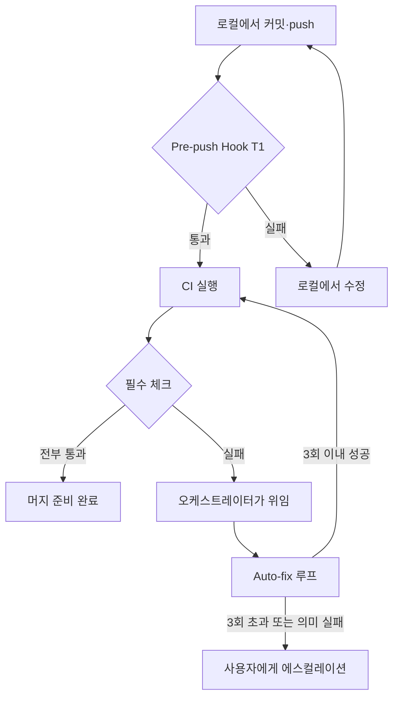

CI(지속적 통합) 서버에 빨간 불이 뜨면, 보통 개발자가 달려가 로그를 읽고
원인을 찾아 고칩니다. MoAI-ADK는 이 반복 일을 도구가 대신 맡습니다.
로컬에서 push하기 전에 미리 검사하고, CI가 실패하면 기계가 스스로
진단하고 수정한 뒤 다시 검증하는 루프를 돕니다. 개발자가 일일이
"진단 → 수정 → 검증" 사이클을 손으로 돌리지 않아도 된다는 뜻입니다.
에이전틱 루프(에이전트가 스스로 판단해 반복하는 구조)를 저장소 단위로
적용한 사례입니다.

이 가이드는 그 자율 CI/CD 시스템을 처음부터 따라 할 수 있도록 안내합니다.
여러 겹의 방어선이 어떤 순서로 작동하는지, 그리고 각 단계에서 개발자가
무엇을 직접 하고 무엇을 도구에 맡기는지를 단계별로 보여줍니다. 읽고 나면
친구에게 두 문장으로 개념을 설명할 수 있어야 합니다. "MoAI-ADK는 CI가
깨지면 알아서 원인을 잡고 고친 다음 재검증까지 돌린다. 그래서 나는 빨간
불을 보고 달려가는 대신 다른 일을 하고 있을 수 있다."가 그 설명의
목표하는 모양입니다.

## 방어선이 하는 일

MoAI-ADK의 자율 CI/CD는 여러 겹의 방어선으로 이어집니다. 한 줄이라도
걸러지면 다음 줄이 받습니다. push 전 로컬 검사에서 시작해 CI 자동
수정까지 하나의 흐름으로 이어지는 모양을 아래 그림으로 볼 수 있습니다.



왼쪽 위에서 아래로 흐르는 이 그림이 자율 CI/CD의 전체 모양입니다.
로컬에서 막히면 고치고 다시 push하고, CI에서 막히면 자동 수정 루프가
돌고, 루프조차 못 고르면 그때사 사용자에게 넘어갑니다.

## 8-Tier 아키텍처 한눈에 보기

SPEC(요구사항 명세서) V3R3-CI-AUTONOMY-001에서 도입한 이 시스템은
8개 티어(Tier, 계층)로 이루어집니다. 각 티어는 하나의 독립된
방어선입니다.

| Tier | 이름 | 우선순위 | 설명 |
|------|------|----------|------|
| T1 | Pre-push Hook | P0 | push 전 자동 품질 검증 |
| T2 | Branch Protection | P0 | main 브랜치 보호 규칙 |
| T3 | Auto-fix Loop | P1 | CI 실패 시 자동 수정 |
| T4 | Auxiliary Workflows | P2 | 보조 워크플로우 정리 |
| T5 | Worktree State Guard | P1 | 워크트리 상태 무결성 보장 |
| T6 | i18n Validator | P2 | 4개국어 문서 일관성 검증 |
| T7 | BODP | P0 | 브랜치 원점 결정 프로토콜 |
| T8 | Release Workflow | P1 | 릴리스 자동화 |

아래 단계별 섹션에서 개발자가 직접 만지게 되는 T1, T3, T7, T6를
차례로 실습합니다. T2, T4, T5, T8는 저장소 설정 단에서 한 번 잡아두면
이후에는 보이지 않게 작동합니다.

## Step 1 — push 전 로컬 검증 켜기 (Pre-push Hook)

첫 번째 방어선은 push 전에 로컬에서 품질 검증을 자동으로 돌리는
것입니다. CI까지 갔다가 실패하고 돌아오는 왕복 비용을 로컬에서 미리
끊어 주는 역할입니다.

`moai init`이나 `moai update`를 실행하면 pre-push hook이 자동으로
설치됩니다. 별도 설치 작업은 필요 없습니다.

```bash
# illustrative-only — moai init / moai update 시 자동 설치되는 매핑
.git/hooks/pre-push → moai hook pre-push
```

push할 때 이 hook이 아래 검증을 실행합니다. 프로젝트 언어는 자동으로
감지합니다.

- `go vet` / `golangci-lint` (프로젝트 언어에 따라 자동 감지)
- `go test ./...` (테스트 스위트)
- MX 태그(코드에 다는 의미 표식) 무결성 검사

hook이 제대로 들어갔는지 직접 확인하거나 수동으로 한 번 돌려보고
싶다면 아래 명령을 씁니다.

```bash
moai hook pre-push
```

검증이 하나라도 실패하면 push가 중단됩니다. 로그를 읽고 원인을 고친 뒤
다시 push하면 됩니다. CI 왕복을 기다릴 필요 없이 로컬에서 즉시
피드백을 받는 셈입니다. 이 한 줄이 개발자의 "깨진 CI 기다리기" 시간을
줄여 줍니다.

## Step 2 — CI 실패를 자동 수정에 맡기기 (Auto-fix Loop)

로컬 검증을 통과했더라도 CI 환경에서는 다른 결과가 나올 수 있습니다.
운영체제 차이, 의존성 버전, 병렬 세션 간섭 같은 요인 때문입니다.
이때 T3 Auto-fix Loop가 작동합니다.

`/moai sync`가 PR(풀 리퀘스트)을 만든 뒤, 오케스트레이터(작업을 조율하는
중심 에이전트)가 실패한 필수 체크를 넘겨주면 `manager-develop` 에이전트가
`cycle_type=autofix` 사이클로 "진단 → 수정 → 재검증" 루프를 돌립니다.
로컬에서 쓰던 진단형 자가 수정 루프를 PR 파이프라인까지 늘린 구조입니다.
개발자가 개입하지 않아도 에이전트가 알아서 패치를 만들고 다시 검증합니다.

진입 조건과 안전장치가 정해져 있습니다.

- **진입 조건** — 실패한 필수 체크가 하나 이상 있고, 오케스트레이터가
  해당 PR과 브랜치를 지목해 넘겨줄 때만 루프가 시작됩니다.
  오케스트레이터만 이 루프를 시작할 수 있습니다.
- **반복 상한** — PR push 한 번당 최대 3회. 4회째로 넘어가면 자동
  패치를 시도하지 않고 blocking AskUserQuestion으로 사용자에게 넘깁니다.
- **의미 수준 실패** — data race, deadlock, panic, 테스트 단언 실패는
  자동으로 고치지 않고 사용자 판단으로 넘깁니다. 겉만 고쳐놓고 핵심
  결함을 숨기는 일을 막기 위해서입니다.
- **보호 파일** — 비밀·자격 증명 파일과 CI 워크플로 정의는 루프가
  건드리지 않습니다. 실패를 보고하는 계층을 고치면 진짜 실패가 가짜
  green(통과)으로 둔갑할 수 있기 때문입니다.

루프 한 번 돌 때마다 진단·수정·결과가 `.moai/logs/ci-autofix/`에
기록됩니다. 무엇을 고쳤는지 돌아보고 싶으면 아래 명령으로 최근 기록을
봅니다.

```bash
ls -t .moai/logs/ci-autofix/
```

반복 상한, 에스컬레이션 계약, 의미 수준 실패 처리, 보호 파일 목록의
SSoT(단일 진실 원천)는
`.claude/rules/moai/workflow/ci-autofix-protocol.md`입니다. 루프의
구체적 동작이 궁금할 때 이 파일을 먼저 읽으면 됩니다.

## Step 3 — 새 브랜치의 base 자동으로 고르기 (BODP)

새 브랜치나 워크트리(Git의 독립 작업 공간)를 만들 때, base branch를
어디서 따야 할지 매번 고민하게 됩니다. `main`에서 따야 할지, 현재
작업 중인 브랜치에서 이어갈지 결정이 상황마다 다릅니다. BODP(Branch
Origin Decision Protocol)가 이 결정을 자동으로 내려 줍니다.

BODP는 세 가지 시그널을 평가합니다.

| 시그널 | 출처 | 의미 |
|--------|------|------|
| Signal A | SPEC `depends_on` + diff path overlap | 코드 의존성 |
| Signal B | `git status`에서 `.moai/specs/<NewSpecID>/` 매칭 | 작업 트리 동위치 |
| Signal C | `gh pr list --head <branch> --state open` ≥ 1 | 현재 브랜치 PR |

세 시그널을 조합해 다음처럼 결정합니다.

| 시그널 | 결정 |
|--------|------|
| A만 있음 | `stacked` — 현재 브랜치 기반 |
| B 있음 | `continue` — 현재 컨텍스트에서 계속 |
| C만 있음 | `stacked` — 현재 브랜치 기반 |
| 아무것도 없음 | `main` — origin/main 기반 |

모든 BODP 결정은 `.moai/branches/decisions/<branch-name>.md`에 남습니다.
추측이 아니라 기록으로 남는 셈입니다. 증거로 완료를 판정한다는 MoAI
원칙이 브랜치를 고를 때도 그대로 적용됩니다. 과거 결정을 돌아보려면
아래 명령으로 결정 기록 디렉터리를 봅니다.

```bash
ls .moai/branches/decisions/
```

## Step 4 — 4개국어 문서 일관성 검증하기 (i18n Validator)

문서가 4개 국어로 있으면 한쪽을 고쳤을 때 다른 쪽이 어긋나기 쉽습니다.
번역이 빠지거나, 제목 구조가 달라지거나, 용어가 제각각이 됩니다.
T6 i18n Validator가 이 일관성을 자동 검증합니다.

```bash
scripts/docs-i18n-check.sh
```

검증 항목은 다음과 같습니다.

- 4개 locale 간 파일 개수·경로 일치
- front matter `title` 존재
- H1 heading 존재
- MoAI 용어집 준수

이 검증을 CI에 올려두면, 번역 누락이나 구조 어긋남을 머지 전에 잡을 수
있습니다. 수동으로 4개 국어를 한 줄한 줄 비교하지 않아도 된다는
뜻입니다. 문서를 고칠 때마다 4개 locale을 같이 고치는 규칙을 이
검증이 기계로 뒷받침합니다.

## 나머지 방어선

직접 실습하지는 않았지만 저장소 설정 단에서 한 번 잡아두면 계속
작동하는 나머지 티어들입니다.

- **T2 Branch Protection** — main 브랜치에 보호 규칙을 걸어 직접 push를
  막고 필수 체크 통과를 머지 조건으로 삼습니다.
- **T5 Worktree State Guard** — 워크트리의 상태 무결성을 보장합니다.
  커밋되지 않은 변경을 감지하고, 워크트리와 메인 브랜치 동기화 상태를
  확인하며, `moai status`에서 그 상태를 표시합니다.
- **T4 Auxiliary Workflows** — 보조 워크플로우를 정리해 CI 구성이
  흩어지지 않게 합니다.
- **T8 Release Workflow** — 릴리스 단계의 자동화를 맡습니다.

## 요약 및 다음 단계

자율 CI/CD는 한 줄로 요약하면 "로컬에서 미리 막고, CI에서 깨지면
기계가 알아서 고친다"입니다. 개발자가 직접 만지는 지점은 push 전
검증(T1)과 CI 자동 수정 루프(T3)이고, BODP(T7)와 i18n 검증(T6)은
작업 흐름을 돕는 보조 방어선입니다. 나머지는 저장소 설정 단에서 한 번
잡아두면 보이지 않게 작동합니다.

더 읽어볼 관련 문서:

- [워크트리 가이드](/ko/worktree/guide) — Git Worktree 완벽 가이드
- [/moai loop](/ko/utility-commands/moai-loop) — 반복 수정 루프
- [/moai fix](/ko/utility-commands/moai-fix) — 자동 에러 수정
- [GitHub 연동 가이드](/ko/guides/github-integration) — 이슈 파싱·SPEC 링크
