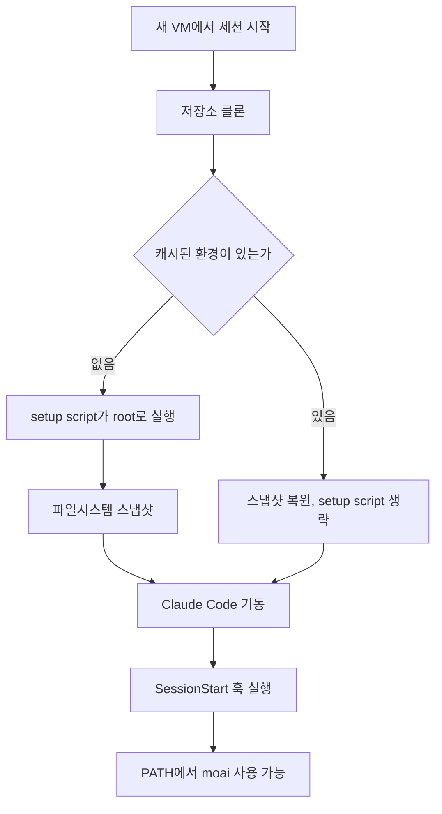

클라우드 세션은 Anthropic이 관리하는 VM에서 저장소를 새로 클론하며 시작합니다. MoAI-ADK가
저장소에 두는 것 — `CLAUDE.md`, `.claude/settings.json`과 거기에 걸린 훅, `.claude/rules/`,
`.claude/skills/`, `.claude/agents/`, `.claude/commands/`, `.mcp.json` — 은 그 클론에 전부
실려 옵니다. 하나만 오지 않습니다. `moai` 바이너리입니다. 내 컴퓨터에만 있고 저장소에
들어간 적이 없기 때문입니다.

이 빈칸 하나가 이 문서가 메우려는 것입니다. 바이너리가 없으면 `.claude/settings.json`에
배선된 훅이 실패하고, `moai` 명령은 찾을 수 없다고 나오며, `.mcp.json`이 선언한 MCP 서버는
아예 뜨지 않습니다. 있으면 클라우드 세션은 로컬 세션처럼 동작합니다.

## 레시피

[claude.ai/code](https://claude.ai/code)에서 환경 설정 대화상자를 열고 **Setup script** 칸에
아래를 붙여 넣습니다.

```bash
#!/bin/bash
curl -fsSL https://raw.githubusercontent.com/modu-ai/moai-adk/main/install.sh \
  | bash -s -- --install-dir /usr/local/bin || true
moai --version || true
```

이 짧은 스크립트에서 세 가지가 결정적입니다. 셋 다 "당연해 보이는 형태"가 실패하기 때문에
그 자리에 있습니다.

**설치 스크립트를 `adk.mo.ai.kr`이 아니라 `raw.githubusercontent.com`에서 받습니다.** README에
적힌 `curl -fsSL https://adk.mo.ai.kr/install.sh | bash` 형태는 내 컴퓨터에서 쓰는 것입니다.
클라우드 세션의 기본 네트워크 등급인 **Trusted**는 정해진 도메인 목록만 허용하는데,
`adk.mo.ai.kr`은 그 목록에 없습니다. GitHub은 있습니다 — `github.com`,
`raw.githubusercontent.com`, `objects.githubusercontent.com`,
`release-assets.githubusercontent.com`이 모두 열려 있어 스크립트와 그것이 내려받는 릴리즈
자산이 함께 해결됩니다. `raw.githubusercontent.com`이 주는 파일은 저장소 루트의 `install.sh`와
동일한 파일입니다.

**`--install-dir`는 환경변수가 아니라 플래그로 넘깁니다.** 설치 스크립트는 인자를 파싱할 때
`INSTALL_DIR`를 비우므로 `INSTALL_DIR=/usr/local/bin bash`는 조용히 무시되고 바이너리가 다른
곳에 떨어집니다. 기본값에 맡기면 VM에서는 `$GOPATH/bin`이나 `~/.local/bin`을 고르는데, 둘 다
세션의 `PATH`에 있다는 보장이 없습니다. `/usr/local/bin`은 있습니다.

**`|| true`가 종료 코드를 막아 줍니다.** 종료 코드가 0이 아닌 setup script는 세션 시작 자체를
실패시킵니다. 즉 설치 중 일시적인 네트워크 문제가 "moai 없는 세션"이 아니라 "세션을 못 여는
상태"를 만듭니다. 뒤따르는 `moai --version`은 설치된 판본을 setup 로그에 남기려는 것이고,
같은 이유로 같은 가드를 답니다.

## `go install`을 쓰지 않는 이유

Go 사용자에게 가장 자연스러운 형태는 동작하지 않습니다. 누군가 반나절을 쓰지 않도록 실패
형태를 그대로 적어 둡니다.

```bash
go install github.com/modu-ai/moai-adk/cmd/moai@latest
# go: module github.com/modu-ai/moai-adk@latest found (v1.14.5),
#     but does not contain package github.com/modu-ai/moai-adk/cmd/moai
```

모듈 경로가 `/v3` 접미사 없는 `github.com/modu-ai/moai-adk`인데, Go의 시맨틱 임포트 버저닝은
메이저 2 이상에 그 접미사를 요구합니다. 그래서 `@latest`는 접미사 없는 경로가 가질 수 있는
가장 최신 태그인 `v1.14.5` — `cmd/moai`가 생기기 한참 전 — 로 해소됩니다. v3 릴리즈를 이름으로
지정하면 아예 거부됩니다.

```bash
go install github.com/modu-ai/moai-adk/cmd/moai@v3.1.2
# go: invalid version: module contains a go.mod file, so module path must match
#     major version ("github.com/modu-ai/moai-adk/v3")
```

`@main`은 빌드됩니다. 브랜치에서 만들어지는 유사 버전은 메이저 버전 규칙을 비껴가기 때문입니다.
다만 클라우드 환경에 권장하지는 않습니다. 이유는 셋입니다 — 바이너리를 받는 대신 트리 전체를
컴파일하고(따뜻한 로컬 머신에서 1분 42초, 설치 스크립트는 약 2초), VM의 Go가 이 모듈의 `go`
지시자를 만족할 만큼 새로워야 하며, 만들어진 바이너리에 판본 스탬프가 없어 `moai version`이
릴리즈가 아니라 컴파일 기본값을 보고합니다. 나중에 "이거 무슨 버전이지?"에 답할 수 없게 됩니다.

## 실행 순서



setup script는 Claude Code가 뜨기 전에 한 번 실행됩니다. 그 뒤 Anthropic이 파일시스템을
스냅샷으로 떠서 이후 세션의 출발점으로 재사용하므로, 설치 비용은 세션마다가 아니라 한 번만
듭니다. 스냅샷은 디스크에 쓰인 것(바이너리 포함)을 남기고, 그저 실행 중이던 것은 잃습니다.

스크립트를 고쳤을 때, 환경의 허용 네트워크 호스트를 바꿨을 때, 그리고 스냅샷이 대략 7일 뒤
만료됐을 때 다시 실행됩니다. 이 주기 때문에 레시피는 특정 판본을 고정하지 않고 최신 릴리즈를
설치합니다 — 재생성될 때마다 현재 판본을 집습니다. 고정하고 싶다면 플래그를 더합니다.

```bash
curl -fsSL https://raw.githubusercontent.com/modu-ai/moai-adk/main/install.sh \
  | bash -s -- --install-dir /usr/local/bin --version 3.1.2 || true
```


setup script는 캐시가 만들어지도록 대략 5분 안에 끝나야 합니다. 설치 스크립트는 미리 빌드된
바이너리를 내려받아 수 초에 끝나므로, 남는 예산은 프로젝트가 필요로 하는 다른 일에 쓸 수 있습니다.


## 확인

클라우드 세션에서 Claude에게 아래를 실행해 달라고 하면 됩니다. 평범한 셸 명령이라 Claude가
대신 돌려 줍니다.

```bash
which moai              # /usr/local/bin/moai
moai --version          # setup script가 설치한 릴리즈
moai doctor             # MCP 배선을 포함한 환경 점검
```

`which moai`가 빈 값이면, setup script가 실행되지 않았거나(캐시된 환경은 건너뜁니다) 실패했는데
`|| true`가 그 오류를 삼킨 것입니다. 스크립트를 수정해(어떤 편집이든 캐시를 무효화합니다) 새
세션을 시작한 뒤 setup 로그를 읽으십시오.

## 이 문서가 다루지 않는 것

환경 대화상자는 setup script와 환경변수를 평문으로 보관하며, 그 환경을 쓰는 사람은 누구나 읽을
수 있습니다. 아직 전용 비밀 저장소가 없습니다. 이 레시피는 자격 증명을 필요로 하지 않으며,
자격 증명을 싣도록 확장해서도 안 됩니다. 프로젝트에 `GH_TOKEN`이 필요하다면, 세션의 GitHub
프록시가 토큰 없이도 `gh`를 인증해 줍니다.
