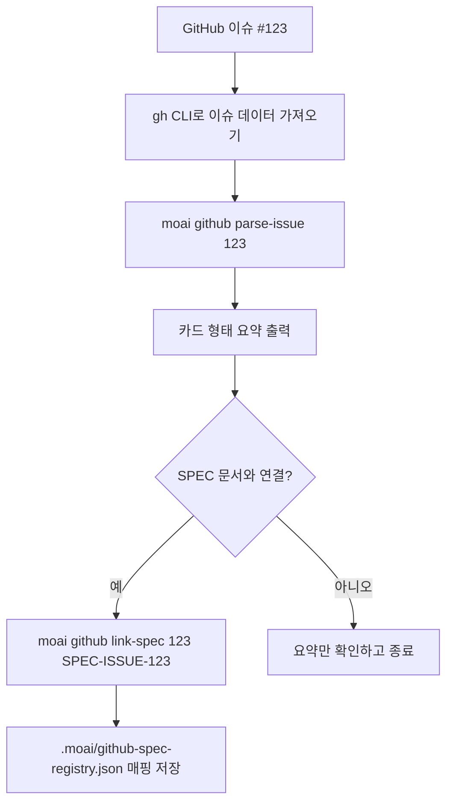

MoAI-ADK의 GitHub 연동 기능은 GitHub 이슈(GitHub에서 관리하는 작업 단위)와
SPEC 문서(MoAI-ADK가 단위 작업을 정의하는 설계 문서)를 이어 주는 가벼운 CLI
도구입니다. GitHub에 자연어로 들어온 요청 한 건을 MoAI-ADK의 작업 체계로
끌어와, 이슈 한 건을 개발 작업 한 건으로 바로 바꿔 줍니다.

왜 이 연동이 필요할까요? GitHub 이슈만 쓰는 팀은 이슈 본문을 사람이 직접
읽고 작업을 따로 만들어야 합니다. 반대로 SPEC만 쓰는 팀은 GitHub에 올라온
요청을 다시 SPEC으로 옮겨 적어야 합니다. `moai github` 서브커맨드(moai의
GitHub 전용 하위 명령)는 이 둘 사이의 간극을 메워 줘, 이슈 번호 하나로 두
세계를 왕복할 수 있게 해 줍니다.

모든 명령은 로컬에 설치된 `gh` CLI(GitHub가 공식 제공하는 명령줄 도구)를
통해 현재 리포지토리의 이슈 데이터를 가져옵니다. 별도의 서버나 토큰 발급
절차 없이 `gh auth login` 한 번이면 충분합니다.

> **범위 안내**: 이 페이지는 실제로 배포되는 `moai github` 서브커맨드와,
> 거기에 딸려 오는 GitHub Actions 자산만 다룹니다. 여러 LLM을 PR에 패널로
> 붙이는 "멀티 LLM 리뷰 패널"은 지금 배포 릴리스에 들어 있지 않습니다.

아래 그림은 GitHub 이슈 한 건이 `parse-issue`와 `link-spec` 명령을 거쳐
SPEC 문서로 이어지는 전체 흐름을 보여 줍니다.



## Step 1 — 사전 요구사항 갖추기

GitHub 연동 명령을 실행하려면 세 가지가 먼저 준비되어 있어야 합니다.

1. **MoAI-ADK 설치** — macOS · Linux · Windows 중 하나. 설치가 끝났다면
   `moai --version`으로 버전이 찍히는지 확인합니다.
2. **GitHub CLI (`gh`) 설치 및 인증** — GitHub 공식 문서를 따라 `gh`를
   설치한 뒤 `gh auth login`으로 계정 인증을 마칩니다.
3. **GitHub 리포지토리** — 이슈가 살 리포지토리가 하나 필요합니다. 이미
   있는 리포를 써도 되고, 테스트용 새 리포를 만들어도 됩니다.

세 가지가 갖춰졌다면 아래 명령으로 `gh`가 정상 인증됐는지 한 번 더
확인합니다.

```bash
gh auth status
```

## Step 2 — 이슈 하나 파싱해 보기

준비가 끝났으면 이슈 하나를 직접 파싱(parse, 구조화된 형태로 해석)해 봅니다.
파싱이란 GitHub 이슈 본문을 그대로 가져와서 번호 · 제목 · 작성자 · 라벨 ·
본문 요약 · 코멘트 수를 한눈에 보이는 카드 형태로 바꾸는 동작입니다.

```bash
moai github parse-issue 123
```

이 명령은 123번 이슈를 가져와 터미널에 카드 형태로 출력합니다. 이때 이슈
본문이 통째로 찍히지는 않고, MoAI-ADK가 요약 한 줄로 압축해서 보여 줍니다.
본문 전체가 필요하면 `gh issue view 123`을 직접 쓰는 게 낫고, "이 이슈가
대략 무슨 말을 하려는 걸까?"를 빠르게 훑을 때는 `parse-issue`가 훨씬
가볍습니다.

처음 써 본다면 실제로 바꾸기 전에 어떤 데이터가 나오는지부터 눈으로
확인하세요. `parse-issue`는 읽기 전용 명령이라 리포지토리를 변경하지
않습니다. 그래서 이슈를 미리 둘러보는 용도로 부담 없이 반복 실행해 볼 수
있습니다.

## Step 3 — 이슈와 SPEC 문서 이어주기

이슈 내용을 파악했다면 그 이슈를 SPEC 문서와 양방향으로 이어 줄 수
있습니다. 한 번 이어 두면 나중에 이슈 번호만으로 SPEC을 찾을 수 있고,
반대로 SPEC ID만으로도 원래 이슈를 역추적할 수 있습니다. 이 매핑이
`.moai/github-spec-registry.json` 파일에 저장되기 때문에, 팀원 누구나 같은
레지스트리를 공유하게 됩니다.

```bash
moai github link-spec 123 SPEC-ISSUE-123
```

이 명령은 두 가지 일을 합니다. 첫째, GitHub 이슈 123번과 `SPEC-ISSUE-123`이라는
SPEC ID 사이의 매핑을 `.moai/github-spec-registry.json` 파일에 저장합니다.
둘째, 입력한 SPEC ID가 `SPEC-` 접두사 규칙을 따르는지 저장 전에 한 번 더
검증합니다.

실수로 잘못된 ID를 넣을까 걱정된다면 `--dry-run` 플래그를 붙여 먼저
시뮬레이션해 봅니다. 이 플래그를 붙이면 실제 파일 변경은 일어나지 않고
"이렇게 실행될 것이다"라는 계획만 화면에 출력합니다. 그래서 처음 `link-spec`을
쓰는 사람도 안심하고 결과를 미리 살펴볼 수 있습니다.

```bash
moai github link-spec 123 SPEC-ISSUE-123 --dry-run
```

SPEC ID는 반드시 `SPEC-` 접두사로 시작해야 합니다. 이 규칙을 어기면
`link-spec`이 저장 단계에서 거부합니다.

## Step 4 — 함께 배포되는 GitHub Actions 자산 확인하기

`moai github` 명령 말고도, `moai init`을 실행하면 `.github/` 디렉터리 아래에
GitHub Actions(리포지토리 이벤트로 실행되는 자동화 스크립트) 자산 두 개가
함께 배포됩니다. 이 두 자산은 CLI 없이도 리포지토리를 자동으로 관리해 주는
보조 도구입니다. 한 번 `moai init`으로 깔아 두면 이후로는 별도 설정 없이도
라벨 동기화와 언어 감지가 리포지토리 이벤트에 맞춰 자동으로 돌아갑니다.

### Label Sync 워크플로우 (`.github/workflows/label-sync.yml`)

`.github/labels.yml` 파일을 단일 진실 원천(source of truth, 여러 곳에 흩어진
값의 기준이 되는 하나의 파일)으로 삼아 리포지토리 라벨을 동기화합니다.

- **트리거**: `workflow_dispatch`(수동 실행, `dry_run` 입력 지원) 또는
  `.github/labels.yml`이나 워크플로우 파일 자체가 `main` 브랜치에 push될 때
  자동 실행
- **권한**: `issues: write`, `pull-requests: write`, `contents: read`
- **동작**: EndBug/label-sync 액션으로 `labels.yml`의 내용을 리포지토리 라벨에
  반영

쉽게 말해 라벨을 GitHub 웹 UI에서 하나씩 클릭해서 만들 필요 없이, YAML
파일에 적어 두면 자동으로 맞춰 준다는 뜻입니다. 그래서 팀 전체가 같은 라벨
묶음을 일관되게 쓸 수 있습니다.

### detect-language 컴포지트 액션 (`.github/actions/detect-language/action.yml`)

리포지토리에서 처음 발견한 소스 파일의 확장자로 주 언어를 판별해 `language`라는
출력값으로 내보냅니다. 다른 워크플로우가 이 출력을 참조해서 언어별로 다른
빌드 명령을 실행할 수 있습니다.

- **지원 언어** — 16개: Go, Python, TypeScript, JavaScript, Rust, Java, Kotlin,
  C#, Ruby, PHP, Elixir, C++, Scala, R, Flutter, Swift
- **구현 메모**: `find ... -print -quit`로 첫 매치 후 즉시 종료하여
  `set -o pipefail` 환경에서 broken-pipe 실패를 피합니다

언어 감지가 왜 필요할까요? CI(지속적 통합, 코드가 들어올 때마다 자동으로
검증하는 과정)에서 Go 리포면 `go test`를, Python 리포면 `pytest`를 실행하는
식으로 언어별로 명령이 달라야 하기 때문입니다. detect-language가 그 분기를
대신 판단해 줘서, 하나의 워크플로우 템플릿이 16개 언어를 모두 대응할 수
있습니다.

## 트러블슈팅

### `gh` 명령을 찾을 수 없을 때

`moai github` 서브커맨드는 로컬 `gh` CLI에 의존합니다. `gh --version`으로
설치를 확인하고 `gh auth login`으로 인증을 마치세요.

### 이슈를 가져오지 못할 때

현재 디렉터리가 대상 리포지토리의 작업 트리 안에 있는지, 그리고 `gh`에
해당 리포 접근 권한이 있는지 확인하세요.

### SPEC ID 검증 실패

`link-spec`은 `SPEC-` 접두사를 따르는 유효한 SPEC ID만 받습니다. ID 형식을
확인한 뒤 재실행하세요.

## 다음 단계

- [CLI 레퍼런스 참조](/ko/workflow-commands/)
- [Workflow 설정 참조](/ko/advanced/settings-json/)
- [보안 정책 확인](/ko/advanced/security-notes/)
