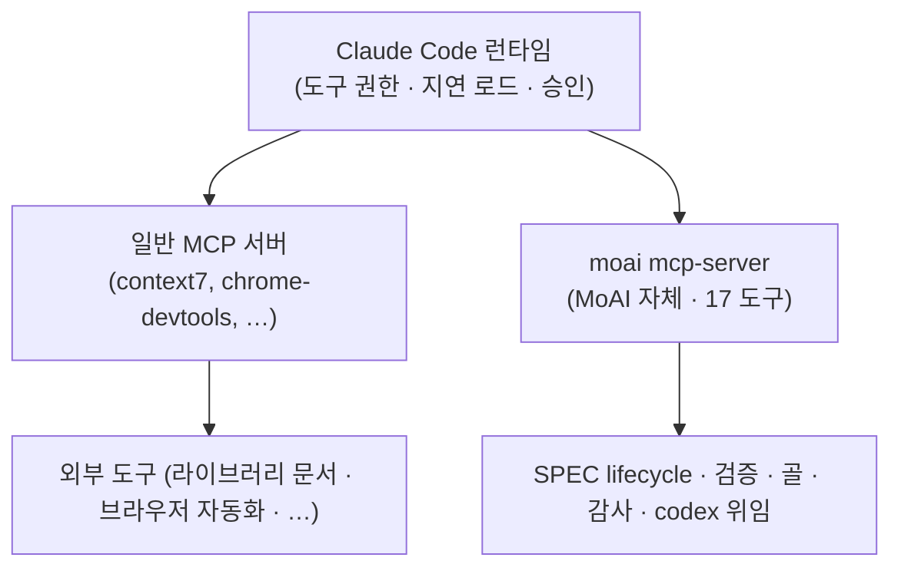

# MCP 서버

MoAI-ADK는 Claude Code의 MCP 생태계 위에 올라타되, 그 위에 **자체 MCP 서버**를 하나 더 얹습니다. 바이너리 하나(`moai mcp-server`)가 stdio 로컬 서버로 실행되며, SPEC 라이프사이클 감사, 검증 스냅샷, 골 엔진, 교차 모델 감사, codex 위임 등 MoAI-ADK 고유의 17개 도구를 Claude Code 런타임에 노출합니다.


[**Claude Code 일반 MCP**](/ko/claude-code/extensibility/mcp)는 플랫폼 자체의 MCP(Model Context Protocol) 통합을 다룹니다 — USB 포트 비유, 서버 등록, 전송 타입, `/mcp` 명령, OAuth 인증, 지연 로드 원리.

이 문서는 그 위에 올라탄 **MoAI 자체 MCP 서버**를 다룹니다. 두 표면은 같은 코어 규칙을 공유하지만, 다루는 주체가 다릅니다.


## 같은 코어, 두 표면

Claude Code의 MCP 생태계와 MoAI의 자체 MCP 서버는 서로 별개의 서버이면서, **동일한 운용 원칙** 위에 놓입니다. 세 가지 코어 규칙을 공유합니다.

| 코어 규칙 | 의미 |
|-----------|------|
| **MCP-over-CLI** | 같은 기능을 CLI와 MCP 도구 양쪽으로 노출하되, 에이전트의 `tools:` 목록에 MCP 도구가 있으면 CLI보다 MCP를 우선한다. 구조화 출력, shell-quoting 회피, 서브에이전트에서 저지연이라는 이점이 있다. |
| **지연 로드** | MCP 도구 정의는 기본으로 지연 로드된다. 평소에는 짧은 메타데이터만 컨텍스트에 두고, 실제 호출 시 `ToolSearch`로 스키마를 불러온다. |
| **권한 게이트** | MCP 도구는 Claude의 일반 도구와 같은 권한 게이트를 통과한다. 처음 호출 시 승인 프롬프트가 메인 세션에 표시되고, 허용하면 이후 같은 도구는 다시 묻지 않는다. |



핵심은 "MoAI가 MCP를 프로비저닝하지 않는다"는 것이 **반쪽짜리 진실**이라는 점입니다. 외부 MCP 서버(context7, playwright 등)는 기본으로 프로비저닝하지 않는 것이 맞습니다. 하지만 MoAI 자체 서버 하나는 `moai init` 시점에 default-on으로 깔립니다. 이 서버가 곧 MoAI의 17-도구 카탈로그가 Claude Code에 닿는 통로입니다.

## .mcp.json 프로비저닝

`moai init`은 프로젝트 루트에 `.mcp.json`(project scope)을 생성하며, 그 안에 **정확히 하나의 활성 엔트리**를 깝니다 — 자체 `moai` 로컬 stdio 서버입니다.

```json
{
  "mcpServers": {
    "moai": {
      "command": "moai",
      "args": ["mcp-server"]
    }
  },
  "staggeredStartup": {
    "enabled": true,
    "delayMs": 500,
    "connectionTimeout": 15000
  }
}
```

`staggeredStartup`은 서버가 순차적으로 시작되도록 조절하는 Claude Code 런타임 필드입니다. 서버가 여럿일 때 동시 기동 경쟁(race)을 막아 줍니다.

### 네 가지 documented-but-disabled 엔트리

배포 기본값은 `moai` 서버 하나만 활성입니다. 네 개의 외부 서버는 문서에 기록되어 있지만 비활성 상태로, `moai mcp add <이름>` 명령으로 켭니다.

| 서버 | 용도 | 활성화 |
|------|------|--------|
| `context7` | 최신 라이브러리 공식 문서 조회 (resolve-library-id, get-library-docs) | `moai mcp add context7` |
| `chrome-devtools` | 헤드리스 브라우저 자동화 | `moai mcp add chrome-devtools` |
| `playwright` | 브라우저 자동화 + E2E 테스트 | `moai mcp add playwright` |
| `ast-grep` | 구조적 코드 검색 및 리팩터링 | `moai mcp add ast-grep` |

### 중립성 계약

`.mcp.json`은 git-tracked 파일입니다. 그래서 "비밀을 싣는 엔트리, 자격 증명이 필요한 엔트리, 중립성 검사에 실패하는 엔트리"는 **금지**됩니다. 모든 환경변수 값은 `${VAR}` 리터럴로 적습니다 — Claude Code 런타임이 실제 값을 확장하며, 해석된 비밀이 git-tracked `.mcp.json`에 직렬화되지 않습니다.

```json
{
  "remote-needs-auth": {
    "type": "http",
    "url": "https://mcp.example.com/sse",
    "headers": {
      "Authorization": "Bearer ${MY_API_KEY}"
    }
  }
}
```

`${MY_API_KEY}`는 런타임이 환경변수에서 채웁니다. 파일 자체에는 리터럴 문자열만 남으므로, 비밀이 저장소에 노출되지 않습니다.

### atomic-RWM 관리

사용자가 직접 `.mcp.json`을 손편집하지 않습니다. `moai mcp add|remove|list` CLI가 파일을 관리하며, 이 CLI는 atomic-RWM seam(flock 파일 잠금 + compare-retry + 백업 후 기록 + idempotent-skip)으로 동작합니다. 두 세션이 동시에 편집해도 한쪽의 변경이 다른 쪽을 덮어쓰지 않습니다.

## 17-도구 카탈로그

`moai mcp-server`가 노출하는 17개 도구는 다섯 그룹으로 나뉩니다. 호출 시점에는 모두 `mcp__moai__` 접두사가 붙습니다.

### SPEC 라이프사이클

| 도구 | 목적 | 소비 에이전트 | CLI 등가물 |
|------|------|---------------|------------|
| `mcp__moai__spec_progress` | SPEC 문서 목록 + frontmatter 조회 | manager-spec, manager-docs | `moai spec list` |
| `mcp__moai__spec_audit` | SPEC 라이프사이클 감사 (시대 분류 + 드리프트) | manager-spec, manager-docs, plan-auditor, super-advisor | `moai spec audit` |
| `mcp__moai__spec_drift` | 현대 시대 V3R6 드리프트 발견 | manager-spec, plan-auditor | `moai spec audit` (drift 뷰) |

plan-phase(manager-spec이 새 SPEC을 저작할 때, 시대 분류와 드리프트 확인)와 sync-phase(manager-docs가 라이프사이클 종결을 검증할 때)에서 쓰입니다. plan-auditor는 `spec_audit` / `spec_drift`로 plan-phase 회의적 검토를 수행합니다.

### 검증 스냅샷

| 도구 | 목적 | 소비 에이전트 | CLI 등가물 |
|------|------|---------------|------------|
| `mcp__moai__verify_snapshot` | 키별 검증 스냅샷 읽기/기록 | manager-develop | `moai verify check` |
| `mcp__moai__verify_trend` | 키별 검증 이력 추이 | manager-develop, sync-auditor, super-advisor | `moai verify check` |

manager-develop가 run-phase 자가 검증(이음매 §E)에서 쓰며, sync-auditor와 super-advisor는 추이를 검토합니다. `verify_snapshot`은 HEAD 다이제스트를 키로 하는 스냅샷을 읽거나 기록하고, `verify_trend`는 수렴 판단을 위한 이력을 드러냅니다.

### 골 + 세션 (자율 루프)

| 도구 | 목적 | 소비 에이전트 | CLI 등가물 |
|------|------|---------------|------------|
| `mcp__moai__goal_arm` | 조건 선언 골 무장 | **오케스트레이터 메인 세션 전용** (어떤 에이전트에도 배선되지 않음) | `moai goal arm` / `/moai goal` |
| `mcp__moai__goal_status` | 무장된 골 상태 읽기 | manager-develop, manager-lead | `moai goal status` |
| `mcp__moai__session_list` | 활성 moai 세션 목록 | manager-lead | `moai session list` |

`goal_arm`은 오케스트레이터 전용입니다 — 자율 루프 무장은 오케스트레이터 관심사이므로 에이전트 안에서 호출하지 않습니다. 평면 계층 무장 표면을 보존하기 위한 설계입니다. `goal_status`는 manager-develop / manager-lead가 무장된 조건의 진행을 읽는 채널이고, `session_list`는 manager-lead가 팬아웃 전 동일 체크아웃의 동시 세션을 감지하는 경쟁 완화 수단입니다.

### 교차 모델 감사 (제2의 의견)

| 도구 | 목적 | 소비 에이전트 | CLI 등가물 |
|------|------|---------------|------------|
| `mcp__moai__audit_multi` | 다중 감사자 수렴 (claude + codex + glm) | plan-auditor, sync-auditor | — (MCP 전용 수렴 진입점) |
| `mcp__moai__codex_audit` | codex 백엔드 단일 감사 (네이티브/적대적) | plan-auditor, sync-auditor | — |
| `mcp__moai__glm_audit` | GLM (z.ai) 백엔드 단일 감사 | plan-auditor, sync-auditor | — |
| `mcp__moai__audit_cache` | plan-audit PASS 캐시 (compute_hash / lookup / store, 프로세스 간 공유) | sync-auditor | `moai audit cache` |

단일 백엔드 감사 모드는 프로젝트의 `audit_model` 설정으로 결정합니다: `codex+glm`(기본값, `audit_multi`로 수렴) | `glm` | `codex` | `none`(Claude 단독, 백엔드 호출 없음). 모든 백엔드는 fail-open입니다 — 사용 불가 백엔드는 `inconclusive`를 반환하며, Go error가 아닙니다.

### codex 위임 (백그라운드 작업)

| 도구 | 목적 | 소비 에이전트 | CLI 등가물 |
|------|------|---------------|------------|
| `mcp__moai__codex_task` | 코딩/조사 작업을 codex에 위임 (동기 또는 백그라운드) | super-advisor | `moai codex task` |
| `mcp__moai__codex_setup` | 로컬 codex 설치 탐지 (LookPath + 버전 + 인증) | super-advisor | `moai codex setup` |
| `mcp__moai__codex_job_status` | 백그라운드 codex 작업 상태/기록 읽기 | super-advisor | `moai codex job status` |
| `mcp__moai__codex_job_result` | 백그라운드 codex 작업 출력 읽기 | super-advisor | `moai codex job result` |
| `mcp__moai__codex_job_cancel` | 실행 중인 백그라운드 codex 작업 중단 | super-advisor | `moai codex job cancel` |

codex 위임 도구군은 super-advisor에 배선되어 있습니다 — 수시 고추론 자문 에이전트가 백그라운드 교차 모델 위임의 자연스러운 소비자이기 때문입니다. `codex_task`로 작업을 위임하고, `codex_job_status` / `codex_job_result`로 완료를 폴링하고, `codex_job_cancel`로 중단합니다. codex는 선택적(optional)입니다 — 누락되거나 사용 불가면 fail-open `inconclusive`를 반환하며, hard error가 아닙니다.

### MCP-over-CLI 규칙

에이전트의 `tools:` 목록에 MCP 도구가 있으면 CLI보다 MCP 경로를 우선합니다. 두 경로는 **같은 구현**을 뒤에서 실행합니다. MCP 경로가 유리한 이유는 세 가지입니다:

- 구조화된 출력을 반환한다 (파싱이 필요 없다)
- shell-quoting 위험을 피한다
- 서브에이전트에서 Bash가 제한될 수 있는 환경에서 저지연으로 동작한다

CLI는 MCP 도구가 `tools:` 목록에 없거나, 메인 세션에서 CLI 형태가 더 자연스러울 때만 씁니다.

## 인증

### GLM (z.ai)

GLM 세션(`moai glm` 또는 `moai cg`의 GLM 패널)에서 실행하면, 웹 검색과 웹 조회가 내장 `WebSearch` / `WebFetch` 대신 z.ai MCP 도구로 라우팅됩니다. 인증은 `~/.moai/.env.glm`에서 읽어옵니다.

z.ai MCP 서버(`zai-mcp-server`, `web_search_prime`, `web_reader`)는 기본으로 비활성이며, GLM 세션에서 `moai glm tools enable`로 켭니다. GLM 세션에서의 라우팅 규칙은 [다중 LLM 백엔드](/ko/multi-llm/)를 참조하세요.

### codex

codex 감사 / 위임 도구(`codex_audit`, `codex_task` 등)는 `~/.codex/auth.json`에서 인증 자격을 읽습니다. codex는 **선택적**입니다 — 인증 파일이 없거나 codex가 설치되지 않았으면, 관련 도구는 `inconclusive`를 반환하고 계속 진행합니다. 에이전트 작업이 codex 가용성에 매이지 않는 설계입니다.

### 모든 백엔드는 fail-open

GLM, codex, Claude — 세 백엔드 모두 fail-open 원칙을 따릅니다. 사용 불가한 백엔드는 `inconclusive`를 반환할 뿐, Go error를 일으키지 않습니다. 하나의 백엔드가 빠져도 나머지로 감사가 수렴하며, 아무 백엔드도 없으면 Claude 단독으로 동작합니다(`audit_model: none`).

## 백그라운드 작업 진행 추적

codex 위임 도구 가운데 `codex_task`는 `background: true`로 백그라운드 작업을 시작할 수 있습니다. 이 경우 작업이 끝날 때까지 대기하지 않고 즉시 작업 ID를 반환합니다.

진행 상태는 두 도구로 폴링합니다:

```text
codex_task(background=true) ──▶ 작업 ID 반환
       │
       ├── codex_job_status(작업 ID) ──▶ 실행 중 / 완료 / 실패
       │
       └── codex_job_result(작업 ID) ──▶ 완료 시 출력 읽기

필요하면 codex_job_cancel(작업 ID) ──▶ 중단
```

MCP 콘솔(웹 콘솔)에서 각 도구별 설정과 인증 상태를 확인할 수 있습니다. 자세한 콘솔 기능은 [웹 콘솔](/ko/advanced/moai-web-console)을 참조하세요.

## 지연 로드와 ToolSearch

MoAI 자체 MCP 서버도 Claude Code 일반 MCP와 같은 지연 로드 원칙을 따릅니다. 도구 정의 전체를 컨텍스트에 상시 로드하면 컨텍스트 윈도우가 빠르게 차므로, 평소에는 짧은 메타데이터만 두고 실제 호출 시점에 스키마를 불러옵니다.

지연 도구를 호출하려면 먼저 `ToolSearch`로 스키마를 활성 컨텍스트로 불러와야 합니다.

```text
도구가 필요해짐 ──▶ {스키마가 컨텍스트에 있는가?}
                           │
                    ┌──────┴──────┐
                    아니오          예
                    │              │
            ToolSearch로          도구 호출
            스키마 선행 로드
                    │
                    └──▶ 도구 호출
```

이 절차를 건너뛰면 도구 호출이 검증 오류로 거부됩니다. 지연 로드 원리에 대한 배경 설명은 [Claude Code 일반 MCP](/ko/claude-code/extensibility/mcp) 문서의 "지연 로드와 Tool Search" 절을 참조하세요.

## 관련 문서

- [Claude Code 일반 MCP](/ko/claude-code/extensibility/mcp) — 플랫폼 자체 MCP 통합 (USB 포트 비유, 서버 등록, 전송 타입, `/mcp` 명령)
- [다중 LLM 백엔드](/ko/multi-llm/) — Claude × GLM 다중 백엔드 운용 · GLM 세션에서 웹 검색/조회가 z.ai MCP 도구로 라우팅되는 규칙
- [교차 모델 감사](/ko/advanced/multi-model-audit) — 다중 감사자 수렴 메커니즘
- [웹 콘솔](/ko/advanced/moai-web-console) — MCP 도구별 설정 및 인증 표면
