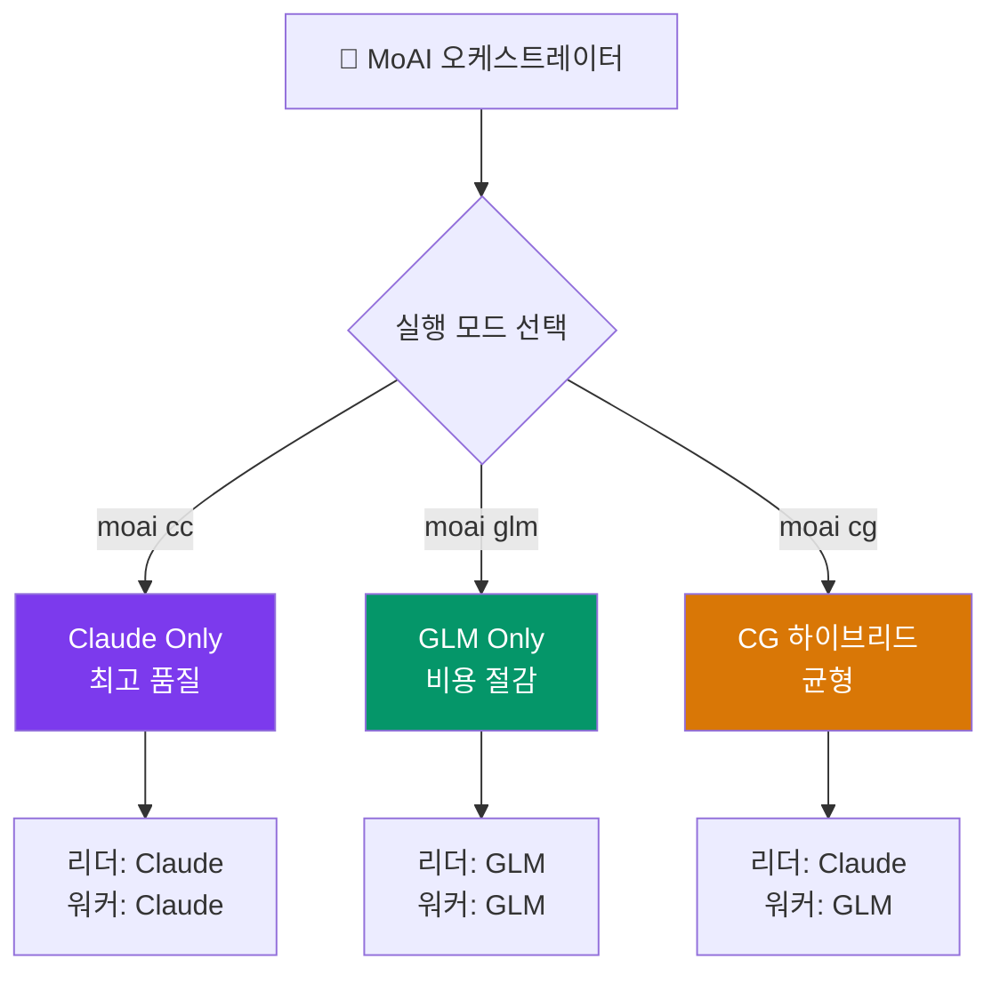

MoAI-ADK는 Claude API 외에 **z.ai GLM**을 대안 AI 백엔드로 지원하여 멀티 LLM 개발 워크플로우를 가능하게 합니다.

## z.ai GLM이란?

GLM(Generative Language Model)은 z.ai에서 제공하는 AI 모델 서비스로, Claude Code와 호환됩니다. 코드 변경 없이 환경 변수만으로 전환이 가능합니다.

| 항목 | 내용 |
|------|------|
| **GLM 코딩 플랜** | 월 **$10**부터 ([가입 링크](https://z.ai/subscribe?ic=1NDV03BGWU)) |
| **호환성** | Claude Code와 호환 — 코드 변경 없음 |
| **모델** | GLM-5.1, GLM-4.7, GLM-4.5-Air, 무료 모델 |

## 기본 모델 매핑

| Claude 티어 | GLM 모델 | 입력 (1M 토큰당) | 출력 (1M 토큰당) |
|-------------|-----------|-----------------|-----------------|
| Opus | GLM-5.1 | $2.00 | $8.00 |
| Sonnet | GLM-4.7 | $0.60 | $2.20 |
| Haiku | GLM-4.5-Air | $0.20 | $1.10 |

> 무료 모델도 제공됩니다: GLM-4.7-Flash, GLM-4.5-Flash. 전체 가격은 [z.ai Pricing](https://docs.z.ai/guides/overview/pricing)을 참조하세요.

## 3가지 실행 모드

MoAI-ADK는 3가지 LLM 실행 모드를 제공합니다:

| 명령어 | 리더 | 워커 | tmux 필요 | 비용 절감 | 용도 |
|--------|------|------|----------|----------|------|
| `moai cc` | Claude | Claude | 아니오 | - | 최고 품질, 복잡한 작업 |
| `moai glm` | GLM | GLM | 권장 | ~70% | 비용 최적화 |
| `moai cg` | Claude | GLM | **필수** | **~60%** | 품질 + 비용 균형 |



### 빠른 시작

```bash
# 1. GLM API 키 저장 (최초 1회)
moai glm sk-your-glm-api-key

# 2. 모드 선택
moai cc            # Claude 전용
moai glm           # GLM 전용
moai cg            # CG 하이브리드 (tmux 필요)
```

> **v2.7.1부터** CG 모드가 `--team` 플래그의 **기본 팀 모드**입니다. `moai cc` 또는 `moai glm`으로 명시적으로 변경하지 않는 한 CG 모드로 실행됩니다.

## 다음 단계

- [CG 모드 (Claude + GLM)](/ko/multi-llm/cg-mode) — tmux 격리 아키텍처 상세
- [모델 정책](/ko/multi-llm/model-policy) — 24개 에이전트별 모델 배정표
