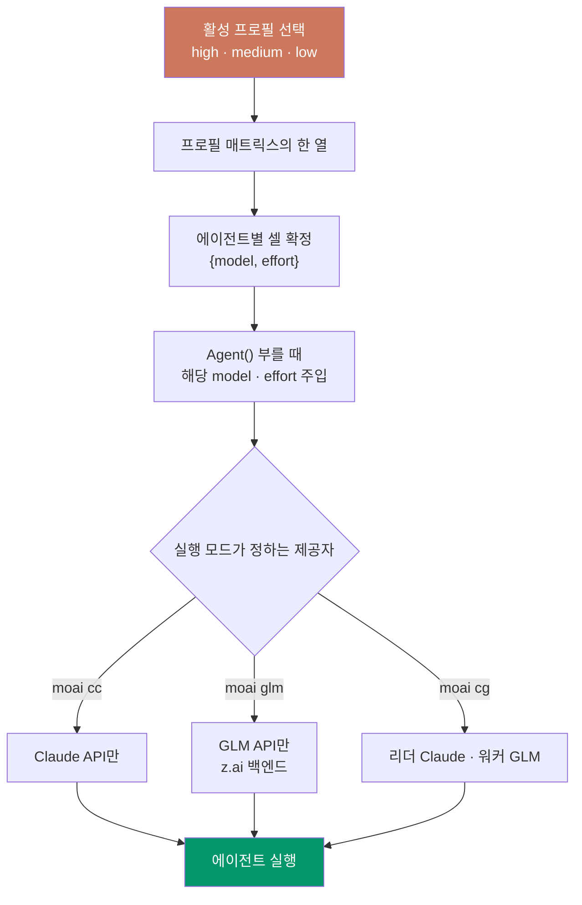

 <strong>소속 가치</strong>: 토크노믹스

<!-- @value: tokenomics -->

MoAI-ADK가 에이전트를 부를 때마다 슬쩍 결정하는 것이 하나 있습니다. 바로
"이 일에는 어느 모델이, 얼마나 깊이 생각하게 할까"입니다. 이 섹션은 바로 그
모델 배정을 다루는 곳입니다 — Claude 모델 라인업, 추론 깊이(effort), 프로필
매트릭스, 그리고 Claude와 GLM을 한 세션 안에서 섞어 쓰는 다중 제공자 라우팅까지.

## 토크노믹스에서 이 섹션의 자리

토크노믹스(tokenomics, 토큰 경제)는 같은 품질의 결과를 더 적은 토큰으로
얻으려는 모든 수단을 묶어 부르는 이름입니다. 그 가운데 비용을 가르는 일은
크게 두 갈래로 나뉩니다.

- **모델 배정** (이 섹션) — 어느 모델로, 얼마나 깊이, 어느 제공자에게 맡길지를
  정해 작업마다 알맞은 단가와 추론 깊이를 짝짓습니다.
- **컨텍스트 절약** ([비용 최적화](/ko/cost-optimization) 섹션) — 모델에
  넘기는 글머리 자체를 덜어 내고(컨텍스트 다이어트), 남은 글머리를 싼값에
  다시 쓰도록(프롬프트 캐싱) 컨텍스트를 줄입니다.

두 갈래는 서로 보완합니다. 아무리 모델을 잘 골라도 컨텍스트가 비대하면 비용이
걷잡을 수 없이 커지고, 아무리 컨텍스트를 줄여도 모델 배정이 빗나가면 싼
작업에 비싼 추론을 쓰게 됩니다. 이 섹션은 앞의 갈래, 곧 "무엇을 어떤
조건으로 부를까"를 책임집니다. 전체 그림은
[심화 학습/토크노믹스 개요](/ko/advanced/tokenomics-overview)에서 볼 수 있습니다.

## 한 칸의 두 축: 모델과 추론 깊이

에이전트를 한 번 부를 때마다 정해지는 것은 `{model, effort}` 한 쌍입니다.
이 한 쌍을 **셀** (cell, 매트릭스의 한 칸)이라 부릅니다. 두 축이 각각
다른 질문에 답합니다.

- **모델** (model) — "어느 모델로?" Fable·Opus·Sonnet·Haiku 가운데 무엇을
  쓸지 정합니다. 모델이 바뀌면 토큰당 단가와 컨텍스트 창이 함께 바뀝니다.
- **effort** (추론 깊이) — "얼마나 깊이 생각하게 할까?" 같은 모델 안에서도
  얕게 훑을지 깊이 파고들지 정합니다. 추론이 깊어질수록 토큰이 더 듭니다.

이 두 축을 함께 움직이기 때문에 "비싼 모델을 얕게" 쓸 수도 있고 "싼 모델을
깊게" 쓸 수도 있습니다. 모델 클래스를 바꾸지 않고도 effort만으로 비용 곡선의
무릎을 찾을 수 있는 까닭입니다.

### 모델 라인업 (2026-08)

| 모델 | 식별자 | 컨텍스트 | 어울리는 일 |
|------|--------|----------|------------|
| **Claude Fable 5** | `claude-fable-5` | 256K | 신규 Mythos-tier 범용 최상위. 가장 깊은 추론과 복잡한 코딩 |
| **Claude Opus 5 / 4.8** | — | 1M | 복잡한 아키텍처와 고난도 추론 |
| **Claude Sonnet 5** | — | 200K | 속도와 지능의 균형, 일상 코딩 |
| **Claude Haiku 4.5** | `claude-haiku-4-5-20251001` | 200K | 가장 빠르고 경제적, 단순·대량 작업 |


**라인업과 배정은 다릅니다.** 위 표는 "사용 가능한 모델"을 보여 줄 뿐, MoAI-ADK가
실제로 배정하는 모델은 아닙니다. 기본으로 배송되는 프로필 매트릭스는
**No-Haiku 정책**을 따라 Opus를 일차 모델로 삼고, Sonnet은 단발성 행에만 쓰며,
Haiku는 어떤 셀에도 등장하지 않습니다. Fable 5도 라인업의 정점이지만 기본
매트릭스에는 없습니다. 무엇을 배정할지는 아래 [프로필 매트릭스](#프로필-매트릭스가-한-열을-고른다)가 정합니다.


### 추론 깊이 effort

effort는 다섯 단계로 붙습니다.

| effort | 의미 |
|--------|------|
| `low` | 얕게 훑는다. 속도 우선, 단순 작업 |
| `medium` | 기본 균형 |
| `high` | 깊이 파고든다 |
| `xhigh` | 더 깊이. 고난도 추론·복잡한 코딩 |
| `max` | 가장 깊은 추론 |

`xhigh`와 `max`는 Opus 5·Opus 4.8·Sonnet 5·Opus 4.7에서 지원합니다. 두 단계를
한 번에 켜는 단축어가 **ultrathink** 키워드입니다. 이 키워드는
`effort: xhigh`를 설정하는 동시에 **Adaptive Thinking** (추론 토큰을 모델이
스스로 할당하도록 맡기는 방식)을 켭니다.


**고정 추론 예산은 금지입니다.** Opus 4.7 이상에서는 `budget_tokens` 같은
고정 추론 예산을 거부합니다. 추론 깊이는 항상 effort 단계와 Adaptive Thinking으로만
조절하세요 — 고정값을 박아 넣으면 요청이 실패합니다.


effort는 슬래시 명령으로 바꿀 수 있습니다.

```bash
/effort low       # 속도 우선
/effort high      # 깊은 추론
/effort xhigh     # 고난도
/effort ultracode # xhigh + 워크플로우 자동 편성
/effort auto      # 모델이 맥락에 맞춰 선택
```

## 프로필 매트릭스가 한 열을 고른다

에이전트마다 셀을 하나하나 고르다 보면 금세 감당이 안 됩니다. 그래서
MoAI-ADK는 세 개의 **프로필** (profile) 열을 미리 깔아 두고, 활성 프로필이
고른 한 열을 그날 모든 에이전트 부름에 그대로 씁니다.

| 프로필 | 성격 |
|--------|------|
| `high` | 품질 우선 열 |
| `medium`(기본값) | 균형 열, 비용/점수 곡선의 변곡점 |
| `low` | 경제 열 |

열 하나를 고르면 11개 에이전트 각각의 `{model, effort}` 셀이 한꺼번에 정해집니다.
사용자가 매 작업마다 모델을 고르지 않아도 되는 까닭이 이 표 한 장에 있습니다.
현재 활성 프로필이 각 에이전트에 어떤 셀을 주는지는 CLI로 바로 확인할 수 있습니다.

```bash
moai model profile --json
```

> 프로필은 이 섹션의 자세한 페이지로 자리를 옮기는 중입니다. 33개 셀의
> 전체 배정표와 `max`가 `high`의 읽기 전용 별칭이 되는 내력은 지금은
> [프로필 매트릭스](/ko/advanced/profile-matrix)와
> [모델 정책](/ko/multi-llm/model-policy)에서 볼 수 있습니다.

### 모델 배정이 한 에이전트 부름으로 이어지는 흐름


```mermaid
flowchart TD
    A["활성 프로필 선택<br/>high · medium · low"] --> B["프로필 매트릭스의 한 열"]
    B --> C["에이전트별 셀 확정<br/>{model, effort}"]
    C --> D["Agent() 부를 때<br/>해당 model · effort 주입"]
    D --> E{"실행 모드가 정하는 제공자"}
    E -->|"moai cc"| F["Claude API만"]
    E -->|"moai glm"| G["GLM API만<br/>z.ai 백엔드"]
    E -->|"moai cg"| H["리더 Claude · 워커 GLM"]
    F --> I["에이전트 실행"]
    G --> I
    H --> I

    style A fill:#cc785c,color:#fff
    style I fill:#059669,color:#fff
```

## 다중 제공자: Claude와 GLM을 섞어 쓰기

모델 배정의 마지막 질문은 "어느 제공자에게 맡길까"입니다. MoAI-ADK는 Claude
API 외에 **z.ai GLM** (Generative Language Model)도 대안 백엔드로 씁니다. 코드를
고칠 필요 없이 환경 변수만 바꾸면 Claude Code와 호환되어 그대로 돌아갑니다.


GLM으로 갈아탈 때 Claude 티어마다 대응하는 GLM 모델이 배정됩니다. Claude
Code의 `ANTHROPIC_DEFAULT_*_MODEL` 환경변수로 주입되는 짝은 이렇습니다.

| Claude 슬롯 | GLM 모델 | 컨텍스트 |
|-------------|----------|----------|
| Opus / Fable | `glm-5.3` | 1M |
| Sonnet | `glm-5.3` | 1M |
| Haiku | `glm-5.3` | 1M |

### 세 가지 실행 모드

무엇을 우선할지에 따라 세 모드 가운데 고르면 됩니다.

| 명령어 | 리더 | 워커 | tmux 필요 | 비용 절감 | 용도 |
|--------|------|------|----------|----------|------|
| `moai cc` | Claude | Claude | 아니오 | — | 최고 품질, 복잡한 작업 |
| `moai glm` | GLM | GLM | 권장 | ~70% | 비용 최적화 |
| `moai cg` | Claude | GLM | **필수** | **~60%** | 품질 + 비용 균형 |

그 가운데 **CG 모드** (Claude + GLM)가 다중 제공자 라우팅의 대표 사례입니다.
전략·계획·감사처럼 추론 품질이 중요한 일은 Claude 리더가 맡고, 대량 구현처럼
물량이 중요한 일은 GLM 워커가 맡습니다. tmux 세션 단위로 환경 변수를 갈라
놓아 이 배분을 한 세션 안에서 그대로 실행합니다. 구현 중심 작업이라면 비용을
약 60-70% 줄일 수 있습니다. 자세한 아키텍처와 설정 절차는
[CG 모드 (Claude + GLM)](/ko/multi-llm/cg-mode)에서 다룹니다.

```bash
# 1. GLM API 키 저장 (최초 1회)
moai glm setup sk-your-glm-api-key

# 2. 모드 선택
moai cc            # Claude 전용
moai glm           # GLM 전용
moai cg            # CG 하이브리드 (tmux 필요)
```

## 모델 정책: 부를 때마다 모델을 확인한다

프로필 매트릭스가 셀을 정해 두더라도, 에이전트를 실제로 부르는 순간 그 셀의
모델이 제대로 들어가는지를 지키는 것이 **모델 정책** (model policy)입니다.
MoAI-ADK는 에이전트를 부를 때마다 해당 모델을 spawn 호출에 명시적으로 넘깁니다.

에이전트 정의 파일의 기본값은 `model: inherit`(부모 세션의 모델을 그대로
이어받기)이기 때문에, 모델을 빠뜨려 부르면 부모 세션이 쓰는 모델로 조용히
회귀합니다. 그래서 "선언된 모델"과 "실제로 해석된 모델"이 어긋나는
**drift** (표류)를 경계합니다 — drift가 생기면 프로필이 아무리 정교해도
배정이 무의미해집니다. spawn 때마다 모델 주입을 감사 로그로 남겨 drift를
잡아냅니다.

정책 티어가 무엇을 바꾸고 무엇을 바꾸지 않는지, 33개 셀이 어떻게 짜이는지는
[모델 정책](/ko/multi-llm/model-policy)에서 펼쳐 봅니다.

## 이 섹션의 문서

- [CG 모드 (Claude + GLM)](/ko/multi-llm/cg-mode) — tmux 격리 아키텍처, GLM 설정 절차, 리더/워커 비용 분배
- [모델 정책](/ko/multi-llm/model-policy) — 3단계 정책 개요, 33개 셀 배정표, 에이전트별 모델
- [프로필 매트릭스](/ko/advanced/profile-matrix) — 매트릭스가 푸는 문제와 셀 해부 (이 섹션으로 이동 예정)

## 관련 문서

- [비용 최적화](/ko/cost-optimization) — 토크노믹스의 다른 갈래: 컨텍스트 다이어트와 프롬프트 캐싱
- [심화 학습/토크노믹스 개요](/ko/advanced/tokenomics-overview) — 모델 배정과 컨텍스트 절약을 하나로 잇는 전체 그림
