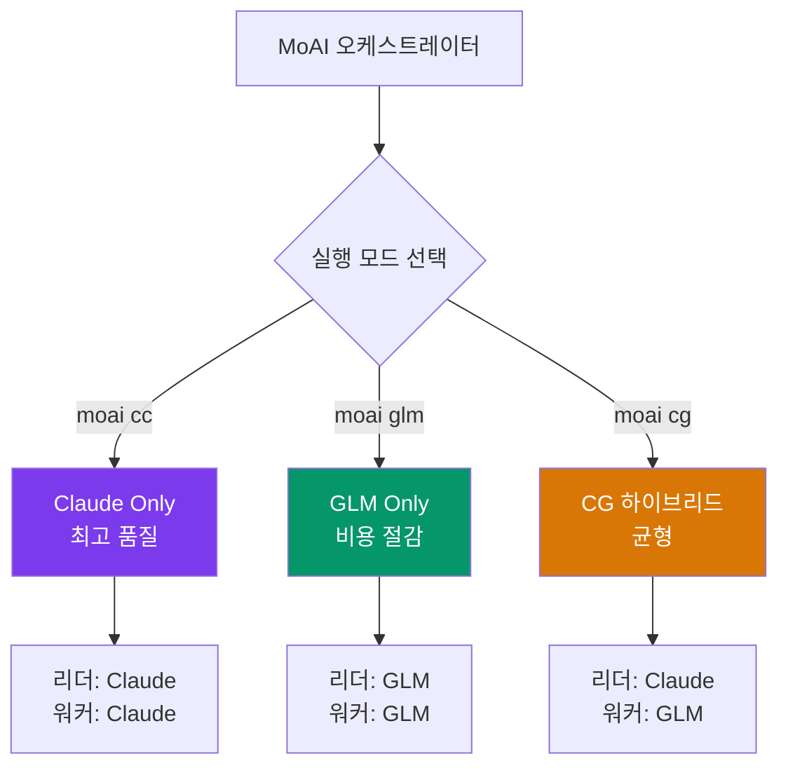

 <strong>소속 가치</strong>: 🪙 토크노믹스

<!-- @value: tokenomics -->


MoAI-ADK는 Claude API 외에 **z.ai GLM**을 대안 AI 백엔드로 지원합니다. 이는
편의 기능이 아니라 v3.0의 핵심 가치인 **토크노믹스**(Token Economics)를
실현하는 축입니다. 같은 품질의 코드를 더 적은 비용으로 얻으려면 작업마다
알맞은 모델을 배정할 수 있어야 하기 때문입니다.


## z.ai GLM이란?

GLM(Generative Language Model)은 z.ai에서 제공하는 AI 모델 서비스로 Claude Code와 호환됩니다. 코드 변경 없이 환경 변수만으로 전환이 가능합니다.

| 항목 | 내용 |
|------|------|
| **GLM 코딩 플랜** | 월 **$10**부터 ([가입 링크](https://z.ai/subscribe?ic=1NDV03BGWU)) |
| **호환성** | Claude Code와 호환 — 코드 변경 없음 |
| **모델** | glm-5.2, GLM-4.7, GLM-4.5-Air, 무료 모델 |

## 기본 모델 매핑

MoAI-ADK는 Claude 티어별로 서로 다른 GLM 모델을 배정합니다. 4개의 Claude Code
`ANTHROPIC_DEFAULT_*_MODEL` 환경변수로 구현됩니다:

| Claude 티어 | 환경변수 | GLM 모델 | 컨텍스트 |
|-------------|----------|----------|----------|
| Opus | `ANTHROPIC_DEFAULT_OPUS_MODEL` | glm-5.2 | 1M |
| Sonnet | `ANTHROPIC_DEFAULT_SONNET_MODEL` | glm-4.7 | 202K |
| Haiku | `ANTHROPIC_DEFAULT_HAIKU_MODEL` | glm-4.5-air | 128K |
| Fable | `ANTHROPIC_DEFAULT_FABLE_MODEL` | glm-5.2 | 1M |

> Opus 슬롯(메인 세션 + 상속 에이전트)과 Fable 슬롯은 1M 컨텍스트의 `glm-5.2`를,
> Sonnet 슬롯은 202K의 `glm-4.7`을, Haiku 슬롯은 128K의 `glm-4.5-air`를 사용합니다.
> 이 티어별 차등 매핑은 `llm.yaml`의 `glm.models` (high/medium/low/fable)로
> 설정하며, 각각 위 환경변수로 주입됩니다. Fable 환경변수는 Claude Code
> v2.1.202부터 공식 지원됩니다.

> 무료 모델도 제공됩니다: GLM-4.7-Flash, GLM-4.5-Flash. 전체 가격은 [z.ai Pricing](https://docs.z.ai/guides/overview/pricing)을 참조하세요.

## 3가지 실행 모드

MoAI-ADK는 3가지 LLM 실행 모드를 제공합니다. "무엇을 최적화할 것인가"에 따라
고르면 됩니다:

| 명령어 | 리더 | 워커 | tmux 필요 | 비용 절감 | 용도 |
|--------|------|------|----------|----------|------|
| `moai cc` | Claude | Claude | 아니오 | - | 최고 품질, 복잡한 작업 |
| `moai glm` | GLM | GLM | 권장 | ~70% | 비용 최적화 |
| `moai cg` | Claude | GLM | **필수** | **~60%** | 품질 + 비용 균형 |


```mermaid
graph TD
    A["MoAI 오케스트레이터"] --> B{"실행 모드 선택"}
    B -->|"moai cc"| C["Claude Only<br/>최고 품질"]
    B -->|"moai glm"| D["GLM Only<br/>비용 절감"]
    B -->|"moai cg"| E["CG 하이브리드<br/>균형"]

    C --> F["리더: Claude<br/>워커: Claude"]
    D --> G["리더: GLM<br/>워커: GLM"]
    E --> H["리더: Claude<br/>워커: GLM"]

    style C fill:#7C3AED,color:#fff
    style D fill:#059669,color:#fff
    style E fill:#D97706,color:#fff
```

CG 모드가 토크노믹스의 대표 사례입니다. 전략·계획·감사처럼 추론 품질이
중요한 일은 Claude 리더가, 대량 구현처럼 물량이 중요한 일은 GLM 워커가
맡습니다. 구현 중심 작업 기준 약 60-70%의 비용이 절감됩니다.

### 빠른 시작

```bash
# 1. GLM API 키 저장 (최초 1회)
moai glm setup sk-your-glm-api-key

# 2. 모드 선택
moai cc            # Claude 전용
moai glm           # GLM 전용
moai cg            # CG 하이브리드 (tmux 필요)
```

## 다음 단계

- [CG 모드 (Claude + GLM)](/ko/multi-llm/cg-mode) — tmux 격리 아키텍처 상세
- [모델 정책](/ko/multi-llm/model-policy) — 에이전트별 모델 배정표
