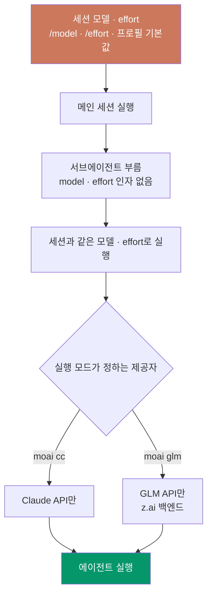

 <strong>소속 가치</strong>: 토크노믹스

<!-- @value: tokenomics -->

MoAI-ADK가 세션을 시작할 때 정하는 것이 하나 있습니다. 바로
"이 세션은 어느 모델로, 얼마나 깊이 생각하게 할까"입니다. 이 섹션은 바로 그
모델 선택을 다루는 곳입니다 — Claude 모델 라인업, 추론 깊이(effort), 서브에이전트가
세션을 따르는 상속 규칙, 그리고 Claude와 GLM을 한 세션 안에서 섞어 쓰는 다중 제공자 라우팅까지.

## 토크노믹스에서 이 섹션의 자리

토크노믹스(tokenomics, 토큰 경제)는 같은 품질의 결과를 더 적은 토큰으로
얻으려는 모든 수단을 묶어 부르는 이름입니다. 그 가운데 비용을 가르는 일은
크게 두 갈래로 나뉩니다.

- **모델 선택** (이 섹션) — 세션을 어느 모델로, 얼마나 깊이, 어느 제공자에게
  맡길지를 정합니다. 서브에이전트는 그 세션의 모델과 추론 깊이를 그대로 따르므로
  세션 하나를 잘 고르는 것이 곧 전체 배정입니다.
- **컨텍스트 절약** ([비용 최적화](/ko/cost-optimization) 섹션) — 모델에
  넘기는 글머리 자체를 덜어 내고(컨텍스트 다이어트), 남은 글머리를 싼값에
  다시 쓰도록(프롬프트 캐싱) 컨텍스트를 줄입니다.

두 갈래는 서로 보완합니다. 아무리 모델을 잘 골라도 컨텍스트가 비대하면 비용이
걷잡을 수 없이 커지고, 아무리 컨텍스트를 줄여도 모델 선택이 빗나가면 싼
작업에 비싼 추론을 쓰게 됩니다. 이 섹션은 앞의 갈래, 곧 "세션을 무엇으로
어떤 조건으로 돌릴까"를 책임집니다. 전체 그림은
[심화 학습/토크노믹스 개요](/ko/advanced/tokenomics-overview)에서 볼 수 있습니다.

## 한 쌍의 두 축: 모델과 추론 깊이

세션이 정하는 것은 `{model, effort}` 한 쌍입니다. 이 한 쌍이 세션의 모든
에이전트 부름에 그대로 적용됩니다. 두 축이 각각 다른 질문에 답합니다.

- **모델** (model) — "어느 모델로?" Fable·Opus·Sonnet·Haiku 가운데 무엇을
  쓸지 정합니다. 모델이 바뀌면 토큰당 단가와 컨텍스트 창이 함께 바뀝니다.
- **effort** (추론 깊이) — "얼마나 깊이 생각하게 할까?" 같은 모델 안에서도
  얕게 훑을지 깊이 파고들지 정합니다. 추론이 깊어질수록 토큰이 더 듭니다.

이 두 축을 함께 움직이기 때문에 "비싼 모델을 얕게" 쓸 수도 있고 "싼 모델을
깊게" 쓸 수도 있습니다. 모델 클래스를 바꾸지 않고도 effort만으로 비용 곡선의
무릎을 찾을 수 있는 까닭입니다.

### 모델 라인업 (2026-08)

| 모델 | 식별자 | 컨텍스트 | 어울리는 일 |
|------|--------|----------|------------|
| **Claude Fable 5** | `claude-fable-5` | 1M | 신규 Mythos-tier 범용 최상위. 가장 깊은 추론과 복잡한 코딩 |
| **Claude Opus 5.5 / 5 / 4.8** | — | 1M | 복잡한 아키텍처와 고난도 추론 |
| **Claude Sonnet 5** | — | 1M | 속도와 지능의 균형, 일상 코딩 |
| **Claude Haiku 4.5** | `claude-haiku-4-5-20251001` | 200K | 가장 빠르고 경제적, 단순·대량 작업 |


**라인업과 선택은 다릅니다.** 위 표는 "사용 가능한 모델"을 보여 줄 뿐입니다.
MoAI-ADK의 세션 기본 선택은 **No-Haiku 정책**을 따라 Opus 계열을 일차 모델로
삼고, Haiku는 기본 조합 어디에도 등장하지 않습니다. 무엇으로 돌릴지는 세션의
모델 선택이 정하며, 아래 [세션이 모델과 effort를 정한다](#세션이-모델과-effort를-정한다)에서
그 규칙을 다룹니다.


### 추론 깊이 effort

effort는 다섯 단계로 붙습니다.

| effort | 의미 |
|--------|------|
| `low` | 얕게 훑는다. 속도 우선, 단순 작업 |
| `medium` | 기본 균형 |
| `high` | 깊이 파고든다 |
| `xhigh` | 더 깊이. 고난도 추론·복잡한 코딩 |
| `max` | 가장 깊은 추론 |

`xhigh`와 `max`는 Opus 5.5·Opus 5·Opus 4.8·Sonnet 5·Opus 4.7에서 지원합니다. 두 단계를
한 번에 켜는 단축어가 **ultrathink** 키워드입니다. 이 키워드는
`effort: xhigh`를 설정하는 동시에 **Adaptive Thinking** (추론 토큰을 모델이
스스로 할당하도록 맡기는 방식)을 켭니다.


**고정 추론 예산은 금지입니다.** Opus 4.7 이상에서는 `budget_tokens` 같은
고정 추론 예산을 거부합니다. 추론 깊이는 항상 effort 단계와 Adaptive Thinking으로만
조절하세요 — 고정값을 박아 넣으면 요청이 실패합니다.


effort는 슬래시 명령으로 바꿀 수 있습니다.

```bash
/effort low       # 속도 우선
/effort high      # 깊은 추론
/effort xhigh     # 고난도
/effort ultracode # 워크플로우 자동 편성 토글
/effort auto      # 모델이 맥락에 맞춰 선택
```

## 세션이 모델과 effort를 정한다

에이전트마다 모델을 하나하나 고르던 예전의 프로필 매트릭스 방식은 물러났습니다.
v3.2부터 **서브에이전트는 메인 세션의 모델과 추론 깊이를 그대로 따릅니다** —
서브에이전트를 부를 때 `model`도 `effort`도 넘기지 않으며, MoAI 에이전트 정의는
어느 쪽도 선언하지 않습니다. 에이전트별 배정표를 관리할 필요가 없어진 대신,
남은 것은 세션의 선택 세 가지입니다.

| 선택 | 하는 것 |
|------|--------|
| 모델 (`/model`) | 세션이 실행하는 모델. 모든 서브에이전트가 함께 따릅니다 |
| effort (`/effort` · `ultrathink`) | 세션의 추론 깊이. `high`가 품질 우선, `medium`이 기본, `low`가 같은 모델 안에서의 경제 운용입니다 |
| 세션 모델 정책 (`moai profile setup`) | 추론 강도를 따로 고르지 않았을 때 프로필이 쥐어 주는 기본 effort 폴백입니다 |

> 예전 매트릭스(에이전트 13개 × 프로필 3개)가 어떻게 물러났는지, 그리고
> 상속 규칙의 자세한 내용은 지금은
> [프로필 매트릭스](/ko/advanced/profile-matrix)와
> [모델 정책](/ko/multi-llm/model-policy)에서 볼 수 있습니다.

### 세션 선택이 에이전트 부름으로 이어지는 흐름


```mermaid
flowchart TD
    A["세션 모델 · effort<br/>/model · /effort · 프로필 기본값"] --> B["메인 세션 실행"]
    B --> C["서브에이전트 부름<br/>model · effort 인자 없음"]
    C --> D["세션과 같은 모델 · effort로 실행"]
    D --> E{"실행 모드가 정하는 제공자"}
    E -->|"moai cc"| F["Claude API만"]
    E -->|"moai glm"| G["GLM API만<br/>z.ai 백엔드"]
    F --> I["에이전트 실행"]
    G --> I

    style A fill:#cc785c,color:#fff
    style I fill:#059669,color:#fff
```

## 다중 제공자: Claude와 GLM을 섞어 쓰기

모델 배정의 마지막 질문은 "어느 제공자에게 맡길까"입니다. MoAI-ADK는 Claude
API 외에 **z.ai GLM** (Generative Language Model)도 대안 백엔드로 씁니다. 코드를
고칠 필요 없이 환경 변수만 바꾸면 Claude Code와 호환되어 그대로 돌아갑니다.


GLM으로 갈아탈 때 Claude 티어마다 대응하는 GLM 모델이 배정됩니다. Claude
Code의 `ANTHROPIC_DEFAULT_*_MODEL` 환경변수로 주입되는 짝은 이렇습니다.

| Claude 슬롯 | GLM 모델 | 컨텍스트 |
|-------------|----------|----------|
| Opus / Fable | `glm-5.3-flash` | 1M |
| Sonnet | `glm-5.3-flash` | 1M |
| Haiku | `glm-5.3-flash` | 1M |

> `glm-5.3-flash`가 기본 모델이다. glm-5.3은 어느 티어 슬롯에서든 여전히 선택할 수 있다 — `llm.yaml`(`llm.glm.models.*`)에서 슬롯을 지정하면 기존 동작(1M 컨텍스트, 표준 effort 모아짐) 그대로 로드된다.

### 실행 모드

Claude 또는 GLM 런처를 명시적으로 선택합니다.

| 명령어 | 리더 | 워커 | tmux 필요 | 비용 절감 | 용도 |
|--------|------|------|----------|----------|------|
| `moai cc` | Claude | Claude | 아니오 | — | 최고 품질, 복잡한 작업 |
| `moai glm` | GLM | GLM | 권장 | ~70% | 비용 최적화 |

`moai cg`는 폐기되었습니다. Claude나 GLM을 실행하지 않고 설정 이전 안내와 함께 종료합니다. `moai cc`의 별칭이 아닙니다. `llm.team_mode: cg`가 남은 프로젝트는 세션을 실행하기 전에 이전할 구성을 명시적으로 선택해야 합니다. [CG 폐기와 설정 이전](/ko/multi-llm/cg-mode/)

```bash
# 1. GLM API 키 저장 (최초 1회)
moai glm setup sk-your-glm-api-key

# 2. 모드 선택
moai cc            # Claude 전용
moai glm           # GLM 전용
```

## 모델 정책: 세션이 정하고 에이전트가 따른다

**모델 정책** (model policy)의 오늘날 자리는 세션의 모델과 추론 깊이를
정하는 일입니다. 서브에이전트는 세션의 모델과 추론 깊이를 그대로 따르므로
부름에 모델을 명시할 필요가 없고, 에이전트 정의도 어느 쪽도 선언하지 않습니다.
예전에는 "선언된 모델"과 "실제로 해석된 모델"이 어긋나는 **drift** (표류)를
감사 로그로 잡아냈지만, 상속이 기본이 된 지금은 부름에 모델을 명시하는 일
자체가 드문 관측 대상일 뿐입니다.

세션 모델 정책이 무엇을 정하고 무엇을 정하지 않는지, 예전 매트릭스가
물러난 내력은 [모델 정책](/ko/multi-llm/model-policy)에서 펼쳐 봅니다.

## 이 섹션의 문서

- [CG 폐기와 설정 이전](/ko/multi-llm/cg-mode/)
- [모델 정책](/ko/multi-llm/model-policy) — 세션 모델 정책, effort 폴백, 상속 규칙 상세
- [프로필 매트릭스](/ko/advanced/profile-matrix) — 예전 매트릭스가 물러난 자리와 현재의 상속 규칙

## 관련 문서

- [비용 최적화](/ko/cost-optimization) — 토크노믹스의 다른 갈래: 컨텍스트 다이어트와 프롬프트 캐싱
- [심화 학습/토크노믹스 개요](/ko/advanced/tokenomics-overview) — 모델 배정과 컨텍스트 절약을 하나로 잇는 전체 그림
