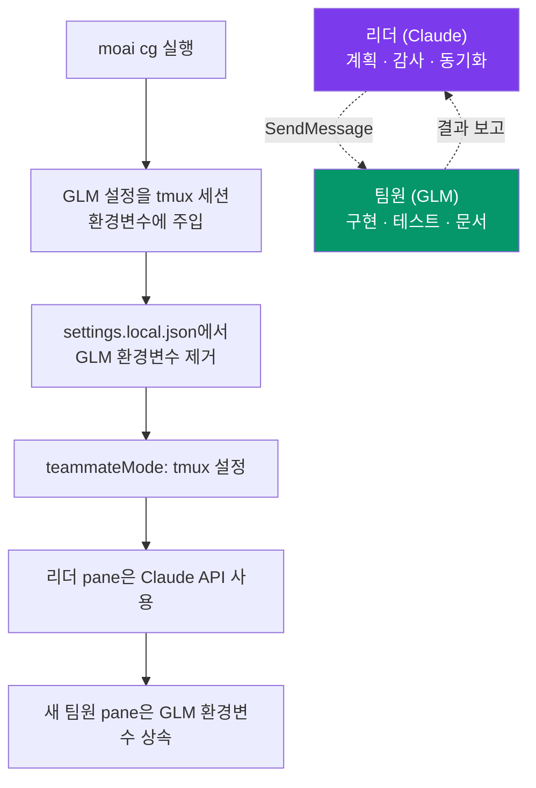

## CG 모드, 한 줄로

CG 모드는 한마디로 "생각은 Claude가 하고, 손은 GLM이 움직이게" 하는
실행 방식입니다. 전략과 품질 판단이 중요한 일은 **Claude** 리더가 맡고,
코드를 직접 짜는 구현 중심의 일은 더 저렴한 **GLM**(z.ai) 팀원에게
맡겨, 한 세션 안에서 비용을 약 60-70% 줄입니다.

이름의 **CG**는 **Claude + GLM**을 뜻합니다. 두 모델을 번갈아 쓰는 게
아니라, tmux 세션마다 환경 변수를 나눠 담아 한 세션에서 두 모델이
각자의 역할만 담당하도록 격리합니다. "계획은 Claude가 깊게, 구현은 GLM이
싸게"라는 토크노믹스(tokenomics) 목표를 코드 한 줄 안 고치고 그대로
실행하는 셈입니다.


 <strong>핵심 아이디어</strong>: 가장 비싼 추론은
가장 똑똑한 모델에게, 가장 물량이 많은 일은 가장 싼 모델에게. 두 역할을
한 세션에서 나눠 맡기는 것이 CG 모드의 전부입니다.


## 왜 이런 분리가 필요한가

AI 코딩 작업의 비용은 대부분 "구현" 단계에서 발생합니다. SPEC을 세우고
아키텍처를 고민하는 계획(plan)과 결과를 검토하는 감사(audit) 단계는 추론의
깊이가 품질을 가르지만 호출 횟수 자체는 적습니다. 반면 코드를 실제로 짜고
테스트를 채우고 문서를 만드는 구현(run) 단계는 토큰이 쏟아지는 구간입니다.

그래서 두 단계에 같은 최고가 모델을 쓰면 품질은 보장되지만 비용이 빠르게
불어납니다. CG 모드는 이 비대칭을 이용합니다. Claude의 깊은 추론이
필요한 자리에는 Claude를, 물량이 많아 모델 단가가 청구액을 가르는 자리에는
더 싼 GLM을 배치합니다. 결과적으로 계획과 감사의 품질은 그대로 두면서
구현 비용만 크게 줄입니다.

## 작동 원리

CG 모드는 tmux 세션을 단위로 환경 변수를 갈라 놓습니다. 리더가 쓰는 pane은
Claude API 환경만 남고, 새로 열리는 팀원 pane은 tmux 세션에 주입된 GLM
환경 변수를 물려받습니다. 코드를 고칠 필요 없이 환경 변수만으로 두 모델이
나뉘어 도는 것입니다.



리더와 팀원은 Claude Code의 메신저(SendMessage) 도구로 대화합니다. 리더가
작업을 넘기면 팀원 pane에서 그 일이 GLM으로 실행되고, 결과는 다시 리더에게
돌아옵니다.

## 어떤 일은 누가 하나

| 역할 | 모델 | 맡는 일 |
|------|------|--------|
| **리더** (현재 tmux pane) | Claude | 오케스트레이션, 계획(plan), 품질 판단, 감사, 동기화(sync) |
| **팀원** (새 tmux pane) | GLM | run 단계의 구현 물량, 코드 생성, 테스트 작성, 문서 생성 |

리더는 "무엇을 어떻게 만들 것인가"를 정하고 결과가 기준에 맞는지 확인합니다.
팀원은 정해진 계획을 따라 실제 코드를 씁니다. 이 분업이 CG 모드의 비용
절감 출처입니다 — 비싼 모델이 구현 물량까지 떠안지 않게 합니다.

> **GLM 팀원이 쓰는 모델**: Claude 티어마다 다른 GLM 모델이 매핑됩니다.
> Opus 슬롯(메인 세션 + 상속 에이전트)과 Fable 슬롯은 1M 컨텍스트의
> `glm-5.2`, Sonnet 슬롯은 202K의 `glm-4.7`, Haiku 슬롯은 128K의
> `glm-4.5-air`를 씁니다. 자세한 매핑은 [멀티 LLM 소개](/ko/multi-llm)를
> 참고하세요.

## 준비와 실행

### 1단계: GLM API 키 저장 (최초 1회)

```bash
moai glm setup sk-your-glm-api-key
```

키는 `~/.moai/.env.glm`에 안전하게 저장됩니다.

### 2단계: tmux 환경 확인

이미 tmux를 쓰고 있다면 새 세션을 만들 필요가 없습니다.

```bash
# tmux를 사용 중이 아니라면:
tmux new -s moai
```


 VS Code 터미널 기본 셸을 tmux로 잡아 두면 이 단계를
아예 건너뛸 수 있습니다. CG 모드는 tmux 분할 화면 환경에서만 리더/팀원 API
분리가 가능합니다.


### 3단계: CG 모드 실행

```bash
moai cg
```

`moai cg`가 현재 pane에서 Claude Code를 알아서 띄웁니다. 따로 `claude`를 칠
필요가 없습니다.

### 4단계: 워크플로우 실행

```bash
/moai "사용자 인증 기능 구현"
```

이후는 평소와 같습니다. 오케스트레이터(리더, Claude)가 계획과 품질,
동기화를 맡고, 구현 물량이 큰 작업은 새 tmux pane의 GLM 팀원에게 넘어갑니다.


 예전 <code>--team</code> 플래그(Agent Teams 정적
오케스트레이션 계층)는 v3.0에서 물러났습니다. 강제로 지정해도 sub-agent
모드로 돌아갑니다. CG 모드의 리더/팀원 분리는 Claude Code 내장 teammate
런타임(tmux pane)이 담당하며, 이 런타임은 그대로 남아 있습니다.


## 언제 CG 모드를 쓰고, 언제 피해야 하나

### CG 모드가 잘 맞는 작업

- 구현 중심의 SPEC 실행(run 단계)
- 코드 생성, 리팩터링 물량
- 테스트 코드 작성
- 문서 생성

이런 작업은 추론보다 물량이 많아 GLM 팀원에게 맡겼을 때 비용 절감 효과가
가장 큽니다.

### CG 모드를 피해야 할 작업

- 아키텍처 설계와 계획(Opus/Fable급 깊은 추론이 필요)
- 보안 리뷰(Claude의 보안 트레이닝이 필요)
- 복잡한 디버깅(고급 추론이 품질을 가름)

이런 작업은 한 번의 판단이 이후 비용과 방향을 크게 좌우합니다. 가장 똑똑한
모델이 직접 끝까지 맡는 편이 안전합니다. 이때는 CG 모드 대신 Claude 전용
실행(`moai cc`)을 쓰세요.


 CG 모드가 항상 정답은 아닙니다. 계획 단계에서
GLM 팀원에게 너무 이르게 판단을 맡기면, 비용은 줄어도 방향이 틀려 다시
짜는 비용이 더 커질 수 있습니다. "생각"은 반드시 Claude 리더가, "손"만
GLM 팀원에게 맡기는 것이 이 모드의 올바른 쓰임입니다.


## 세 가지 실행 모드 비교

| 명령어 | 리더 | 팀원 | tmux 필요 | 비용 절감 | 용도 |
|--------|------|------|----------|----------|------|
| `moai cc` | Claude | Claude | 아니오 | - | 복잡한 작업, 최고 품질 |
| `moai glm` | GLM | GLM | 권장 | ~70% | 비용 최적화 |
| `moai cg` | Claude | GLM | **필수** | **~60%** | 품질 + 비용 균형 |

`moai cc`는 품질 최우선, `moai glm`은 비용 최우선, `moai cg`는 그 사이의
균형입니다. CG 모드만이 리더와 팀원에 서로 다른 모델을 배정하므로 tmux가
필수입니다.

## 디스플레이 모드 (teammateMode)

`teammateMode`는 Claude Code 내장 디스플레이 설정으로,
`settings.local.json`에 저장됩니다. MoAI의 team-mode(예전 `--team`
플래그, v3.0에서 물러남)와는 다른 개념입니다. teammate 런타임 자체는
Claude Code가 제공하고, `teammateMode`는 화면에 어떻게 띄울지만 정합니다.

| 값 | 설명 | 리더/팀원 분리 | CG 모드 |
|------|------|--------------|---------|
| `in-process` | 기본값, 같은 터미널 인라인 | 불가 | 미사용 |
| `auto` | 환경 자동 감지 | 미지원 | 미사용 |
| `tmux` | tmux 분할 화면 | 세션 환경변수 격리 |  사용 |
| `iterm2` | iTerm2 분할 화면 | 미지원 | 미사용 |

`moai cg`와 `moai glm`은 `settings.local.json`의 `teammateMode`를
`"tmux"`로 설정하고, `moai cc`는 빈 값으로 되돌립니다. 예전
`CLAUDE_CODE_TEAMMATE_DISPLAY` 환경변수보다 `teammateMode` 설정이
우선합니다.

> **CG 모드는 `tmux` 디스플레이 모드에서만 리더/팀원 API 분리가 가능합니다.**

## 중요 사항

| 항목 | 설명 |
|------|------|
| **tmux 환경** | 이미 tmux를 쓰고 있으면 새 세션 불필요. 기본 셸을 tmux로 잡아 두면 편리 |
| **자동 실행** | `moai cg`가 현재 pane에서 Claude Code를 알아서 띄움. 별도 `claude` 명령 불필요 |
| **세션 종료** | session_end 훅이 tmux 세션 환경변수를 알아서 치움 → 다음 세션은 Claude 사용 |
| **팀 통신** | SendMessage 도구로 리더와 팀원 간 통신 |
| **모드 전환** | `moai glm`에서 넘어올 때 `moai cg`가 GLM 설정을 알아서 초기화. 중간에 `moai cc`를 거칠 필요 없음 |

## tmux 환경 변수 주입 보안 모델 {#tmux-env-security}

v3.0.0부터 `moai cg`는 GLM token(`ANTHROPIC_AUTH_TOKEN`)을 tmux 세션
환경 변수에 주입할 때 **argv 채널**(`tmux set-environment <KEY> <VALUE>`) 대신
**source-file 채널**(`tmux source-file <tmp>`)을 씁니다. 덕분에 token이
`ps auxe`, `/proc/<pid>/cmdline`, auditd 로그, sysmon 추적, 크래시 덤프에
평문으로 드러나지 않습니다(CWE-214).

### 주입 흐름

1. `~/.moai/run/` 아래 임시 파일을 `mkstemp`로 생성(mode `0o600` 강제)
2. `set-environment -t <session> <KEY> <VALUE>` 한 줄을 기록
3. `tmux source-file <tmp>`로 tmux가 그 파일을 읽어 환경에 주입
4. 주입 직후 `os.Remove`로 unlink

argv에 남는 것은 임시 파일 경로뿐이고, token 자체는 드러나지 않습니다.

### 민감하지 않은 값은 argv 유지

`CLAUDE_CONFIG_DIR`, `ANTHROPIC_BASE_URL`,
`ANTHROPIC_DEFAULT_*_MODEL`처럼 token이 아닌 값은 기존 argv 경로를 그대로
씁니다(보안 위협 없음).

### 사용자 책임

`~/.moai/.env.glm` 파일은 사용자 환경에서 `0o600` 권한을 유지해야 합니다.
권한은 `moai glm` 명령이 알아서 잡아 줍니다:

```bash
stat -c '%a' ~/.moai/.env.glm    # Linux: 600
stat -f '%A' ~/.moai/.env.glm    # macOS: 600
```

### 자체 점검

CG 모드가 도는 중에 token이 argv에 드러나는지 확인해 봅니다:

```bash
# moai cg 실행 후 새 tmux 세션 내에서
ps auxe | grep -i 'tmux set-environment.*ANTHROPIC_AUTH_TOKEN'
# 기대값: 0 matches (token 이 argv 에 없음)
```

자세한 위협 모델과 실패 시 동작(`ErrTmuxSensitiveInjectFailed` sentinel),
추가 점검 절차는 [보안 노트 — CWE-214](/ko/advanced/security-notes/#cwe-214)를
참고하세요.

## 비용을 줄이는 두 가지 경로

CG 모드가 다루는 "비용 절감"과, 프롬프트 캐싱이 다루는 "비용 절감"은
관점이 다릅니다. 둘 다 토크노믹스의 한 축이지만 어디서 아끼느냐가 다릅니다.

| 경로 | 어디서 아끼나 | 어떻게 | 관련 페이지 |
|------|--------------|--------|------------|
| **모델 분배** (CG 모드) | 모델 단가 | 싼 일은 싼 모델에게 | 이 페이지 |
| **연산 재사용** (프롬프트 캐싱) | 반복 계산 | 같은 접두사를 캐시해 재계산 생략 | [프롬프트 캐싱](/ko/claude-code/context-memory/prompt-caching) |

CG 모드는 **비용** 관점(청구액을 줄인다)이고, 프롬프트 캐싱은 **컨텍스트**
관점(같은 컨텍스트를 다시 계산하는 비용을 줄인다)입니다. 두 축은 서로
배타적이지 않아 함께 쓰면 효과가 겹칩니다. 다만 이 페이지의 주제는
모델 분배 쪽입니다.

## 문제 해결

| 문제 | 원인 | 해결 |
|------|------|------|
| 팀원이 Claude API를 씀 | tmux 세션 환경변수가 설정되지 않음 | tmux 안에서 `moai cg` 다시 실행 |
| `moai cg`를 쳐도 Claude Code가 안 뜸 | tmux 밖에서 실행함 | `tmux new -s moai` 후 다시 실행 |
| 세션을 닫아도 GLM 환경변수가 남음 | session_end 훅 실패 | `moai cc`로 직접 정리 |

## 다음 단계

- [모델 정책](/ko/multi-llm/model-policy) — 에이전트마다 알맞은 모델을 배정하는 방식
- [프롬프트 캐싱](/ko/claude-code/context-memory/prompt-caching) — 비용 절감의 다른 축, 연산 재사용
- [자주 묻는 질문](/ko/getting-started/faq) — 실행 모드 관련 FAQ
- [CLI 레퍼런스](/ko/getting-started/cli) — moai cc, moai glm, moai cg 상세
