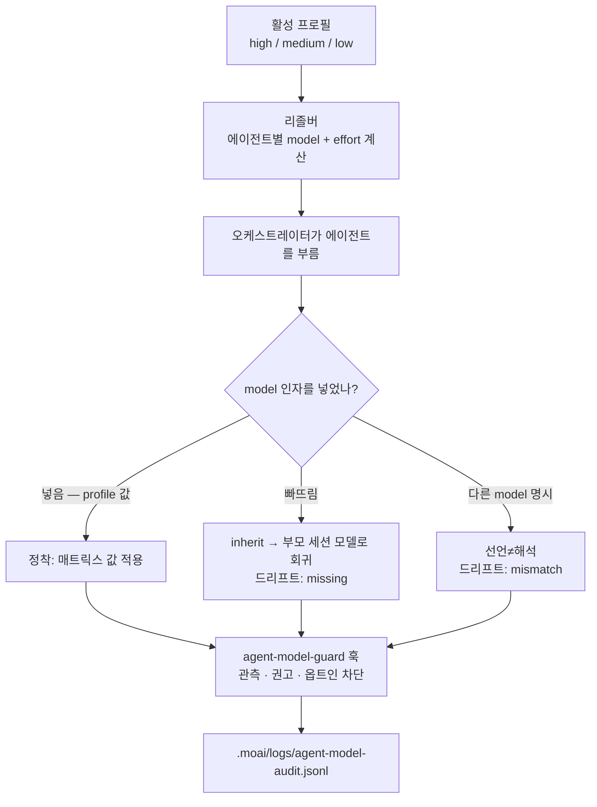

## 모델 정책이란?

모델 정책은 "모든 일에 가장 비싼 모델을" 대신 "이 일에는 이 모델을, 이만큼 깊이"로
바꾸는 배정 규칙입니다. 계획·감사처럼 생각이 무거운 일과 문서화·Git 절차처럼 가벼운
일을 갈라 놓고, 에이전트마다 알맞은 모델과 추론 깊이(effort)를 선언적으로 정해 둡니다.
그래야 Claude Code 구독 플랜 안에서 품질을 최대한 끌어올리면서도 요율 제한 에러를
피할 수 있습니다.

이 규칙은 토크노믹스(tokenomics, 토큰 경제)의 뼈대입니다. 토크노믹스는 품질 대비
비용을 따져 토큰을 나눠 쓰는 방식을 가리키며, MoAI-ADK가 그중 **비용** 축을 실제로
구현하는 수단이 바로 이 모델 정책입니다.


**한 줄로:** 정책 하나를 고르면(high/medium/low), 그 열의 값이 그날 11개 에이전트
각각의 모델과 추론 깊이를 한 번에 정합니다. 모델을 직접 고르는 부담이 열한 곳에서
한 곳(프로필 선택)으로 줄어듭니다.


## 왜 "가장 강한 모델"을 고집하면 안 될까

언뜻 보면 그냥 Opus만 쓰는 게 가장 안전해 보입니다. 하지만 두 가지가 걸립니다.

첫째, **청구액을 가르는 것은 토큰당 단가가 아니라 과제당 스텝 수**입니다. 멀티턴
에이전트는 과제가 끝날 때까지 스텝을 밟고, 스텝이 길어지면 출력 토큰이 쌓여 비용이
불어납니다. 깊은 추론 모델이 한 번에 끝내는 일을 얕은 모델이 여러 번 다시 하면,
토큰당 단가가 싸도 전체 비용은 더 커집니다. 반대로, 정말 단순한 한 번의 패스로
끝나는 일까지 매번 깊은 추론 모델로 돌리면 비용만 낭비입니다.

둘째, **같은 모델 안에서도 추론 깊이를 조절할 수 있습니다**. Opus의 `low` effort가
어떤 단계의 Sonnet보다도 점수가 높으면서 과제당 비용은 더 쌉니다. 즉 비용을 아끼려
모델 클래스를 내리는 대신, 같은 모델 안에서 추론 깊이만 낮추는 쪽이 품질과 비용
모두에서 유리한 구간이 있습니다. 모델 정책은 바로 이 구간을 찾아 배정하는 일입니다.

## 모델 팔레트와 추론 깊이

먼저 선택지를 짚고 넘어갑니다. 모델 정책은 아래 라인업 가운데 어느 모델을, 어느
추론 깊이로 쓸지를 고르는 규칙입니다.

### 모델 라인업 (2026-08)

| 모델 | 식별자 | 컨텍스트 | 성격 |
|------|--------|----------|------|
| Claude Fable 5 | `claude-fable-5` | 256K | 신규 Mythos-tier 범용 최상위. 가장 깊은 추론과 복잡한 코딩 |
| Claude Opus 5 / 4.8 | `opus` | 1M | 복잡한 아키텍처, 고난도 추론 |
| Claude Sonnet 5 | `sonnet` | 200K | 속도와 지능의 균형, 일상 코딩 |
| Claude Haiku 4.5 | `claude-haiku-4-5-20251001` | 200K | 가장 빠르고 경제적, 단순·대량 작업 |

> MoAI의 모델 정책은 이 라인업 전체를 쓰지 않습니다. **No-Haiku 정책**에 따라 Haiku는
> 에이전트 매트릭스 어디에도 등장하지 않으며, 멀티턴 에이전틱 행은 전부 Opus가
> 맡습니다. 이유는 바로 다음 절에 나옵니다.

### 추론 깊이(effort)

모델이 얼마나 깊이 생각할지를 다섯 단계로 고릅니다.

| effort | 의미 |
|--------|------|
| `low` | 가장 얕은 추론. 빠르고 쌈 |
| `medium` | 균형. 기본 프로필의 기준점 |
| `high` | 깊은 추론 |
| `xhigh` | 더 깊은 추론 (Opus 5 · 4.8 · Sonnet 5 · Opus 4.7 지원) |
| `max` | 가장 깊은 추론 |

> **`ultrathink` 키워드**: `ultrathink`를 입력하면 `effort:xhigh`와 Adaptive Thinking
> (추론 토큰 자동 할당)가 함께 켜집니다. 고정된 `budget_tokens`는 쓰지 않습니다 — 모델이
> 스스로 추론 깊이를 배분합니다. `/effort low|medium|high|xhigh|max|ultracode|auto`
> 슬래시 명령으로도 바꿀 수 있습니다.

## 3단계 프로필

정책은 세 값 가운데 하나를 고르는 것으로 시작합니다. 하나를 고르면 그 열 전체가
활성화됩니다.

| 프로필 (profile) | CLI 플래그 | 성격 |
|---------------|-----------|------|
| **high** | `--model-policy high` | 품질 우선. 감사·자문·조율 행이 `high`를 유지하고, 저작·구현 행은 `medium`에 머뭄 |
| **medium** (기본) | `--model-policy medium` | 균형. `high`와 두 행(builder-harness · e2e-tester)에서만 다름 |
| **low** | `--model-policy low` | 과제당 최저 비용. 에이전틱 행은 대부분 Opus `medium`으로 내려감 |


**이름 정리**: `llm.yaml`의 `profile` 필드, legacy `performance_tier` 별칭, CLI 플래그
`--model-policy`는 모두 `high`/`medium`/`low` 세 값을 그대로 쓰며 1:1로 대응합니다.
기본값은 `medium`입니다. 예전 최상위 티어 이름 `max`는 기존 설정이 계속 읽히도록
지금도 `high`의 **읽기 전용 별칭**으로 처리되지만, 저장할 때는 항상 `high`로
기록됩니다. 따로 마이그레이션할 일은 없습니다. `performance_tier`는 `profile`이
없을 때만 읽습니다.


> **정책을 낮춘다고 더 약한 모델 클래스로 가는 건 아닙니다.** 호흡이 긴 에이전틱
> 작업에서는 Opus의 `low` effort가 어떤 effort의 Sonnet보다도 점수가 높고, 동시에
> 과제당 비용도 쌉니다. 그래서 `low` 정책은 추론 깊이를 낮춰 Opus *안에서* 아끼고,
> 멀티스텝 완주 실패가 문제되지 않는 단발성 행에서만 Sonnet을 씁니다.

## 에이전트별 배정표

아래 36개 셀이 프로필 매트릭스(에이전트 12개 × 프로필 3개)입니다. 각 셀에는 리졸버가
부름 시점에 주입하는 `{model, effort}` 쌍이 들어 있습니다. 오케스트레이터 메인 세션은
부름받는 에이전트가 아니라서 표에서 뺐습니다.

### Manager Agents (6개)

| 에이전트 | high | medium | low |
|---------|------|--------|-----|
| manager-spec | opus / medium | opus / medium | opus / medium |
| manager-develop | opus / medium | opus / medium | opus / medium |
| manager-docs | sonnet / low | sonnet / low | sonnet / low |
| manager-git | sonnet / low | sonnet / low | sonnet / low |
| manager-design | opus / high | opus / high | opus / medium |
| manager-lead | opus / high | opus / high | opus / medium |

### Evaluator · Advisor · Builder · Specialist Agents (5개)

| 에이전트 | high | medium | low |
|---------|------|--------|-----|
| plan-auditor | opus / high | opus / high | opus / medium |
| sync-auditor | opus / high | opus / high | opus / medium |
| super-advisor | opus / high | opus / high | opus / high |
| builder-harness | opus / high | opus / medium | opus / low |
| e2e-tester | opus / medium | opus / low | sonnet / low |

### Built-in Agent (1개)

| 에이전트 | high | medium | low |
|---------|------|--------|-----|
| Explore | sonnet / low | sonnet / low | sonnet / low |

> `Explore`는 디스크에 에이전트 파일이 없어 frontmatter로 effort를 고정할 수 없습니다.
> 대신 매트릭스가 `sonnet / low`를 부름 시점 기본값으로 기록하고, 이 값은 부름
> 프롬프트에 그대로 적힙니다. Agent Teams 정적 계층(정적 role profile)은 v3.0에서
> 물러났고, 그 자리는 sub-agent 병렬 실행과 동적 워크플로우가 채웠습니다. `moai cg`의
> teammate 런타임(tmux pane)은 그대로 남아 있습니다.

> **Haiku 제거** (v3.0): 예전 Haiku 슬롯(문서화 · MX 태깅 · Git 절차)은 더 낮은 모델
> 클래스가 아니라 더 낮은 추론 깊이로 바뀌었습니다. 비용은 모델을 갈아 끼워서가
> 아니라 effort를 단계별로 나눠서 줄입니다.

## 배정 원칙

- **지출은 판단하는 행에**: 정책은 비용·점수 곡선의 도출이 아니라 확정된 운영자
  판단입니다. 감사·자문 행(`plan-auditor`, `sync-auditor`, `super-advisor`)과 조율
  행(`manager-design`, `manager-lead`)이 `high`를 유지하는 동안, 저작·구현 행
  (`manager-spec`, `manager-develop`)은 세 프로필 모두 `medium`에 머뭅니다.
- **모든 에이전틱 행은 Opus**: `manager-spec`, `manager-develop`, `plan-auditor`,
  `sync-auditor`, `manager-design`, `manager-lead`, `builder-harness`, `e2e-tester`
  등 멀티턴 작업은 전부 Opus에 남깁니다. Opus의 `low`가 어떤 effort의 Sonnet보다 점수는
  높고 과제당 비용은 싸기 때문입니다.
- **Sonnet은 단발성·입력 지배 행에만**: `manager-docs`의 문서 정리, `manager-git`의
  기계적 작업, `Explore` 탐색은 입력이 대부분인 단일 패스로 끝나 멀티스텝 완주 실패를
  걱정할 일이 없고, 그 자리에서는 Sonnet의 싼 입력 단가가 결정적입니다. 이 세 행은
  세 프로필 모두에서 `sonnet / low`로 고정입니다.
- **어떤 행도 `max`를 받지 않음**: `max`는 `high` 위의 유일한 단계로 어휘에 남지만,
  현재 그것을 쓰는 셀은 없습니다.
- **`xhigh`는 어디에도 쓰지 않음**: Opus에서는 점수가 `high`와 같은데 비용만 49% 더
  듭니다.

**`manager-lead`는 이제 매트릭스의 한 행입니다.** 예전에는 표에 아예 없어서 미매핑
에이전트용 `inherit` 센티널로 해석됐습니다 — Tier L 조율자가 세션이 우연히 타고 있던
모델을 그대로 받는 상태였습니다. 지금은 다른 유지 에이전트와 똑같이 자기 행을 갖고,
주입과 오버라이드 대상입니다.

계획을 세운 에이전트가 자기 계획을 감사하지 않도록 `plan-auditor`와 `sync-auditor`는
`manager-spec`과 따로 배정합니다. 편향을 막는 힘은 셀 값이 아니라 카탈로그 구조
자체에서 나옵니다.

## 정해진 값을 어떻게 에이전트에 전달하나

지금까지는 "이 에이전트는 이 모델을 써야 한다"는 **의도**를 정리한 것입니다. 하지만
의도가 곧 실행은 아닙니다. 매트릭스가 정해 둔 값을 실제 부름(spawn)에 반영하는 과정이
따로 있고, 그 과정이 바로 **모델 정책의 강제 지점**입니다.

### 리졸버가 값을 정한다

에이전트 하나를 부를 때마다, 그 에이전트가 쓸 `{model, effort}`를 정하는 결정기를
**리졸버** (resolver)라고 부릅니다. 리졸버는 정해진 우선순위를 따라 첫 번째로 발견한
값을 씁니다.

1. `llm.agent_overrides[에이전트 이름]`이 있으면 그 값이 우선합니다.
2. 없으면 활성 프로필의 에이전트 셀(config의 `llm.profiles`)을 씁니다.
3. config에 셀이 없으면 Go 기본 매트릭스의 에이전트 셀을 씁니다.
4. 매트릭스에 없는 에이전트(사용자가 추가한 에이전트)는 `inherit`입니다 — 모델을
   주입하지 않고 부모 세션을 그대로 따릅니다.

리졸브된 값을 확인하려면 읽기 전용 명령 `moai model profile`을 씁니다. 사람이 읽기
좋은 표는 인자 없이, 기계 판독용은 `--json`을 붙입니다.

```bash
moai model profile          # 사람이 읽는 표
moai model profile --json   # 기계 판독용 JSON
```

이 명령은 아무것도 바꾸지 않습니다 — 오케스트레이터가 에이전트를 부를 때 넣을 값을
그대로 보여줄 뿐입니다.

### model과 effort는 다른 길로 간다

여기가 핵심입니다. 리졸브된 **model**과 **effort**는 소비되는 경로가 다릅니다.

- **model** — 오케스트레이터가 에이전트를 부를 때 **부름마다 주는 런타임 인자**입니다.
  `Agent(model: <alias>)` 형태로 넣습니다. 에이전트 파일의 frontmatter는 `model: inherit`
  으로 그대로 두며, 초기화 · 갱신 · 저장 어느 단계에서도 이 값을 건드리지 않습니다.
- **effort** — 에이전트가 추론 깊이를 정하는 기준이 되는 **문서화된 의도**입니다.
  에이전트를 부르는 도구는 부름마다 effort 인자를 받지 않으므로, effort는 (a) 에이전트
  파일의 effort 기본값, (b) GLM effort 오버레이, (c) 워크플로우나 프롬프트 수준
  steering을 거쳐서만 반영됩니다.


**`model: inherit` 함정**: 거의 모든 에이전트 파일의 frontmatter가 `model: inherit`이
기본값입니다. 그래서 오케스트레이터가 에이전트를 부를 때 `model` 인자를 **빠뜨리면**,
프로필이 정해 둔 모델이 아니라 **부모 세션의 모델**로 조용히 회귀합니다. 프로필은
계산되는데 아무도 "적용되지 않았다"고 보고하지 않는 상태가 됩니다. 실제 관측에서는
model 인자가 붙은 부름이 1%에도 못 미칩니다. 이 점이 다음 절의 드리프트 이야기로
이어집니다.




### GLM 백엔드의 reasoning 상한

GLM 백엔드(`moai glm` 전환, `moai cg`의 GLM 패널)에서는 effort가 Claude의 5단 어휘를
그대로 쓰지 못합니다. GLM-5.3은 **항상 추론합니다** — reasoning을 끄는 것은 지원되지
않고, 끄기를 요청하는 호출은 실패합니다. 조절 축은 세 단계 `reasoning_effort`
(low / high / max) 하나이고, Claude effort는 그 위로 모아집니다.

| Claude effort | GLM reasoning_effort |
|--------------|---------------------|
| `low` | `low` |
| `medium` | `max` |
| `high` | `max` |
| `xhigh` | `max` |
| `max` | `max` |
| (인식 불가 값) | `max` — 전체성 조항: 절대 과소 추론하지 않음 |

즉 **상한은 `max`**입니다. `low` 위의 모든 Claude effort가 reasoning-max로 수렴하고,
인식하지 못하는 값도 reasoning-max로 빠지며, 명시적 오버라이드가 없는 GLM 세션은
기본으로 reasoning-max로 실행됩니다. reasoning-high는 여전히 유효한 wire 값이지만
어떤 Claude effort도 그리로 모아지지 않습니다. 구현 에이전트 `manager-develop`는
모아짐 결과와 무관하게 reasoning-max로 강제됩니다(z.ai의 "코딩 과제는 reasoning max"
권고). `manager-git`은 세 프로필 모두 `low` effort라 reasoning-low 자리를 차지합니다.

이 매핑은 문서가 아니라 코드가 원천입니다 — 런타임의 단일 원천은
`internal/template/glm_effort_overlay.go`입니다.

## 선언과 해석이 어긋날 때 (드리프트)

매트릭스가 정한 값(해석)과 실제 부름에 붙은 값(선언)이 다르면 **드리프트** (drift)가
생깁니다. MoAI는 이 빈틈을 기계적으로 관찰하는 PreToolUse 훅, **agent-model-guard**를
달고 있습니다. 부름이 일어날 때마다 이 훅은 선언된 model을 빼내고, 리졸버에게 "이
에이전트는 원래 어떤 모델이어야 하는가"를 물은 뒤, 네 가지 판정(verdict) 가운데
하나를 내립니다.

| 판정 | 뜻 | 처리 |
|------|------|------|
| `ok` | 선언과 해석이 같음 | 통과 |
| `missing` | 해석은 구체적 별칭인데 부름에 model 인자가 아예 없음 | 권고(비차단) — 가장 흔한 케이스 |
| `mismatch` | 부름이 선언한 model이 해석과 다름 | 권고 + (옵트인 시) 차단 |
| `unmapped` | 유지 카탈로그 밖의 에이전트(사용자 하네스 스페셜리스트) — `inherit`이라 비교할 것이 없음 | 통과 |

### 세 단계의 강도

훅은 서로 독립적으로 켜고 끌 수 있는 세 단계로 동작합니다.

- **observe** (관측) — 항상 켜져 있습니다. 부름마다 JSONL 기록 한 줄을 남기고, 결코
  차단하지 않습니다.
- **advise** (권고) — 항상 켜져 있습니다. `missing`이나 `mismatch`일 때 차단하지 않는
  권고 메시지를 띄웁니다.
- **block** (차단) — 옵트인입니다. `workflow.agent_model_guard.enabled`(기본값 `false`)를
  켰을 때만 동작하며, **`mismatch` 판정만** 거부합니다.


**`missing`은 차단하지 않습니다.** model 인자가 붙은 부름이 1%에 못 미치는 현실에서
`missing`까지 차단하면 거의 모든 부름을 거부하게 됩니다. 그래서 게이트를 켜도
`missing`은 권고로 남습니다. 차단은 오직 "분명히 다른 모델을 명시한" `mismatch`에만
적용됩니다.


### 감사 기록과 fail-open

관측 기록은 `<프로젝트 루트>/.moai/logs/agent-model-audit.jsonl`에 한 줄씩 쌓입니다.
한 줄에는 시간 · 세션 · 에이전트 · 선언된 model · 해석된 model · 판정이 들어가고,
프롬프트 본문은 절대 기록되지 않습니다. 이 로그로 에이전트별 드리프트 비율을 모을 수
있습니다.

차단은 **긍정적 증거**가 있을 때만 나갑니다(fail-open 원칙). 에이전트 식별자가 파싱
되고, 해석이 매핑되고, 선언된 model이 존재하고, 둘이 다를 때만 거부합니다. 그 외의
모든 불확실한 상태(파싱 불가, 식별자 없음, 매핑 안 됨, config 읽기 실패, 프로젝트
루트 파악 불가)는 통과시킵니다. 강제 버그가 세션을 멈춰 세우는 일이 없어야 하기
때문입니다.

> **effort는 이 훅의 범위 밖입니다.** 에이전트를 부르는 도구가 effort 인자를 아예
> 노출하지 않으므로, 부름 시점에 관찰할 수 있는 것은 `model`뿐입니다. effort가 제대로
> 닿는지는 frontmatter와 오버레이로만 다룹니다.

## v3.1에서의 강화

지금의 agent-model-guard는 "관측은 항상, 차단은 옵트인" 단계에 머물러 있습니다. 가장
흔한 `missing` 판정은 권고에만 그치기 때문에, 의도한 프로필이 조용히 무시되는 빈틈이
남아 있습니다. v3.1에서는 이 강제를 더 단단히 잡는 작업(SPEC-AGENT-MODEL-ENFORCE-001,
진행 중)이 움직이고 있습니다.

방향은 부름 시점에 model 인자를 빠뜨리는 일 자체를 줄이는 것입니다 — 오케스트레이터가
`moai model profile --json`이 알려 준 값을 부름마다 성실히 주입하도록 라우팅을
강화하고, 관측 기록이 쌓이는 만큼 드리프트 비율을 가시화합니다. 단, 이 SPEC은 아직
진행 중이므로, "v3.1에서 `missing`까지 자동으로 차단된다"로 읽지 마세요. 현 시점에서
차단은 여전히 `mismatch` 전용·옵트인입니다.

## 비용을 더 아끼는 두 lever

모델 정책이 "어떤 모델을"을 정한다면, 비용을 더 내리는 두 가지 lever가 옆에 있습니다.
둘 다 이 페이지가 다루는 **비용** 관점에서 짚고, 깊이는 각 전용 페이지로 넘깁니다.

**프롬프트 캐싱**은 접두사 매치(tools → system → messages 순서)로 이전 요청의 앞부분을
재사용해 입력 비용을 줄입니다. 읽기는 기본 입력의 약 0.1배, 쓰기는 1.25배이고, 5분간
요청이 없으면(유휴 TTL) 캐시가 만료됩니다. 그래서 게이트는 이른 곳에 묶고, 긴 세션은
쪼개는 쪽이 유리합니다. 참고로 이 **비용** 관점의 프롬프트 캐싱은 [컨텍스트/메모리의
프롬프트 캐싱](/ko/claude-code/context-memory/prompt-caching/)이 다루는 "컨텍스트
유지" 관점과 보는 각도가 다릅니다 — 같은 메커니즘이되 하나는 요금, 하나는 세션
연속성을 따집니다.

**`MOAI_AUTONOMY_TIER`**는 자율성 티어별로 비용과 속도의 트레이드오프를 정합니다.
높은 티어일수록 더 많은 일을 사람 개입 없이 진행하지만, 그만큼 토큰 소모가 커집니다.
자세한 티어 정의는 [자율성 티어](/ko/advanced/autonomy-tier/) 페이지에 있습니다.

## 설정 방법

### 프로젝트 초기화 시

```bash
moai init my-project
# 대화형 위자드에서 모델 정책 선택 포함
```

### 기존 프로젝트 재설정

```bash
moai update
# 대화형 프롬프트:
# - Reset model policy? (y/n) — 모델 정책 재설정
# - Update GLM settings? (y/n) — GLM 환경변수 설정
```

### CLI 플래그로 직접 설정

```bash
moai init my-project --model-policy high    # 품질 우선 (감사·자문·조율 행 high)
moai init my-project --model-policy medium  # 균형 (기본값)
moai init my-project --model-policy low     # 과제당 최저 비용
```

`--model-policy`는 `high`/`medium`/`low` 세 값을 받고, 결과는 `llm.yaml`에 저장됩니다.
예전 최상위 티어 이름 `max`도 입력값으로는 여전히 받아 주며, `high`로 정규화합니다.


기본 정책은 `medium`입니다(llm.yaml `profile: "medium"`, CLI `--model-policy medium`에
해당하며 값이 없으면 `medium`으로 봅니다). GLM 설정은 `settings.local.json`에 따로
두므로 Git에 커밋되지 않습니다. 에이전트 하나만 따로 덮어쓰려면 `llm.agent_overrides`에
에이전트 이름을 키로 값을 적습니다 — 모델 enum과 에이전트 카탈로그로 검증하므로, 알 수
없는 이름은 거부합니다.


## 다음 단계

- [프로필 매트릭스](/ko/advanced/profile-matrix/) — 36개 셀의 배치 근거(판단 가중 정책)와 리졸버 우선순위 상세
- [CG 모드](/ko/multi-llm/cg-mode) — Claude 리더 + GLM 워커 하이브리드로 비용 절감
- [자율성 티어](/ko/advanced/autonomy-tier/) — `MOAI_AUTONOMY_TIER` 비용·속도 트레이드오프
- [CLI 레퍼런스](/ko/getting-started/cli) — `moai init`, `moai update`, `moai model profile` 상세
