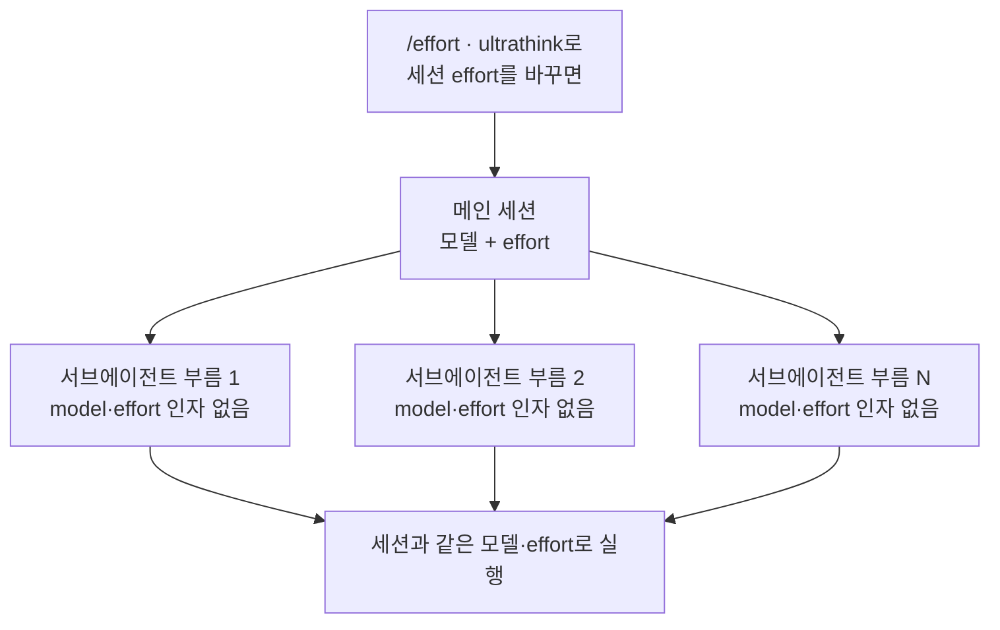

## 모델 정책이란?

모델 정책은 "모든 일에 가장 비싼 모델을" 대신 "이 세션에는 이 모델을, 이만큼 깊이"로
바꾸는 선택입니다. v3.2부터 MoAI-ADK의 모델과 추론 깊이(effort)는 **세션 단위**로
정해집니다. 메인 세션이 어떤 모델로, 어떤 추론 깊이로 돌고 있으면 서브에이전트도
그대로 같은 모델과 같은 추론 깊이로 돕니다. 에이전트마다 따로 모델을 배정하는
예전의 프로필 매트릭스 방식은 물러났습니다.

이 선택은 토크노믹스(tokenomics, 토큰 경제)의 뼈대입니다. 토크노믹스는 품질 대비
비용을 따져 토큰을 나눠 쓰는 방식을 가리키며, MoAI-ADK가 그중 **비용** 쪽을 실제로
다루는 수단이 바로 이 모델 정책입니다.


**한 줄로:** 메인 세션의 모델과 추론 깊이가 곧 모든 서브에이전트의 모델과 추론
깊이입니다. 모델을 에이전트별로 고를 필요가 없어졌으므로, 선택할 것은 세션 하나의
모델과 effort뿐입니다.


## 왜 "가장 강한 모델"을 고집하면 안 될까

언뜻 보면 그냥 Opus만 쓰는 게 가장 안전해 보입니다. 하지만 두 가지가 걸립니다.

첫째, **청구액을 가르는 것은 토큰당 단가가 아니라 과제당 스텝 수**입니다. 멀티턴
에이전트는 과제가 끝날 때까지 스텝을 밟고, 스텝이 길어지면 출력 토큰이 쌓여 비용이
불어납니다. 깊은 추론 모델이 한 번에 끝내는 일을 얕은 모델이 여러 번 다시 하면,
토큰당 단가가 싸도 전체 비용은 더 커집니다. 반대로, 정말 단순한 한 번의 패스로
끝나는 일까지 매번 깊은 추론 모델로 돌리면 비용만 낭비입니다.

둘째, **같은 모델 안에서도 추론 깊이를 조절할 수 있습니다**. Opus의 `low` effort가
어떤 단계의 Sonnet보다도 점수가 높으면서 과제당 비용은 더 쌉니다. 즉 비용을 아끼려
모델 클래스를 내리는 대신, 같은 모델 안에서 추론 깊이만 낮추는 쪽이 품질과 비용
모두에서 유리한 구간이 있습니다. 모델 정책은 바로 이 구간을 찾는 일입니다.

이 원칙의 근거와 실측 데이터는 [3-티어 에이전트 아키텍처](/ko/advanced/no-haiku-3tier/)
페이지에 정리돼 있습니다.

## 모델 팔레트와 추론 깊이

먼저 선택지를 짚고 넘어갑니다. 모델 정책은 아래 라인업 가운데 어느 모델을, 어느
추론 깊이로 세션을 실행할지를 고르는 규칙입니다.

### 모델 라인업 (2026-09)

| 모델 | 식별자 | 컨텍스트 | 성격 |
|------|--------|----------|------|
| Claude Fable 5 | `claude-fable-5` | 1M | 신규 Mythos-tier 범용 최상위. 가장 깊은 추론과 복잡한 코딩 |
| Claude Opus 5.5 | `opus` | 1M | 복잡한 아키텍처, 고난도 추론 |
| Claude Sonnet 5.5 | `sonnet` | 1M | 속도와 지능의 균형, 일상 코딩 |
| Claude Haiku 5.5 | `claude-haiku-5-5` | 1M | 가장 빠르고 경제적 (Anthropic API 기본 Haiku, CC v2.1.293+) |
| Claude Haiku 4.5 | `claude-haiku-4-5-20251001` | 200K | 가장 빠르고 경제적, 단순·대량 작업 (AWS 계열 별칭 대상) |

> **Haiku 5.5 팩트 (Claude Code v2.1.293+)**: Anthropic API에서 `haiku` 별칭은 Haiku
> 5.5(`claude-haiku-5-5`, 1M 컨텍스트 전 플랜, `[1m]` 접미사 불요)로 해석됩니다. auto-compact
> 기본 ~967K. 요금은 input $0.10 / output $0.50 per Mtok이고, 프롬프트가 over 100K(10만 토큰
> 초과)이면 input $0.50 / output $2.50으로 증액됩니다. adaptive thinking은 기본적으로 켜져 있고,
> `high` effort 이하(low/medium/high)에서는 `thinking: {"type": "disabled"}`로 끌 수 있습니다.
> 품질과 비용의 균형은 effort 파라미터로 조정하는 것이 좋습니다. 한편 AWS
> Bedrock·GCP Agent Platform·Microsoft Foundry에서는 `haiku`가 Haiku
> 4.5(200K)로 해석됩니다 — 별칭 해석은 provider별입니다.

> MoAI의 세션 라인업은 기본적으로 Haiku를 쓰지 않습니다. 긴 호흡의 에이전틱
> 작업에서 Haiku를 끼워 넣으면 과제당 비용이 오히려 커진다는 것이 DeepSWE
> 리더보드 실측으로 확인된 **No-Haiku 정책**입니다. 근거는
> [3-티어 에이전트 아키텍처](/ko/advanced/no-haiku-3tier/) 페이지에 있습니다.


**Sonnet 5.5로 넘어가기 전에**: thinking을 끈 상태로 Sonnet을 쓰고 있다면, 올라가기 전에
thinking 설정을 `between_tools`로 바꿔야 합니다 — Sonnet 5.5에서도 사전(thinking) thinking은
계속 꺼져 있습니다.


### 추론 깊이(effort)

모델이 얼마나 깊이 생각할지를 다섯 단계로 고릅니다.

| effort | 의미 |
|--------|------|
| `low` | 가장 얕은 추론. 빠르고 쌈 |
| `medium` | 균형. 세션 기본값의 기준점 |
| `high` | 깊은 추론 |
| `xhigh` | 더 깊은 추론 (Opus 5.5 · Opus 5 · 4.8 · Sonnet 5.5 · Opus 4.7 지원) |
| `max` | 가장 깊은 추론 |

> **기본 effort**: Opus 5.5의 기본 effort는 `medium`이고, effort를 지원하는 다른 모델은 대부분 `high`가 기본입니다.
> `opus` 별칭이
> Opus 5.5로 풀리려면 Claude Code v2.1.280 이상이 필요합니다.

> **`ultrathink` 키워드**: `ultrathink`를 입력하면 `effort:xhigh`와 Adaptive Thinking
> (추론 토큰 자동 할당)가 함께 켜집니다. 고정된 `budget_tokens`는 쓰지 않습니다 — 모델이
> 스스로 추론 깊이를 배분합니다. `/effort low|medium|high|xhigh|max|ultracode|auto`
> 슬래시 명령으로도 바꿀 수 있습니다. 이 조절은 **세션 단위**입니다 — 세션의 effort를
> 바꾸면 그 세션에서 돌아가는 서브에이전트도 함께 따라갑니다.

## 서브에이전트는 세션을 따른다

MoAI-ADK v3.2의 모델·effort 규칙은 한 문장으로 요약됩니다.

> 서브에이전트는 메인 세션의 모델과 추론 깊이를 그대로 따릅니다 — 서브에이전트를
> 부를 때 `model`도 `effort`도 넘기지 않으며, MoAI 에이전트 정의는 어느 쪽도
> 선언하지 않습니다.

이 규칙의 실제 모습은 세 가지입니다.

- **에이전트 정의는 model도 effort도 선언하지 않습니다.** `.claude/agents/moai/`의
  에이전트 파일 frontmatter는 어느 쪽도 적지 않습니다. 예전에 배정됐던
  `model: inherit` 필드와 effort 기본값은 물러났습니다.
- **부를 때도 넘기지 않습니다.** 오케스트레이터가 서브에이전트를 부를 때 model이나
  effort 인자를 주지 않는 것이 정상입니다. 부름에 model을 명시하는 것은 예전
  프로필 매트릭스 시절의 관행이며, 지금은 더 이상 하지 않습니다.
- **세션이 정답입니다.** 그 세션이 `opus / high`로 돌면 그 세션의 모든
  서브에이전트가 `opus / high`로 돕니다. `/effort` 슬래시 명령이나 `ultrathink`
  키워드로 세션 effort를 바꾸면 이후의 서브에이전트 부름 전부가 바뀐 깊이를
  따릅니다.


```mermaid
flowchart TD
    S["메인 세션<br/>모델 + effort"] --> W1["서브에이전트 부름 1<br/>model·effort 인자 없음"]
    S --> W2["서브에이전트 부름 2<br/>model·effort 인자 없음"]
    S --> W3["서브에이전트 부름 N<br/>model·effort 인자 없음"]
    W1 --> I["세션과 같은 모델·effort로 실행"]
    W2 --> I
    W3 --> I
    E["/effort · ultrathink로<br/>세션 effort를 바꾸면"] --> S
```

모델을 세션에서 세션으로 바꾸는 일은 Claude Code 자체의 모델 선택(`/model` 등)이
맡고, MoAI는 세션 모델을 건드리지 않습니다.

## 세션 모델 정책이 하는 일

`moai profile setup` 위자드의 **세션 모델 정책** 질문은 모델이 아니라
**effort 폴백**을 정합니다. 이 프로필로 실행하는 Claude 세션을 시작할 때 추론
강도를 따로 고르지 않았다면, 여기서 고른 값이 세션의 기본 추론 강도가 됩니다.
`high` / `medium` / `low` 세 값이 그대로 effort 어휘로 옮겨지고, 아무 값도 없으면
오버라이드 없이 Claude Code의 기본 동작을 따릅니다.


**이름 정리**: 예전에는 `llm.yaml`의 `profile` 필드, `performance_tier` 별칭,
`moai init --model-policy` 플래그가 에이전트별 배정 표의 열을 골랐습니다. 지금은
이 자리에 남은 것이 세션 effort 폴백 하나입니다. 예전 플래그들은 스크립트 호환을
위해 받아 주기만 하고 아무 효과가 없으며, 실행하면 `moai profile setup`을
가리키는 지원 종료 경고를 냅니다.


### GLM 백엔드의 reasoning 상한

GLM 백엔드(`moai glm` 전환)에서는 세션의 effort가 Claude의 5단 어휘를
그대로 쓰지 못합니다. GLM-5.3은 **항상 추론합니다** — reasoning을 끄는 것은 지원되지
않고, 끄기를 요청하는 호출은 실패합니다. 조절 축은 세 단계 `reasoning_effort`
(low / high / max) 하나이고, Claude effort는 그 위로 모아집니다.

| Claude effort | GLM reasoning_effort |
|--------------|---------------------|
| `low` | `low` |
| `medium` | `max` |
| `high` | `max` |
| `xhigh` | `max` |
| `max` | `max` |
| (인식 불가 값) | `max` — 전체성 조항: 절대 과소 추론하지 않음 |

즉 **상한은 `max`**입니다. `low` 위의 모든 Claude effort가 reasoning-max로 수렴하고,
인식하지 못하는 값도 reasoning-max로 빠지며, 명시적 오버라이드가 없는 GLM 세션은
기본으로 reasoning-max로 실행됩니다. reasoning-high는 여전히 유효한 wire 값이지만
어떤 Claude effort도 그리로 모아지지 않습니다. 구현 에이전트 `manager-develop`는
모아짐 결과와 무관하게 reasoning-max로 강제됩니다(z.ai의 "코딩 과제는 reasoning max"
권고).

이 매핑은 문서가 아니라 코드가 원천입니다 — 런타임의 단일 원천은
`internal/template/glm_effort_overlay.go`입니다.

## 예전 에이전트별 배정은 어떻게 됐나 (역사)

v3.1까지 MoAI-ADK는 **프로필 매트릭스**로 에이전트 하나하나에 `{model, effort}`를
배정했습니다. 에이전트 13개 × 프로필 3개 = 39칸짜리 표가 활성 프로필의 한 열을
골랐고, 리졸버가 그 값을 부름 시점에 주입했으며, `moai model profile` 명령으로
리졸브된 값을 들여다볼 수 있었습니다.

이 장치 전체가 SPEC-AGENT-MODEL-INHERIT-001에서 물러났습니다. 부름에 model을
명시하는 일이 거의 없다는 실측(붙은 부름이 1%에도 못 미침)과, 그럼에도 매트릭스가
"적용은 되는데 아무도 못 보는" 드리프트를 계속 만든다는 진단이 이유였습니다.
배정의 단일 원천은 세션 하나로 바뀌었고, 접근자·리졸버·드리프트 강제는 함께
정리됐습니다. 당시 매트릭스의 배치 근거(지출은 판단하는 행에, 에이전틱 행은 Opus,
No-Haiku)는 세션 단위 모델 선택에서도 여전히 유효한 판단 기준으로,
[3-티어 에이전트 아키텍처](/ko/advanced/no-haiku-3tier/)와
[프로필 매트릭스](/ko/advanced/profile-matrix/) 페이지에 남아 있습니다.

스폰 시점의 model 인자 관측 기록(`.moai/logs/agent-model-audit.jsonl`)은 남아
있습니다. 상속이 기본이 된 지금 이 기록이 하는 일은 "선언된 model이 리졸브 값과
다른지"를 지켜보는 것이고, 차단은 옵트인입니다. 평소에는 신경 쓰지 않아도 되는
관측 계층입니다.

## 비용을 더 아끼는 두 lever

모델 정책이 "세션을 어떤 모델로, 어떤 깊이로" 정한다면, 비용을 더 내리는 두 가지
lever가 옆에 있습니다. 둘 다 이 페이지가 다루는 **비용** 관점에서 짚고, 깊이는 각
전용 페이지로 넘깁니다.

**프롬프트 캐싱**은 접두사 매치(tools → system → messages 순서)로 이전 요청의 앞부분을
재사용해 입력 비용을 줄입니다. 읽기는 기본 입력의 약 0.1배, 쓰기는 1.25배이고, 5분간
요청이 없으면(유휴 TTL) 캐시가 만료됩니다. 그래서 게이트는 이른 곳에 묶고, 긴 세션은
쪼개는 쪽이 유리합니다. 참고로 이 **비용** 관점의 프롬프트 캐싱은 [컨텍스트/메모리의
프롬프트 캐싱](/ko/claude-code/context-memory/prompt-caching/)이 다루는 "컨텍스트
유지" 관점과 보는 각도가 다릅니다 — 같은 메커니즘이되 하나는 요금, 하나는 세션
연속성을 따집니다.

**`MOAI_AUTONOMY_TIER`**는 자율성 티어별로 비용과 속도의 트레이드오프를 정합니다.
높은 티어일수록 더 많은 일을 사람 개입 없이 진행하지만, 그만큼 토큰 소모가 커집니다.
자세한 티어 정의는 [자율성 티어](/ko/advanced/autonomy-tier/) 페이지에 있습니다.

## 설정 방법

### 프로필 위자드에서 정하기

```bash
moai profile setup
# 세션 모델 정책 질문에서 세션 기본 effort 폴백을 고릅니다
```

세션 모델 정책은 이 프로필로 실행하는 Claude 세션의 기본 추론 강도를 정합니다.
서브에이전트는 그 세션의 모델과 추론 강도를 그대로 따릅니다.

### CLI 플래그에 대하여

예전에 쓰던 `moai init --model-policy`, `--profile`, `--high`, `--medium-alias`,
`--low` 플래그는 **지원 종료된 스텁(stub)**입니다. 스크립트 호환을 위해 값은
받아들이지만 아무 효과가 없고, 실행하면 `moai profile setup`을 안내하는 경고를
냅니다. 새 설정은 위자드에서 하세요.


GLM 설정은 `settings.local.json`에 따로 두므로 Git에 커밋되지 않습니다. 세션의
모델과 effort를 매번 바꾸려면 Claude Code의 `/model`, `/effort`를 쓰세요.


## 다음 단계

- [프로필 매트릭스](/ko/advanced/profile-matrix/) — 예전 매트릭스가 물러난 자리와 상속 규칙 상세
- [3-티어 에이전트 아키텍처](/ko/advanced/no-haiku-3tier/) — DeepSWE 실측 근거와 No-Haiku 정책
- [CG 폐기와 설정 이전](/ko/multi-llm/cg-mode/)
- [CLI 레퍼런스](/ko/getting-started/cli) — `moai profile setup`, `moai init` 상세
