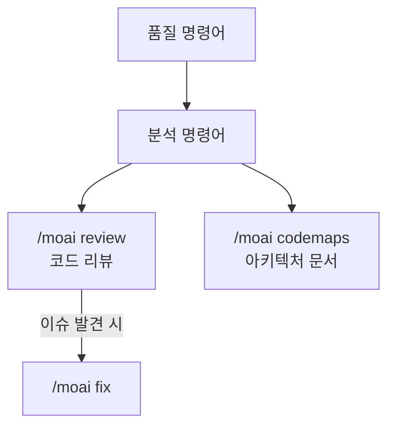

MoAI-ADK의 코드 품질 관리 명령어를 소개합니다.


품질 명령어는 코드의 **리뷰, 테스트 커버리지, E2E 테스트, 아키텍처 분석**에 특화된 명령어입니다. 코드 품질을 체계적으로 관리하고 개선할 수 있습니다.


## 명령어 비교

| 명령어 | 목적 | 실행 방식 | 사용 시점 |
|--------|------|-----------|-----------|
| `/moai review` | 코드 리뷰 | 보안/성능/품질/UX 4가지 관점 분석 | PR 전 코드 리뷰가 필요할 때 |
| `/moai codemaps` | 아키텍처 문서 | 코드베이스 구조 분석 및 문서화 | 프로젝트 아키텍처를 파악하고 싶을 때 |

## 명령어 관계도


**어떤 명령어를 써야 할지 모르겠다면?**

- 코드 품질을 전반적으로 점검하고 싶다면 → `/moai review`
- 프로젝트 구조를 이해하고 문서화하고 싶다면 → `/moai codemaps`

