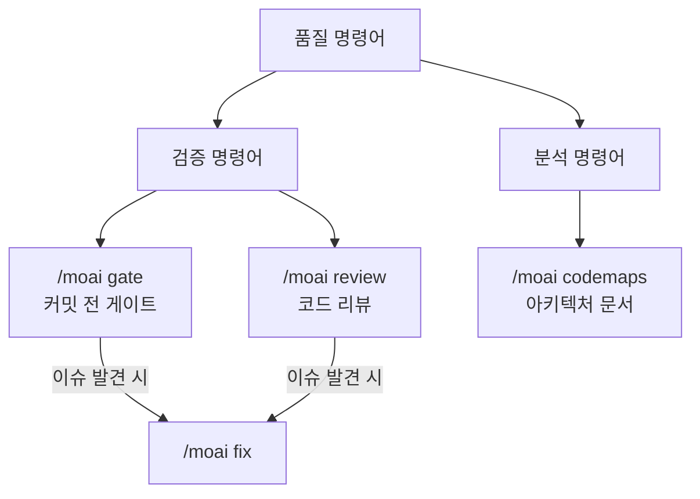

코드 품질을 검증하고 아키텍처를 문서화하는 명령어 모음입니다.


품질 명령어는 **커밋 전 게이트, 다관점 코드 리뷰, 아키텍처 분석**에 특화된 명령어입니다. TRUST 5 품질 프레임워크를 일상 작업 흐름 안에서 실행하는 표면입니다.


## 품질 게이트도 하네스의 일부

v3의 에이전틱 하네스는 "에이전트가 잘 일할 환경"을 뜻하고, 품질 게이트는 그 환경의 핵심 부품입니다. 에이전트가 만든 결과물을 "된 것 같다"가 아니라 lint·테스트·리뷰라는 **증거**로 판정하는 장치이기 때문입니다. 검증 깊이도 작업 크기에 맞춰 고릅니다 — 커밋 직전에는 30초 안에 끝나는 `/moai gate`, PR 직전에는 4가지 관점의 `/moai review`. 매번 가장 무거운 검사를 돌리지 않는 것이 토크노믹스입니다.

## 명령어 비교

| 명령어 | 목적 | 실행 방식 | 사용 시점 |
|--------|------|-----------|-----------|
| `/moai gate` | 커밋 전 품질 게이트 | lint + format + type-check + test 병렬 실행 (<30초) | 모든 commit 직전 |
| `/moai review` | 코드 리뷰 | 보안/성능/품질/UX 4가지 관점 분석 | PR 전 코드 리뷰가 필요할 때 |
| `/moai codemaps` | 아키텍처 문서 | 코드베이스 구조 분석 및 문서화 | 프로젝트 아키텍처를 파악하고 싶을 때 |

## 명령어 관계도

```mermaid
flowchart TD
    A[품질 명령어] --> B[검증 명령어]
    A --> C[분석 명령어]

    B --> G["/moai gate<br/>커밋 전 게이트"]
    B --> D["/moai review<br/>코드 리뷰"]
    C --> E["/moai codemaps<br/>아키텍처 문서"]

    G -->|이슈 발견 시| H["/moai fix"]
    D -->|이슈 발견 시| H
```


**어떤 명령어를 써야 할지 모르겠다면?**

- 커밋하기 전에 빠르게 안전망을 돌리고 싶다면 → `/moai gate`
- 코드 품질을 전반적으로 점검하고 싶다면 → `/moai review`
- 프로젝트 구조를 이해하고 문서화하고 싶다면 → `/moai codemaps`

