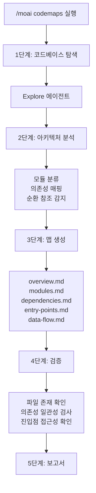
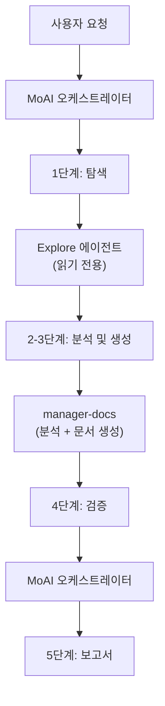

# /moai codemaps

코드베이스를 스캔하여 **아키텍처 문서**를 자동 생성하는 명령어입니다.


**한 줄 요약**: `/moai codemaps`는 "아키텍처 지도 제작자" 입니다. 코드베이스를 분석하여 모듈 맵, 의존성 그래프, 진입점 카탈로그 등 **구조 문서를 자동 생성**합니다.



**슬래시 커맨드**: Claude Code에서 `/moai:codemaps`를 입력하면 이 명령어를 바로 실행할 수 있습니다. `/moai`만 입력하면 사용 가능한 모든 서브커맨드 목록이 표시됩니다.


## 개요

새 프로젝트에 합류하거나 대규모 코드베이스를 파악할 때, 아키텍처를 이해하는 것이 가장 중요합니다. `/moai codemaps`는 코드베이스를 자동으로 분석하여 모듈 맵, 의존성 그래프, 진입점 카탈로그, 데이터 플로우 문서를 생성합니다.

생성된 문서는 `.moai/project/codemaps/` 디렉토리에 저장되며, 사람과 AI 에이전트 모두가 코드베이스를 빠르게 이해할 수 있도록 돕습니다.

## 사용법

```bash
# 전체 코드베이스 아키텍처 문서 생성
> /moai codemaps

# 기존 문서를 무시하고 재생성
> /moai codemaps --force

# 특정 영역만 분석
> /moai codemaps --area api

# Mermaid 다이어그램 포함
> /moai codemaps --format mermaid

# 탐색 깊이 제한
> /moai codemaps --depth 3
```

## 지원 플래그

| 플래그 | 설명 | 예시 |
|-------|------|------|
| `--force` (또는 `--regenerate`) | 기존 문서를 무시하고 모든 코드맵 재생성 | `/moai codemaps --force` |
| `--area AREA` | 특정 영역에 집중 분석 | `/moai codemaps --area auth` |
| `--format FORMAT` | 출력 형식 (markdown, mermaid, json, 기본값: markdown) | `/moai codemaps --format mermaid` |
| `--depth N` | 최대 디렉토리 탐색 깊이 (기본값: 4) | `/moai codemaps --depth 3` |

### --force 플래그

기존 코드맵 문서를 모두 삭제하고 처음부터 다시 생성합니다:

```bash
> /moai codemaps --force
```

코드베이스에 큰 변화가 있었을 때 유용합니다.

### --area 플래그

특정 영역과 그 의존성만 분석합니다:

```bash
# API 모듈만 분석
> /moai codemaps --area api

# 인증 모듈만 분석
> /moai codemaps --area auth
```

결과는 `.moai/project/codemaps/{area}/`에 저장됩니다.

### --format 플래그

출력 형식을 지정합니다:

```bash
# Mermaid 다이어그램 포함
> /moai codemaps --format mermaid

# JSON 형식 추가 생성
> /moai codemaps --format json
```

## 실행 과정

`/moai codemaps`는 5단계로 실행됩니다.



### 1단계: 코드베이스 탐색

`Explore` 에이전트가 코드베이스를 깊이 탐색합니다:

| 탐색 대상 | 설명 |
|-----------|------|
| 디렉토리 구조 | 최상위 및 중요 하위 디렉토리 매핑 |
| 모듈 경계 | 패키지/모듈 경계와 책임 식별 |
| 진입점 | 메인 진입점 탐색 (main.go, index.ts, app.py 등) |
| 공개 API | 내보내진 함수, 타입, 인터페이스 목록 |
| 의존성 그래프 | 모듈 간 의존성 매핑 (import, require) |
| 외부 의존성 | 서드파티 의존성 카탈로그 |
| 설정 파일 | 빌드, 배포, 설정 파일 식별 |

### 2단계: 아키텍처 분석

`manager-docs` 에이전트가 탐색 결과를 분석합니다:

- 레이어별 모듈 분류 (프레젠테이션, 비즈니스, 데이터, 인프라)
- 높은 fan-in 모듈 식별 (`@MX:ANCHOR` 후보)
- 순환 의존성 감지
- 요청/데이터 플로우 경로 매핑
- 도메인 경계 식별
- 아키텍처 패턴 인식 (MVC, Clean, Hexagonal 등)

### 3단계: 맵 생성

`.moai/project/codemaps/` 디렉토리에 5가지 문서를 생성합니다:

| 파일 | 내용 |
|------|------|
| `overview.md` | 고수준 아키텍처 요약 및 모듈 설명 |
| `modules.md` | 상세 모듈 카탈로그 (책임, 의존성) |
| `dependencies.md` | 의존성 그래프 (텍스트 및 Mermaid 다이어그램) |
| `entry-points.md` | 진입점 카탈로그 및 호출 경로 |
| `data-flow.md` | 주요 데이터 플로우 경로 |

`--area` 플래그 사용 시:
- `.moai/project/codemaps/{area}/overview.md`
- `.moai/project/codemaps/{area}/modules.md`
- `.moai/project/codemaps/{area}/dependencies.md`

### 4단계: 검증

- 참조된 모든 파일과 모듈의 실제 존재 여부 확인
- 의존성 관계의 양방향 일관성 검사
- 진입점의 접근 가능성 검증
- 기존 코드맵과의 변경사항 비교 (`--force`가 아닌 경우)

### 5단계: 보고서

```
## 코드맵 생성 보고서

### 생성된 파일
- .moai/project/codemaps/overview.md
- .moai/project/codemaps/modules.md
- .moai/project/codemaps/dependencies.md
- .moai/project/codemaps/entry-points.md
- .moai/project/codemaps/data-flow.md

### 아키텍처 하이라이트
- 패턴: Clean Architecture
- 모듈 수: 12개
- 진입점: 3개 (API 서버, CLI, 워커)

### 잠재적 이슈
- 순환 의존성: pkg/auth <-> pkg/user
- 높은 결합도: pkg/core (fan_in: 8)
- 고립된 모듈: pkg/legacy (사용처 없음)
```

## 에이전트 위임 체인



**에이전트 역할:**

| 에이전트 | 역할 | 주요 작업 |
|----------|------|----------|
| **MoAI 오케스트레이터** | 워크플로우 조율, 검증, 보고서 | 플래그 파싱, 검증, 사용자 상호작용 |
| **Explore** | 코드베이스 탐색 (읽기 전용) | 디렉토리 구조, 모듈 경계, 의존성 매핑 |
| **manager-docs** | 아키텍처 분석 및 문서 생성 | 모듈 분류, 의존성 분석, 코드맵 파일 작성 |

## 자주 묻는 질문

### Q: 코드맵은 얼마나 자주 재생성해야 하나요?

대규모 리팩토링이나 새 모듈 추가 후에 재생성하는 것이 좋습니다. `/moai sync`를 실행하면 코드맵도 자동으로 업데이트됩니다.

### Q: --area 플래그로 생성한 코드맵이 전체 코드맵과 충돌하나요?

아니요. `--area`로 생성한 코드맵은 별도의 하위 디렉토리에 저장됩니다. 전체 코드맵과 독립적으로 관리됩니다.

### Q: 생성된 코드맵을 직접 수정해도 되나요?

네, 수동으로 수정할 수 있습니다. 다만 `--force` 플래그로 재생성하면 수동 수정이 덮어쓰여집니다. `--force` 없이 실행하면 기존 문서를 참고하여 증분 업데이트합니다.

### Q: 어떤 아키텍처 패턴을 인식하나요?

MVC, Clean Architecture, Hexagonal, Layered Architecture 등 주요 패턴을 인식합니다. 인식된 패턴은 `overview.md`에 기록됩니다.

## 관련 문서

- [/moai review - 코드 리뷰](/quality-commands/moai-review)
- [/moai coverage - 커버리지 분석](/quality-commands/moai-coverage)
- [/moai mx - @MX 태그 스캔](/utility-commands/moai-mx)
