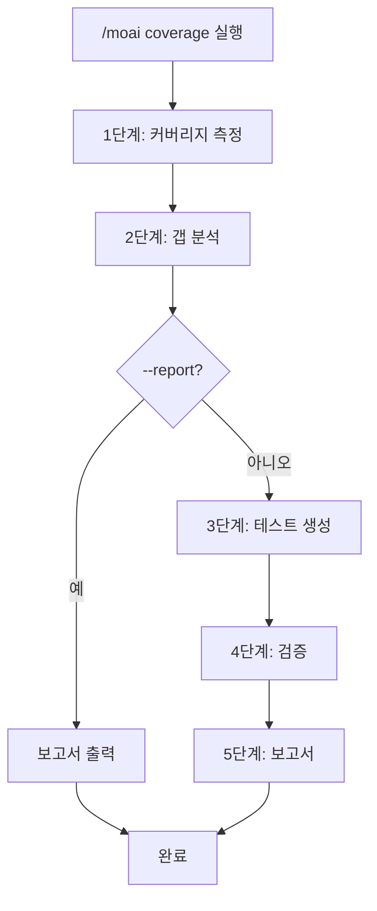
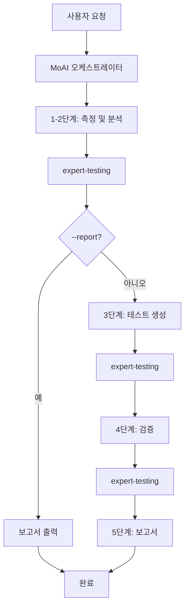

# /moai coverage

테스트 커버리지를 분석하고, 갭을 식별하며, 누락된 테스트를 자동 생성하는 명령어입니다.


**한 줄 요약**: `/moai coverage`는 "테스트 갭 헌터" 입니다. 언어별 커버리지 도구로 **정확히 측정**하고, 우선순위별로 **누락된 테스트를 자동 생성**합니다.



**슬래시 커맨드**: Claude Code에서 `/moai:coverage`를 입력하면 이 명령어를 바로 실행할 수 있습니다. `/moai`만 입력하면 사용 가능한 모든 서브커맨드 목록이 표시됩니다.


## 개요

테스트 커버리지를 높이려면 먼저 어디가 부족한지 알아야 합니다. `/moai coverage`는 언어별 전용 도구로 커버리지를 정확히 측정한 후, 위험도에 따라 갭을 우선순위로 분류하고, 누락된 테스트를 자동으로 생성합니다.

`quality.yaml`의 `development_mode` 설정에 따라 TDD 또는 DDD 방식의 테스트를 생성합니다.

## 사용법

```bash
# 전체 프로젝트 커버리지 분석 및 테스트 생성
> /moai coverage

# 커버리지 목표 85%로 분석
> /moai coverage --target 85

# 특정 파일만 분석
> /moai coverage --file src/auth/

# 보고서만 생성 (테스트 생성 안 함)
> /moai coverage --report

# 미커버된 라인만 표시
> /moai coverage --uncovered

# 크리티컬 패스에만 집중
> /moai coverage --critical
```

## 지원 플래그

| 플래그 | 설명 | 예시 |
|-------|------|------|
| `--target N` | 커버리지 목표 퍼센트 (기본값: quality.yaml의 test_coverage_target) | `/moai coverage --target 85` |
| `--file PATH` | 특정 파일 또는 디렉토리만 분석 | `/moai coverage --file src/auth/` |
| `--report` | 보고서만 생성, 테스트 생성 안 함 | `/moai coverage --report` |
| `--package PKG` | 특정 패키지 (Go) 또는 모듈만 분석 | `/moai coverage --package pkg/api` |
| `--uncovered` | 미커버된 라인/함수만 표시 | `/moai coverage --uncovered` |
| `--critical` | 크리티컬 패스 (높은 fan_in, 공개 API)에 집중 | `/moai coverage --critical` |

### --target 플래그

커버리지 목표를 지정합니다. 지정하지 않으면 `quality.yaml`의 `test_coverage_target` 값을 사용합니다 (기본값: 85%):

```bash
# 90% 커버리지 달성 목표
> /moai coverage --target 90
```

### --report 플래그

테스트를 생성하지 않고 갭 분석 보고서만 출력합니다:

```bash
> /moai coverage --report
```

현재 상태를 파악하고 싶을 때 유용합니다.

### --critical 플래그

P1 (공개 API, 높은 fan_in) 및 P2 (비즈니스 로직, 에러 핸들링)에만 집중합니다:

```bash
> /moai coverage --critical
```

## 실행 과정

`/moai coverage`는 5단계로 실행됩니다.



### 1단계: 커버리지 측정

언어별 전용 도구로 정확한 커버리지를 측정합니다:

| 언어 | 커버리지 도구 | 실행 명령어 |
|------|-------------|------------|
| **Go** | go test + cover | `go test -coverprofile=coverage.out -covermode=atomic ./...` |
| **Python** | pytest-cov 또는 coverage | `pytest --cov --cov-report=json` |
| **TypeScript/JavaScript** | vitest 또는 jest | `vitest run --coverage` |
| **Rust** | cargo-llvm-cov | `cargo llvm-cov --json` |

측정 결과:
- 전체 커버리지 퍼센트
- 파일별 커버리지 퍼센트
- 함수별 커버리지 데이터 (커버된/미커버된 라인)
- 브랜치 커버리지 (가능한 경우)

### 2단계: 갭 분석

커버리지 타겟 미달 파일을 식별하고 우선순위로 분류합니다:

| 우선순위 | 조건 | 설명 |
|----------|------|------|
| **P1 (크리티컬)** | 공개 API 함수, fan_in >= 3, @MX:ANCHOR | 최우선 테스트 필요 |
| **P2 (높음)** | 비즈니스 로직, 에러 핸들링 경로 | 비즈니스 영향 큰 코드 |
| **P3 (중간)** | 내부 유틸리티, 헬퍼 함수 | 타겟 미달 시 테스트 필요 |
| **P4 (낮음)** | 생성된 코드, 설정, 단순 getter/setter | 타겟에서 제외 가능 |

### 3단계: 테스트 생성

`quality.yaml`의 `development_mode`에 따라 다른 방식으로 테스트를 생성합니다:

| 모드 | 테스트 방식 | 설명 |
|------|-----------|------|
| **TDD** | RED-GREEN-REFACTOR | 실패하는 테스트를 먼저 작성 후 검증 |
| **DDD** | 특성화 테스트 | 기존 동작을 캡처하는 테스트 작성 |

테스트 생성 순서: P1 → P2 → P3 → P4 건너뜀

각 갭에 대해:
- 테이블 드리븐 테스트 (Go) 또는 파라미터화 테스트 (Python/TS)
- 엣지 케이스와 에러 시나리오 포함
- 코드베이스의 기존 테스트 패턴 따름
- 파일 명명 규칙 준수 (`*_test.go`, `*.test.ts`, `test_*.py`)

### 4단계: 검증

테스트 생성 후:
- 전체 테스트 스위트를 실행하여 회귀 없음을 확인
- 커버리지를 재측정하여 개선 확인
- 전/후 커버리지 퍼센트 비교
- 타겟 달성 여부 확인

### 5단계: 보고서

```
## 커버리지 보고서

### Before: 72.5% -> After: 88.3%
### 타겟: 85% - 달성 완료

### 생성된 테스트: 8개
- auth_test.go: TestAuthenticateUser (P1 갭 커버)
- auth_test.go: TestValidateToken (P1 갭 커버)
- handler_test.go: TestErrorHandling (P2 갭 커버)

### 패키지별 커버리지
| 패키지 | Before | After | 타겟 | 상태 |
|--------|--------|-------|------|------|
| pkg/api | 70% | 88% | 85% | PASS |
| pkg/core | 45% | 82% | 85% | FAIL |

### 남은 갭
- pkg/core: 3% 부족 (2개 함수 미커버)
```

## 에이전트 위임 체인



**에이전트 역할:**

| 에이전트 | 역할 | 주요 작업 |
|----------|------|----------|
| **MoAI 오케스트레이터** | 워크플로우 조율, 사용자 상호작용 | 보고서 출력, 다음 단계 안내 |
| **expert-testing** | 측정, 분석, 생성, 검증 전담 | 커버리지 측정, 갭 분석, 테스트 작성, 검증 |

## 자주 묻는 질문

### Q: 어떤 커버리지 도구를 사용하나요?

프로젝트 언어에 맞는 표준 도구를 자동으로 선택합니다. Go는 `go test -cover`, Python은 `pytest-cov`, TypeScript는 `vitest` 또는 `jest`의 커버리지 기능을 사용합니다.

### Q: 생성된 테스트의 품질은 어떤가요?

코드베이스의 기존 테스트 패턴을 분석하여 일관된 스타일로 테스트를 작성합니다. 테이블 드리븐 테스트, 엣지 케이스, 에러 시나리오를 포함합니다.

### Q: 커버리지 타겟을 달성하지 못하면?

남은 갭 목록과 함께 추가 테스트 생성 옵션을 제시합니다. P4 (낮은 우선순위) 갭은 건너뛰므로, 100% 달성이 불가능할 수 있습니다.

### Q: 특정 파일을 커버리지 측정에서 제외할 수 있나요?

`quality.yaml`의 `coverage_exemptions` 설정으로 제외할 수 있습니다. 다만, 제외 비율은 기본적으로 5%로 제한됩니다.

## 관련 문서

- [/moai review - 코드 리뷰](/quality-commands/moai-review)
- [/moai e2e - E2E 테스트](/quality-commands/moai-e2e)
- [/moai fix - 일회성 자동 수정](/utility-commands/moai-fix)
- [/moai loop - 반복 수정 루프](/utility-commands/moai-loop)
