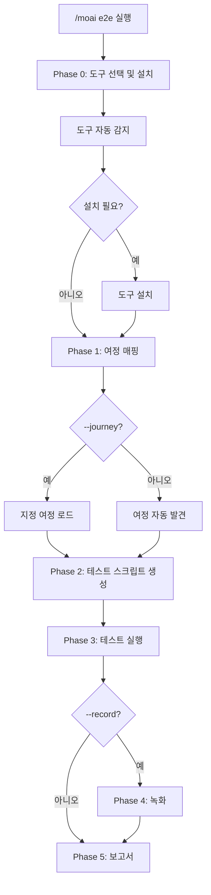
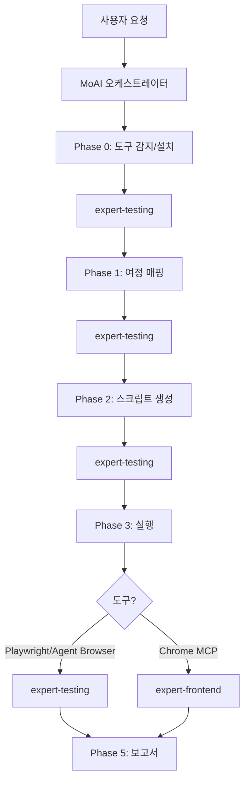

브라우저 자동화 도구를 사용하여 **E2E (End-to-End) 테스트**를 생성하고 실행하는 명령어입니다.


**한 줄 요약**: `/moai e2e`는 "사용자 여정 테스터" 입니다. **3가지 브라우저 도구** 중 최적의 도구를 선택하여 사용자 플로우를 자동으로 테스트합니다.



**슬래시 커맨드**: Claude Code에서 `/moai:e2e`를 입력하면 이 명령어를 바로 실행할 수 있습니다. `/moai`만 입력하면 사용 가능한 모든 서브커맨드 목록이 표시됩니다.


## 개요

E2E 테스트는 실제 사용자의 관점에서 애플리케이션이 올바르게 동작하는지 검증합니다. `/moai e2e`는 3가지 브라우저 자동화 도구를 지원하며, 프로젝트 환경에 맞는 도구를 자동으로 선택합니다.

사용자 여정을 자동으로 발견하고, 테스트 스크립트를 생성하며, 실행 결과를 리포트합니다. GIF 녹화 기능으로 시각적 검증도 가능합니다.

## 사용법

```bash
# 자동 도구 선택으로 E2E 테스트 실행
> /moai e2e

# Playwright 지정
> /moai e2e --tool playwright

# GIF 녹화 포함
> /moai e2e --record

# 특정 URL 대상
> /moai e2e --url http://localhost:3000

# 특정 사용자 여정만 실행
> /moai e2e --journey login

# 헤드리스 모드 비활성화 (디버깅용)
> /moai e2e --headless false
```

## 지원 플래그

| 플래그 | 설명 | 예시 |
|-------|------|------|
| `--tool TOOL` | 브라우저 도구 선택 (agent-browser, playwright, chrome-mcp) | `/moai e2e --tool playwright` |
| `--record` | 브라우저 상호작용을 GIF로 녹화 | `/moai e2e --record` |
| `--url URL` | 테스트 대상 URL (기본값: 프로젝트 설정에서 자동 감지) | `/moai e2e --url http://localhost:3000` |
| `--journey NAME` | 특정 사용자 여정만 실행 | `/moai e2e --journey login` |
| `--headless` | 헤드리스 모드 (기본값: true) | `/moai e2e --headless false` |
| `--browser BROWSER` | Playwright 브라우저 선택 (chromium, firefox, webkit) | `/moai e2e --browser firefox` |
| `--timeout N` | 테스트 타임아웃 (초, 기본값: 30) | `/moai e2e --timeout 60` |
| `--retry N` | 실패한 테스트 재시도 횟수 (기본값: 1) | `/moai e2e --retry 3` |

## 브라우저 자동화 도구

### 도구 비교

| 기능 | Agent Browser | Playwright CLI | Claude in Chrome |
|------|--------------|----------------|------------------|
| **토큰 비용** | 낮음 (CLI 출력) | 낮음 (CLI 출력) | 높음 (MCP 왕복) |
| **설치** | npm install | npx playwright install | Chrome 확장 필요 |
| **헤드리스** | 지원 | 지원 | 미지원 (Chrome 필요) |
| **크로스 브라우저** | Chromium만 | Chromium, Firefox, WebKit | Chrome만 |
| **GIF 녹화** | Playwright trace | Playwright trace | MCP GIF creator |
| **AI 내비게이션** | 내장 AI 에이전트 | 스크립트 기반 | MCP 도구 기반 |
| **적합한 용도** | AI 탐색 테스트 | 결정적 테스트 스위트 | 인터랙티브 디버깅 |
| **CI/CD** | 지원 | 지원 | 미지원 |

### 자동 선택 로직

`--tool` 플래그를 지정하지 않으면, 작업 특성에 따라 최적의 도구를 자동 선택합니다:

| 조건 | 선택되는 도구 | 이유 |
|------|-------------|------|
| `--record` 플래그 사용 | Claude in Chrome | 최고의 GIF 녹화 기능 |
| CI/CD 환경 감지 | Playwright CLI | 가장 안정적인 헤드리스 지원 |
| AI 탐색이 필요한 여정 | Agent Browser | 내장 AI 내비게이션 |
| 결정적 테스트 필요 | Playwright CLI | 가장 안정적, 크로스 브라우저 |
| 인터랙티브 디버깅 | Claude in Chrome | 실시간 시각적 피드백 |
| 기본값 | Playwright CLI | 기능과 토큰 효율의 최적 균형 |

## 실행 과정

`/moai e2e`는 5단계 (+설치 단계)로 실행됩니다.



### Phase 0: 도구 선택 및 설치

3가지 도구의 설치 상태를 병렬로 확인합니다:

```bash
# 자동 감지 명령어 (병렬 실행)
npx agent-browser --version     # Agent Browser
npx playwright --version         # Playwright
# Chrome MCP 도구 가용성 확인    # Claude in Chrome
```

설치가 필요한 경우:

| 도구 | 설치 명령어 |
|------|-----------|
| **Playwright** | `npx playwright install --with-deps chromium` |
| **Agent Browser** | `npm install -g agent-browser` |
| **Claude in Chrome** | Chrome 확장 설치 (자동 설치 불가) |

### Phase 1: 여정 매핑

`--journey` 플래그가 없으면 애플리케이션을 분석하여 주요 사용자 여정을 자동 발견합니다:

- 프로젝트 문서 (`.moai/project/product.md`) 분석
- 라우트 정의 분석 (`routes.ts`, `urls.py`, `router.go`)
- 폼 요소, 인증 플로우, CRUD 작업 식별
- 핵심 사용자 경로 매핑 (로그인, 주요 기능, 에러 처리)

### Phase 2: 테스트 스크립트 생성

선택된 도구에 맞는 테스트 파일을 생성합니다:

| 도구 | 테스트 파일 형식 | 위치 |
|------|----------------|------|
| **Playwright** | `{journey-name}.spec.ts` | `e2e/` |
| **Agent Browser** | `{journey-name}.agent.ts` | `e2e/` |
| **Claude in Chrome** | 구조화된 MCP 프롬프트 | 메모리 내 |

Playwright 테스트에는:
- Page Object Model 패턴
- 단계별 어설션
- 스크린샷 캡처
- 네트워크 응답 검증
- 접근성 검사 (`@axe-core/playwright`)

### Phase 3: 테스트 실행

| 도구 | 실행 방식 |
|------|----------|
| **Playwright** | `npx playwright test e2e/` (CLI, 토큰 효율적) |
| **Agent Browser** | `npx agent-browser --task "..."` (CLI, AI 내비게이션) |
| **Claude in Chrome** | MCP 도구 호출 (실시간, 높은 토큰 비용) |

### Phase 4: 녹화 (선택)

`--record` 플래그 사용 시:

| 도구 | 녹화 방식 | 출력 |
|------|----------|------|
| **Playwright** | `npx playwright test --trace on` | `e2e/traces/` |
| **Agent Browser** | `npx agent-browser --task "..." --trace` | `e2e/recordings/` |
| **Claude in Chrome** | `mcp__claude-in-chrome__gif_creator` | `e2e/recordings/{journey}.gif` |

### Phase 5: 보고서

```
## E2E 테스트 보고서

### 사용된 도구: Playwright CLI

### 결과 요약
| 여정 | 상태 | 소요 시간 | 스크린샷 |
|------|------|----------|----------|
| 로그인 | PASS | 2.3초 | 3장 |
| 결제 | FAIL | 5.1초 | 4장 |

### 실패 내역
- 결제 (4단계): /confirmation 리다이렉트 예상, /error로 이동
  - 스크린샷: e2e/screenshots/checkout-step4.png
  - 오류: TimeoutError: 30000ms 초과

### 녹화 (--record 사용 시)
- e2e/recordings/login_flow.gif
- e2e/recordings/checkout_process.gif

### 커버리지
- 테스트된 사용자 여정: 5/7
- 커버된 크리티컬 패스: 3/3
- 테스트된 에러 시나리오: 2/4
```

## 에이전트 위임 체인



**에이전트 역할:**

| 에이전트 | 역할 | 주요 작업 |
|----------|------|----------|
| **MoAI 오케스트레이터** | 워크플로우 조율, 사용자 상호작용 | 보고서 출력, 다음 단계 안내 |
| **expert-testing** | 도구 감지, 여정 매핑, 스크립트 생성, 실행 | 전체 E2E 테스트 파이프라인 |
| **expert-frontend** | Chrome MCP 실행 (Chrome 모드만) | 브라우저 자동화, GIF 녹화 |

## 자주 묻는 질문

### Q: 어떤 도구를 선택해야 하나요?

대부분의 경우 **Playwright CLI** 가 최선의 선택입니다. CI/CD 지원, 크로스 브라우저 테스트, 낮은 토큰 비용을 제공합니다. AI 기반 탐색이 필요하면 Agent Browser, 시각적 디버깅이 필요하면 Claude in Chrome을 사용하세요.

### Q: CI/CD 파이프라인에서 사용할 수 있나요?

Playwright CLI와 Agent Browser는 CI/CD를 지원합니다. Claude in Chrome은 실제 Chrome 브라우저가 필요하므로 CI/CD에서는 사용할 수 없습니다.

### Q: GIF 녹화의 토큰 비용은?

Playwright/Agent Browser는 CLI trace를 사용하므로 추가 토큰 비용이 없습니다. Claude in Chrome의 GIF 녹화는 MCP 왕복으로 인해 토큰 비용이 높습니다.

### Q: 기존 E2E 테스트가 있으면 어떻게 되나요?

기존 테스트를 감지하고 기존 패턴에 맞춰 새 테스트를 추가합니다. 기존 테스트를 덮어쓰지 않습니다.

## 관련 문서

- [/moai coverage - 커버리지 분석](/quality-commands/moai-coverage)
- [/moai review - 코드 리뷰](/quality-commands/moai-review)
- [/moai fix - 일회성 자동 수정](/utility-commands/moai-fix)
