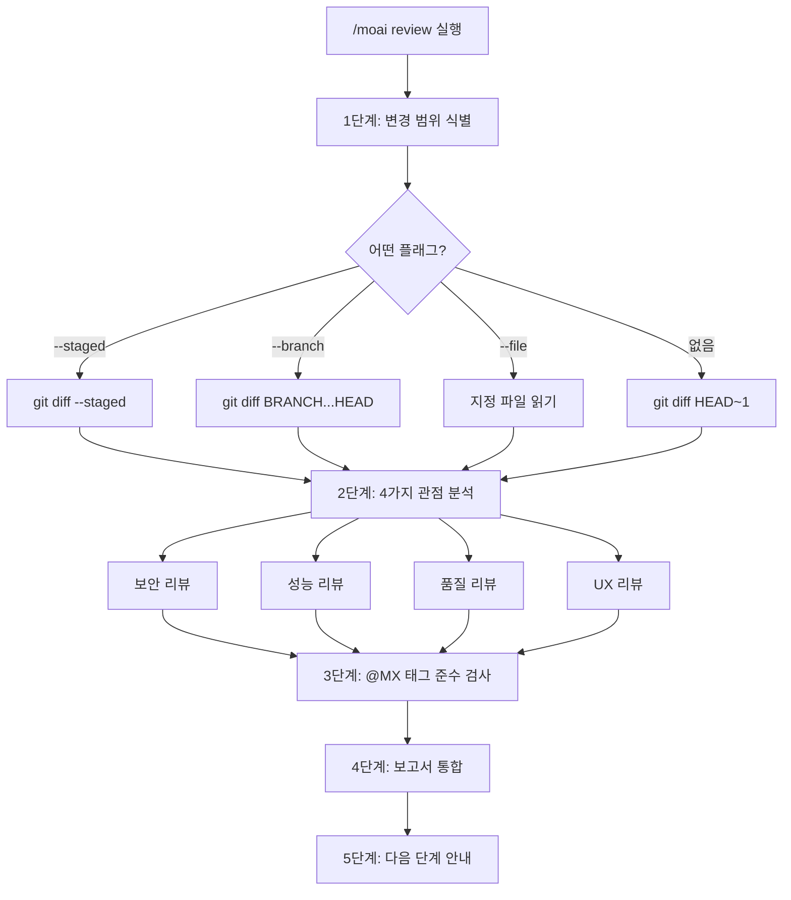
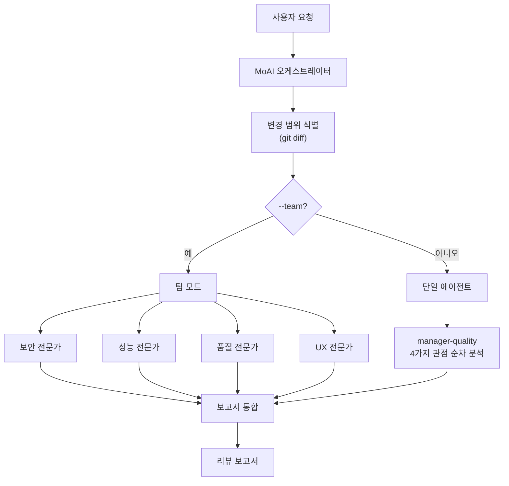

# /moai review

코드베이스를 **보안, 성능, 품질, UX** 4가지 관점에서 분석하는 코드 리뷰 명령어입니다.


**한 줄 요약**: `/moai review`는 "AI 코드 리뷰어" 입니다. OWASP 보안 점검부터 성능 분석, TRUST 5 품질 검증, UX 접근성까지 **4가지 관점에서 동시에 리뷰**합니다.



**슬래시 커맨드**: Claude Code에서 `/moai:review`를 입력하면 이 명령어를 바로 실행할 수 있습니다. `/moai`만 입력하면 사용 가능한 모든 서브커맨드 목록이 표시됩니다.


## 개요

코드 리뷰는 소프트웨어 품질의 핵심입니다. 하지만 보안, 성능, 품질, UX를 모두 꼼꼼히 확인하기는 쉽지 않습니다. `/moai review`는 AI가 4가지 관점에서 체계적으로 코드를 분석하고, 심각도별로 정리된 리뷰 보고서를 생성합니다.

@MX 태그 준수 여부도 함께 검사하여, AI 에이전트가 코드를 더 잘 이해할 수 있도록 돕습니다.

## 사용법

```bash
# 가장 최근 커밋의 변경사항 리뷰
> /moai review

# 스테이징된 변경사항만 리뷰
> /moai review --staged

# 특정 브랜치와 비교 리뷰
> /moai review --branch develop

# 보안 집중 리뷰
> /moai review --security

# 특정 파일만 리뷰
> /moai review --file src/auth/service.py
```

## 지원 플래그

| 플래그 | 설명 | 예시 |
|-------|------|------|
| `--staged` | 스테이징된 (git add) 변경사항만 리뷰 | `/moai review --staged` |
| `--branch BRANCH` | 지정 브랜치와 비교 리뷰 (기본값: main) | `/moai review --branch develop` |
| `--security` | 보안 리뷰에 집중 (OWASP, 인젝션, 인증) | `/moai review --security` |
| `--file PATH` | 특정 파일만 리뷰 | `/moai review --file src/auth/` |
| `--team` | 에이전트 팀 모드 (4명의 전문 리뷰어가 병렬 분석) | `/moai review --team` |

### --staged 플래그

`git add`로 스테이징한 변경사항만 리뷰합니다. 커밋 전 최종 점검에 유용합니다:

```bash
> git add src/auth/
> /moai review --staged
```

### --security 플래그

보안 관점에 집중하여 더 깊은 분석을 수행합니다:

```bash
> /moai review --security
```

OWASP Top 10, 인젝션 위험, 인증/인가 로직, 시크릿 노출 등을 심층 분석합니다.

### --team 플래그

4명의 전문 리뷰 에이전트가 동시에 분석합니다:

```bash
> /moai review --team
```

보안, 성능, 품질, UX 전문가가 각각 독립적으로 리뷰하므로 더 깊이 있는 분석이 가능합니다.

## 실행 과정

`/moai review`는 5단계로 실행됩니다.



### 1단계: 변경 범위 식별

플래그에 따라 리뷰 대상을 결정합니다:

| 조건 | 사용되는 명령어 |
|------|----------------|
| `--staged` | `git diff --staged` |
| `--branch BRANCH` | `git diff {BRANCH}...HEAD` |
| `--file PATH` | 지정 파일 직접 읽기 |
| 플래그 없음 | `git diff HEAD~1` |

### 2단계: 4가지 관점 분석

4가지 전문 관점에서 코드를 분석합니다:

#### 관점 1: 보안 리뷰

| 검사 항목 | 설명 |
|-----------|------|
| OWASP Top 10 준수 | 주요 웹 보안 취약점 점검 |
| 입력 검증 및 새니타이징 | 사용자 입력 처리 안전성 |
| 인증/인가 로직 | 접근 제어 구현 검증 |
| 시크릿 노출 | API 키, 비밀번호, 토큰 유출 여부 |
| 인젝션 위험 | SQL, 커맨드, XSS, CSRF 위험 |
| 의존성 취약점 | 서드파티 라이브러리 취약점 |

#### 관점 2: 성능 리뷰

| 검사 항목 | 설명 |
|-----------|------|
| 알고리즘 복잡도 | O(n) 분석 |
| 데이터베이스 쿼리 효율 | N+1 쿼리, 누락된 인덱스 |
| 메모리 사용 패턴 | 메모리 누수, 과도한 할당 |
| 캐싱 기회 | 캐시 적용 가능한 부분 식별 |
| 번들 사이즈 | 프론트엔드 변경의 번들 크기 영향 |
| 동시성 안전성 | 레이스 컨디션, 데드락 |

#### 관점 3: 품질 리뷰

| 검사 항목 | 설명 |
|-----------|------|
| TRUST 5 준수 | Tested, Readable, Unified, Secured, Trackable |
| 네이밍 규칙 | 코드 가독성 |
| 에러 핸들링 | 에러 처리 완전성 |
| 테스트 커버리지 | 변경된 코드의 테스트 존재 여부 |
| 문서화 | 공개 API의 문서 유무 |
| 프로젝트 패턴 일관성 | 기존 코드베이스 패턴 준수 |

#### 관점 4: UX 리뷰

| 검사 항목 | 설명 |
|-----------|------|
| 사용자 플로우 | 기존 플로우 깨짐 여부 |
| 에러 상태 | 사용자 관점의 에러 및 엣지 케이스 |
| 접근성 | WCAG, ARIA 준수 |
| 로딩 상태 | 로딩 표시 및 피드백 |
| 브레이킹 체인지 | 공개 인터페이스 호환성 |

### 3단계: @MX 태그 준수 검사

변경된 파일의 @MX 태그 준수 여부를 검사합니다:

- 새로운 exported 함수: `@MX:NOTE` 또는 `@MX:ANCHOR` 필요
- 높은 fan_in 함수 (>=3 호출): `@MX:ANCHOR` 필수
- 위험한 패턴: `@MX:WARN` 필요
- 테스트 없는 공개 함수: `@MX:TODO` 필요

### 4단계: 보고서 통합

심각도별로 정리된 통합 보고서를 생성합니다:

```
## 코드 리뷰 보고서

### 치명적 이슈 (반드시 수정)
- [SECURITY] src/auth/service.py:45: SQL 인젝션 가능성
- [PERFORMANCE] src/api/handler.py:23: N+1 쿼리 패턴

### 경고 (수정 권장)
- [QUALITY] src/utils/helper.py:12: 에러 핸들링 누락
- [UX] src/components/Form.tsx:88: 접근성 속성 누락

### 제안 (개선 가능)
- [QUALITY] src/models/user.py:34: 메서드 분리 권장

### @MX 태그 준수
- 누락된 태그: 3개
- 오래된 태그: 1개
- 준수 파일: 8/12

### 종합 평가
- 보안: PASS
- 성능: WARN
- 품질: PASS
- UX: WARN
- TRUST 5 점수: 4/5
```

### 5단계: 다음 단계 안내

리뷰 결과에 따라 다음 단계를 안내합니다:

- **자동 수정**: `/moai fix`로 Level 1-2 이슈 자동 해결
- **수정 작업 생성**: 각 발견 사항을 개별 작업으로 등록
- **보고서 내보내기**: `.moai/reports/`에 리뷰 보고서 저장
- **닫기**: 리뷰 확인 후 별도 조치 없이 종료

## 에이전트 위임 체인



**에이전트 역할:**

| 에이전트 | 역할 | 주요 작업 |
|----------|------|----------|
| **MoAI 오케스트레이터** | 변경 식별 및 결과 통합 | git diff, 보고서 생성 |
| **manager-quality** | 코드 품질 분석 (기본 모드) | 4가지 관점 순차 분석 |
| **expert-security** | 보안 집중 분석 (`--security`) | OWASP, 인젝션, 인증 |

## 자주 묻는 질문

### Q: --team 모드와 기본 모드의 차이점은?

기본 모드는 `manager-quality` 에이전트가 4가지 관점을 순차적으로 분석합니다. `--team` 모드는 4명의 전문 리뷰어가 동시에 분석하므로 더 깊이 있지만, 토큰 소비가 약 4배 많습니다.

### Q: PR 전 리뷰에 가장 적합한 플래그 조합은?

`/moai review --staged`로 스테이징된 변경사항만 리뷰하는 것이 가장 효율적입니다. 보안이 중요한 경우 `/moai review --staged --security`를 사용하세요.

### Q: @MX 태그 검사를 건너뛸 수 있나요?

현재는 @MX 태그 검사가 항상 포함됩니다. 검사 결과는 보고서에 별도 섹션으로 표시되며, 태그 추가는 자동으로 이루어지지 않습니다.

### Q: 리뷰에서 발견된 이슈를 자동으로 수정할 수 있나요?

네, 리뷰 완료 후 다음 단계에서 `/moai fix`를 실행하면 Level 1-2 이슈를 자동으로 수정할 수 있습니다. Level 3-4 이슈는 수동 확인이 필요합니다.

## 관련 문서

- [/moai fix - 일회성 자동 수정](/utility-commands/moai-fix)
- [/moai coverage - 커버리지 분석](/quality-commands/moai-coverage)
- [/moai e2e - E2E 테스트](/quality-commands/moai-e2e)
- [/moai codemaps - 아키텍처 문서](/quality-commands/moai-codemaps)
