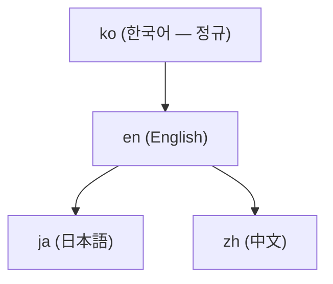

# 4-로케일 문서와 번역

이 문서 사이트(adk.mo.ai.kr)는 **네 가지 언어** 로 같은 내용을 제공합니다 — 한국어(ko), 영어(en), 일본어(ja), 중국어(zh). 모든 페이지가 네 언어에 같은 무게로 존재하는 것이 규칙입니다. 이 페이지는 그 구조를 설명하고, 번역 문제를 어떻게 신고하는지를 안내합니다.

## 네 로케일의 위치

각 로케일은 문서 루트 아래 자기 디렉터리를 가집니다.

| 로케일 | 언어 | 경로 |
|--------|------|------|
| **ko** | 한국어 | `/ko/...` (사이트 기본 언어) |
| **en** | English | `/en/...` |
| **ja** | 日本語 | `/ja/...` |
| **zh** | 中文 | `/zh/...` |

`ko` 가 사이트의 기본 언어입니다(Hugo 설정 `defaultContentLanguage = "ko"`). 사이트 상단의 언어 선택기로 네 로케일 사이를 오갈 수 있습니다.

## 정규 연쇄 — 어디서 번역이 시작하는가

문서의 원본(정규 로케일)은 **한국어(ko)** 입니다. 번역은 정해진 순서를 따릅니다.

- **ko** 가 정규 원천입니다. 새 페이지는 ko 에서 먼저 쓰입니다.
- **en** 은 ko 에서 파생됩니다.
- **ja** 와 **zh** 는 en 을 거쳐 파생됩니다.

한국어 페이지를 고치면, 같은 변경이 en·ja·zh 의 대응 페이지에도 같이 반영되어야 합니다.


**정규 로케일에서만 고치세요.** 번역 로케일(en·ja·zh) 에서 원문을 "고치는" 것은 금지입니다. 번역이 이상하면, 대부분의 경우 원문(ko) 이 번역을 잘못 몰고 간 것입니다. 번역 페이지를 직접 고치지 말고 원문 페이지의 수정을 제안하세요.


## 4-로케일 동시 갱신 의무

모든 문서 변경은 **하나의 PR 에서 네 로케일 모두**에 반영되어야 합니다. 한국어 페이지만 고치고 나머지 세 로케일을 뒤로 미루면 로케일 간 불일치가 생깁니다. 새 페이지를 만들 때도 마찬가지입니다 — 네 로케일의 페이지가 한 묶음으로 올라갑니다.

## 무엇이 보존되고 무엇이 번역되는가

번역이 **바꾸지 않는 것** (로케일을 가로지르는 공통 규칙):

- **Mermaid 다이어그램 방향** — `flowchart TD` / `graph TB` 만 허용됩니다. `LR`/`RL` 방향은 금지이고, 번역이 방향을 바꾸지 않습니다.
- **코드 블록** — 명령어·코드·플래그는 그대로 둡니다. 주석 안의 자연어만 번역합니다.
- **URL 화이트리스트** — `adk.mo.ai.kr` 과 `github.com/modu-ai` 만 허용됩니다. 그 외 변형 도메인(`docs` + `moai-ai` + `dev` 계열, `adk` + `moai` + `com` 계열, 점 위치가 다른 `adk` + `moai` + `kr` 계열) 은 어느 로케일에서도 쓰지 않습니다. 유효한 도메인은 정확히 `adk.mo.ai.kr` 입니다 — 점 하나라도 다르면 안 됩니다.
- **장식 이모지 금지** — 본문의 장식용 이모지 대신 `` shortcode 를 씁니다. 타이포그래피 기호(`→ ← ↓ ✓ ✗`)는 이모지가 아니므로 그대로 둡니다.
- **버전** — `hugo.toml` 의 `params.version` / `params.releaseDate` 가 단일 원천입니다. 페이지에 버전을 직접 적지 말고 `` shortcode 를 씁니다.

번역이 **바꾸는 것**:

- 본문 산문 — 각 로케일의 자연어로.
- UI 라벨과 메뉴 — 사이트 메뉴(`data/menu/main.yaml`)의 이름 맵은 로케일마다 번역됩니다.
- 문서 제목 — frontmatter 의 `title` 은 각 언어로 번역됩니다.

## 번역 품질 — 번역투를 피하기

영어가 원천 언어이고 다른 언어는 파생되므로, 번역이 영어의 문장 구조를 그대로 옮기는 "번역투"(calque) 에 빠지기 쉽습니다. 각 언어의 자연스러운 표현을 씁니다.

- 한국어에서 "세 축" / "일곱 기둥" 같은 구조적 비유는 피합니다. "세 가지 핵심" / "일곱 가지 강점" 이 자연스럽습니다.
- 영어의 비유적 표현을 낱말 단위로 옮기지 말고, 각 언어에서 같은 뜻을 전하는 보편적 표현을 찾습니다.
- 대화체 산문과 문어체 산문을 구분합니다 — 안내서의 산문은 깔끔한 문어체로 씁니다.

## 번역 문제를 어떻게 신고하는가

번역 오류나 로케일 간 불일치를 발견하면, GitHub 이슈로 알려주세요.

1. **어느 페이지인지** — URL(예: `https://adk.mo.ai.kr/ko/core-concepts/trust-5/`) 을 적어주세요.
2. **어느 로케일인지** — 네 로케일 가운데 어디인지(ko/en/ja/zh) 명시해주세요.
3. **문제가 무엇인지** — 번역 오류, 빠진 문단, 로케일 간 불일치, 용어 불일치 등을 알려주세요.
4. **제안이 있다면** — 자연스러운 대체 표현을 같이 적어주시면 반영에 도움이 됩니다.

이슈는 [github.com/modu-ai/moai-adk/issues](https://github.com/modu-ai/moai-adk/issues) 에서 엽니다. Claude Code 세션 안에서는 `/moai feedback` 명령으로도 이슈를 열 수 있습니다.


**원문이 의심스러울 때.** 번역이 이상하다고 해서 번역 페이지를 먼저 의심하지 마세요. 한국어 원문(ko) 의 표현이 번역을 잘못 이끈 경우가 많습니다. 이런 경우 원문 수정과 번역 수정이 한 묶음으로 처리됩니다.


## README 도 같은 구조입니다

이 문서 사이트뿐 아니라, GitHub 저장소의 README 도 네 언어로 제공됩니다. 단, README 는 사이트와 반대로 **영어(en) 가 정규** 이고 한국어·일본어·중국어 가 파생됩니다. 문서 사이트(ko 정규) 와 README(en 정규) 의 정규 로케일이 다른 점을 주의하세요.

- **문서 사이트** (이 사이트) — ko 정규, en·ja·zh 파생.
- **README** (GitHub 저장소) — `README.md`(en) 정규, `README.ko.md` / `README.ja.md` / `README.zh.md` 파생.

두 표면 모두 네 로케일이 하나의 변경 묶음으로 갱신되는 규칙은 같습니다.

## 관련 문서

- [시작하기](/ko/getting-started/) — 설치와 빠른 시작
- [MoAI-ADK 란?](/ko/core-concepts/what-is-moai-adk/) — 프로젝트 개요
- [GitHub 저장소](https://github.com/modu-ai/moai-adk) — 이슈와 기여
