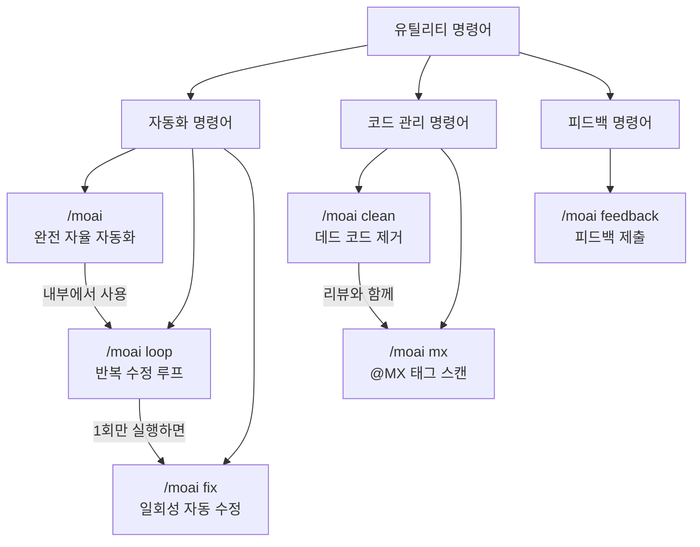

# 유틸리티 명령어

MoAI-ADK의 자동화 및 피드백 명령어를 소개합니다.


유틸리티 명령어는 워크플로우 명령어 (`/moai plan`, `/moai run`, `/moai sync`) 와 달리, **빠른 자동화와 문제 해결**에 특화된 명령어입니다.


## 명령어 비교

| 명령어 | 목적 | 실행 방식 | 사용 시점 |
|--------|------|-----------|-----------|
| `/moai` | 완전 자율 자동화 | SPEC 생성부터 문서화까지 전 과정 | 새 기능을 처음부터 끝까지 맡기고 싶을 때 |
| `/moai loop` | 반복 수정 루프 | 진단 → 수정 → 검증을 반복 | 여러 오류를 한꺼번에 잡고 싶을 때 |
| `/moai fix` | 일회성 자동 수정 | 진단 → 수정 → 완료 (1회) | 빠르게 린트 오류나 타입 오류를 고치고 싶을 때 |
| `/moai clean` | 데드 코드 제거 | 정적 분석 → 사용 그래프 → 안전 제거 | 미사용 코드를 정리하고 싶을 때 |
| `/moai mx` | @MX 태그 스캔 | 3단계 스캔 → 자동 태그 삽입 | 코드에 AI 컨텍스트 어노테이션을 추가하고 싶을 때 |
| `/moai feedback` | 피드백 제출 | GitHub 이슈 자동 생성 | MoAI-ADK에 버그 리포트나 개선 제안을 보낼 때 |

## 명령어 관계도


**어떤 명령어를 써야 할지 모르겠다면?**

- 기능 하나를 통째로 만들고 싶다면 → `/moai`
- 코드에 오류가 많아서 반복적으로 고치고 싶다면 → `/moai loop`
- 간단한 린트 오류만 빠르게 고치고 싶다면 → `/moai fix`
- 사용하지 않는 코드를 정리하고 싶다면 → `/moai clean`
- AI가 코드를 더 잘 이해하게 태그를 달고 싶다면 → `/moai mx`
- MoAI-ADK 자체에 문제가 있다면 → `/moai feedback`

