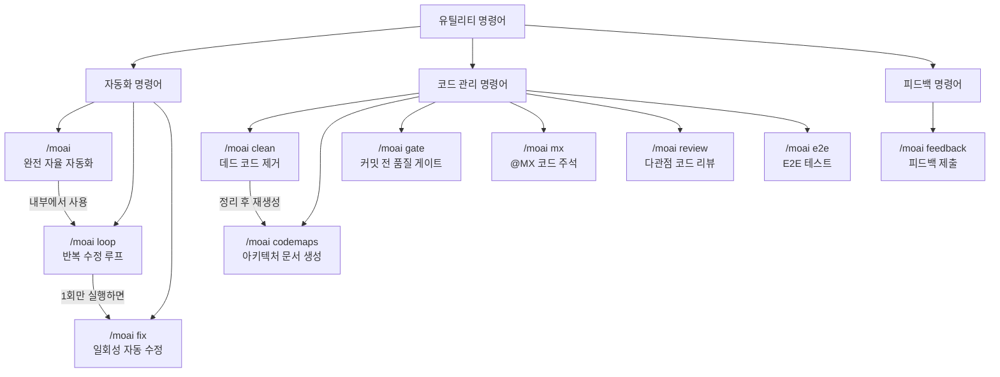

 <strong>소속 가치</strong>: 🧠 재귀적 자가 학습 · 🛡️ 에이전틱 하네스

<!-- @value: self-learning, agentic-harness -->

자율 자동화와 반복 수정 루프, 코드 관리, 피드백 명령어 모음입니다.


유틸리티 명령어는 워크플로우 명령어 (`/moai plan`, `/moai run`, `/moai sync`) 와 달리, **빠른 자동화와 문제 해결**에 특화된 명령어입니다.


## 에이전틱 루프 엔지니어링의 실행 표면

v3의 두 번째 기둥인 **에이전틱 루프 엔지니어링**이 실제로 도는 곳이 이 섹션입니다. `/moai loop`는 진단 도구가 찾은 이슈 큐를 비울 때까지 반복하는 진단형 루프이고, `/moai goal`은 완료 조건을 선언하면 조건이 충족될 때까지 세션이 스스로 일하는 조건 선언형 루프입니다. `/moai fix`는 같은 계열의 단발 (1회) 프리셋입니다. 루프가 돌며 남긴 관찰은 하네스 학습의 원료가 됩니다 — 루프가 관찰을 축적하고, 하네스가 학습하여 지침이 진화하는 재귀 고리의 입구입니다.

## 명령어 비교

| 명령어 | 목적 | 실행 방식 | 사용 시점 |
|--------|------|-----------|-----------|
| `/moai` | 완전 자율 자동화 | SPEC 생성부터 문서화까지 전 과정 | 새 기능을 처음부터 끝까지 맡기고 싶을 때 |
| `/moai goal` | 조건 선언형 자율 루프 | 완료 조건 충족까지 턴을 이어감 | "테스트 전부 통과할 때까지"처럼 끝 상태를 선언하고 싶을 때 |
| `/moai loop` | 반복 수정 루프 | 진단 → 수정 → 검증을 반복 | 여러 오류를 한꺼번에 잡고 싶을 때 |
| `/moai fix` | 일회성 자동 수정 | 진단 → 수정 → 완료 (1회) | 빠르게 린트 오류나 타입 오류를 고치고 싶을 때 |
| `/moai gate` | 커밋 전 품질 게이트 | 린트·포맷·타입·테스트 병렬 검사 (<30초) | 커밋하기 전에 빠르게 통과/실패를 확인하고 싶을 때 |
| `/moai mx` | @MX 코드 주석 | 코드베이스 스캔 → @MX 태그 삽입 | AI 맥락용 코드 앵커·위험 표시를 심고 싶을 때 |
| `/moai clean` | 데드 코드 제거 | 정적 분석 → 사용 그래프 → 안전 제거 | 미사용 코드를 정리하고 싶을 때 |
| `/moai codemaps` | 아키텍처 문서 생성 | 코드베이스 스캔 → 구조 문서 자동 생성 | 프로젝트 아키텍처 문서를 만들고 싶을 때 |
| `/moai review` | 다관점 코드 리뷰 | 보안·성능·품질·UX 판정 + @MX 준수 검사 | PR/변경분을 다관점으로 검토하고 싶을 때 |
| `/moai e2e` | E2E 테스트 | web/mobile/desktop 자동 감지 + CLI-first 실행 | 사용자 여정 E2E 테스트를 만들고 실행하고 싶을 때 |
| `/moai feedback` | 피드백 제출 | GitHub 이슈 자동 생성 | MoAI-ADK에 버그 리포트나 개선 제안을 보낼 때 |

## 명령어 관계도

```mermaid
flowchart TD
    A[유틸리티 명령어] --> B[자동화 명령어]
    A --> C[코드 관리 명령어]
    A --> D[피드백 명령어]

    B --> E["/moai<br/>완전 자율 자동화"]
    B --> F["/moai loop<br/>반복 수정 루프"]
    B --> G["/moai fix<br/>일회성 자동 수정"]
    C --> H["/moai clean<br/>데드 코드 제거"]
    C --> I["/moai codemaps<br/>아키텍처 문서 생성"]
    C --> K["/moai gate<br/>커밋 전 품질 게이트"]
    C --> L["/moai mx<br/>@MX 코드 주석"]
    C --> M["/moai review<br/>다관점 코드 리뷰"]
    C --> N["/moai e2e<br/>E2E 테스트"]
    D --> J["/moai feedback<br/>피드백 제출"]

    E -->|내부에서 사용| F
    F -->|1회만 실행하면| G
    H -->|정리 후 재생성| I
```


SPEC 3-Phase 라이프사이클 명령어 (`/moai plan`, `run`, `sync`, `project`, `design`, `harness`)는 [워크플로우 명령어](/workflow-commands/) 섹션을 참조하세요. `/moai` 오케스트레이터가 라우팅하는 전체 15개 서브커맨드 목록도 그 섹션에 있습니다.



**어떤 명령어를 써야 할지 모르겠다면?**

- 기능 하나를 통째로 만들고 싶다면 → `/moai`
- "이 조건이 만족될 때까지 알아서 해줘"라면 → `/moai goal`
- 코드에 오류가 많아서 반복적으로 고치고 싶다면 → `/moai loop`
- 간단한 린트 오류만 빠르게 고치고 싶다면 → `/moai fix`
- 커밋 전에 통과/실패만 빠르게 확인하고 싶다면 → `/moai gate`
- AI 맥락용 코드 주석 (@MX) 을 심고 싶다면 → `/moai mx`
- 사용하지 않는 코드를 정리하고 싶다면 → `/moai clean`
- 프로젝트 아키텍처 문서를 만들고 싶다면 → `/moai codemaps`
- MoAI-ADK 자체에 문제가 있다면 → `/moai feedback`

