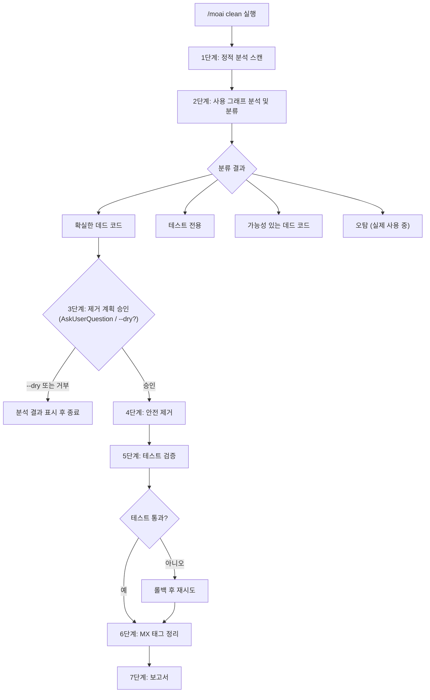
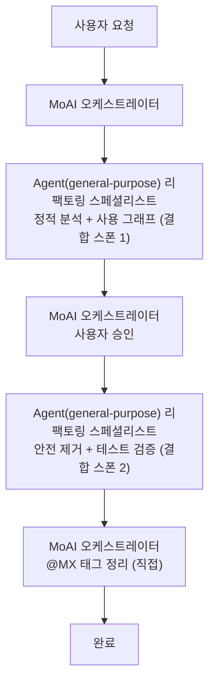

데드 코드를 찾아 안전하게 지우는 명령어입니다. 정적 분석과 사용 그래프 분석으로 **쓰이지 않는 코드를 골라내 안전하게 제거**합니다.


**한 줄 요약**: `/moai clean`은 "코드 다이어트 도구"입니다. 사용하지 않는 함수, 변수, import, 파일을 **자동으로 찾아서 안전하게 삭제**합니다.



**슬래시 커맨드**: Claude Code에서 `/moai:clean`을 입력하면 이 명령어를 바로 실행할 수 있습니다. `/moai`만 입력하면 사용 가능한 모든 서브커맨드 목록이 표시됩니다.


## 개요

프로젝트가 커지면 더 이상 쓰지 않는 코드가 쌓입니다. 참조가 끊긴 import, 아무도 부르지 않는 함수, 어디에도 쓰이지 않는 타입이 코드베이스를 어지럽힙니다. `/moai clean`은 이런 데드 코드를 정적 분석으로 찾아내고, 테스트로 확인한 뒤 안전하게 지웁니다.

하네스 엔지니어링 관점에서 이 명령어는 **가비지 컬렉션** 역할을 합니다. 죽은 코드는 사람에게만 짐이 아니라 에이전트에게도 짐입니다. 에이전트가 읽는 코드 한 줄 한 줄이 곧 컨텍스트 (토큰) 이기 때문에, 데드 코드를 지우는 일은 코드 위생이면서 동시에 컨텍스트를 줄이고 비용을 아끼는 일이기도 합니다.

## 사용법

```bash
# 기본 사용법
> /moai clean

# 미리보기 (수정 없이 확인만)
> /moai clean --dry

# 안전한 항목만 제거
> /moai clean --safe-only

# 특정 파일/디렉토리만 분석
> /moai clean --file src/auth/

# 특정 코드 유형만 분석
> /moai clean --type functions
```

## 지원 플래그

| 플래그 | 설명 | 예시 |
|-------|------|------|
| `--dry` (또는 `--dry-run`) | 제거 없이 분석 결과만 표시 | `/moai clean --dry` |
| `--safe-only` | 확실한 데드 코드만 제거 (불확실한 항목 건너뜀) | `/moai clean --safe-only` |
| `--file PATH` | 특정 파일 또는 디렉토리만 분석 | `/moai clean --file src/utils/` |
| `--type TYPE` | 특정 코드 유형만 분석 | `/moai clean --type imports` |
| `--aggressive` | 낮은 사용 코드도 포함 (1개 호출자가 데드 코드인 경우) | `/moai clean --aggressive` |

### --type 플래그 옵션

| 유형 | 설명 |
|------|------|
| `functions` | 호출되지 않는 함수/메서드 |
| `imports` | 참조되지 않는 import 문 |
| `types` | 사용되지 않는 타입 정의 |
| `variables` | 선언 후 사용되지 않는 변수 |
| `files` | 어디서도 import 되지 않는 파일 |

### --dry 플래그

실제 코드를 수정하지 않고 어떤 항목이 데드 코드로 분류되는지 미리 확인합니다:

```bash
> /moai clean --dry
```

이 옵션은 제거 전에 분석 결과를 검토하고 싶을 때 유용합니다.

## 실행 과정

`/moai clean`은 7단계로 실행됩니다.



3단계 **제거 계획 승인**은 오케스트레이터가 `AskUserQuestion`으로 지울 목록을 보여 주고 승인을 받는 휴먼 게이트입니다. 6단계 **MX 태그 정리**에서는 지운 코드에 붙어 있던 `@MX` 주석까지 같이 걷어내, 갈 곳 잃은 주석이 남지 않게 합니다.

### 1단계: 정적 분석 스캔

프로젝트 언어를 project marker로 자동 감지하고, 각 언어의 표준 데드 코드 분석 도구로 후보를 탐지합니다. **16개 지원 언어를 동등하게 취급**하며 (go, python, typescript, javascript, rust, java, kotlin, csharp, ruby, php, elixir, cpp, scala, r, flutter, swift), 설치되지 않은 도구는 알아서 건너뜁니다. 인식된 언어 마커가 없는 프로젝트는 조용히 통과됩니다. 아래는 대표 예시일 뿐 특정 언어를 우대하지 않습니다:

| 언어 (예시) | 분석 도구 (예시) | 검사 대상 |
|------|-----------|-----------|
| Go | `go vet`, `staticcheck`, `deadcode` | 미사용 변수, 함수, 타입 |
| Python | `vulture`, `autoflake` | 데드 코드, 미사용 import |
| TypeScript/JavaScript | `ts-prune`, ESLint `no-unused-vars` | 미사용 export, 변수 |
| Rust | `cargo clippy`, `cargo udeps` | 데드 코드 경고, 미사용 의존성 |

나머지 12개 언어(java, kotlin, csharp, ruby, php, elixir, cpp, scala, r, flutter, swift 등)도 각자의 표준 툴체인으로 동일하게 스캔됩니다.

**스캔 카테고리:**

- 미사용 import: 참조가 없는 import 문
- 미사용 변수: 선언되었지만 읽히지 않는 변수
- 미사용 함수: 정의되었지만 호출되지 않는 함수
- 미사용 타입: 사용처가 없는 타입 정의
- 미사용 파일: 어디서도 import 하지 않는 파일
- 데드 의존성: 설치되었지만 import 되지 않는 패키지

### 2단계: 사용 그래프 분석

정적 분석 결과를 검증하기 위해 사용 그래프를 구축합니다:

- 각 후보에 대해 코드베이스 전체에서 참조를 검색
- 간접 사용 확인 (인터페이스, 리플렉션, 동적 디스패치)
- 테스트 전용 사용 확인 (테스트에서만 사용, 프로덕션 코드에서 미사용)
- 조건부 컴파일 확인 (빌드 태그, 환경 기반 import)

### 3단계: 분류

| 분류 | 설명 | 제거 안전도 |
|------|------|------------|
| **확실한 데드 코드** | 코드베이스 어디에서도 참조 없음 | 안전 |
| **테스트 전용** | 테스트 파일에서만 사용됨 | 대체로 안전 |
| **가능성 있는 데드 코드** | 낮은 신뢰도 (동적 사용 가능성) | 주의 필요 |
| **오탐** | 실제 사용 중 (리플렉션, 플러그인 등) | 제거 불가 |

### 4단계: 안전 제거

의존성 그래프의 역순으로 제거합니다 (리프 노드 먼저):

- 관련 코드를 그룹으로 제거 (함수 + 비공개 헬퍼)
- 영향받는 import 업데이트
- 모든 export가 제거된 빈 파일 정리
- `@MX:ANCHOR` 태그가 있는 코드는 명시적 승인 없이 제거하지 않음

### 5단계: 테스트 검증

지운 뒤에는 전체 테스트 스위트를 돌려 회귀가 없는지 확인합니다. 테스트가 깨지면 그 제거를 되돌리고 "오탐"으로 분류합니다. "지웠는데 괜찮은 것 같다"가 아니라 테스트 통과라는 증거를 보고 안전을 판정합니다.

### 6단계: 보고서

```
데드 코드 제거 보고서

제거됨: 15개 항목 (287줄)
  - src/utils/helper.go: UnusedFunction (15줄)
  - src/models/old.go: 전체 파일 삭제 (120줄)

유지됨 (오탐): 2개 항목
  - src/api/handler.go: DynamicHandler (리플렉션 사용)

테스트 결과: PASS (모든 테스트 통과)

코드베이스 감소:
  - 파일 제거: 3개
  - 줄 제거: 287줄
  - 의존성 제거: 1개
```

## 에이전트 위임 체인

`/moai clean`은 `Agent(general-purpose)` 리팩토링 스페셜리스트를 두 번 스폰해 실행합니다 (전용 named 에이전트가 아니라, 리팩토링 화이트리스트와 ANALYZE-PRESERVE-IMPROVE 지침을 스폰 시점에 주입받는 범용 에이전트입니다). 1·2단계가 한 번의 결합 스폰, 4·5단계가 또 한 번의 결합 스폰이고, 6단계는 오케스트레이터가 스폰 없이 직접 처리합니다.



| 에이전트 | 역할 | 주요 작업 |
|----------|------|----------|
| **Agent(general-purpose) 리팩토링 스페셜리스트** (스폰 1) | 분석 | 정적 분석 + 사용 그래프 (1·2단계 결합) |
| **Agent(general-purpose) 리팩토링 스페셜리스트** (스폰 2) | 제거 및 검증 | 안전 제거 + 테스트 스위트 실행·회귀 확인 (4·5단계 결합) |
| **MoAI 오케스트레이터** | 조율 | 사용자 승인, @MX 태그 정리 (6단계, 직접) |

## 자주 묻는 질문

### Q: 데드 코드를 잘못 제거하면 어떻게 하나요?

Git으로 되돌리면 됩니다. MoAI는 의존성 역순으로 지운 뒤 테스트를 돌리므로, 문제가 생기면 알아서 롤백합니다.

### Q: `--aggressive`는 언제 사용하나요?

호출자가 1개인데 그 호출자도 데드 코드인 경우를 포함하고 싶을 때 사용합니다. 대규모 리팩토링 후 정리에 유용합니다.

### Q: 리플렉션으로 사용되는 코드도 제거되나요?

`--safe-only` 모드에서는 "확실한 데드 코드"만 제거합니다. 리플렉션이나 동적 디스패치로 사용되는 코드는 "오탐"으로 분류되어 보존됩니다.

## 다른 표면 — `moai clean --home` (홈 디렉터리 정리)


이름이 같은 **터미널 CLI** `moai clean --home`은 위의 `/moai clean`(프로젝트 데드 코드)과 대상이 다릅니다 — 이쪽은 `~/.moai` 홈 디렉터리를 정리합니다. 슬래시 커맨드가 아니고, 데드 코드 분석도 하지 않습니다.


`~/.moai`에는 세션 상태, 캐시, 로그, 오래된 프로필이 쌓입니다. `moai clean --home`은 이 중 **허용 목록(allowlist)에 들어있는 정리 대상 디렉터리만** 정리합니다 — 목록에 없는 것은 묻지도 않고 남습니다. `~/.claude`는 절대 건드리지 않습니다.

```bash
# 정리 대화 — 기본은 dry-run(보고만 하고 지우지 않음)
$ moai clean --home

# 실제 삭제 — 가드된 force
$ moai clean --home --force
```

- **dry-run이 기본**입니다. 삭제를 원하면 `--force`를 명시적으로 붙여야 하고, 그마저 허용 목록 안쪽에서만 작동합니다.
- 삭제 전에 얼마나 차 있는지는 `moai doctor`의 **Home Disk Usage** 진단이 먼저 알려 줍니다 — 권고(advisory) 성격의 체크이고, 임계값은 컴파일된 기본값을 따릅니다.
- `~/.moai`의 위치 자체를 옮기고 싶다면 `MOAI_HOME` 환경변수로 홈 루트를 재지정할 수 있습니다(비어 있지 않은 절대 경로만 유효, 빈 값은 미설정과 같고 상대 경로는 무시). 다만 이 변수를 읽는 것은 Go 바이너리뿐이라 **셸 훅은 따르지 않습니다**.

### 허용 목록 4범주

| 범주 | 대상 | 조건 |
|------|------|------|
| `debug` | `claude-profiles/<프로필>/debug/` 항목 | 보존 기간 경과 |
| `releases` | `releases/`의 릴리즈 바이너리(+ 짝지어진 `.sha256`) | 현재 버전과 **나머지 중 최신 3개**를 제외한 나머지. `version.json`·`LATEST`는 후보 아님 |
| `logs` | 루트 `logs/`의 파일 | 보존 기간 경과 |
| `backups` | `backups/removed-*` 디렉터리 | 보존 기간 경과 |

목록에 없는 것은 스캐너에게 아예 보이지 않습니다. 그리고 보존 대상(`config/`·`state/`·`projects/`·`worktrees/`·`mcp/`·`bin/`·`search/`·`studio/`·`plugins/`, `launch.yaml`·`preferences.yaml`, `credentials`로 시작하는 모든 파일)은 허용 목록 **안쪽에서도** 이깁니다 — 오래된 `backups/removed-*` 안에 그런 파일이 하나라도 있으면 그 디렉터리는 통째로 건너뜁니다. `~/.claude`는 `--force`를 붙여도 읽히지 않습니다.

### `state.home_retention_days`

보존 기간은 **홈 티어** 파일 `~/.moai/config/sections/state.yaml`에서만 읽습니다. 프로젝트의 `state.retention_days`와는 다른 키·다른 티어입니다 — 홈은 하나인데 프로젝트는 여럿이라, 프로젝트마다 다른 기간으로 같은 홈을 정리하는 일을 막습니다.

| 값 | 동작 |
|---|---|
| 키 없음 / 파일 없음 | 기본값 **30일** |
| 양의 정수 | 그 일수보다 오래된 항목만 후보 |
| `0` | 정리 **비활성화** — 후보가 나오지 않음 |

전체 이야기는 [홈 디렉터리 위생](/ko/advanced/home-hygiene)에 있습니다.

## 관련 문서

- [/moai fix - 일회성 자동 수정](/ko/utility-commands/moai-fix)
- [/moai codemaps - 아키텍처 문서 생성](/ko/utility-commands/moai-codemaps)
