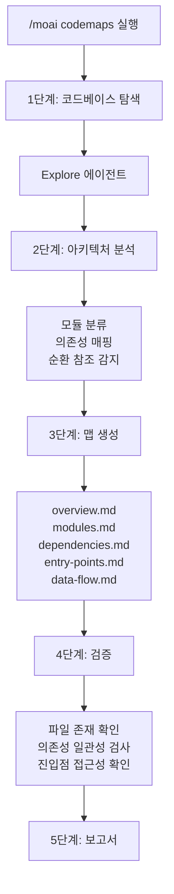
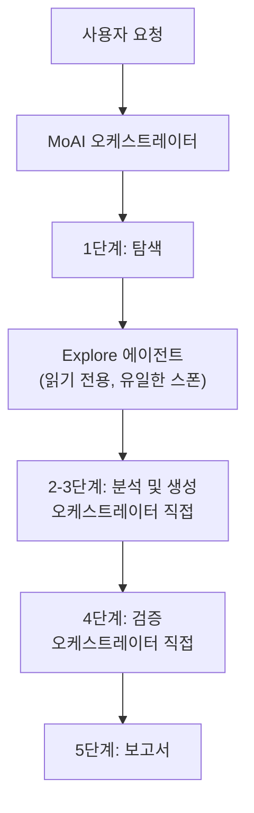

코드베이스를 스캔하여 **아키텍처 문서**를 자동 생성하는 명령어입니다. 에이전트가 매번 디렉토리 구조를 다시 뒤지는 대신, 한 번 만들어 둔 파일 기반 지도를 펼쳐 보게 해주기 때문에 컨텍스트 비용이 크게 줄어듭니다.


**한 줄 요약**: `/moai codemaps`는 "아키텍처 지도 제작자" 입니다. 코드베이스를 분석하여 모듈 맵, 의존성 그래프, 진입점 카탈로그 등 **구조 문서를 자동 생성**합니다.



**슬래시 커맨드**: Claude Code에서 `/moai:codemaps`를 입력하면 이 명령어를 바로 실행할 수 있습니다. `/moai`만 입력하면 사용 가능한 모든 서브커맨드 목록이 표시됩니다.


## 개요

새 프로젝트에 합류했거나 큰 코드베이스를 처음 들여다볼 때는 아키텍처부터 파악해야 합니다. `/moai codemaps`는 코드베이스를 알아서 분석해 모듈 맵, 의존성 그래프, 진입점 카탈로그, 데이터 플로우 문서를 만들어 줍니다.

만들어진 문서는 `.moai/project/codemaps/` 디렉토리에 저장되며, 사람과 AI 에이전트 모두 코드베이스를 빠르게 이해하는 데 씁니다. 하네스 엔지니어링 용어로는 **컨텍스트 맵**에 해당합니다. 에이전트가 세션마다 아키텍처를 다시 뒤지는 대신 언제든 펼쳐 볼 수 있는 파일 기반 지도인 셈입니다. 되풀이되던 탐색 비용을 문서 생성 한 번으로 갈음하니 비용도 크게 아낍니다.

## 사용법

```bash
# 전체 코드베이스 아키텍처 문서 생성
> /moai codemaps

# 기존 문서를 무시하고 재생성
> /moai codemaps --force

# 특정 영역만 분석
> /moai codemaps --area api

# Mermaid 다이어그램 포함
> /moai codemaps --format mermaid

# 탐색 깊이 제한
> /moai codemaps --depth 3
```

## 지원 플래그

| 플래그 | 설명 | 예시 |
|-------|------|------|
| `--force` (또는 `--regenerate`) | 기존 문서를 무시하고 모든 코드맵 재생성 | `/moai codemaps --force` |
| `--area AREA` | 특정 영역에 집중 분석 | `/moai codemaps --area auth` |
| `--format FORMAT` | 출력 형식 (markdown, mermaid, json, 기본값: markdown) | `/moai codemaps --format mermaid` |
| `--depth N` | 최대 디렉토리 탐색 깊이 (기본값: 4) | `/moai codemaps --depth 3` |

### --force 플래그

기존 코드맵 문서를 모두 삭제하고 처음부터 다시 생성합니다:

```bash
> /moai codemaps --force
```

코드베이스에 큰 변화가 있었을 때 유용합니다.

### --area 플래그

특정 영역과 그 의존성만 분석합니다:

```bash
# API 모듈만 분석
> /moai codemaps --area api

# 인증 모듈만 분석
> /moai codemaps --area auth
```

결과는 `.moai/project/codemaps/{area}/`에 저장됩니다.

### --format 플래그

출력 형식을 지정합니다:

```bash
# Mermaid 다이어그램 포함
> /moai codemaps --format mermaid

# JSON 형식 추가 생성
> /moai codemaps --format json
```

## 실행 과정

`/moai codemaps`는 5단계로 실행됩니다.



### 1단계: 코드베이스 탐색

`Explore` 에이전트가 코드베이스를 깊이 탐색합니다:

| 탐색 대상 | 설명 |
|-----------|------|
| 디렉토리 구조 | 최상위 및 중요 하위 디렉토리 매핑 |
| 모듈 경계 | 패키지/모듈 경계와 책임 식별 |
| 진입점 | 메인 진입점 탐색 (main.go, index.ts, app.py 등) |
| 공개 API | 내보내진 함수, 타입, 인터페이스 목록 |
| 의존성 그래프 | 모듈 간 의존성 매핑 (import, require) |
| 외부 의존성 | 서드파티 의존성 카탈로그 |
| 설정 파일 | 빌드, 배포, 설정 파일 식별 |

### 2단계: 아키텍처 분석

오케스트레이터가 탐색 결과와 결정론적 도구 (예: `go list -deps -json` + `go doc`, 또는 프로젝트 언어의 등가 의존성·문서 추출기) 를 바탕으로 **직접** 분석합니다 (별도 에이전트 스폰 없음):

- 레이어별 모듈 분류 (프레젠테이션, 비즈니스, 데이터, 인프라)
- 높은 fan-in 모듈 식별 (`@MX:ANCHOR` 후보)
- 순환 의존성 감지
- 요청/데이터 플로우 경로 매핑
- 도메인 경계 식별
- 아키텍처 패턴 인식 (MVC, Clean, Hexagonal 등)

### 3단계: 맵 생성

`.moai/project/codemaps/` 디렉토리에 5가지 문서를 생성합니다:

| 파일 | 내용 |
|------|------|
| `overview.md` | 고수준 아키텍처 요약 및 모듈 설명 |
| `modules.md` | 상세 모듈 카탈로그 (책임, 의존성) |
| `dependencies.md` | 의존성 그래프 (텍스트 및 Mermaid 다이어그램) |
| `entry-points.md` | 진입점 카탈로그 및 호출 경로 |
| `data-flow.md` | 주요 데이터 플로우 경로 |

`--area` 플래그 사용 시:
- `.moai/project/codemaps/{area}/overview.md`
- `.moai/project/codemaps/{area}/modules.md`
- `.moai/project/codemaps/{area}/dependencies.md`

### 4단계: 검증

- 참조된 모든 파일과 모듈의 실제 존재 여부 확인
- 의존성 관계의 양방향 일관성 검사
- 진입점의 접근 가능성 검증
- 기존 코드맵과의 변경사항 비교 (`--force`가 아닌 경우)

만들어진 지도가 실제 코드와 맞는지 기계적으로 확인하는 단계입니다. 문서 역시 "만들었다"가 아니라 검증을 통과해야 완료로 칩니다.

### 5단계: 보고서

```
## 코드맵 생성 보고서

### 생성된 파일
- .moai/project/codemaps/overview.md
- .moai/project/codemaps/modules.md
- .moai/project/codemaps/dependencies.md
- .moai/project/codemaps/entry-points.md
- .moai/project/codemaps/data-flow.md

### 아키텍처 하이라이트
- 패턴: Clean Architecture
- 모듈 수: 12개
- 진입점: 3개 (API 서버, CLI, 워커)

### 잠재적 이슈
- 순환 의존성: pkg/auth <-> pkg/user
- 높은 결합도: pkg/core (fan_in: 8)
- 고립된 모듈: pkg/legacy (사용처 없음)
```

## 에이전트 위임 체인

`/moai codemaps`의 유일한 에이전트 스폰은 1단계의 `Explore` (읽기 전용) 입니다. 2·3단계 분석과 문서 생성, 4단계 검증은 모두 오케스트레이터가 직접 수행합니다.



**에이전트 역할:**

| 에이전트 | 역할 | 주요 작업 |
|----------|------|----------|
| **Explore** | 코드베이스 탐색 (읽기 전용) — 유일한 Agent() 스폰 | 디렉토리 구조, 모듈 경계, 의존성 매핑 |
| **MoAI 오케스트레이터** | 분석·생성·검증·보고서 (모두 직접) | 탐색 결과 + 결정론적 도구로 모듈 분류·의존성 분석·코드맵 파일 작성, 검증, 사용자 상호작용 |

## BAS Navigator (v3.1)

`/moai codemaps`가 코드베이스 구조를 **한 번** 사진 찍어 문서로 남긴다면, v3.1의 **BAS Navigator**는 코드맵을 코드 변경에 맞춰 **계속 최신으로 유지**하는 3-계층 (3-tier) 동기화 계층입니다. BAS (Blueprint-Anchored Synchronization) 는 `@NAV:DEC` · `@NAV:SYM` · `@MX:SPEC` 세 바인딩 토큰을 하나의 주소 가능한 그래프 (`nav-graph.json`) 로 엮어, 설계 문서와 코드 심볼과 SPEC이 서로 향하게 고정합니다.

코드맵이 "구조를 그린 지도"라면, BAS Navigator는 그 지도 위에 설계 결정과 코드 심볼을 핀으로 꽂아 두는 계층입니다. 따라서 두 개는 겹치지 않고 층을 이룹니다 — 코드맵이 먼저, BAS Navigator가 그 위에서 동기화를 맡습니다.

BAS Navigator의 설계와 3-계층 구조, 토큰 문법은 [고급 — BAS Navigator](/ko/advanced/bas-navigator) 페이지에 있습니다.

## 자주 묻는 질문

### Q: 코드맵은 얼마나 자주 재생성해야 하나요?

큰 리팩토링을 마쳤거나 모듈을 새로 추가했을 때 다시 만들면 됩니다. `/moai sync`를 실행하면 코드맵도 함께 갱신됩니다.

### Q: --area 플래그로 생성한 코드맵이 전체 코드맵과 충돌하나요?

아니요. `--area`로 생성한 코드맵은 별도의 하위 디렉토리에 저장됩니다. 전체 코드맵과 독립적으로 관리됩니다.

### Q: 생성된 코드맵을 직접 수정해도 되나요?

네, 직접 손대도 됩니다. 다만 `--force` 플래그로 재생성하면 손댄 내용을 덮어씁니다. `--force` 없이 실행하면 기존 문서를 참고해 바뀐 부분만 갱신합니다.

### Q: 어떤 아키텍처 패턴을 인식하나요?

MVC, Clean Architecture, Hexagonal, Layered Architecture 등 주요 패턴을 인식합니다. 인식된 패턴은 `overview.md`에 기록됩니다.

## 관련 문서

- [/moai clean - 데드 코드 제거](/ko/utility-commands/moai-clean)
- [/moai feedback - 피드백 제출](/ko/utility-commands/moai-feedback)
