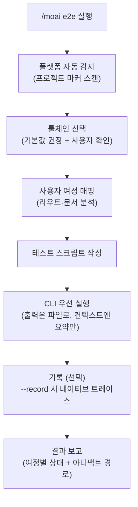
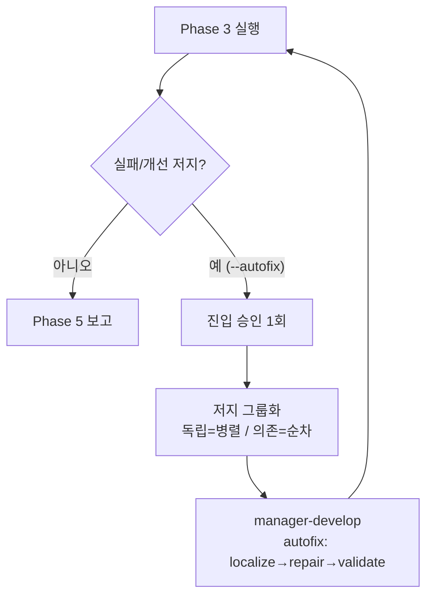
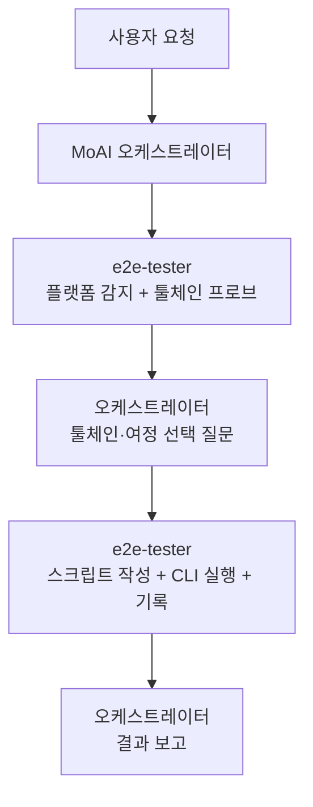

웹·모바일·데스크탑 애플리케이션의 E2E (End-to-End) 테스트를 생성하고 실행하는 명령어입니다. 프로젝트 유형을 **자동 감지**하고, 플랫폼에 맞는 **CLI 우선 툴체인**을 선택해 토큰을 최소화하며 실행합니다.


**한 줄 요약**: `/moai e2e`는 "사용자 여정 검증 도구" 입니다. 로그인 → 결제 → 확인 같은 실제 사용자 흐름을 브라우저·시뮬레이터·데스크탑 앱에서 끝까지 실행해 검증합니다.



**슬래시 커맨드**: Claude Code에서 `/moai:e2e`를 입력하면 이 명령어를 바로 실행할 수 있습니다. `/moai`만 입력하면 사용 가능한 모든 서브커맨드 목록이 표시됩니다.


## 개요

단위 테스트가 함수 하나를 검증한다면, E2E 테스트는 **사용자의 실제 여정 전체**를 검증합니다. `/moai e2e`는 이 과정을 자동화합니다 — 프로젝트가 웹인지 모바일인지 데스크탑인지 스스로 판별하고, 플랫폼별 기본 툴체인을 골라 테스트 스크립트를 작성하고 실행합니다.

전체 흐름은 다음과 같습니다.



## 사용법

```bash
> /moai e2e
```

인수 없이 실행하면 프로젝트 유형을 감지한 뒤, 추천 툴체인과 발견된 사용자 여정을 제시하고 선택을 받아 진행합니다.

```bash
# 툴체인을 지정해 바로 실행
> /moai e2e --tool playwright

# 특정 여정만 실행
> /moai e2e --journey login

# 실행 과정을 기록 (트레이스/레코딩)
> /moai e2e --record
```

## 지원 플래그

| 플래그 | 설명 | 예시 |
|-------|------|------|
| `--tool TOOL` | 툴체인 강제 지정 (선택 질문 생략) | `/moai e2e --tool maestro` |
| `--platform web\|mobile\|desktop\|desktop-native` | 플랫폼 분류 강제 지정 | `/moai e2e --platform desktop-native` |
| `--record` | 툴체인의 네이티브 기록 기능으로 실행 기록 | `/moai e2e --record` |
| `--url URL` | 웹 테스트 대상 URL 지정 | `/moai e2e --url http://localhost:3000` |
| `--journey NAME` | 지정한 사용자 여정만 실행 | `/moai e2e --journey checkout` |
| `--headless` | 헤드리스 모드 실행 (기본값 true) | `/moai e2e --headless` |
| `--browser BROWSER` | Playwright 브라우저 선택 (기본값 chromium) | `/moai e2e --browser firefox` |
| `--timeout N` | 테스트 타임아웃 (초, 기본값 30) | `/moai e2e --timeout 60` |
| `--retry N` | 실패 테스트 재시도 횟수 (기본값 1) — **실패한 스펙만** 재실행 | `/moai e2e --retry 2` |
| `--autofix` | 자동 수정 위임 활성화 — Phase 3 실패 시 manager-develop에 수정 위임 후 재실행 (최대 3회, 독립 저지는 병렬) | `/moai e2e --autofix` |

## 플랫폼별 툴체인 매트릭스

플랫폼마다 기본 툴체인이 정해져 있으며, 모든 기본 경로는 **CLI만으로 완결**됩니다.

| 플랫폼 | 기본 툴체인 | 대안/폴백 | 비고 |
|--------|-------------|-----------|------|
| **웹** | Playwright CLI | agent-browser (AI 탐색형) | chromium / firefox / webkit 크로스 브라우저 |
| **모바일** | Maestro | Appium (폴백), Detox (React Native 한정) | iOS / Android / Flutter 지원, 선언적 YAML 플로우 |
| **데스크탑 (Electron)** | Playwright `_electron` | — | 웹 Playwright 설치를 재사용. API는 실험적 (experimental) — 보고서에 명시 |
| **데스크탑 (Tauri)** | WebdriverIO + `@wdio/tauri-service` | — | 임베디드 WebDriver 모드는 macOS 포함 크로스 플랫폼 |
| **데스크탑-네이티브 (macOS)** | axcli | appium-mac2 + WebdriverIO (폴백) | AppKit·네이티브 macOS 앱을 AXUIElement 접근성 트리로 제어. 버전 PIN |
| **데스크탑-네이티브 (Windows)** | FlaUI.WebDriver + WebdriverIO | pywinauto (폴백) | WinUI/Win32/Qt. W3C WebDriver2 over UIA3. 실험적 — 버전 PIN |
| **데스크탑-네이티브 (Linux)** | dogtail | ydotool/xdotool + 스크린샷 검증 (폴백) | GTK/Qt를 AT-SPI2로 제어. Wayland는 GNOME 한정 |

선택한 툴체인이 설치되어 있지 않으면, 설치 명령어를 먼저 제시하고 승인 후 설치 → 버전 재확인 → 진행합니다.

데스크탑-네이티브 레인은 세 OS (macOS·Windows·Linux) 의 접근성 레시피를 모두 문서화하지만, **호스트 OS 규칙**에 따라 호스트와 다른 OS의 레시피는 선언적 문서로만 취급하고 실제 프로브·실행은 호스트 OS에 대해서만 수행합니다.

## 프로젝트 유형 자동 감지

프로젝트의 **마커 파일**을 읽어 플랫폼을 분류합니다. 감지는 마커 기반이며 특정 언어나 프레임워크를 우대하지 않습니다.

| 분류 | 감지 마커 (예시) |
|------|------------------|
| 데스크탑 (Electron) | package.json 의존성의 `electron`, electron-builder/Forge 설정 |
| 데스크탑 (Tauri) | `src-tauri/tauri.conf.json`, 의존성의 `tauri` |
| 모바일 (React Native) | 의존성의 `react-native`, `ios/` + `android/` 디렉토리 |
| 모바일 (Flutter) | `flutter:`가 포함된 `pubspec.yaml`, `lib/main.dart` |
| 모바일 (네이티브) | iOS 타깃의 `*.xcodeproj`, `com.android.application`이 있는 `build.gradle` |
| 웹 | next/nuxt/vite/astro 등 웹 프레임워크 설정, `index.html`, HTTP 서빙 앱 전반 |
| 데스크탑-네이티브 | Electron/Tauri 없이 네이티브 툴킷 마커만 — AppKit (`.xcodeproj`/`Package.swift`의 macOS 앱 타깃, electron/tauri 의존성 없음), WinUI/Win32 (`.vcxproj`), Qt (`CMakeLists.txt`의 Qt `find_package`/`.pro`), GTK (gtk 의존성) |
| 혼합 (mixed) | 두 개 이상의 플랫폼 마커가 동시에 감지 — 표면별로 각각 툴체인 선택 |

## 실행 과정

### 1단계: 사용자 여정 매핑

프로젝트 문서와 라우트 정의 (routes.ts, urls.py, router.go, 내비게이션 그래프 등) 를 읽어 테스트할 사용자 여정 후보를 발견합니다. 로그인, 핵심 기능, 오류 처리 같은 중요 경로가 우선입니다.

```markdown
여정: 사용자 로그인
단계:
1. /login으로 이동 (웹) | 로그인 화면으로 앱 실행 (모바일/데스크탑)
2. 이메일 입력
3. 비밀번호 입력
4. 제출
5. /dashboard로 리다이렉트 확인
6. 환영 메시지 표시 확인
```

### 2단계: 스크립트 작성

선택된 툴체인의 규약에 맞춰 `e2e/` 디렉토리에 테스트 스크립트를 작성합니다.

| 툴체인 | 산출물 위치 |
|--------|-------------|
| Playwright | `e2e/<여정>.spec.ts` |
| Maestro | `e2e/flows/<여정>.yaml` |
| Appium / WebdriverIO | `e2e/<여정>.e2e.ts` + `wdio.conf.ts` |

모든 여정 단계는 **검증 가능한 결과**와 짝을 이룹니다 — 단언 (assertion) 없는 내비게이션 스크립트는 작성하지 않습니다.

### 3단계: 실행과 보고

테스트를 실행하고, 여정별 PASS/FAIL 상태·소요 시간·아티팩트 경로를 표로 보고합니다. 실패한 여정은 실패 지점의 로그 발췌와 스크린샷 경로가 함께 제공됩니다.

## 자동 수정 위임 (--autofix)

`--autofix` 플래그를 주면 Phase 3 실행에서 **실패나 개선 여지**가 발견됐을 때, 오케스트레이터가 수정을 `manager-develop` 에이전트에 위임하고 Phase 3를 재실행하는 루프에 진입합니다. 플래그가 없거나 Phase 3가 green이면 이 단계는 건너뜁니다.



- **진입 승인 1회**: 첫 위임 전 오케스트레이터가 1회 승인을 받습니다. 이 승인이 전체 루프를 아우르며 이후 반복에서는 다시 묻지 않습니다. 거절하면 기존 수동 다음 단계 흐름으로 돌아갑니다.
- **저지 그룹화**: 서로 다른 파일을 건드리는 독립 저지는 병렬 fan-out, 같은 모듈을 건드리는 의존 저지는 순차 처리합니다 (동시 쓰기 충돌 방지).
- **루프 한계**: 최대 3회 반복 (`ci-autofix-protocol.md`와 동일). green이면 보고, 3회 소진 시 잔여 실패와 아티팩트 경로를 사용자에게 회귀합니다.

## 토큰 최소화 실행

`/moai e2e`의 핵심 설계 원칙은 **CLI 우선** (CLI-first) 입니다. AI 컨텍스트에 장황한 출력을 쌓는 대신, 가장 싼 경로부터 사용합니다.

1. **CLI + 제한된 꼬리 출력**: 전체 실행 로그는 `e2e/.runs/` 아래 파일로 저장하고, 컨텍스트에는 종료 코드 + 마지막 일부만 표시합니다. 로그 파일 경로는 항상 인용됩니다.
2. **구조화 리포터**: 실패 분석 시 전체 재실행 대신 JSON 리포터 출력에서 **실패한 스펙만** 선별해 읽습니다.
3. **MCP는 조건부**: 성능 트레이스, Lighthouse류 감사처럼 CLI로 불가능한 기능에만 MCP 도구를 사용합니다. MCP는 어떤 기본 경로에서도 필수 의존성이 아닙니다.

보고서·트레이스·스크린샷·레코딩은 프로젝트 로컬 `e2e/` 디렉토리에 저장되고 **경로로 인용**됩니다 — 내용이 컨텍스트에 인라인되지 않습니다.

## 기록 옵션

`--record` 플래그를 사용하면 선택한 툴체인의 **네이티브 기록 기능**으로 실행을 기록합니다.

| 툴체인 | 네이티브 기능 | 출력 위치 |
|--------|---------------|-----------|
| Playwright | `--trace on` 트레이스 | `e2e/traces/*.zip` |
| Maestro | `maestro record` | `e2e/recordings/` |
| WebdriverIO | 비디오/트레이스 리포터 서비스 | `e2e/recordings/` |

## 대상이 없을 때

테스트할 E2E 표면이 감지되지 않으면 (예: 웹/모바일/데스크탑 진입점이 없는 순수 라이브러리), 어떤 마커를 확인했는지 근거와 함께 **"E2E 대상 없음"**을 보고하고 `e2e/` 아티팩트를 만들지 않은 채 정상 종료합니다.

Electron도 Tauri도 아닌 **네이티브 데스크탑 앱** (순수 macOS 앱, WinUI, Qt/GTK 등) 이 감지되면 이 분기로 가지 않습니다 — 데스크탑-네이티브 자동화 레인 (macOS의 axcli, Windows의 FlaUI.WebDriver, Linux의 dogtail) 으로 라우팅되어 정상적으로 테스트가 진행됩니다. "E2E 대상 없음" 분기는 어떤 표면도 없는 순수 라이브러리에만 예약되어 있습니다.

## 에이전트 위임 체인

`/moai e2e`의 실행 주체는 **e2e-tester** 에이전트입니다. 모든 사용자 선택 질문은 MoAI 오케스트레이터가 담당하고, e2e-tester는 선택 결과를 전달받아 실행만 수행합니다.



| 에이전트 | 역할 | 주요 작업 |
|----------|------|----------|
| **MoAI 오케스트레이터** | 선택과 보고 | 툴체인/여정 선택 질문, 결과 보고 렌더링 |
| **e2e-tester** | 실행 전담 | 감지 프로브, 여정 매핑, 스크립트 작성, CLI 실행, 기록 |
| **manager-develop** (--autofix 시) | 수정 위임 | localize→repair→validate (관련 e2e 스펙 로컬 재검증) |

## 관련 문서

- [/moai fix - 일회성 자동 수정](/utility-commands/moai-fix)
- [/moai loop - 반복 수정 루프](/utility-commands/moai-loop)
- [/moai - 완전 자율 자동화](/utility-commands/moai)
