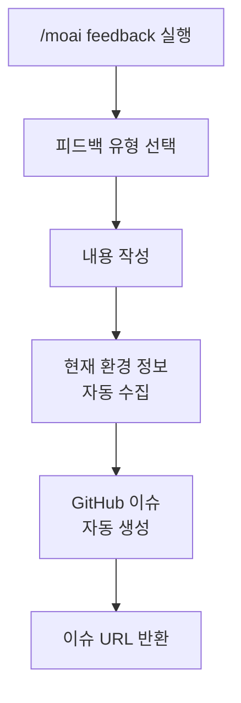
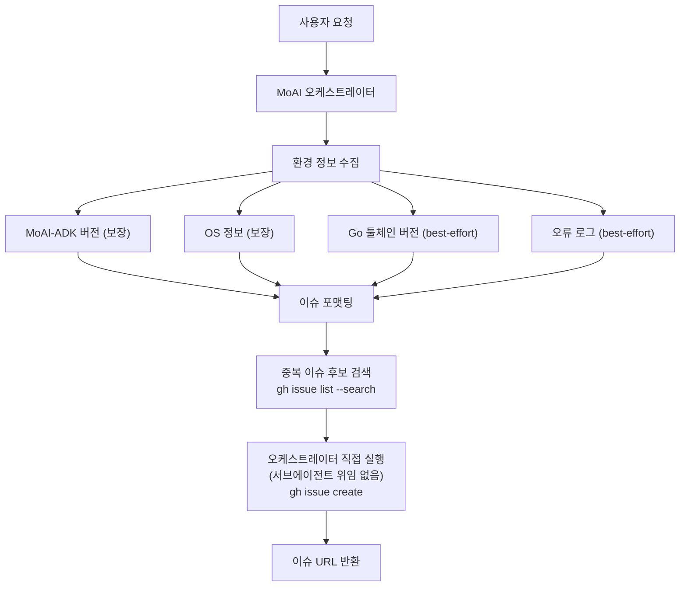

MoAI-ADK에 피드백이나 버그 리포트를 제출하는 명령어입니다.



**새로운 명령어 형식**

`/moai:9-feedback`는 이제 `/moai feedback`으로 변경되었습니다.




**한 줄 요약**: `/moai feedback`은 MoAI-ADK 자체에 대한 개선 제안이나 버그 리포트를 **GitHub 이슈로 자동 생성**해주는 명령어입니다.



**슬래시 커맨드**: Claude Code에서 `/moai:feedback`을 입력하면 이 명령어를 바로 실행할 수 있습니다. `/moai`만 입력하면 사용 가능한 모든 서브커맨드 목록이 표시됩니다.


## 개요

MoAI-ADK를 사용하다가 버그를 발견하거나, 새로운 기능이 필요하거나, 개선 아이디어가 떠올랐을 때 이 명령어를 사용합니다. 직접 GitHub에 접속하여 이슈를 작성할 필요 없이, Claude Code 안에서 바로 피드백을 제출할 수 있습니다.


**중요**: 이 명령어는 **여러분의 프로젝트 코드를 수정하는 명령어가 아닙니다**. MoAI-ADK 도구 자체에 대한 피드백을 개발팀에 전달하는 명령어입니다.


## 사용법

```bash
# 표준 형식
> /moai feedback

# 짧은 별칭
> /moai fb
> /moai bug
> /moai issue
```

명령어를 실행하면 피드백 유형을 선택하고, 내용을 입력하는 과정을 안내받습니다.

## 지원 플래그

| 플래그 | 설명 | 예시 |
|-------|------|------|
| `--type {bug,feature,question}` | 피드백 유형 직접 지정 | `/moai feedback --type bug` |
| `--title "<title>"` | 제목 직접 지정 | `/moai feedback --title "오류 보고"` |
| `--dry-run` | 이슈 생성 없이 내용만 확인 | `/moai feedback --dry-run` |

## 작동 방식

`/moai feedback`을 실행하면 다음 과정이 진행됩니다.



### 자동 수집되는 정보

피드백 제출 시 다음 정보가 자동으로 포함되어, 개발팀이 문제를 더 빠르게 파악할 수 있습니다.

| 수집 항목 | 설명 | 예시 | 수집 방식 |
|-----------|------|------|-----------|
| MoAI-ADK 버전 | 현재 설치된 버전 (`moai version`) | v10.8.0 | 보장 (항상 수집) |
| OS 정보 | 운영체제 및 버전 (`uname`) | macOS 15.2 | 보장 (항상 수집) |
| Go 툴체인 버전 | 도구 바이너리의 빌드 출처 정보 (`go version`) | go1.23.4 | best-effort (Go 툴체인 미설치 환경에서는 생략) |
| 오류 로그 | 오케스트레이터가 전달한 오류 컨텍스트 (있는 경우) | TypeError: ... | best-effort (오케스트레이터가 전달할 때만 포함, 워크플로우 자체는 세션 기록을 읽지 않음) |

## 피드백 설정

`/moai feedback`은 다음 4가지 세부 동작으로 이슈 생성 과정을 보강합니다.

### 진단 정보: 보장 항목 + best-effort 항목

위 표와 같이 MoAI-ADK 버전(`moai version`)과 OS 정보(`uname`)는 **항상** 수집되는 보장 항목입니다. Go 툴체인 버전(`go version`)과 오케스트레이터가 전달하는 오류 컨텍스트는 **best-effort** 항목으로, 조건이 맞지 않으면(예: 사전 빌드된 `moai` 바이너리만 있고 Go 툴체인이 설치되지 않은 환경) 생략되며 이는 실패가 아닙니다.

### 중복 이슈 후보 확인

이슈 제목이 정해지면, 이슈 생성 전에 `gh issue list --repo <대상 저장소> --search "<제목 키워드>" --state open` 명령으로 대상 저장소에서 열려 있는 중복 이슈를 검색합니다. 이 단계는 사용자에게 직접 묻지 않고 "가능한 중복 이슈" 후보 리포트(이슈 번호, 제목, URL, 상태)만 생성하며, 새 이슈로 진행할지 기존 이슈로 안내할지는 오케스트레이터가 판단합니다.

### `gh` 인증 실패 시 로컬 임시 저장

이슈 생성 직전에 `gh auth status`를 확인합니다. `gh`가 인증되지 않았거나 GitHub API 레이트 리밋에 걸린 경우, 다음과 같이 우아하게 대응합니다.

1. 감지된 상태(미인증 또는 레이트 리밋)를 사용자에게 알립니다.
2. 미인증이면 `gh auth login` 실행을, 레이트 리밋이면 제한 해제까지 대기를 안내합니다.
3. 작성된 이슈 내용을 `.moai/state/feedback-draft-<timestamp>.md` 경로에 로컬로 저장할지 제안합니다.

작성된 피드백 내용은 `gh` 실패로 인해 유실되지 않으며, 로컬 임시 파일이 복구 수단이 됩니다.

### 피드백 대상 저장소 설정

`/moai feedback`이 이슈를 생성하는 대상 저장소는 `.moai/config/sections/feedback.yaml`의 `feedback.repository` 값으로 설정됩니다. 기본값은 `modu-ai/moai-adk`(MoAI-ADK 도구 저장소 자체)이며, fork를 유지보수하는 사용자는 이 값을 자신의 fork 저장소로 변경해 피드백을 리다이렉트할 수 있습니다.

## 피드백 유형

### 버그 리포트

MoAI-ADK 사용 중 발생한 오류나 예상과 다른 동작을 보고합니다.

```bash
> /moai feedback
# 유형 선택: 버그 리포트
# 제목: /moai run 실행 시 특성화 테스트가 생성되지 않음
# 설명: SPEC-AUTH-001에 대해 /moai run을 실행했는데,
#        PRESERVE 단계에서 특성화 테스트가 생성되지 않고
#        바로 IMPROVE 단계로 넘어갑니다.
# 재현 방법: /moai run SPEC-AUTH-001 실행
```

### 기능 요청

MoAI-ADK에 추가되었으면 하는 새로운 기능을 제안합니다.

```bash
> /moai feedback
# 유형 선택: 기능 요청
# 제목: /moai loop에 특정 파일만 대상으로 하는 옵션 추가
# 설명: /moai loop 실행 시 전체 프로젝트가 아닌 특정 디렉토리나
#        파일만 대상으로 할 수 있으면 좋겠습니다.
# 예시: /moai loop --path src/auth/
```

### 개선 제안

기존 기능의 개선 아이디어를 제안합니다.

```bash
> /moai feedback
# 유형 선택: 개선 제안
# 제목: /moai fix 실행 결과에 수정 전후 diff 표시
# 설명: /moai fix가 자동 수정한 내용을 diff 형태로
#        보여주면 어떤 변경이 있었는지 한눈에 파악할 수 있겠습니다.
```

## 에이전트 위임 체인

`/moai feedback` 명령어는 서브에이전트 위임 없이 **오케스트레이터가 직접** 전 과정을 실행합니다:



**담당 주체:**

| 담당 주체 | 역할 | 주요 작업 |
|----------|------|----------|
| **MoAI 오케스트레이터** | 피드백 프로세스 전체를 오케스트레이터가 직접 진행 (서브에이전트 위임 없음) | 유형/제목/설명 수집, 환경 정보 수집, 중복 이슈 후보 검색, `gh issue create` 직접 실행, URL 반환 |

## 실전 예시

### 상황: 명령어 실행 중 예상치 못한 오류 발생

```bash
# 오류가 발생한 상황
> /moai "결제 기능 구현" --branch
# Error: Branch creation failed - permission denied

# 피드백 제출
> /moai feedback
```

MoAI 오케스트레이터가 피드백 유형, 제목, 설명을 차례로 물어봅니다. 답변을 입력하면 자동으로 GitHub 이슈가 생성되고, 이슈 URL이 반환됩니다.

```
GitHub 이슈가 생성되었습니다:
https://github.com/anthropics/moai-adk/issues/1234

개발팀이 확인 후 답변드리겠습니다.
```


**피드백은 언제든 환영합니다!** 사소한 불편 사항이라도 피드백을 제출해주시면 MoAI-ADK 개선에 큰 도움이 됩니다.


## 자주 묻는 질문

### Q: 피드백 내용을 수정하거나 삭제할 수 있나요?

네, GitHub에서 직접 이슈를 수정하거나 닫을 수 있습니다. 이슈 URL이 제공되므로 언제든 접근할 수 있습니다.

### Q: 같은 문제를 여러 번 보고해도 되나요?

GitHub에서 중복 이슈를 확인하므로 걱정하지 않아도 됩니다. 이미 보고된 문제라면 기존 이슈로 안내해줍니다.

### Q: 피드백에 대한 응답은 언제 받을 수 있나요?

개발팀이 확인 후 주마다 이슈에 댓글을 달아드립니다. 복잡한 문제의 경우 해결까지 시간이 걸 수 있습니다.

### Q: `/moai feedback`와 GitHub 직접 이슈 생성의 차이는 무엇인가요?

`/moai feedback`는 환경 정보를 자동으로 수집하여 개발팀이 문제를 더 빠르게 파악할 수 있게 해줍니다. 수동으로 이슈를 생성하는 것보다 더 효율적입니다.

## 관련 문서

- [/moai - 완전 자율 자동화](/utility-commands/moai)
- [/moai loop - 반복 수정 루프](/utility-commands/moai-loop)
- [/moai fix - 일회성 자동 수정](/utility-commands/moai-fix)
