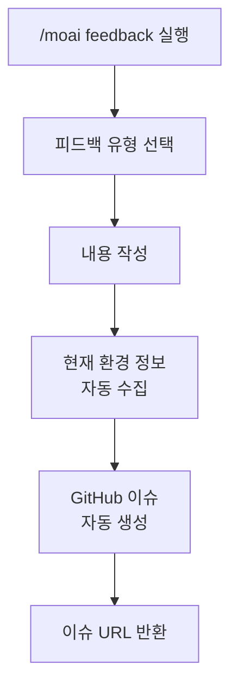
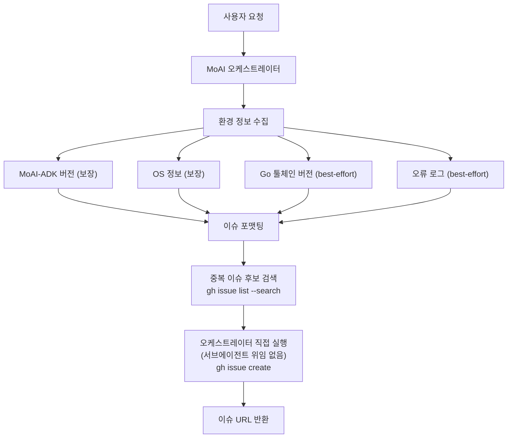

MoAI-ADK에 피드백이나 버그 리포트를 제출하는 명령어입니다.


**한 줄 요약**: `/moai feedback`은 MoAI-ADK 자체에 대한 개선 제안이나 버그 리포트를 **GitHub 이슈로 자동 생성**해주는 명령어입니다.



**슬래시 커맨드**: Claude Code에서 `/moai:feedback`을 입력하면 이 명령어를 바로 실행할 수 있습니다. `/moai`만 입력하면 사용 가능한 모든 서브커맨드 목록이 표시됩니다.


## 개요

MoAI-ADK를 쓰다가 버그를 만났거나, 아쉬운 기능이 있거나, 개선 아이디어가 떠올랐을 때 쓰는 명령어입니다. GitHub에 따로 들어가 이슈를 쓸 것 없이 Claude Code 안에서 바로 피드백을 보낼 수 있습니다.


**중요**: 이 명령어는 **여러분의 프로젝트 코드를 수정하는 명령어가 아닙니다**. MoAI-ADK 도구 자체에 대한 피드백을 개발팀에 전달하는 명령어입니다.


## 사용법

```bash
# 표준 형식
> /moai feedback

# 짧은 별칭
> /moai fb
> /moai bug
> /moai issue
```

명령어를 실행하면 피드백 유형을 선택하고, 내용을 입력하는 과정을 안내받습니다.

## 입력 방식 (플래그 없음)

`/moai feedback`은 별도 플래그를 받지 않습니다. 피드백 유형은 입력한 내용을 보고 알아서 판별하고, 제목과 설명은 오케스트레이터가 `AskUserQuestion` 한 라운드로 모읍니다. 문제나 제안을 자연어로 풀어 쓰기만 하면 됩니다.

## 작동 방식

`/moai feedback`을 실행하면 다음 과정이 진행됩니다.


```mermaid
flowchart TD
    A["/moai feedback 실행"] --> B["피드백 유형 선택"]
    B --> C["내용 작성"]
    C --> D["현재 환경 정보<br/>자동 수집"]
    D --> E["GitHub 이슈<br/>자동 생성"]
    E --> F["이슈 URL 반환"]
```

### 자동 수집되는 정보

피드백 제출 시 다음 정보가 자동으로 포함되어, 개발팀이 문제를 더 빠르게 파악할 수 있습니다.

| 수집 항목 | 설명 | 예시 | 수집 방식 |
|-----------|------|------|-----------|
| MoAI-ADK 버전 | 현재 설치된 버전 (`moai version`) | v3.1.1 | 보장 (항상 수집) |
| OS 정보 | 운영체제 및 버전 (`uname`) | macOS 15.2 | 보장 (항상 수집) |
| Go 툴체인 버전 | 도구 바이너리의 빌드 출처 정보 (`go version`) | go1.23.4 | best-effort (Go 툴체인 미설치 환경에서는 생략) |
| 오류 로그 | 오케스트레이터가 전달한 오류 컨텍스트 (있는 경우) | TypeError: ... | best-effort (오케스트레이터가 전달할 때만 포함, 워크플로우 자체는 세션 기록을 읽지 않음) |

## 피드백 설정

`/moai feedback`은 다음 4가지 세부 동작으로 이슈 생성 과정을 보강합니다.

### 진단 정보: 보장 항목 + best-effort 항목

위 표와 같이 MoAI-ADK 버전 (`moai version`)과 OS 정보 (`uname`)는 **항상** 수집되는 보장 항목입니다. Go 툴체인 버전 (`go version`)과 오케스트레이터가 전달하는 오류 컨텍스트는 **best-effort** 항목으로, 조건이 맞지 않으면 (예: 사전 빌드된 `moai` 바이너리만 있고 Go 툴체인이 설치되지 않은 환경) 생략되며 이는 실패가 아닙니다.

### 중복 이슈 후보 확인

이슈 제목이 정해지면, 이슈를 만들기 전에 `gh issue list --repo <대상 저장소> --search "<제목 키워드>" --state open` 명령으로 대상 저장소에 열려 있는 비슷한 이슈를 찾아봅니다. 이 단계에서는 사용자에게 묻지 않고 "중복일 수 있는 이슈" 후보 리포트 (이슈 번호, 제목, URL, 상태) 만 만들며, 새 이슈로 갈지 기존 이슈로 안내할지는 오케스트레이터가 판단합니다.

### `gh` 인증 실패 시 로컬 임시 저장

이슈 생성 직전에 `gh auth status`를 확인합니다. `gh`가 인증되지 않았거나 GitHub API 레이트 리밋에 걸린 경우, 다음 순서로 대응합니다.

1. 감지된 상태 (미인증 또는 레이트 리밋)를 사용자에게 알립니다.
2. 미인증이면 `gh auth login` 실행을, 레이트 리밋이면 제한 해제까지 대기를 안내합니다.
3. 작성된 이슈 내용을 `.moai/state/feedback-draft-<timestamp>.md` 경로에 로컬로 저장할지 제안합니다.

이렇게 해 두면 `gh`가 실패해도 써 둔 피드백이 날아가지 않고, 로컬 임시 파일로 되살릴 수 있습니다.

### 피드백 대상 저장소 설정

`/moai feedback`이 이슈를 생성하는 대상 저장소는 `.moai/config/sections/feedback.yaml`의 `feedback.repository` 값으로 설정됩니다. 기본값은 `modu-ai/moai-adk` (MoAI-ADK 도구 저장소 자체)이며, fork를 유지보수하는 사용자는 이 값을 자신의 fork 저장소로 변경해 피드백을 리다이렉트할 수 있습니다.

### 제출 전 확인

`/moai feedback`은 이슈를 만들기 전에 올라갈 내용을 먼저 보여줍니다. 제목, 본문 전체, 그리고 가려낸 값(시크릿, 토큰, 홈 디렉터리 절대 경로)의 요약을 함께 보여준 뒤 진행할지 묻습니다. 이 질문을 할지 말지는 `.moai/config/sections/feedback.yaml`의 `feedback.auto_submit` 값이 결정합니다. 배포 기본값 `false`는 매번 묻고, `true`는 묻지 않고 바로 제출합니다.

```yaml
feedback:
    repository: modu-ai/moai-adk
    auto_submit: false
```

`moai init` 설치 마법사에서도 이 값을 묻고, 나중에 웹 콘솔의 Feedback 섹션에서 바꿀 수 있습니다. `true`로 두면 질문만 건너뛸 뿐 값 가리기는 그대로 동작하며, 보안 취약점 제보로 판단된 내용은 여전히 공개 이슈 대신 비공개 advisory 경로로 안내됩니다.

## 피드백 유형

### 버그 리포트

MoAI-ADK 사용 중 발생한 오류나 예상과 다른 동작을 보고합니다.

```bash
> /moai feedback
# 유형 (자동 판별): 버그 리포트
# 제목: /moai run 실행 시 특성화 테스트가 생성되지 않음
# 설명: SPEC-AUTH-001에 대해 /moai run을 실행했는데,
#        PRESERVE 단계에서 특성화 테스트가 생성되지 않고
#        바로 IMPROVE 단계로 넘어갑니다.
# 재현 방법: /moai run SPEC-AUTH-001 실행
```

### 기능 요청

MoAI-ADK에 추가되었으면 하는 새로운 기능을 제안합니다.

```bash
> /moai feedback
# 유형 (자동 판별): 기능 요청
# 제목: /moai loop에 특정 파일만 대상으로 하는 옵션 추가
# 설명: /moai loop 실행 시 전체 프로젝트가 아닌 특정 디렉토리나
#        파일만 대상으로 할 수 있으면 좋겠습니다.
# 예시: /moai loop --path src/auth/
```

### 질문 (Question)

MoAI-ADK 사용법이나 동작에 대한 궁금증을 질문합니다.

```bash
> /moai feedback
# 유형 (자동 판별): 질문
# 제목: /moai fix와 /moai loop의 차이가 무엇인가요?
# 설명: 두 명령어 모두 오류를 수정하는 것 같은데
#        언제 어떤 것을 써야 하는지 궁금합니다.
```

## 에이전트 위임 체인

`/moai feedback` 명령어는 서브에이전트 위임 없이 **오케스트레이터가 직접** 전 과정을 실행합니다:


```mermaid
flowchart TD
    User["사용자 요청"] --> Orchestrator["MoAI 오케스트레이터"]
    Orchestrator --> Collect["환경 정보 수집"]

    Collect --> Info1["MoAI-ADK 버전 (보장)"]
    Collect --> Info2["OS 정보 (보장)"]
    Collect --> Info3["Go 툴체인 버전 (best-effort)"]
    Collect --> Info4["오류 로그 (best-effort)"]

    Info1 --> Format["이슈 포맷팅"]
    Info2 --> Format
    Info3 --> Format
    Info4 --> Format

    Format --> Dup["중복 이슈 후보 검색<br/>gh issue list --search"]
    Dup --> GitHub["오케스트레이터 직접 실행<br/>(서브에이전트 위임 없음)<br/>gh issue create"]
    GitHub --> Complete["이슈 URL 반환"]
```

**담당 주체:**

| 담당 주체 | 역할 | 주요 작업 |
|----------|------|----------|
| **MoAI 오케스트레이터** | 피드백 프로세스 전체를 오케스트레이터가 직접 진행 (서브에이전트 위임 없음) | 유형/제목/설명 수집, 환경 정보 수집, 중복 이슈 후보 검색, `gh issue create` 직접 실행, URL 반환 |

절차 하나로 끝나는 단순한 일에 서브에이전트를 띄우지 않는 것도 비용을 아끼는 원칙입니다. 위임은 꼭 필요할 때만, 가장 싼 경로로 합니다.

## 실전 예시

### 상황: 명령어 실행 중 예상치 못한 오류 발생

```bash
# 오류가 발생한 상황
> /moai "결제 기능 구현" --branch
# Error: Branch creation failed - permission denied

# 피드백 제출
> /moai feedback
```

MoAI 오케스트레이터가 피드백 유형, 제목, 설명을 차례로 물어봅니다. 답을 채워 넣으면 GitHub 이슈가 만들어지고 이슈 URL이 돌아옵니다.

```
GitHub 이슈가 생성되었습니다:
https://github.com/modu-ai/moai-adk/issues/1234

개발팀이 확인 후 답변드리겠습니다.
```


**피드백은 언제든 환영합니다!** 사소한 불편 사항이라도 피드백을 제출해주시면 MoAI-ADK 개선에 큰 도움이 됩니다.


## 자주 묻는 질문

### Q: 피드백 내용을 수정하거나 삭제할 수 있나요?

네, GitHub에서 직접 이슈를 수정하거나 닫을 수 있습니다. 이슈 URL이 제공되므로 언제든 접근할 수 있습니다.

### Q: 같은 문제를 여러 번 보고해도 되나요?

GitHub에서 중복 이슈를 확인하니 걱정하지 않아도 됩니다. 이미 올라온 문제라면 기존 이슈로 안내해 줍니다.

### Q: 피드백에 대한 응답은 언제 받을 수 있나요?

개발팀이 확인 후 이슈에 댓글로 답변드립니다. 복잡한 문제의 경우 해결까지 시간이 걸릴 수 있습니다.

### Q: `/moai feedback`과 GitHub에서 직접 이슈를 만드는 것은 무엇이 다른가요?

`/moai feedback`은 환경 정보를 알아서 모아 붙여 주기 때문에 개발팀이 문제를 더 빨리 파악합니다. 직접 이슈를 작성하는 것보다 손도 덜 갑니다.

## 관련 문서

- [/moai - 완전 자율 자동화](/ko/utility-commands/moai)
- [/moai loop - 반복 수정 루프](/ko/utility-commands/moai-loop)
- [/moai fix - 일회성 자동 수정](/ko/utility-commands/moai-fix)
