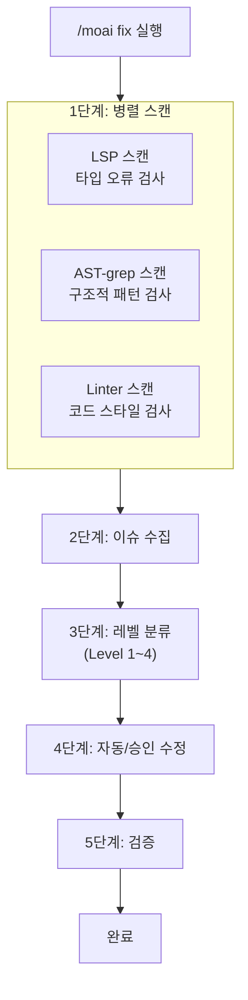
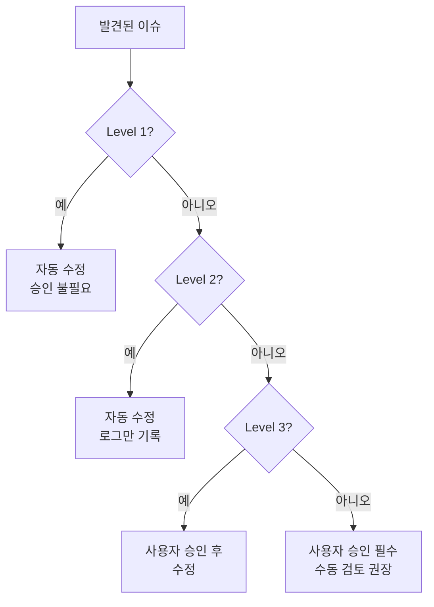
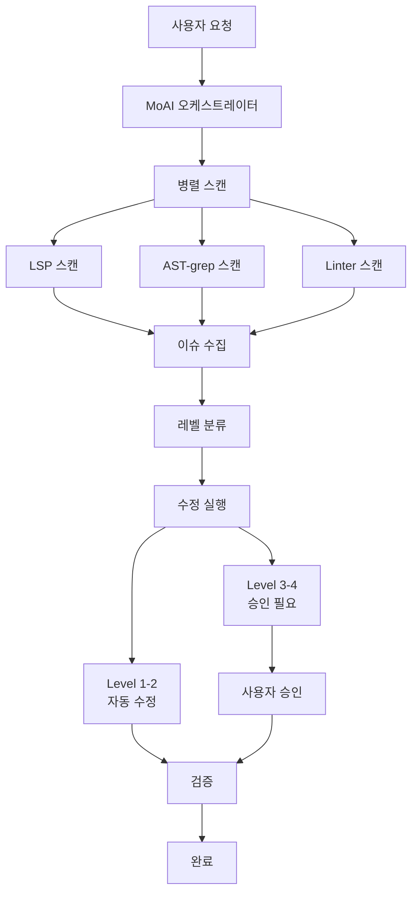

# /moai fix

일회성 자동 수정 명령어입니다. 코드의 오류를 **병렬로 스캔**한 후 **한 번에 수정**합니다.


**한 줄 요약**: `/moai fix`는 "빠른 청소 도구" 입니다. 코드에 쌓인 린트 오류, 타입 오류를 **한 번에 쓸어담아** 수정합니다.



**슬래시 커맨드**: Claude Code에서 `/moai:fix`를 입력하면 이 명령어를 바로 실행할 수 있습니다. `/moai`만 입력하면 사용 가능한 모든 서브커맨드 목록이 표시됩니다.


## 개요

개발하다 보면 import 정렬이 깨지거나, 타입이 맞지 않거나, 린트 경고가 쌓이곤 합니다. 이런 문제를 하나씩 찾아 고치는 대신, `/moai fix`를 실행하면 AI가 자동으로 문제를 찾아 수정합니다.

`/moai loop`와 달리 **딱 1회만** 실행되므로, 빠르게 현재 상태를 깨끗하게 만들고 싶을 때 적합합니다.

## 사용법

```bash
> /moai fix
```

별도의 인수 없이 실행하면, 현재 프로젝트의 오류를 스캔하고 가능한 것을 자동 수정합니다.

## 지원 플래그

| 플래그 | 설명 | 예시 |
|-------|------|------|
| `--dry` (또는 `--dry-run`) | 수정 없이 결과만 표시 | `/moai fix --dry` |
| `--sequential` (또는 `--seq`) | 순차 스캔 instead of 병렬 | `/moai fix --sequential` |
| `--level N` | 최대 수정 레벨 지정 (기본값 3) | `/moai fix --level 2` |
| `--errors` (또는 `--errors-only`) | 오류만 수정, 경고 건너뜀 | `/moai fix --errors` |
| `--security` (또는 `--include-security`) | 보안 이슈 포함 | `/moai fix --security` |
| `--no-fmt` (또는 `--no-format`) | 포맷팅 수정 건너뜀 | `/moai fix --no-fmt` |
| `--resume [ID]` (또는 `--resume-from`) | 스냅샷에서 재개 (latest면 최신) | `/moai fix --resume` |
| `--team` | 에이전트 팀 모드 강제 | `/moai fix --team` |
| `--solo` | 하위 에이전트 모드 강제 | `/moai fix --solo` |

### --dry 플래그

수정 없이 어떤 변경이 이루어질지 미리 볼 수 있습니다:

```bash
> /moai fix --dry
```

이 옵션을 사용하면 실제 코드를 수정하지 않고, 발견된 이슈와 예상 변경사항만 표시합니다.

### --level 플래그

수정할 레벨을 제한합니다:

```bash
# Level 1-2만 수정 (포맷팅, 린트)
> /moai fix --level 2

# Level 1만 수정 (포맷팅만)
> /moai fix --level 1
```

## 실행 과정

`/moai fix`는 5단계로 실행됩니다.



### 1단계: 병렬 스캔

3가지 도구가 **동시에** 코드를 스캔합니다.

| 스캔 도구 | 검사 대상 | 발견하는 문제 |
|-----------|-----------|---------------|
| **LSP** | 타입 시스템 | 타입 불일치, 미정의 변수, 잘못된 인수 개수 |
| **AST-grep** | 코드 구조 | 사용하지 않는 코드, 위험한 패턴, 비효율적인 구조 |
| **Linter** | 코드 스타일 | import 정렬, 들여쓰기, 네이밍 규칙 위반 |

### 2단계: 이슈 수집

스캔 결과를 하나의 목록으로 합칩니다.

```
발견된 이슈 (예시):
  [Level 1] src/api/router.py:3 - import 정렬 필요
  [Level 1] src/models/user.py:15 - 불필요한 공백
  [Level 2] src/utils/helper.py:8 - 사용하지 않는 변수 "temp"
  [Level 2] src/auth/service.py:22 - 불필요한 else 구문
  [Level 3] src/auth/service.py:45 - 누락된 에러 처리
  [Level 4] src/db/connection.py:12 - SQL Injection 가능성
```

### 3단계: 레벨 분류

수집된 이슈를 **위험도에 따라 4단계로 분류**합니다. 레벨에 따라 자동 수정 여부가 달라집니다.



## 이슈 레벨 상세

### Level 1: 포맷팅 오류

코드의 **동작에 영향을 주지 않는** 형식적인 문제입니다. AI가 자동으로 수정합니다.

| 항목 | 내용 |
|------|------|
| **위험도** | 매우 낮음 |
| **승인** | 불필요 (자동 수정) |
| **예시** | import 정렬, 후행 공백 제거, 줄바꿈 통일, 들여쓰기 수정 |
| **수정 도구** | black, isort, prettier |

**실제 수정 예시:**

```python
# 수정 전 (Level 1 이슈)
import os
import sys
from pathlib import Path
import json

# 수정 후 (자동 수정)
import json
import os
import sys
from pathlib import Path
```

### Level 2: 린트 경고

코드 품질에 영향을 주는 **경미한** 문제입니다. AI가 자동으로 수정하고 로그를 남깁니다.

| 항목 | 내용 |
|------|------|
| **위험도** | 낮음 |
| **승인** | 불필요 (자동 수정, 로그 기록) |
| **예시** | 사용하지 않는 변수, 불필요한 else, 중복 코드, 네이밍 규칙 위반 |
| **수정 도구** | ruff, eslint, golangci-lint |

**실제 수정 예시:**

```python
# 수정 전 (Level 2 이슈)
def get_user(user_id):
    result = db.query(user_id)
    if result:
        return result
    else:           # 불필요한 else
        return None

# 수정 후 (자동 수정)
def get_user(user_id):
    result = db.query(user_id)
    if result:
        return result
    return None
```

### Level 3: 로직 오류

코드의 **동작을 변경할 수 있는** 문제입니다. 사용자의 승인을 받은 후 수정합니다.

| 항목 | 내용 |
|------|------|
| **위험도** | 중간 |
| **승인** | 필요 (사용자 확인 후 수정) |
| **예시** | 누락된 에러 처리, 잘못된 조건문, 경계값 미처리, 비동기 오류 |
| **수정 방식** | 사용자에게 변경 내용을 보여주고 승인을 요청 |

**사용자에게 보여주는 내용:**

```
[Level 3] src/auth/service.py:45
  문제: 인증 실패 시 에러 처리가 누락되어 있습니다
  제안: try-except 블록을 추가하여 인증 실패 시 적절한 에러 응답을 반환합니다

  승인하시겠습니까? (y/n)
```

### Level 4: 보안 취약점

**보안에 영향을 미치는** 심각한 문제입니다. 반드시 사용자의 승인이 필요하며, 수동 검토를 권장합니다.

| 항목 | 내용 |
|------|------|
| **위험도** | 높음 |
| **승인** | 필수 (수동 검토 강력 권장) |
| **예시** | SQL Injection, XSS 취약점, 하드코딩된 비밀키, 안전하지 않은 역직렬화 |
| **수정 방식** | 문제와 해결 방안을 상세히 설명하고 사용자에게 검토를 요청 |


**Level 4 이슈가 발견되면** AI가 자동으로 수정하지 않습니다. 보안 취약점은 잘못 수정하면 더 큰 문제를 만들 수 있으므로, 반드시 직접 확인한 후 수정하세요.


## /moai loop와의 차이

| 비교 항목 | `/moai fix` | `/moai loop` |
|-----------|-------------|--------------|
| **실행 횟수** | 1회 | 완료될 때까지 반복 |
| **레벨 분류** | 있음 (Level 1-4) | 없음 |
| **승인 절차** | Level 3-4는 승인 필요 | 자율적으로 처리 |
| **소요 시간** | 짧음 (1-2분) | 길 수 있음 (5-30분) |
| **적합한 상황** | 간단한 오류 정리 | 대규모 문제 해결 |


**선택 가이드**:
- "커밋 전에 린트 오류만 빠르게 정리하고 싶다" → `/moai fix`
- "테스트 실패가 많아서 전부 고치고 싶다" → `/moai loop`


## 에이전트 위임 체인

`/moai fix` 명령어의 에이전트 위임 흐름입니다:



**에이전트 역할:**

| 에이전트 | 역할 | 주요 작업 |
|----------|------|----------|
| **MoAI 오케스트레이터** | 병렬 스캔 조율 |
| **expert-backend** | 백엔드 수정 (Level 1-2) |
| **expert-frontend** | 프론트엔드 수정 (Level 1-2) |
| **expert-debug** | 로직 오류 수정 (Level 3-4) |
| **manager-quality** | 품질 검증 | 수정 결과 확인 |

## 실전 예시

### 상황: 커밋 전 코드 정리

새로운 기능을 구현한 후, 커밋하기 전에 코드를 정리하고 싶은 상황입니다.

```bash
# 현재 상태 확인
$ ruff check src/
# 12개 린트 경고 발견

# fix 실행
> /moai fix
```

**실행 로그:**

```
[병렬 스캔]
  LSP: 오류 2개 발견
  AST-grep: 패턴 위반 3개 발견
  Linter: 경고 12개 발견

[이슈 분류]
  Level 1 (포맷팅): 7개 → 자동 수정
  Level 2 (린트): 8개 → 자동 수정
  Level 3 (로직): 2개 → 승인 필요
  Level 4 (보안): 0개

[Level 1-2 자동 수정 완료]
  - import 정렬 5건
  - 후행 공백 제거 2건
  - 사용하지 않는 변수 제거 3건
  - 불필요한 else 제거 2건
  - 타입 힌트 수정 2건
  - 네이밍 규칙 수정 1건

[Level 3 승인 요청]
  이슈 1: src/auth/service.py:45
    문제: 토큰 만료 시 에러 처리 누락
    제안: TokenExpiredError 예외 처리 추가
    → 승인됨: 수정 완료

  이슈 2: src/api/router.py:78
    문제: 입력 값 검증 누락
    제안: Pydantic 모델로 입력 검증 추가
    → 승인됨: 수정 완료

[검증]
  LSP 오류: 0개
  Linter 경고: 0개
  모든 수정이 검증되었습니다.

완료: 17개 이슈 수정됨
```

## 자주 묻는 질문

### Q: Level 3-4 이슈가 많으면 모두 승인해야 하나요?

네, Level 3-4 이슈는 각각 승인이 필요합니다. 하지만 `--dry`로 먼저 확인하고, 중요한 것만 승인할 수도 있습니다.

### Q: `/moai fix` 실행 후 문제가 생기면?

Git으로 되돌릴 수 있습니다. 수정 전에 커밋하거나, `git stash`로 백업해두는 것이 좋습니다.

### Q: 특정 파일만 수정하고 싶다면?

`--path` 플래그를 사용하세요:

```bash
> /moai fix --path src/auth/
```

### Q: `/moai fix`와 `/moai`의 차이는 무엇인가요?

`/moai fix`는 **오류 수정만** 담당합니다. `/moai`는 SPEC 생성부터 구현, 문서화까지 **전체 워크플로우**를 자동으로 수행합니다.

## 관련 문서

- [/moai loop - 반복 수정 루프](/utility-commands/moai-loop)
- [/moai - 완전 자율 자동화](/utility-commands/moai)
- [TRUST 5 품질 시스템](/core-concepts/trust-5)
