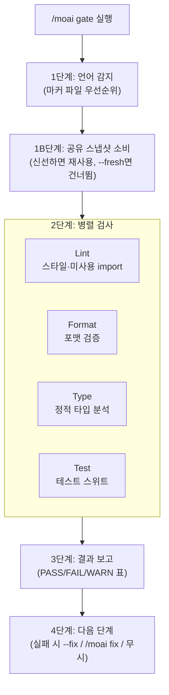

커밋 전 품질을 빠르게 검증하는 **경량 게이트** 명령어입니다. 린트·포맷·타입 검사·테스트를 **병렬로** 실행하여 대부분의 프로젝트에서 30초 이내에 완료됩니다.


**한 줄 요약**: `/moai gate`는 "커밋 전 빠른 검문소" 입니다. 4가지 검사 (린트·포맷·타입·테스트) 를 동시에 돌려 통과/실패를 즉시 알려줍니다 — 전체 코드 리뷰나 커버리지 분석 없이 빠르게.



**슬래시 커맨드**: Claude Code에서 `/moai:gate`를 입력하면 이 명령어를 바로 실행할 수 있습니다. `/moai`만 입력하면 사용 가능한 모든 서브커맨드 목록이 표시됩니다.


## 개요

커밋하기 전에 "지금 상태가 깨끗한가?"를 확인하고 싶을 때 사용합니다. `/moai review` (심층 4관점 리뷰) 나 sync 파이프라인의 전체 품질 검사와 달리, `/moai gate`는 **빠른 통과/실패 판정**만 제공합니다.

| 워크플로우 | 범위 | 속도 | 사용 시점 |
|-----------|------|------|-----------|
| `/moai gate` | 린트 + 포맷 + 타입 + 테스트 | 빠름 (<30초) | 매 커밋 전 |
| `/moai review` | 4관점 심층 코드 리뷰 | 중간 (2-5분) | PR 전, 설계 리뷰 |
| sync 품질 검사 | 전체 품질 + 코드 리뷰 + 커버리지 | 느림 (5-10분) | sync 파이프라인 일부 |

## 사용법

```bash
# 전체 검사
> /moai gate

# 린트·포맷 자동 수정
> /moai gate --fix

# 스테이징된 파일만 검사
> /moai gate --staged

# 특정 파일만 검사
> /moai gate --file src/auth/service.go
```

## 지원 플래그

| 플래그 | 설명 | 예시 |
|-------|------|------|
| `--fix` | 린트·포맷 이슈 자동 수정 (기본값: 보고만) | `/moai gate --fix` |
| `--staged` | `git diff --staged` 파일만 검사 (테스트는 항상 전체 실행) | `/moai gate --staged` |
| `--file PATH` | 특정 파일만 검사 | `/moai gate --file src/api.go` |
| `--fresh` | fresh 모드 강제 — 공유 진단 스냅샷 재사용을 모두 끄고 모든 검사를 새로 실행 | `/moai gate --fresh` |

## 실행 과정



### 1단계: 언어 감지

마커 파일을 우선순위대로 확인하여 (첫 매칭이 이김) 언어별 도구 체인을 선택합니다. 16개 지원 언어를 동등하게 다루며, 예를 들어 Go는 `go vet`·`golangci-lint`·`go test -race`, Python은 `ruff`·`mypy`·`pytest`가 실행됩니다. 인식되는 마커가 없으면 언어별 검사를 건너뛰고 "unknown language"를 보고합니다.

### 1B단계: 공유 진단 스냅샷 소비

검사를 실행하기 전, 현재 작업 트리에 대한 공유 진단 스냅샷을 조회합니다. 신선한 스냅샷(키 일치 + TTL 이내, 기본 10분)이 이 게이트가 돌릴 검사 카테고리를 커버하면, 재실행 대신 기록된 결과를 재사용하고 보고서에 `Test | PASS (snapshot)`처럼 표시합니다. 오래된 스냅샷은 증거로 인용하지 않고 다시 실행합니다. `--fresh` 모드에서는 이 단계를 통째로 건너뜁니다.

### 2단계: 병렬 검사

4가지 검사를 백그라운드로 동시에 실행합니다.

| 검사 | 대상 | `--fix` 동작 |
|------|------|--------------|
| **Lint** | 스타일 위반, 미사용 import, 데드 코드 | 자동 수정 가능 항목 교정 |
| **Format** | 포맷되지 않은 파일 | 자동 포맷 |
| **Type** | 타입 오류, 누락된 어노테이션 | 자동 수정 없음 (수동 개입) |
| **Test** | 테스트 실패 | 자동 수정 없음 (원인 조사 필요) |

개별 검사 타임아웃은 60초, 전체 게이트 타임아웃은 90초입니다. 타임아웃되면 WARNING으로 보고하되 차단하지는 않습니다. 실제로 실행된(재사용이 아닌) 검사 결과는 `.moai/state/verify/` 아래 공유 스냅샷 스토어에 기록되어, 다운스트림 소비자(run-phase 사전 리뷰 게이트, sync 사전 게이트, stop-goal 평가기)가 작업 트리가 바뀌지 않는 한 재사용할 수 있습니다.

### 3단계: 결과 보고

```
## Quality Gate: PASS
| Check  | Status | Time  |
|--------|--------|-------|
| Lint   | PASS   | 2.1s  |
| Format | PASS   | 0.8s  |
| Type   | PASS   | 3.2s  |
| Test   | PASS   | 12.4s |
Total: 18.5s
```

### 4단계: 다음 단계

모두 통과하면 커밋 준비 완료 메시지를 표시합니다. `--fix` 없이 실패하면 `AskUserQuestion`으로 다음을 제시합니다 — 자동 수정 (`--fix` 재실행, 권장) / `/moai fix` (심층 해결) / 무시하고 진행. `--fix` 이후에도 남은 이슈 (타입 오류·테스트 실패) 는 수동 조사를 권합니다.

## 다른 명령어와의 관계

`/moai gate`는 검증만 하고 파일을 수정하지 않는 **경량 검문소**입니다 (`--fix`를 줄 때만 린트·포맷을 교정). 더 깊은 해결이 필요하면 `/moai fix` (단발) 나 `/moai loop` (반복) 로 넘어가고, PR 전 종합 리뷰는 `/moai review`를 사용합니다. `--fresh` 모드는 `/moai loop`의 독립 최종 검증 패스가 자기 참조 없는 증거를 얻기 위해 이 게이트를 호출할 때 쓰입니다.

## 관련 문서

- [/moai fix - 일회성 자동 수정](/utility-commands/moai-fix)
- [/moai loop - 반복 수정 루프](/utility-commands/moai-loop)
- [TRUST 5 품질 시스템](/core-concepts/trust-5)
