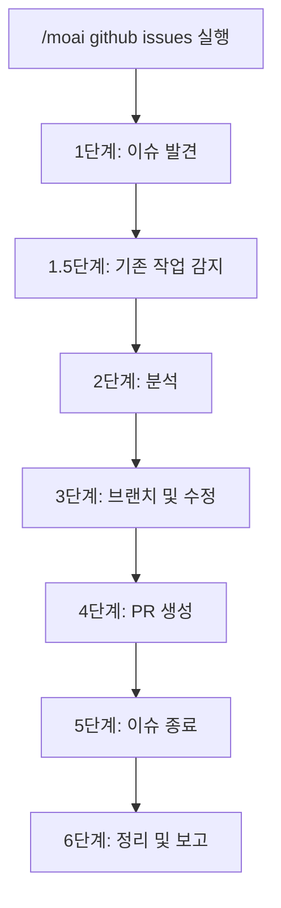
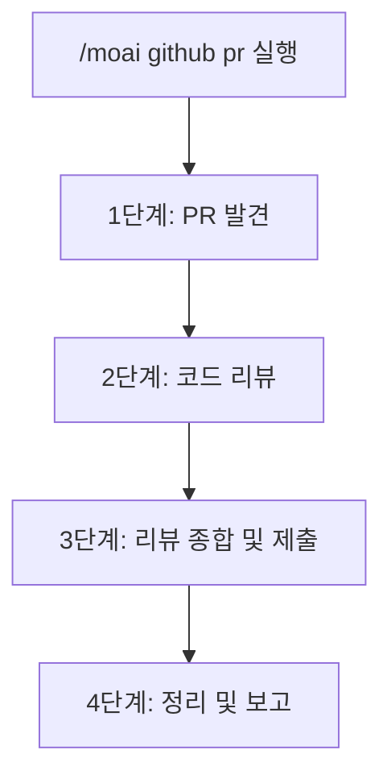

GitHub 이슈 수정 및 PR 코드 리뷰 자동화 (Agent Teams 지원).


**한 줄 요약**: `/moai github`는 Agent Teams를 사용하여 **GitHub 이슈를 자동으로 수정하고 PR을 다각도로 분석하여 리뷰**합니다.



**슬래시 커맨드**: Claude Code에서 `/moai:github`를 입력하여 직접 실행합니다. `/moai`만 입력하면 사용 가능한 모든 서브커맨드 목록을 볼 수 있습니다.


## 개요

`/moai github`는 두 가지 주요 워크플로우를 제공합니다:

- **issues**: GitHub 이슈를 가져와서 원인을 분석하고, 수정을 구현하며, PR을 생성
- **pr**: PR을 가져와서 다각도 코드 리뷰를 수행하고, 리뷰 코멘트를 제출


**중요**: 이 커맨드를 사용하려면 GitHub CLI (`gh`)가 설치되어 있고 인증되어 있어야 합니다.


## 사용법

### 이슈 수정 워크플로우

```bash
# 열려 있는 이슈 목록 표시 후 선택
> /moai github issues

# 특정 이슈 수정
> /moai github issues 123

# 특정 라벨의 이슈 수정
> /moai github issues --label bug

# 모든 열려 있는 이슈 수정 (배치 모드)
> /moai github issues --all

# CI 통과 후 자동 병합
> /moai github issues 123 --merge
```

### PR 리뷰 워크플로우

```bash
# 열려 있는 PR 목록 표시 후 선택
> /moai github pr

# 특정 PR 리뷰
> /moai github pr 456

# 모든 열려 있는 PR 리뷰
> /moai github pr --all

# 승인 후 자동 병합
> /moai github pr 456 --merge

# 서브에이전트 모드 강제 (Agent Teams 건너뛰기)
> /moai github pr 456 --solo
```

## 지원하는 플래그

| 플래그 | 설명 | 예시 |
|------|------|---------|
| `--all` | 모든 열려 있는 항목 처리 | `/moai github issues --all` |
| `--label LABEL` | 라벨로 이슈 필터링 | `/moai github issues --label bug` |
| `--merge` | CI 통과 후 자동 병합 | `/moai github pr 123 --merge` |
| `--solo` | 서브에이전트 모드 강제 | `/moai github issues --solo` |
| `--tmux` | 병렬 작업을 위한 tmux 세션 생성 | `/moai github issues --tmux` |

## 이슈 워크플로우

이슈 워크플로우는 다음 단계를 따릅니다:



### 1단계: 이슈 발견

1. GitHub에서 열려 있는 이슈 가져오기
2. 이슈 목록 표시 또는 라벨/번호로 필터링
3. 유형별 이슈 분류 (버그, 기능, 개선, 문서)

### 1.5단계: 기존 작업 감지

분석을 시작하기 전, 워크플로우는 기존 봇 작업을 확인합니다:

- @claude 봇 브랜치 감지
- 이슈를 참조하는 기존 PR 확인
- 기존 작업을 재사용할지 처음부터 다시 할지 사용자에게 질문

| 봇 브랜치 | PR 존재 | 작업 |
|-----------|---------|------|
| 예 | 예 (병합됨) | 이슈 건너뛰기 (이미 해결됨) |
| 예 | 예 (열림) | 질문: 기존 PR 검토 / 다시 수정 |
| 아니요 | 예 (열림) | 질문: 기존 PR 검토 / 작업 계속 |
| 아니요 | 아니요 | 정상 분석 진행 |

### 2단계: 분석

**팀 모드 (기본값):**

병렬 이슈 분석을 위해 팀 생성:

- **분석가 팀메이트**: 코드베이스 탐색, 근본 원인 식별
- **코더 팀메이트**: 격리된 워크트리에서 수정 구현
- **검증자 팀메이트**: 수정 검증 및 테스트 커버리지 확인

**서브에이전트 모드 (--solo):**

적절한 전문가 에이전트에게 위임:
- 버그 수정: expert-debug 서브에이전트
- 기능: expert-backend 또는 expert-frontend 서브에이전트
- 개선: expert-refactoring 서브에이전트

### 3단계: 브랜치 및 수정

1. 이슈 유형에 따라 기능 브랜치 생성:
   - 버그: `fix/issue-{number}`
   - 기능: `feat/issue-{number}`
   - 개선: `improve/issue-{number}`
   - 문서: `docs/issue-{number}`

2. 테스트와 함께 수정 구현
3. 테스트 통과 확인
4. `Fixes #{number}` 참조와 함께 변경사항 커밋

### 4단계: PR 생성

다음 내용으로 PR 생성:
- 제목: `{type}: {issue title}`
- 본문: 수정 요약, 테스트 계획, 이슈 참조
- `Fixes #{number}`를 통한 이슈 자동 연결

### 5단계: 이슈 종료

PR 병합 후, 다국어 코멘트로 이슈 종료:

```
이슈가 성공적으로 해결되었습니다!

구현: {요약}
관련 PR: #{pr_number}
병합 시간: {timestamp} {timezone}
테스트 커버리지: {coverage}%
```

지원 언어: 영어, 한국어, 일본어, 중국어

## PR 리뷰 워크플로우

PR 워크플로우는 다각도 코드 리뷰를 수행합니다:



### 2단계: 다각도 리뷰

**팀 모드 (기본값):**

세 명의 리뷰어가 PR을 병렬로 분석:

| 리뷰어 | 관점 | 집중 영역 |
|----------|-------------|-------------|
| **security-reviewer** | 보안 | 인젝션 위험, 인증/인가, 데이터 노출, OWASP Top 10 |
| **perf-reviewer** | 성능 | 알고리즘 복잡도, 데이터베이스 패턴, 메모리 누수, 동시성 |
| **quality-reviewer** | 품질 | 정확성, 테스트 커버리지, 명명, 오류 처리 |

**서브에이전트 모드 (--solo):**

다음 에이전트가 순차적으로 리뷰:
1. expert-security 서브에이전트
2. expert-performance 서브에이전트
3. manager-quality 서브에이전트

### 3단계: 리뷰 제출

발견된 내용은 심각도별로 분류:

- **Critical**: 병합 전 수정 필수 (보안 취약점, 데이터 손실 위험)
- **Important**: 수정 권장 (성능 문제, 오류 처리 누락)
- **Suggestion**: 개선 제안 (명명, 스타일, 사소한 개선사항)

리뷰 작업 옵션:
- **Approve**: 요약과 함께 승인 제출
- **Request Changes**: 필수 변경사항과 함께 제출
- **Comment Only**: 승인 결정 없이 코멘트만 제출

## 봇 리뷰 통합

PR 병합 시, 병합 전 봇 리뷰 상태 확인:

| 봇 | 리뷰 상태 | 작업 |
|-----|-------------|--------|
| CodeRabbit | CHANGES_REQUESTED | 피드백 수정 후 `@coderabbitai resolve` 게시 |
| CodeRabbit | APPROVED | 병합 진행 |
| CodeRabbit | COMMENTED | 코멘트 검토, Critical/Important이면 수정 |
| 봇 리뷰 없음 | - | 병합 진행 |

## 자동 병합 안전 프로토콜

병합 시도 전 다음을 확인:

1. **병합 가능성 확인**: `CLEAN`, `BEHIND`, `BLOCKED`, 또는 `DIRTY`
2. **리뷰 결정 확인**: `APPROVED`, `CHANGES_REQUESTED`, 또는 없음
3. **CI 상태 확인**: 모든 필수 체크 통과 필수

| 병합 상태 | 작업 |
|-------------|--------|
| CLEAN | 병합 진행 |
| BEHIND | 브랜치 업데이트, CI 대기, 재시도 |
| BLOCKED | 차단 요소 해결 (리뷰/CI) |
| DIRTY | 충돌 보고, 자동 병합 불가 |

## 에이전트 모드

### 팀 모드 (기본값)

Agent Teams 모드는 병렬 다각도 분석 제공:

- **전제조건**: `CLAUDE_CODE_EXPERIMENTAL_AGENT_TEAMS=1` 및 `workflow.team.enabled: true`
- **장점**: 더 빠른 분석, 동시 다각도 관점
- **격리**: 각 팀메이트는 격리된 워크트리에서 작업

### 서브에이전트 모드 (--solo)

Agent Teams를 사용할 수 없을 때의 대체 모드:

- 순차적 에이전트 위임
- 단일 컨텍스트 창
- 더 간단한 디버깅

## tmux 병렬 개발

`--tmux` 플래그 제공 시:

1. tmux 세션 생성: `github-issues-{timestamp}`
2. 이슈 워크트리당 창 하나 (최대 3개 표시)
3. 각 창은 워크트리 진입 자동 실행
4. 생성 후 첫 번째 창으로 포커스 반환

레이아웃:
- 창 1-3: 세로 분할
- 창 4+: 가로 분할

## Git 워크플로우 설정

`.moai/config/sections/system.yaml`의 `github.git_workflow`를 읽음:

| 전략 | 브랜치 동작 | PR 대상 |
|----------|----------------|-----------|
| **github_flow** | 기능 브랜치 생성 | main |
| **gitflow** | 기능 브랜치 생성 | develop |
| **main_direct** | main에 유지 | main (PR 없음) |

## 자주 묻는 질문

### Q: 수정 중 테스트가 실패하면 어떻게 되나요?

워크플로우는 오류 컨텍스트와 함께 최대 3회 재시도합니다. 여전히 실패하면 사용자에게 재시도, 건너뛰기 또는 중단을 묻습니다.

### Q: 자동 병합 없이 PR을 리뷰할 수 있나요?

네, `--merge` 플래그를 제외하세요. 리뷰가 제출되지만 병합되지 않습니다.

### Q: 병합 후 이슈가 어떻게 종료되나요?

구현 요약, PR 링크, 병합 타임스탬프, 테스트 커버리지가 포함된 다국어 코멘트(EN/KO/JA/ZH)로 이슈가 종료됩니다.

### Q: CodeRabbit이 변경을 요청하면 어떻게 되나요?

워크플로우:
1. 리뷰 코멘트 파싱
2. 전문가 에이전트에게 수정 위임
3. PR 브랜치에 수정사항 푸시
4. `@coderabbitai resolve` 코멘트 게시
5. 재리뷰 대기 (최대 5분)

### Q: 여러 이슈를 동시에 처리할 수 있나요?

네, 배치 모드에는 `--all` 플래그를 사용하세요. 브랜치 충돌을 방지하기 위해 이슈가 순차적으로 처리됩니다.

## 관련 문서

- [/moai - 완전 자동화](/utility-commands/moai)
- [/moai pr - 풀 리퀘스트 관리](/workflow-commands/moai-sync)
- [Git Worktree 가이드](/worktree/guide)
