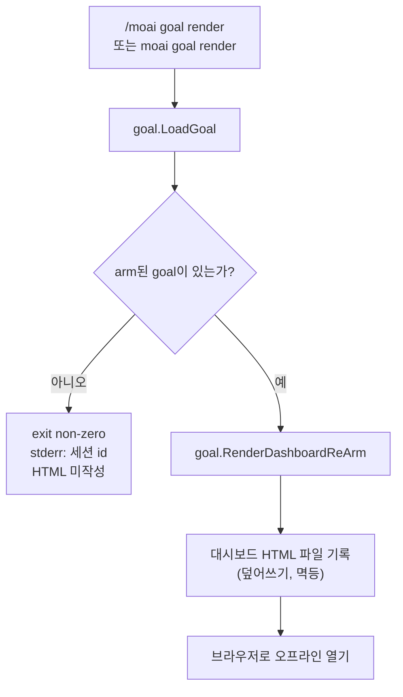

완료 조건을 선언하면 세션이 그 조건을 충족할 때까지 스스로 일하는 **조건 선언형 자율 루프** 명령어입니다. `/moai goal "<조건>"`으로 완료 조건을 arm하면, 매 턴 종료 시 `stop-goal` Stop 훅이 조건 충족 여부를 평가하여 충족될 때까지 다음 턴을 자동으로 시작합니다.


**한 줄 요약**: `/moai goal`은 "끝 상태를 선언하는 범용 루프" 입니다. `/moai loop`가 "진단 도구가 찾은 문제를 다 없앨 때까지"라는 조건이 미리 정해진 프리셋이라면, `/moai goal`은 완료 조건을 **직접 선언**하는 범용 엔진입니다.



**프로그래매틱 명령어**: 네이티브 Claude Code `/goal`은 사용자만 입력할 수 있는 (HUMAN-ONLY) TUI 커맨드입니다. `/moai goal`은 같은 동작을 **파이프라인 안에서 프로그래매틱하게** 다시 구현한 MoAI 소유 명령어로, `moai` 스킬 라우팅과 `moai goal` CLI로 진입합니다.


## 개요

에이전트에게 "이 조건이 만족될 때까지 알아서 계속 일해줘"라고 시키고 싶을 때 씁니다. 조건은 두 종류를 섞어 쓸 수 있습니다.

- **기계적 조건 (mechanical)**: 셸 명령어로 판정하는 조건. 예를 들어 `go test ./... exits 0`이라면, 명령을 돌려 보고 종료 코드를 확인합니다.
- **모델 평가 조건 (model-evaluated)**: 트랜스크립트를 읽고 판단하는 조건. 예를 들어 `모든 AC 행이 PASS로 기록됨`이라면, 세션이 지금까지 남긴 내용을 근거로 판정합니다.

이 루프가 v3의 세 가지 핵심 중 하나인 **에이전틱 루프 엔지니어링**의 범용 엔진입니다. goal 상태는 `.moai/state/goal/<session-id>.json`에 세션별로 저장되며 (공유 파일이 아닙니다), **턴 상한 (기본 30)** 이 루프가 무한정 돌지 않게 막습니다. 상한에 닿으면 평가기가 5-섹션 판정 (Claim / Evidence / Baseline-attribution / Gaps / Residual-risk) 을 내고 블로킹을 멈춥니다. `--max-turns 0`을 주면 오토컴팩트 경계를 넘어 유지되는 무한 goal이 도는데, 턴 수 대신 `--max-duration` (실행 시간) 과 정체 가드가 실제 상한이 된다. 실제 상한 없이 `--max-turns 0`만 arm하면 arm 시점에 거부된다 (fail-closed).

## 동사 (verbs)

### `/moai goal "<조건>"` — 등록 + arm

조건 텍스트를 등록하고 활성 세션에 goal을 arm합니다. 조건은 `conditions[]` 배열로 파싱되는데, 셸 명령 문자열만 있으면 기계적 조건이고 트랜스크립트를 가리키는 주장이면 모델 조건입니다. arm하면 `.moai/state/goal/<session-id>.json`이 원자적으로 (temp+rename) 기록되고, `stop-goal` Stop 훅이 다음 턴이 끝날 때 이를 집어 평가를 시작합니다.

```bash
> /moai goal "go test ./... exits 0; 모든 AC가 PASS로 기록, 또는 30턴 후 중단"
```

### `/moai goal status [--all]`

활성 세션의 goal (또는 `--all`로 모든 세션의 goal) 을 출력합니다. 조건 텍스트, conditions 배열, 쓴 턴 수와 상한, 진행 로그, 라이프사이클 상태 (`armed` / `satisfied` / `ceiling-exit` / `cleared`) 를 보여 줍니다.

### `/moai goal clear`

활성 세션의 goal을 해제합니다 (상태 파일 삭제). Stop 훅은 arm된 goal이 없음을 보고 블로킹을 멈춥니다. 오케스트레이터가 모델 조건을 충족했다고 판정해 루프를 끝낼 때 씁니다.


**`resume` 동사는 없습니다.** 한때 이야기되던 `resume` (해제한 goal을 아카이브에서 되살리는 동사) 은 지금 CLI에 들어 있지 않습니다. `moai goal --help`에도 `resume`은 빠져 있고 `arm` / `status` / `clear` / `render`만 보입니다. `clear`가 상태 파일을 아카이브로 남기지 않고 아예 **삭제**하기 때문에, 되살릴 원본 자체가 없습니다.


### `/moai goal render` — 대시보드 HTML 렌더

활성 세션의 goal 상태를 **자체 완결형 HTML 대시보드**로 렌더해 `.moai/state/goal/<session-id>.html`에 씁니다. 멱등(idempotent)이라 다시 실행하면 같은 경로를 덮어씁니다. 슬래시 커맨드(`/moai goal render`)와 터미널 CLI(`moai goal render`) 양쪽으로 모두 호출할 수 있고, 둘 다 같은 `goal.RenderDashboardReArm`를 호출합니다. arm된 goal이 없으면 0이 아닌 종료 코드와 함께 세션 id를 stderr로 출력하고 HTML을 쓰지 않습니다. `--json` 플래그를 붙이면 `{action, session_id, path, bytes}`를 내보냅니다. 렌더링되는 내용과 보안 속성은 아래 [목표 대시보드](#목표-대시보드) 섹션을 참고하세요.

## 진행 모드 (자율 / 반자율)

오케스트레이터가 구현 착수 승인 (plan→run 경계의 `AskUserQuestion`) 을 물을 때, 승인이냐 거절이냐와는 **별개의 선택지**로 **자율이냐 반자율이냐** 하는 진행 모드를 함께 고르게 합니다. 고른 모드는 goal 상태의 `progression_mode` 필드에 저장됩니다 (따로 고르지 않으면 기본값은 `autonomous`입니다).

| 모드 | 동작 |
|------|------|
| **자율 (autonomous, 기본)** | 평가기가 조건 충족 또는 상한 도달까지 매 턴 블로킹하며, 턴마다 사용자에게 묻지 않습니다. 기존 Stop 훅 동작 그대로입니다. |
| **반자율 (semi-autonomous)** | `stop-goal` 훅이 매 턴 경계에서 **체크포인트 신호** 블록 JSON을 내보내고, 오케스트레이터가 이를 읽어 `AskUserQuestion` 확인 라운드 (계속 / goal 해제 / 자율로 전환) 를 돌립니다. 훅 자체는 절대 `AskUserQuestion`을 호출하지 않습니다 (훅·서브에이전트 경계 — 구조화 JSON만 방출). |


**승인은 두 모드 모두에서 반드시 거칩니다.** 진행 모드 선택은 게이트를 통과한 **다음에** 무엇을 할지 정할 뿐, 게이트를 비켜 가지도 구현 착수 승인을 느슨하게 만들지도 않습니다. arm된 goal은 어떤 모드에서도 run-phase 진입을 승인하거나, PR을 만들거나, 되돌릴 수 없는 작업을 하지 않습니다.


## 안전 불변식

1. **구현 착수 승인은 두 모드 모두 필수** — 진행 모드는 승인 이후의 진행 선택이지 게이트 완화가 아니며, 점수와 무관하게 유지됩니다.
2. **arm된 goal은 게이트를 우회하지 않음** — PR을 자동 생성하지 않고, 파괴적 작업을 수행하지 않습니다. 평가기는 턴을 계속할지 여부만 결정하며, 되돌릴 수 없는 작업을 사전 승인하지 않습니다.
3. **`stop-goal` 훅은 `AskUserQuestion`을 호출하지 않음** — 구조화 JSON만 방출합니다 (훅·서브에이전트 경계).
4. **정체 가드 (stagnation guard)** — N회 연속 무진전 반복이 감지되면 루프를 멈추고 E1/E3 에스컬레이션 노트를 담은 5-섹션 판정을 냅니다.

## goal 조건은 빨라야 합니다

평가기는 턴이 끝날 때마다 돌아갑니다. 전체 스위트 대신 `go test -run <pattern>`을, 오래 걸리는 명령 대신 결과가 일정한 명령을 쓰세요. `stop-goal`의 Stop 훅 타임아웃이 120초이긴 하지만, 명령이 빨라야 턴이 촘촘하게 돌아갑니다.

## /moai loop과의 관계

`/moai loop`는 **goal 엔진 위의 프리셋**입니다. `/moai goal`이 사용자가 완료 조건을 직접 선언하는 범용 루프라면, `/moai loop`는 "진단 도구가 찾은 이슈 큐를 다 비울 때까지"라는 조건을 미리 채워 넣은 프리셋입니다.

| 엔진 | 목표 | 완료 조건 |
|------|------|----------|
| `/moai goal` | 조건 선언형 범용 루프 | 사용자 정의 조건식 만족 |
| `/moai loop` | 진단 수정 루프 (프리셋) | 이슈 큐 비움 + 진단 클린 (0 에러 / 테스트 통과 / 커버리지) |

끝 상태를 조건식으로 표현할 수 있다면 `/moai goal`, "도구가 찾는 문제를 전부 없애줘"라면 `/moai loop`가 맞습니다.

## 목표 대시보드

`render` 동사는 현재 세션의 goal 상태를 정적 HTML 대시보드 하나로 렌더해 `.moai/state/goal/<session-id>.html`에 씁니다. 이 파일은 외부 JS·CSS 프레임워크나 CDN에 의존하지 않고 인라인 CSS만 쓰기 때문에 브라우저로 오프라인에서 바로 열리며, 이메일 첨부나 슬랙 드래그앤드롭으로도 깨지지 않습니다.




**자체 완결형 HTML**: 외부 리소스가 없어 네트워크가 끊겨도 열립니다. 렌더 시점의 goal 상태가 파일 안에 완전히 직렬화됩니다.


**대시보드에 표시되는 내용**: v3.1(PR #1388)부터 렌더러가 프로덕션에 연결되어, 판정·재무장 상태가 실제 대시보드에 표시됩니다.

- **머리글** — 세션 id, 라이프사이클 상태 (`armed` / `satisfied` / `ceiling-exit` / `cleared`), 턴 사용량/상한, 진행 모드 (`autonomous` / `semi-autonomous`), 생성 타임스탬프
- **조건 선언부** — goal 조건 텍스트를 테두리 블록 안에 그대로 표시
- **선언된 조건 표 (Declared Conditions)** — 각 condition을 표로 나열. 기계적 조건은 `<명령어> (expect exit N)` 형태로, 모델 평가 조건은 주장(claim) 텍스트 그대로 표시
- **판정 섹션 (천장 exit 시 활성화)** — `stop-goal` 평가기가 턴 상한·정체 가드·벽시계 상한에 닿는 exit 턴에 한해 사이드카 `.moai/state/goal/<sid>.verdict.json` 에 5-섹션 천장 판정 (Claim / Evidence / Baseline-attribution / Gaps / Residual-risk) 을 기록합니다. `moai goal render`는 렌더 시점에 이 사이드카를 불러와 턴/상한 줄, 실패한 조건 표, 5-섹션 판정을 모두 채워 넣습니다. 판정 사이드카가 없는 일반 턴 다음에 렌더하면 "아직 판정 없음" 자리표시자가 표시됩니다 (사이드카는 exit 턴에만 기록되므로).
- **재무장 (re-arm) 조건부 보기** — 렌더 시점의 보류/활성 상태에서 세 가지 조건부 보기를 자동으로 구성해 표시합니다: (1) `/clear` 시 보류 중인 goal이 재무장될 것이라는 표시, (2) 새 id로 재무장됨 보기, (3) D8 무한 goal 거절 배너. 조건이 해당하지 않으면 각 보기는 숨겨집니다.

**XSS 자동 이스케이프**: 모든 신뢰할 수 없는 필드는 Go 표준 라이브러리 `html/template`의 `{{.Field}}` 문법으로 렌더되어 자동 이스케이프됩니다. 조건 텍스트나 조건 값에 `<script>` 페이로드가 들어가도 HTML 엔티티로 변환되어 실행되지 않습니다. goal 조건에는 셸 명령 문자열과 자유 텍스트가 섞여 들어갈 수 있으므로, 이 자동 이스케이프는 의미 있는 보안 속성입니다.

**`clear`와 연계된 형제 HTML 정리**: `moai goal clear`는 상태 파일(`<session>.json`)과 함께 형제 `<session>.html` 대시보드 파일도 삭제합니다. 또한 `PruneOrphans`가 고아가 된 `.html`을 `.json`과 함께 `consumed/` 아카이브 디렉터리로 옮깁니다 (best-effort). 덕분에 상태 디렉터리에 오래된 대시보드가 쌓이지 않습니다.

## 로드맵

 렌더러는 준비됐지만 후속 릴리즈에서 연결될 표면입니다.

-  **LIVE 대시보드 (턴마다 자동 갱신)** — 현재는 `moai goal render`를 호출한 시점의 정적 스냅샷을 렌더합니다. 후속 릴리즈에서는 `stop-goal` Stop 훅이 매 턴을 마칠 때마다 `.html` 파일을 자동으로 다시 써서, 브라우저를 새로고침하면 진행 상황이 실시간으로 보이는 LIVE 보드로 바뀔 예정입니다.


**재무장 메커니즘은 이미 출하됨**: 재무장 로직 자체(세션 핸드오프 임베드 + `/clear` 시 재무장 + D8 무한 goal 거절 방어)는 앞선 SPEC-INFINITE-GOAL-001에서 이미 출하됐습니다. v3.1(PR #1388)에서 새로 들어온 것은 그 메커니즘 상태를 대시보드 UI에 **표면화**하는 부분만 해당합니다.


## 관련 문서

- [/moai loop - 반복 수정 루프](/utility-commands/moai-loop)
- [/moai fix - 일회성 자동 수정](/utility-commands/moai-fix)
- [/moai - 완전 자율 자동화](/utility-commands/moai)
