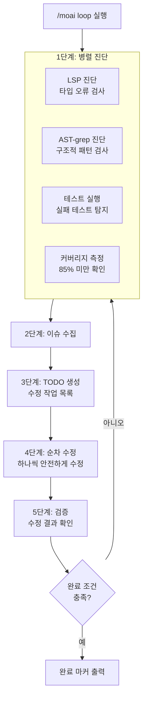
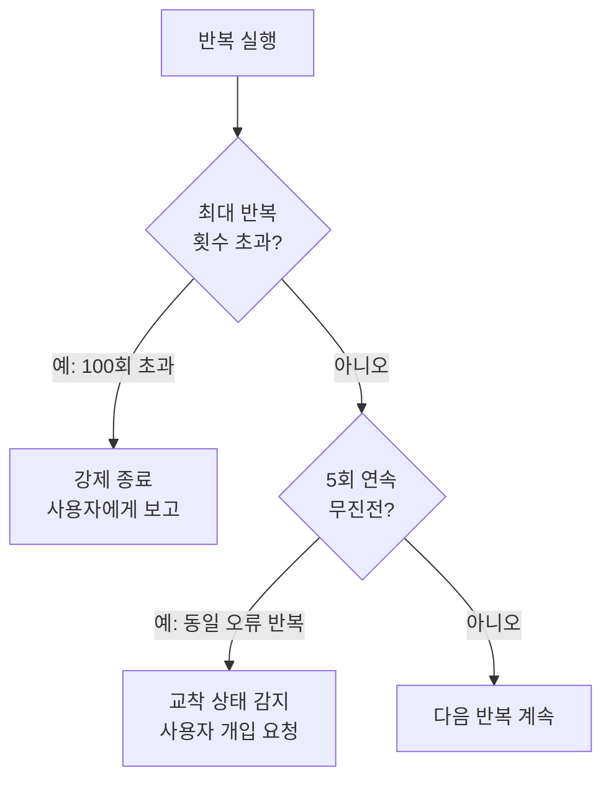
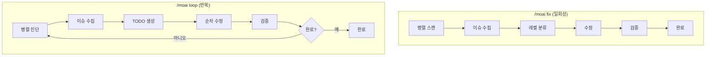
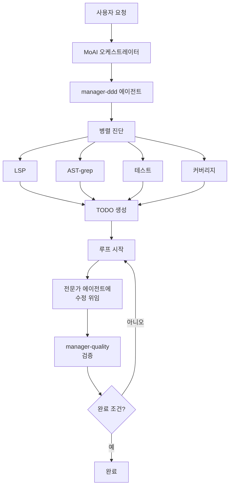

# /moai loop

자율 반복 수정 루프 명령어입니다. AI가 스스로 문제를 진단하고, 수정하고,
검증하는 과정을 **오류가 모두 해결될 때까지** 자동으로 반복합니다.


  **한 줄 요약**: `/moai loop`는 "Ralph Engine" 이라는 자율 수정 엔진입니다.
  **진단 → 수정 → 검증**을 반복하여 코드의 모든 문제를 자동으로 해결합니다.



**슬래시 커맨드**: Claude Code에서 `/moai:loop`를 입력하면 이 명령어를 바로 실행할 수 있습니다. `/moai`만 입력하면 사용 가능한 모든 서브커맨드 목록이 표시됩니다.


## 개요

코드를 작성하다 보면 타입 오류, 린트 경고, 테스트 실패 등 여러 문제가 동시에
발생할 수 있습니다. 이런 문제를 하나씩 수동으로 고치는 대신, `/moai loop`를
실행하면 AI가 모든 문제를 **자동으로 반복 수정**합니다.

`/moai fix`가 **한 번만** 수정하는 것과 달리, `/moai loop`는 **완료 조건을
만족할 때까지** 계속 반복합니다.

## 사용법

```bash
> /moai loop
```

별도의 인수 없이 실행하면, 현재 프로젝트의 모든 문제를 자동으로 찾아 수정합니다.

## 지원 플래그

| 플래그                                   | 설명                             | 예시                          |
| ---------------------------------------- | -------------------------------- | ----------------------------- |
| `--max N` (또는 `--max-iterations`)      | 최대 반복 횟수 제한 (기본값 100) | `/moai loop --max 10`         |
| `--path <path>`                          | 특정 경로만 대상으로 지정        | `/moai loop --path src/auth/` |
| `--stop-on {level}`                      | 특정 레벨 이상에서 중단          | `/moai loop --stop-on 3`      |
| `--auto` (또는 `--auto-fix`)             | 자동 수정 활성화 (기본 Level 1)  | `/moai loop --auto`           |
| `--sequential` (또는 `--seq`)            | 순차 진단 instead of 병렬        | `/moai loop --sequential`     |
| `--errors` (또는 `--errors-only`)        | 오류만 수정, 경고 건너뜀         | `/moai loop --errors`         |
| `--coverage` (또는 `--include-coverage`) | 커버리지 포함 (기본값 85%)       | `/moai loop --coverage`       |
| `--memory-check`                         | 메모리 압력 감지 활성화          | `/moai loop --memory-check`   |
| `--resume ID` (또는 `--resume-from`)     | 스냅샷에서 재개                  | `/moai loop --resume latest`  |

### --max 플래그

반복 횟수를 제한합니다:

```bash
# 최대 10회만 반복
> /moai loop --max 10
```


  무한 루프를 방지하기 위해 기본값은 100회입니다. 대부분의 경우 10회 이내에
  완료됩니다.


## 실행 과정

`/moai loop`는 매 반복(iteration)마다 다음 과정을 거칩니다.



### 1단계: 병렬 진단

4가지 진단 도구가 **동시에** 실행되어 프로젝트의 모든 문제를 빠르게 파악합니다.

| 진단 도구    | 검사 대상     | 발견하는 문제 예시                           |
| ------------ | ------------- | -------------------------------------------- |
| **LSP**      | 타입 시스템   | 타입 불일치, 미정의 변수, 잘못된 인수        |
| **AST-grep** | 코드 구조     | 사용하지 않는 import, 위험한 패턴, 코드 스멜 |
| **Tests**    | 테스트 실행   | 실패하는 테스트, 에러 발생                   |
| **Coverage** | 커버리지 측정 | 85% 미만인 모듈                              |


  **병렬 진단이란?** 4가지 진단을 **동시에** 실행하므로, 순차적으로 하나씩
  실행하는 것보다 약 4배 빠릅니다. 이렇게 수집된 문제들은 하나의 목록으로
  합쳐집니다.


### 2단계: 이슈 수집

병렬 진단에서 발견된 모든 문제를 하나의 목록으로 정리합니다.

```
발견된 이슈 (예시):
  [LSP] src/auth/service.py:42 - "str" 타입에 "int" 할당 불가
  [LSP] src/auth/router.py:15 - "User" 타입 미정의
  [AST] src/utils/helper.py:3 - 사용하지 않는 import "os"
  [TEST] tests/test_auth.py::test_login - AssertionError
  [COV] src/auth/service.py - 커버리지 62% (목표 85%)
```

### 3단계: TODO 생성

수집된 이슈를 기반으로 수정 작업 목록 (TODO) 을 자동 생성합니다. 이때 **의존성
순서**를 고려하여 수정 순서를 결정합니다.

예를 들어 타입 정의가 누락된 경우, 해당 타입을 먼저 추가한 후 그 타입을 사용하는
코드를 수정합니다.

### 4단계: 순차 수정

TODO 목록의 항목을 **하나씩 순차적으로** 수정합니다. 병렬로 수정하면 서로 충돌할
수 있기 때문에, 안전하게 하나씩 처리합니다.

### 5단계: 검증

수정이 끝나면 다시 진단을 실행하여 문제가 해결되었는지 확인합니다. 아직 남은
문제가 있으면 1단계로 돌아가 반복합니다.

## 루프 방지 메커니즘

무한 루프를 방지하기 위해 두 가지 안전장치가 있습니다.



| 안전장치           | 조건               | 동작                                              |
| ------------------ | ------------------ | ------------------------------------------------- |
| **최대 반복 제한** | 100회 초과         | 루프를 강제 종료하고 현재 상태를 보고합니다       |
| **무진전 감지**    | 5회 연속 동일 오류 | 교착 상태로 판단하고 사용자에게 개입을 요청합니다 |


  **교착 상태가 발생하면?** AI가 같은 오류를 5번 연속으로 고치지 못하면,
  자동으로 중단하고 사용자에게 개입을 요청합니다. 이 경우 오류 내용을 직접
  확인하거나 힌트를 제공해주세요.


## 완료 조건

`/moai loop`는 다음 **세 가지 조건을 모두 만족**하면 루프를 종료합니다.

| 조건                | 기준              | 설명                                 |
| ------------------- | ----------------- | ------------------------------------ |
| **zero_errors**     | LSP 오류 0개      | 타입 오류, 구문 오류가 없어야 합니다 |
| **tests_pass**      | 모든 테스트 통과  | 실패하는 테스트가 없어야 합니다      |
| **coverage >= 85%** | 커버리지 85% 이상 | TRUST 5 품질 기준을 충족해야 합니다  |

## /moai fix와의 차이

`/moai fix`와 `/moai loop`는 비슷해 보이지만, 핵심적인 차이가 있습니다.



| 비교 항목     | `/moai fix`           | `/moai loop`            |
| ------------- | --------------------- | ----------------------- |
| **실행 횟수** | 1회                   | 완료될 때까지 반복      |
| **목표**      | 현재 보이는 오류 수정 | 모든 오류 완전 해결     |
| **레벨 분류** | 있음 (Level 1-4)      | 없음 (모든 이슈 처리)   |
| **승인 필요** | Level 3-4는 승인 필요 | 자율적으로 처리         |
| **소요 시간** | 짧음 (1-2분)          | 길 수 있음 (5-30분)     |
| **사용 시점** | 간단한 수정           | 대규모 리팩토링 후 정리 |


  **선택 가이드**: 오류가 몇 개 안 되면 `/moai fix`로 빠르게 해결하세요. 오류가
  많거나 서로 연관된 문제가 있으면 `/moai loop`가 더 효과적입니다.


## 에이전트 위임 체인

`/moai loop` 명령어의 에이전트 위임 흐름입니다:



**에이전트 역할:**

| 에이전트                | 역할      | 주요 작업            |
| ----------------------- | --------- | -------------------- |
| **MoAI 오케스트레이터** | 루프 조율 |
| **manager-ddd**         | 루프 관리 | TODO 생성, 수정 조율 |
| **expert-\***           | 수정 실행 | 실제 코드 수정       |
| **manager-quality**     | 품질 검증 | 완료 조건 확인       |

## 실전 예시

### 상황: DDD 구현 후 다수의 오류 발생

`/moai run`으로 코드를 구현한 후, 여러 오류가 남아있는 상황을 가정합니다.

```bash
# 현재 상태 확인
$ pytest --tb=short
# 3개 테스트 실패
# 커버리지: 71%

# LSP 오류 확인
# 5개 타입 오류, 2개 미정의 참조

# loop 실행
> /moai loop
```

**실행 로그:**

```
[반복 1/100]
  진단: LSP 오류 5개, 테스트 실패 3개, 커버리지 71%
  TODO: 7개 수정 작업 생성
  수정: 타입 오류 5개 해결
  검증: LSP 오류 0개, 테스트 실패 2개, 커버리지 71%

[반복 2/100]
  진단: 테스트 실패 2개, 커버리지 71%
  TODO: 2개 수정 작업 생성
  수정: 테스트 로직 수정 2건
  검증: LSP 오류 0개, 테스트 실패 0개, 커버리지 74%

[반복 3/100]
  진단: 커버리지 74% (목표 85%)
  TODO: 3개 테스트 추가 작업 생성
  수정: 누락된 테스트 케이스 추가
  검증: LSP 오류 0개, 테스트 실패 0개, 커버리지 87%

완료 조건 충족!
  - LSP 오류: 0개
  - 테스트: 모두 통과
  - 커버리지: 87%

DONE
```

이 예시에서 `/moai loop`는 3회 반복만에 모든 문제를 해결했습니다. 수동으로
했다면 각 오류를 하나씩 확인하고 수정해야 했을 것입니다.

## 자주 묻는 질문

### Q: `/moai loop`가 너무 오래 실행되면 어떻게 하나요?

`--max` 플래그로 반복 횟수를 제한하거나, `Ctrl+C`로 중단할 수 있습니다. 현재
상태가 저장되므로 나중에 다시 시작할 수 있습니다.

### Q: 특정 유형의 오류만 수정하고 싶다면?

`--stop-on` 플래그를 사용하세요:

```bash
# Level 3 이상에서 중단 (보안, 로직 오류는 수동 처리)
> /moai loop --stop-on 3
```

### Q: `/moai loop`와 `/moai`의 차이는 무엇인가요?

`/moai loop`는 **오류 수정 루프만** 담당합니다. `/moai`는 SPEC 생성부터 구현,
문서화까지 **전체 워크플로우**를 자동으로 수행합니다.

### Q: 루프가 교착 상태에 빠지면 어떻게 하나요?

AI가 5회 연속 동일 오류를 반복하면 자동으로 중단하고 사용자에게 개입을
요청합니다. 이 경우 직접 코드를 확인하거나 힌트를 제공해주세요.

## 관련 문서

- [/moai fix - 일회성 자동 수정](/utility-commands/moai-fix)
- [/moai - 완전 자율 자동화](/utility-commands/moai)
- [TRUST 5 품질 시스템](/core-concepts/trust-5)
- [도메인 주도 개발](/core-concepts/ddd)
