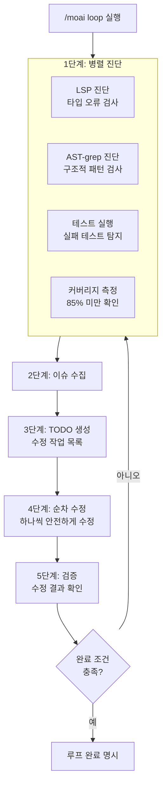
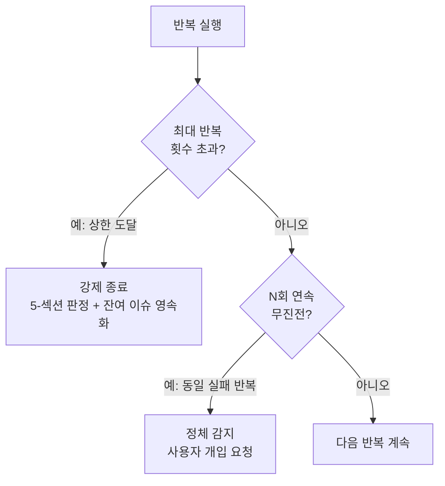
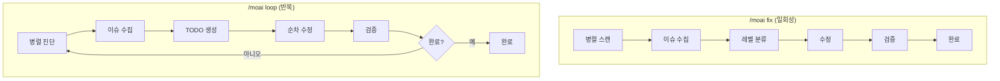
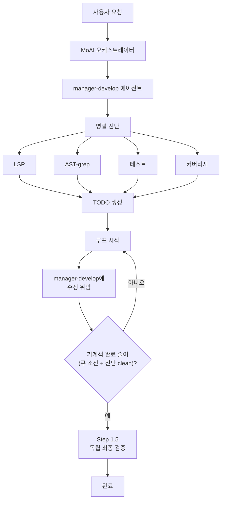

자율 반복 수정 루프 명령어입니다. AI가 스스로 문제를 진단하고, 수정하고, 검증하는 과정을 **오류가 모두 해결될 때까지** 자동으로 반복합니다.


  **한 줄 요약**: `/moai loop`는 "Ralph Engine" 이라는 자율 수정 엔진입니다.
  **진단 → 수정 → 검증**을 반복하여 코드의 모든 문제를 자동으로 해결합니다.



**슬래시 커맨드**: Claude Code에서 `/moai:loop`를 입력하면 이 명령어를 바로 실행할 수 있습니다. `/moai`만 입력하면 사용 가능한 모든 서브커맨드 목록이 표시됩니다.


## 개요

코드를 작성하다 보면 타입 오류, 린트 경고, 테스트 실패 등 여러 문제가 동시에 발생할 수 있습니다. 이런 문제를 하나씩 수동으로 고치는 대신, `/moai loop`를 실행하면 AI가 모든 문제를 **자동으로 반복 수정**합니다.

`/moai fix`가 **한 번만** 수정하는 것과 달리, `/moai loop`는 **완료 조건을 만족할 때까지** 계속 반복합니다.

이 루프가 v3의 두 번째 기둥, **에이전틱 루프 엔지니어링**의 대표 사례입니다. 사람이 오류마다 일일이 개입하는 대신 루프가 스스로 진단하고 수정하며, 루프가 남긴 관찰은 하네스 학습(재귀적 자가 학습)의 원료로 쌓입니다. 엔진 구현은 `internal/ralph/engine.go`에 있다. 매 반복의 `Decide()`가 continue / converge / request_review / abort 중 하나를 우선순위 순으로 판정합니다.

## /moai goal과의 관계

`/moai loop`는 **goal 엔진 위의 프리셋**입니다. `/moai goal "<조건>"`이 사용자가 완료 조건을 직접 선언하는 범용 루프라면, `/moai loop`는 "진단 도구가 찾은 이슈 큐를 다 비울 때까지"라는 조건을 미리 채워 넣은 프리셋입니다.

| 엔진 | 목표 | 작동 방식 | 완료 조건 |
|------|------|----------|----------|
| `/moai goal` | 목표 수렴 루프 | 사용자 정의 조건 만족 시까지 | 조건식 만족 |
| `/moai loop` | 진단 수정 루프 | 에러 0까지 반복 | 0 에러 / 0 타입 / 85%+ 커버리지 |

```text
/moai goal "go test ./... exits 0; 모든 AC가 PASS로 기록"
/moai goal status | clear
```

끝 상태를 조건식으로 표현할 수 있다면 `/moai goal`, "도구가 찾는 문제를 전부 없애줘"라면 `/moai loop`가 맞습니다.

## 사용법

```bash
> /moai loop
```

별도의 인수 없이 실행하면, 현재 프로젝트의 모든 문제를 자동으로 찾아 수정합니다.

## 지원 플래그

| 플래그                                   | 설명                             | 예시                          |
| ---------------------------------------- | -------------------------------- | ----------------------------- |
| `--max N` (또는 `--max-iterations`)      | 최대 반복 횟수 제한 (기본값 10)  | `/moai loop --max 20`         |
| `--lens {clean\|simplify\|coverage}`     | 스캔 렌즈 추가 (쉼표 구분, opt-in) | `/moai loop --lens clean,coverage` |
| `--auto-fix`                             | 자동 수정 활성화 (기본 Level 1)  | `/moai loop --auto-fix`       |
| `--sequential` (또는 `--seq`)            | 병렬 대신 순차 진단              | `/moai loop --sequential`     |
| `--errors` (또는 `--errors-only`)        | 오류만 수정, 경고 건너뜀         | `/moai loop --errors`         |
| `--coverage` (또는 `--include-coverage`) | 커버리지 포함 (기본값 85%)       | `/moai loop --coverage`       |
| `--memory-check`                         | 메모리 압력 감지 활성화          | `/moai loop --memory-check`   |
| `--resume ID` (또는 `--resume-from`)     | 스냅샷에서 재개                  | `/moai loop --resume latest`  |

### --max 플래그

반복 횟수를 제한합니다:

```bash
# 최대 20회까지 반복
> /moai loop --max 20
```


  무한 루프를 방지하기 위해 기본값은 10회입니다 (`ralph.yaml`의 `loop.max_iterations`).
  반복 상한 우선순위는 CLI `--max` 플래그 > `ralph.yaml` `loop.max_iterations` >
  `workflow.yaml` `loop_prevention.max_iterations` 순입니다.


### --lens 플래그

기본 스캔 렌즈 (LSP · lint · 테스트 실패 · 리뷰 렌즈 [보안, @MX])에 더해, opt-in 렌즈로 스캔 범위를 넓힙니다:

| 렌즈 | 추가되는 이슈 |
|------|---------------|
| `clean` | 데드 코드 (미사용 함수·import·파일) |
| `simplify` | 과잉 설계 (over-engineering) 발견 항목 |
| `coverage` | 커버리지 부족 지점 (커버리지 게이트가 켜져 있을 때만 이슈를 공급) |

렌즈가 발견한 것만 큐에 담기며, 루프는 스캔된 큐 밖의 "지어낸 개선"을 절대 수행하지 않습니다.

## 실행 과정

`/moai loop`는 매 반복 (iteration)마다 다음 과정을 거칩니다.


```mermaid
flowchart TD
    Start["/moai loop 실행"] --> Diag

    subgraph Diag["1단계: 병렬 진단"]
        D1["LSP 진단<br/>타입 오류 검사"]
        D2["AST-grep 진단<br/>구조적 패턴 검사"]
        D3["테스트 실행<br/>실패 테스트 탐지"]
        D4["커버리지 측정<br/>85% 미만 확인"]
    end

    Diag --> Collect["2단계: 이슈 수집"]
    Collect --> Todo["3단계: TODO 생성<br/>수정 작업 목록"]
    Todo --> Fix["4단계: 순차 수정<br/>하나씩 안전하게 수정"]
    Fix --> Verify["5단계: 검증<br/>수정 결과 확인"]
    Verify --> Check{완료 조건<br/>충족?}
    Check -->|아니오| Diag
    Check -->|예| Done["루프 완료 명시"]
```

### 1단계: 병렬 진단

4가지 진단 도구가 **동시에** 실행되어 프로젝트의 모든 문제를 빠르게 파악합니다.

| 진단 도구    | 검사 대상     | 발견하는 문제 예시                           |
| ------------ | ------------- | -------------------------------------------- |
| **LSP**      | 타입 시스템   | 타입 불일치, 미정의 변수, 잘못된 인수        |
| **AST-grep** | 코드 구조     | 사용하지 않는 import, 위험한 패턴, 코드 스멜 |
| **Tests**    | 테스트 실행   | 실패하는 테스트, 에러 발생                   |
| **Coverage** | 커버리지 측정 | 85% 미만인 모듈                              |


  **병렬 진단이란?** 4가지 진단을 **동시에** 실행하므로, 순차적으로 하나씩
  실행하는 것보다 약 4배 빠릅니다. 이렇게 수집된 문제들은 하나의 목록으로
  합쳐집니다.


### 2단계: 이슈 수집

병렬 진단에서 발견된 모든 문제를 하나의 목록으로 정리합니다.

```
발견된 이슈 (예시):
  [LSP] src/auth/service.py:42 - "str" 타입에 "int" 할당 불가
  [LSP] src/auth/router.py:15 - "User" 타입 미정의
  [AST] src/utils/helper.py:3 - 사용하지 않는 import "os"
  [TEST] tests/test_auth.py::test_login - AssertionError
  [COV] src/auth/service.py - 커버리지 62% (목표 85%)
```

### 3단계: TODO 생성

수집된 이슈를 기반으로 수정 작업 목록 (TODO) 을 자동 생성합니다. 이때 **의존성 순서**를 고려하여 수정 순서를 결정합니다.

예를 들어 타입 정의가 누락된 경우, 해당 타입을 먼저 추가한 후 그 타입을 사용하는 코드를 수정합니다.

### 4단계: 순차 수정

TODO 목록의 항목을 **하나씩 순차적으로** 수정합니다. 병렬로 수정하면 서로 충돌할 수 있기 때문에, 안전하게 하나씩 처리합니다.

### 5단계: 검증

수정이 끝나면 다시 진단을 실행하여 문제가 해결되었는지 확인합니다. 아직 남은 문제가 있으면 1단계로 돌아가 반복합니다.

## 루프 방지 메커니즘

무한 루프를 막기 위해 두 가지 안전장치가 있습니다. 루프를 무한정 돌리는 건 토큰 낭비이기도 하므로, 안전장치는 안정성과 토크노믹스 양쪽을 함께 지킵니다.


```mermaid
flowchart TD
    A[반복 실행] --> B{최대 반복<br/>횟수 초과?}
    B -->|예: 상한 도달| C["강제 종료<br/>5-섹션 판정 + 잔여 이슈 영속화"]
    B -->|아니오| D{N회 연속<br/>무진전?}
    D -->|예: 동일 실패 반복| E["정체 감지<br/>사용자 개입 요청"]
    D -->|아니오| F[다음 반복 계속]
```

| 안전장치           | 조건                   | 동작                                              |
| ------------------ | ---------------------- | ------------------------------------------------- |
| **최대 반복 제한** | 반복 상한 도달 (기본 10) | 루프를 강제 종료하고 5-섹션 판정 (Claim / Evidence / Baseline-attribution / Gaps / Residual-risk) 을 낸 뒤 잔여 이슈를 `.moai/state/loop-verdict-<id>.json`에 영속화합니다 |
| **정체 감지**      | N회 연속 무진전 (동일 실패 시그니처) | 정체로 판단하고 5-섹션 판정을 낸 뒤 사용자에게 개입을 요청합니다 |


  **정체 상태가 발생하면?** AI가 같은 실패 시그니처를 연속으로 해결하지 못하면,
  자동으로 중단하고 5-섹션 증거 판정과 함께 사용자에게 개입을 요청합니다. 이 경우
  오류 내용을 직접 확인하거나 힌트를 제공해주세요.


## 완료 조건

`/moai loop`는 다음 **세 가지 조건을 모두 만족**하면 루프를 종료합니다.

| 조건                | 기준              | 설명                                 |
| ------------------- | ----------------- | ------------------------------------ |
| **zero_errors**     | LSP 오류 0개      | 타입 오류, 구문 오류가 없어야 합니다 |
| **tests_pass**      | 모든 테스트 통과  | 실패하는 테스트가 없어야 합니다      |
| **coverage >= 85%** | 커버리지 85% 이상 | TRUST 5 품질 기준을 충족해야 합니다  |

## /moai fix와의 차이

`/moai fix`와 `/moai loop`는 비슷해 보이지만, 핵심적인 차이가 있습니다.


```mermaid
flowchart TD
    subgraph Fix["/moai fix (일회성)"]
        F1[병렬 스캔] --> F2[이슈 수집]
        F2 --> F3[레벨 분류]
        F3 --> F4[수정]
        F4 --> F5[검증]
        F5 --> F6[완료]
    end

    subgraph Loop["/moai loop (반복)"]
        L1[병렬 진단] --> L2[이슈 수집]
        L2 --> L3[TODO 생성]
        L3 --> L4[순차 수정]
        L4 --> L5[검증]
        L5 --> L6{완료?}
        L6 -->|아니오| L1
        L6 -->|예| L7[완료]
    end
```

| 비교 항목     | `/moai fix`           | `/moai loop`            |
| ------------- | --------------------- | ----------------------- |
| **실행 횟수** | 1회                   | 완료될 때까지 반복      |
| **목표**      | 현재 보이는 오류 수정 | 모든 오류 완전 해결     |
| **레벨 분류** | 있음 (Level 1-4)      | 없음 (모든 이슈 처리)   |
| **승인 필요** | Level 3-4는 승인 필요 | 자율적으로 처리         |
| **소요 시간** | 짧음 (1-2분)          | 길 수 있음 (5-30분)     |
| **사용 시점** | 간단한 수정           | 대규모 리팩토링 후 정리 |


  **선택 가이드**: 오류가 몇 개 안 되면 `/moai fix`로 빠르게 해결하세요. 오류가
  많거나 서로 연관된 문제가 있으면 `/moai loop`가 더 효과적입니다.


## 에이전트 위임 체인

`/moai loop` 명령어의 에이전트 위임 흐름입니다:


```mermaid
flowchart TD
    User["사용자 요청"] --> Orchestrator["MoAI 오케스트레이터"]
    Orchestrator --> ManagerDDD["manager-develop 에이전트"]

    ManagerDDD --> Diagnose["병렬 진단"]
    Diagnose --> LSP["LSP"]
    Diagnose --> AST["AST-grep"]
    Diagnose --> Test["테스트"]
    Diagnose --> Cov["커버리지"]

    LSP --> Todo["TODO 생성"]
    AST --> Todo
    Test --> Todo
    Cov --> Todo

    Todo --> Loop["루프 시작"]

    Loop --> Fix["manager-develop에<br/>수정 위임"]
    Fix --> Predicate{"기계적 완료 술어<br/>(큐 소진 + 진단 clean)?"}
    Predicate -->|아니오| Loop
    Predicate -->|예| FinalPass["Step 1.5<br/>독립 최종 검증"]
    FinalPass --> Done["완료"]
```

**완료 판정 — 기계적 술어 + 독립 최종 검증:**

루프의 성공 종료는 **기계적 완료 술어**로 판정합니다. 이슈 큐가 비었고 진단(LSP/AST-grep/테스트/커버리지)이 clean한지를 오케스트레이터가 직접 확인합니다. 별도의 감사 에이전트(sync-auditor)가 완료를 판정하지 않습니다.

술어가 충족되면 **Step 1.5 독립 최종 검증(Independent Final Pass)**이 성공 종료 경로로 실행됩니다. `/moai gate --fresh`를 새 컨텍스트로 돌리거나 read-only 검증 Agent를 spawn하여, 루프가 자신을 검사하지 않도록 독립적으로 최종 상태를 확인합니다.

**에이전트 역할:**

| 에이전트                | 역할      | 주요 작업            |
| ----------------------- | --------- | -------------------- |
| **MoAI 오케스트레이터** | 루프 조율 + 완료 술어 판정 | 진단 조율, 기계적 완료 술어 확인, 사용자 보고 |
| **manager-develop**     | 루프 관리 및 수정 실행 | TODO 생성, 실제 코드 수정 (cycle_type=autofix) |
| **`/moai gate --fresh` 또는 read-only 검증 Agent** | Step 1.5 독립 최종 검증 | 성공 종료 전 독립 컨텍스트에서 최종 상태 확인 |

## 실전 예시

### 상황: DDD 구현 후 다수의 오류 발생

`/moai run`으로 코드를 구현한 후, 여러 오류가 남아있는 상황을 가정합니다.

```bash
# 현재 상태 확인
$ pytest --tb=short
# 3개 테스트 실패
# 커버리지: 71%

# LSP 오류 확인
# 5개 타입 오류, 2개 미정의 참조

# loop 실행
> /moai loop
```

**실행 로그:**

```
[반복 1/10]
  진단: LSP 오류 5개, 테스트 실패 3개, 커버리지 71%
  TODO: 7개 수정 작업 생성
  수정: 타입 오류 5개 해결
  검증: LSP 오류 0개, 테스트 실패 2개, 커버리지 71%

[반복 2/10]
  진단: 테스트 실패 2개, 커버리지 71%
  TODO: 2개 수정 작업 생성
  수정: 테스트 로직 수정 2건
  검증: LSP 오류 0개, 테스트 실패 0개, 커버리지 74%

[반복 3/10]
  진단: 커버리지 74% (목표 85%)
  TODO: 3개 테스트 추가 작업 생성
  수정: 누락된 테스트 케이스 추가
  검증: LSP 오류 0개, 테스트 실패 0개, 커버리지 87%

완료 조건 충족!
  - LSP 오류: 0개
  - 테스트: 모두 통과
  - 커버리지: 87%

DONE
```

이 예시에서 `/moai loop`는 3회 반복만에 모든 문제를 해결했습니다. 수동으로 했다면 각 오류를 하나씩 확인하고 수정해야 했을 것입니다.

## 자주 묻는 질문

### Q: `/moai loop`가 너무 오래 실행되면 어떻게 하나요?

`--max` 플래그로 반복 횟수를 제한하거나, `Ctrl+C`로 중단할 수 있습니다. 현재 상태가 저장되므로 나중에 다시 시작할 수 있습니다.

### Q: 특정 유형의 오류만 수정하고 싶다면?

`--errors` 플래그로 오류만 수정하고 경고를 건너뛰거나, `--lens` 플래그로 스캔 범위를 조정하세요:

```bash
# 오류만 수정 (경고 건너뜀)
> /moai loop --errors

# 데드 코드·커버리지 렌즈 추가
> /moai loop --lens clean,coverage
```

### Q: `/moai loop`와 `/moai`의 차이는 무엇인가요?

`/moai loop`는 **오류 수정 루프만** 담당합니다. `/moai`는 SPEC 생성부터 구현, 문서화까지 **전체 워크플로우**를 자동으로 수행합니다.

### Q: `/moai loop`와 `/moai goal`의 차이는 무엇인가요?

`/moai loop`는 진단 도구 (LSP, 테스트, 린터)가 찾은 이슈를 없애는 것이 목표이고, `/moai goal`은 사용자가 선언한 임의의 완료 조건 (예: "AC-001~AC-010 모두 달성")을 향해 턴을 이어갑니다. `/moai loop`는 goal 엔진의 프리셋입니다.

### Q: 루프가 교착 상태에 빠지면 어떻게 하나요?

AI가 동일 실패 시그니처를 N회 연속 해결하지 못하면 (정체 감지) 자동으로 중단하고 5-섹션 증거 판정과 함께 사용자에게 개입을 요청합니다. 이 경우 직접 코드를 확인하거나 힌트를 제공해주세요.

## 관련 문서

- [/moai fix - 일회성 자동 수정](/utility-commands/moai-fix)
- [/moai - 완전 자율 자동화](/utility-commands/moai)
- [TRUST 5 품질 시스템](/core-concepts/trust-5)
- [도메인 주도 개발](/core-concepts/ddd)
