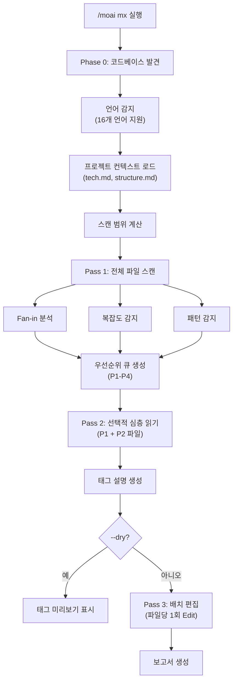
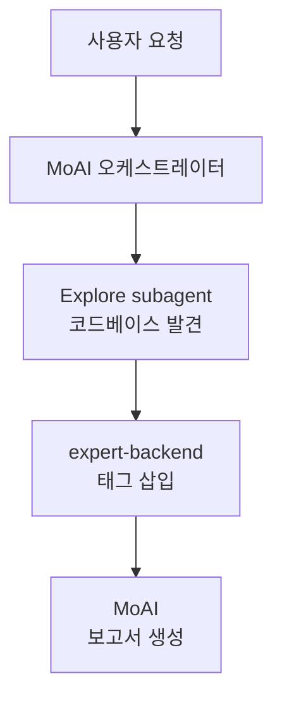

코드베이스를 스캔하고 @MX 코드 수준 어노테이션을 추가하는 명령어입니다. AI 에이전트가 **코드 컨텍스트를 빠르게 이해할 수 있도록** 주석을 자동으로 삽입합니다.


**한 줄 요약**: `/moai mx`는 "코드 네비게이션 표지판"을 자동으로 설치합니다. 위험한 코드, 중요한 함수, 누락된 테스트 등을 **@MX 태그로 마킹**하여 AI 에이전트가 코드를 더 잘 이해하게 합니다.



**슬래시 커맨드**: Claude Code에서 `/moai:mx`를 입력하면 이 명령어를 바로 실행할 수 있습니다. `/moai`만 입력하면 사용 가능한 모든 서브커맨드 목록이 표시됩니다.


## 개요

@MX 태그는 코드에 부착하는 메타데이터 어노테이션입니다. AI 에이전트가 코드를 읽을 때 중요한 함수, 위험한 패턴, 미완성 작업을 즉시 파악할 수 있게 합니다. `/moai mx`는 3단계 스캔으로 코드베이스를 분석하고 적절한 태그를 자동으로 삽입합니다.

### @MX 태그 유형

| 태그 | 용도 | 사용 시점 |
|------|------|----------|
| `@MX:ANCHOR` | 불변 계약 | fan_in >= 3 (3곳 이상에서 호출) |
| `@MX:WARN` | 위험 구역 | 복잡도 >= 15, goroutine/async 패턴 |
| `@MX:NOTE` | 컨텍스트 전달 | 매직 상수, 비즈니스 규칙 설명 |
| `@MX:TODO` | 미완성 작업 | 테스트 누락, SPEC 미구현 |

## 사용법

```bash
# 전체 코드베이스 스캔
> /moai mx --all

# 미리보기 (수정 없이 확인만)
> /moai mx --dry

# P1 우선순위만 (높은 fan_in 함수)
> /moai mx --priority P1

# 기존 태그 강제 덮어쓰기
> /moai mx --all --force

# 특정 언어만 스캔
> /moai mx --all --lang go,python

# fan_in 임계값 낮추기
> /moai mx --all --threshold 2
```

## 지원 플래그

| 플래그 | 설명 | 예시 |
|-------|------|------|
| `--all` | 전체 코드베이스 스캔 (모든 언어, 모든 P1+P2 파일) | `/moai mx --all` |
| `--dry` | 미리보기만 - 파일 수정 없이 태그 표시 | `/moai mx --dry` |
| `--priority P1-P4` | 우선순위 레벨 필터 (기본: 전체) | `/moai mx --priority P1` |
| `--force` | 기존 @MX 태그 덮어쓰기 | `/moai mx --force` |
| `--exclude PATTERN` | 추가 제외 패턴 (쉼표 구분) | `/moai mx --exclude "vendor/**"` |
| `--lang LANGS` | 특정 언어만 스캔 (기본: 자동 감지) | `/moai mx --lang go,ts` |
| `--threshold N` | fan_in 임계값 재정의 (기본: 3) | `/moai mx --threshold 2` |
| `--no-discovery` | Phase 0 코드베이스 발견 건너뜀 | `/moai mx --no-discovery` |
| `--team` | 언어별 병렬 스캔 (에이전트 팀 모드) | `/moai mx --team` |

## 우선순위 레벨

| 우선순위 | 조건 | 태그 유형 |
|---------|------|----------|
| **P1** | fan_in >= 3 (3곳 이상에서 호출) | `@MX:ANCHOR` |
| **P2** | goroutine/async, 복잡도 >= 15 | `@MX:WARN` |
| **P3** | 매직 상수, docstring 누락 | `@MX:NOTE` |
| **P4** | 테스트 누락 | `@MX:TODO` |

## 실행 과정

`/moai mx`는 3단계 패스 (Pass) 로 실행됩니다.



### Phase 0: 코드베이스 발견

16개 언어를 지원하는 자동 감지:

| 언어 | 감지 파일 | 주석 접두사 |
|------|-----------|------------|
| Go | go.mod, go.sum | `//` |
| Python | pyproject.toml, requirements.txt | `#` |
| TypeScript | tsconfig.json | `//` |
| JavaScript | package.json | `//` |
| Rust | Cargo.toml | `//` |
| Java | pom.xml, build.gradle | `//` |
| Kotlin | build.gradle.kts | `//` |
| Ruby | Gemfile | `#` |
| Elixir | mix.exs | `#` |
| C++ | CMakeLists.txt | `//` |
| Swift | Package.swift | `//` |
| 외 5개 | 각 언어별 설정 파일 | 언어별 |

### Pass 1: 전체 파일 스캔

모든 소스 파일을 스캔하여 우선순위 큐를 생성합니다:

- **Fan-in 분석**: 함수/메서드 참조 횟수 카운트
- **복잡도 감지**: 줄 수, 분기 수, 중첩 깊이
- **패턴 감지**: 언어별 위험 패턴 (goroutine, async, threading, unsafe)

### Pass 2: 선택적 심층 읽기

P1 및 P2 파일을 심층 분석하여 정확한 태그 설명을 생성합니다. 프로젝트 컨텍스트 (tech.md, structure.md, product.md)를 활용합니다.

### Pass 3: 배치 편집

파일당 1회 Edit 호출로 태그를 삽입합니다. 기존 @MX 태그는 보존됩니다 (`--force` 제외).

## 배치 체크포인트

대규모 스캔 (50+ 파일)은 배치 처리를 사용합니다:

- **배치 크기**: 50개 파일 per 반복
- **자동 커밋**: 각 배치 완료 후 중간 결과 커밋
- **진행 상황 저장**: `.moai/cache/mx-scan-progress.json`
- **재개 가능**: 중단된 스캔을 이어서 진행


Rate limit 감지 시 현재 배치를 저장하고 graceful 하게 중단합니다. `/moai mx`를 다시 실행하면 중단된 지점부터 재개됩니다.


## 에이전트 위임 체인



## 다른 워크플로우와의 통합

| 워크플로우 | MX 통합 방식 |
|-----------|-------------|
| `/moai sync` | 동기화 중 MX 검증 자동 실행 (SPEC-MX-002) |
| `/moai edit` | 파일 편집 시 @MX 태그 자동 검증 (v2.7.8+) |
| `/moai run` | DDD ANALYZE 단계에서 자동 트리거 |
| `/moai review` | MX 태그 준수 검사 포함 |

## 자주 묻는 질문

### Q: @MX 태그가 코드 실행에 영향을 주나요?

아니요, @MX 태그는 주석으로만 존재합니다. 코드 실행이나 성능에 전혀 영향을 주지 않습니다.

### Q: 기존 태그가 있으면 어떻게 되나요?

기본적으로 기존 태그를 보존합니다. `--force` 플래그를 사용하면 덮어씁니다.

### Q: 자동 생성된 파일도 태그하나요?

아닙니다. `.moai/config/sections/mx.yaml`의 제외 패턴에 따라 생성된 파일, vendor, mock 파일은 자동으로 건너뜁니다.

## 관련 문서

- [/moai clean - 데드 코드 제거](/utility-commands/moai-clean)
- [/moai review - 코드 리뷰](/quality-commands/moai-review)
- [/moai - 완전 자율 자동화](/utility-commands/moai)
