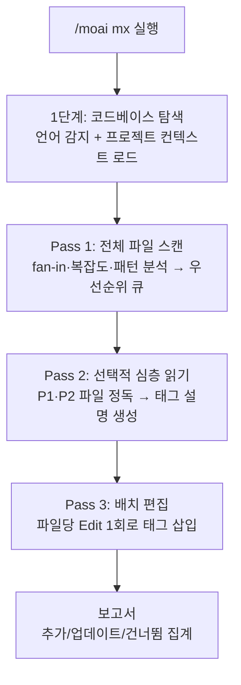

코드베이스를 스캔하여 **@MX 코드 주석**을 추가하는 명령어입니다. @MX 태그는 AI 에이전트가 코드의 맥락·의도·위험을 빠르게 파악하도록 돕는 코드 레벨 어노테이션입니다.


**한 줄 요약**: `/moai mx`는 "AI를 위한 코드 이정표 설치기" 입니다. 높은 fan-in 함수, 위험 구역, 미완성 지점 등을 자동으로 찾아 `@MX:ANCHOR`·`@MX:WARN`·`@MX:NOTE`·`@MX:TODO` 태그를 코드에 심습니다.



**슬래시 커맨드**: Claude Code에서 `/moai:mx`를 입력하면 이 명령어를 바로 실행할 수 있습니다. `/moai`만 입력하면 사용 가능한 모든 서브커맨드 목록이 표시됩니다.


## 개요

에이전트가 코드를 이해하는 데 드는 비용은 곧 컨텍스트 (토큰) 입니다. @MX 태그는 "이 함수는 8곳에서 호출되니 시그니처를 함부로 바꾸지 말 것" 같은 맥락을 코드 옆에 직접 박아 두어, 에이전트가 매번 전체 코드베이스를 재분석하지 않아도 되게 합니다. 하네스 엔지니어링 관점에서 이는 **코드에 심는 앵커** — 반복 탐색 비용을 1회 어노테이션으로 대체하는 토크노믹스 장치입니다.

주로 다음 상황에서 사용합니다:

- @MX 태그가 없는 레거시 코드베이스
- 대규모 리팩토링 전 위험 구역 표시
- 큰 코드 변경 후 어노테이션 업데이트
- `/moai sync` 중 MX 검증 (자동 실행)

## 태그 유형과 우선순위

| 우선순위 | 조건 | 태그 유형 |
|----------|------|-----------|
| P1 | fan_in >= 3 호출자 | `@MX:ANCHOR` (불변 계약, 높은 fan_in) |
| P2 | goroutine/async, 복잡도 >= 15 | `@MX:WARN` (위험 구역, `@MX:REASON` 필수) |
| P3 | 매직 상수, 누락된 docstring | `@MX:NOTE` (맥락·의도) |
| P4 | 누락된 테스트 | `@MX:TODO` (미완성) |
| P5 | 의도적 작동 단순화 (`@MX:CEILING` + `@MX:UPGRADE` 서브라인 동반) | `@MX:DEBT` |

## 사용법

```bash
# 전체 코드베이스 스캔 (16개 언어)
> /moai mx --all

# 수정 없이 미리보기
> /moai mx --dry

# P1 (높은 fan_in 함수) 만
> /moai mx --priority P1

# Go·Python만 스캔
> /moai mx --all --lang go,python
```

## 지원 플래그

| 플래그 | 설명 | 예시 |
|-------|------|------|
| `--all` | 전체 코드베이스 스캔 (모든 언어, P1+P2 파일 전체) | `/moai mx --all` |
| `--dry` | 미리보기 — 파일 수정 없이 추가될 태그만 표시 | `/moai mx --dry` |
| `--priority P1-P4` | 우선순위 레벨로 필터 (기본값: 전체) | `/moai mx --priority P1` |
| `--force` | 기존 @MX 태그 덮어쓰기 | `/moai mx --all --force` |
| `--exclude pattern` | 추가 제외 패턴 (쉼표 구분) | `/moai mx --exclude "vendor/,*.gen.go"` |
| `--lang go,py,ts` | 지정 언어만 스캔 (기본값: 자동 감지) | `/moai mx --lang go,python` |
| `--threshold N` | fan_in 임계값 재정의 (기본값: 3) | `/moai mx --all --threshold 2` |
| `--no-discovery` | 1단계 코드베이스 탐색 건너뛰기 | `/moai mx --no-discovery` |

## 실행 과정

`/moai mx`는 탐색 1단계 + 3-Pass 스캔으로 실행됩니다.


```mermaid
flowchart TD
    Start["/moai mx 실행"] --> Phase1["1단계: 코드베이스 탐색<br/>언어 감지 + 프로젝트 컨텍스트 로드"]
    Phase1 --> Pass1["Pass 1: 전체 파일 스캔<br/>fan-in·복잡도·패턴 분석 → 우선순위 큐"]
    Pass1 --> Pass2["Pass 2: 선택적 심층 읽기<br/>P1·P2 파일 정독 → 태그 설명 생성"]
    Pass2 --> Pass3["Pass 3: 배치 편집<br/>파일당 Edit 1회로 태그 삽입"]
    Pass3 --> Report["보고서<br/>추가/업데이트/건너뜀 집계"]
```

### 1단계: 코드베이스 탐색

프로젝트 언어를 감지하고 (16개 언어, 마커 파일 우선순위) 언어별 주석 접두사 (`//`, `#` 등) 를 결정합니다. `.moai/project/tech.md`·`structure.md`·`product.md`·`README.md`를 읽어 태그 설명에 쓸 프로젝트 맥락을 로드하고, 스캔 범위와 토큰 예산을 계산합니다. `--no-discovery`를 주면 이 단계를 건너뜁니다.

### Pass 1: 전체 파일 스캔

모든 소스 파일을 언어별 패턴으로 Glob하여 fan-in 분석 (함수·메서드 참조 카운트), 복잡도 감지 (줄 수·분기·중첩 깊이), 패턴 감지 (goroutine·async·threading·unsafe) 를 수행하고, 점수순으로 정렬된 우선순위 큐 (P1-P4) 를 만듭니다.

### Pass 2: 선택적 심층 읽기

P1·P2 파일만 정독하여 함수 시그니처와 호출 패턴을 분석하고, 프로젝트 맥락 (tech.md·structure.md·product.md) 을 반영한 정확한 태그 설명을 언어별 주석 문법으로 생성합니다.

### Pass 3: 배치 편집

파일당 Edit 1회로 해당 파일의 모든 태그를 한 번에 삽입합니다. 기존 @MX 태그는 `--force`가 없으면 보존됩니다. 삽입 대상이 5개 미만이면 오케스트레이터가 직접 편집하고 (스폰 없음), 5개 이상이면 배치 편집 에이전트에 위임합니다.

## /moai sync·run과의 통합

- **`/moai sync`**: sync 단계에서 MX 검증이 자동 실행됩니다 — 마지막 sync 이후 변경된 파일을 스캔하여 누락된 @MX 태그를 확인하고, `--skip-mx` 플래그가 없으면 태그를 추가한 뒤 sync 보고서에 태그 변경을 포함합니다.
- **`/moai run`**: DDD ANALYZE 단계에서 코드베이스에 @MX 태그가 하나도 없으면 3-Pass가 자동 트리거됩니다. 기존 태그는 검증·업데이트되고 새 코드에는 새 태그가 추가됩니다.

## 에이전트 위임 체인

| 단계 | 실행 주체 | 주요 작업 |
|------|-----------|-----------|
| 1단계 (탐색) | Explore 서브에이전트 | 언어 감지, 프로젝트 컨텍스트 로드 |
| Pass 1 (스캔) | Explore 또는 `Agent(general-purpose)` (백엔드 스코프) | 전체 파일 스캔, 우선순위 큐 생성 |
| Pass 2 (심층 읽기) | `Agent(general-purpose)` (백엔드 스코프) | P1·P2 정독, 태그 설명 생성 |
| Pass 3 (편집) | `Agent(general-purpose)` (백엔드 스코프); 5개 미만은 오케스트레이터 직접 | 배치 편집, 태그 삽입 |

## 관련 문서

- [/moai sync - 문서 동기화](/workflow-commands/moai-sync)
- [/moai run - DDD/TDD 구현](/workflow-commands/moai-run)
- [/moai clean - 데드 코드 제거](/utility-commands/moai-clean)
