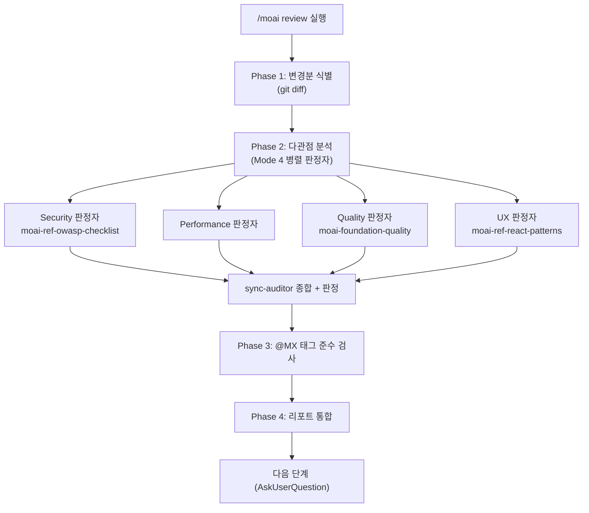

보안·성능·품질·UX 네 관점으로 코드를 검토하고, `@MX` 태그 준수 여부를 확인하여 우선순위가 매겨진 통합 리포트를 만듭니다.


**슬래시 커맨드**: Claude Code에서 `/moai:review`를 입력하면 이 명령어를 바로 실행할 수 있습니다. `/moai`만 입력하면 사용 가능한 모든 서브커맨드 목록이 표시됩니다.


## 개요

`/moai review`는 **다관점 코드 리뷰** 명령어입니다. 변경분을 보안(Security)·성능(Performance)·품질(Quality)·UX 네 관점의 read-only 판정자로 분석하고, `@MX` 태그 준수를 점검한 뒤, 심각도별로 정리된 통합 리포트를 산출합니다.

`/moai review`는 **read-only, 리포트 전용 렌즈**입니다 — 결함을 찾아 보고할 뿐 아무 파일도 수정하지 않습니다. 발견된 문제를 실제로 고치려면 `/moai fix`(또는 `/moai loop`)로 넘깁니다. 즉 `/moai review`로 문제를 **보고**, `/moai loop`로 유한한 이슈 집합을 **수정**하는 계층 관계입니다.

## 지원 플래그

| 플래그 | 설명 | 예시 |
|-------|------|------|
| `--staged` | 스테이징된(`git add`) 변경분만 검토 | `/moai review --staged` |
| `--branch BRANCH` | 현재 브랜치를 BRANCH와 비교 (기본 main) | `/moai review --branch main` |
| `--security` | 보안 리뷰(OWASP·injection·인증)에 집중 | `/moai review --security` |
| `--file PATH` | 특정 파일만 검토 | `/moai review --file src/auth.go` |


`--team` 병렬 리뷰 모드는 Agent Teams 정적 계층과 함께 **은퇴**(tombstone)했습니다. 병렬 리뷰는 Mode 4 서브에이전트 팬아웃으로 수행되며, 팀이 아닙니다.


## 에이전트 체인

네 관점은 **Mode 4 병렬 read-only 팬아웃**으로 실행됩니다 — 관점마다 하나씩 최대 4개의 read-only 판정자(`Agent(general-purpose)`)를 한 턴에 spawn하며, 3-5 동시 실행 상한 안에서 동작합니다. 각 판정자의 발견은 **sync-auditor** 서브에이전트의 종합으로 모이고, sync-auditor가 최종 판정을 소유합니다 — 팬아웃은 실행 형태만 바꿀 뿐 판정 소유권을 옮기지 않습니다.



## 네 관점

| 관점 | 검사 항목 |
|------|-----------|
| **Security** | OWASP Top 10, 입력 검증, 인증/인가, 시크릿 노출, injection(SQL/command/XSS/CSRF) |
| **Performance** | 알고리즘 복잡도, DB 쿼리 효율(N+1), 메모리 패턴, 캐싱 기회, 동시성 안전 |
| **Quality** | TRUST 5 준수, 네이밍/가독성, 에러 핸들링, 변경 코드 테스트 커버리지, 프로젝트 패턴 일관성 |
| **UX** | 사용자 흐름 무결성, 에러 상태/엣지 케이스, 접근성(WCAG/ARIA), 로딩 상태, 공개 인터페이스 breaking change |

발견 단계에서는 확신이 낮거나 심각도가 낮은 것도 **모두** 보고합니다(각각 confidence·severity 부여). 필터링은 뒤따르는 판정 단계(must-pass 임계값 + 조화 평균 점수)가 맡습니다. 발견 단계의 목표는 커버리지입니다.

## --security 정식 절차

`--security` 플래그를 주면 보안 관점이 우선순위를 받아 더 깊이 분석합니다.

### 의존성 취약점 스캔

프로젝트 매니페스트 파일(`go.mod`, `package.json`, `requirements.txt`, `Cargo.toml`, `pyproject.toml`, `Gemfile`, `composer.json`, `mix.exs`, `Package.swift`, `pubspec.yaml`)을 열거하고, project marker로 언어를 자동 감지한 뒤 per-spawn `Agent(general-purpose)` 보안 리뷰어로 취약점 스캔을 수행합니다. OWASP 전체 체크리스트는 `moai-ref-owasp-checklist` 스킬이 공급합니다.

### 시크릿 스캔 (증분 + 체크포인트)

git 히스토리를 증분 스캔합니다. 마지막 스캔 SHA 체크포인트를 `.moai/state/secrets-scan-checkpoint.txt`에 기록하고, 체크포인트가 있으면 새 커밋 범위 + 워킹 트리만 스캔한 뒤 체크포인트를 현재 HEAD로 갱신합니다. 첫 실행이거나 명시적 full-scan 시에는 `--all` 전체 히스토리를 스캔합니다.

### 데이터 격리 점검

멀티 테넌트(교차 테넌트 데이터 흐름 차단), PII 분리(로그·메트릭·텔레메트리에 PII 미기록), 공유 상태 누수(요청 스코프 데이터를 나르는 가변 전역 없음) 경계를 확인합니다.

## @MX 태그 준수 검사

관점 분석 후, 변경된 파일의 `@MX` 태그 준수를 점검합니다:

- 신규 export 함수: `@MX:NOTE` 또는 `@MX:ANCHOR` 권장
- high fan_in 함수(호출자 ≥ 3): `@MX:ANCHOR` 필수
- 위험 패턴: `@MX:WARN` 권장
- 미테스트 공개 함수: `@MX:TODO` 권장

누락되거나 오래된 `@MX` 태그를 findings로 보고합니다.

## 리포트 구조

통합 리뷰 리포트는 심각도별로 정리됩니다:

```markdown
## Code Review Report - {target}

### Critical Issues (must fix)
- [SECURITY] file:line: 설명
- [PERFORMANCE] file:line: 설명

### Warnings (should fix)
- [QUALITY] file:line: 설명
- [UX] file:line: 설명

### MX Tag Compliance
- Missing tags: N / Outdated tags: N / Compliant files: N/M

### Overall Assessment
- Security: PASS/FAIL
- Performance/Quality/UX: PASS/WARN
- TRUST 5 Score: N/5
```


**Security FAIL = 전체 FAIL**. 보안 must-pass 기준은 다른 관점의 높은 점수로 상쇄되지 않습니다.


## 다음 단계

리포트 후 `AskUserQuestion`으로 다음 옵션을 제시합니다:

- **자동 수정 (권장)**: `/moai fix`로 Level 1-2 이슈 자동 해결 (critical·복잡 이슈는 수동 검토)
- **수정 태스크 생성**: 각 finding을 TaskList 항목으로 등록
- **리포트 내보내기**: `.moai/reports/`에 저장
- **무시**: 즉시 조치 없이 리뷰만 확인

## 관련 문서

- [/moai fix](/utility-commands/moai-fix) - 발견된 이슈 자동 수정
- [/moai loop](/utility-commands/moai-loop) - 유한 이슈 집합 반복 수정
- [TRUST 5 품질 시스템](/core-concepts/trust-5) - 품질 기준 상세
