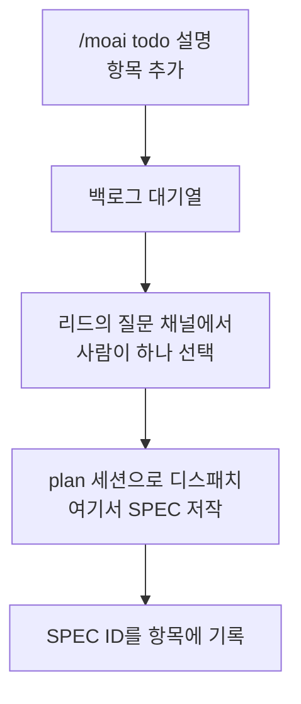



다음에 할 일을 한 줄씩 쌓아 두는 **백로그 대기열**입니다. 칸반 보드의 `backlog` 컬럼에는 맡은 세션이 없어서 아무도 일을 밀어 넣지 못합니다. 그래서 카드를 보드에 들이는 일은 언제나 사람의 판단이고, `/moai todo`가 그 창구입니다.


**한 줄 요약**: `/moai todo`는 "다음에 뭘 할지 적어 두는 줄"입니다. 항목을 넣고, 목록을 보고, 다 된 것을 지우고, 다음에 착수할 하나를 고릅니다. SPEC도 계획도 아니고, 고르는 순간에야 SPEC이 됩니다.



**슬래시 커맨드**: Claude Code에서 `/moai:todo`를 입력하면 바로 실행됩니다. `/moai`만 입력하면 사용 가능한 모든 서브커맨드 목록이 표시됩니다.


## 개요

백로그의 한 항목은 **의도 한 줄**입니다. SPEC도, 계획서도, 추정치도 아닙니다. 사람이 그 항목을 고르고 리드 세션이 `plan` 세션으로 디스패치할 때 비로소 SPEC이 됩니다.

대기열은 일부러 얇게 만들었습니다. SPEC이나 git 이력, 보드가 더 잘 기록할 것은 담지 않고, **사람이 다음에 무엇을 원하는가**만 남깁니다.



## 사용법

```bash
# 항목 추가
> /moai todo "인증 미들웨어의 오류 경로 정리"

# 대기열 보기
> /moai todo
```

| 호출 | 동작 |
|------|------|
| `/moai todo "<설명>"` | 항목을 대기열 끝에 추가하고, 추가된 항목과 위치를 보여 줍니다. |
| `/moai todo` | 대기열을 순서대로, 위치 번호와 함께 보여 줍니다. |

항목을 제거하거나 다음 카드를 고르는 동사는 슬래시 표면에 없습니다. 그 두 가지는 아래의 터미널 CLI(`moai todo done`, `moai todo next`) 또는 리드 세션을 통한 선택이 담당합니다.

그 밖의 인자 형태는 설명으로 취급합니다. `/moai todo CI 캐시 불안정 해결`은 오류가 아니라 항목 추가입니다 — 잘못 알아들었을 때의 대가가 사람이 한 줄 지우는 것뿐이기 때문입니다.

## 상태 파일

대기열은 `.moai/state/kanban/backlog.json`에 저장됩니다. 프로젝트 안에만 있고 커밋되지 않습니다.

```json
{
  "version": 1,
  "items": [
    {
      "id": "t1",
      "text": "인증 미들웨어의 오류 경로 정리",
      "added_at": "<RFC3339 시각>",
      "spec_id": null,
      "state": "queued"
    }
  ],
  "findings": [
    {
      "subject_id": "t2",
      "related_id": "t1",
      "relation": "near-duplicate",
      "source": "mechanical",
      "score": 0.83,
      "note": "",
      "at": "<RFC3339 시각>"
    }
  ]
}
```

| 필드 | 의미 |
|------|------|
| `id` | 추가 시점에 붙는 짧고 안정적인 식별자. 제거된 뒤에도 재사용하지 않습니다. |
| `spec_id` | SPEC 식별자로 가는 선택적 연결고리입니다. 고르는 시점에 `--spec`으로 알려 주면 그때 채워지고, 모르면 `picked` 상태에서도 `null`로 남습니다. |
| `findings` | 카드 **쌍**에 대한 기록입니다. 관계는 어느 한 카드가 아니라 둘 사이의 성질이라 항목이 아니라 여기에 있습니다. 언제나 배열입니다 — 이 기능 이전에 쓰인 파일도 빈 배열로 열리므로, "기록이 없다"와 "그런 기능이 없다"를 헷갈릴 일이 없습니다. `source`는 기계가 잰 `mechanical`이거나 사람·에이전트가 적은 `agent`입니다. 카드가 파일에서 빠지면 그 카드를 가리키던 기록도 함께 빠집니다. |
| `state` | 생명주기 판별자입니다. `queued` · `picked` · `dropped` 중 하나이며, "아직 백로그의 항목"인지 "이미 보드 위로 넘어간 카드"인지는 이 값이 가립니다. 고른 항목도 파일에 남아 무엇이 진행 중인지 보입니다. 항목을 파일에서 **없애는** 길은 `moai todo done` 하나뿐이고 사람이 직접 실행합니다 — 일이 끝났다고 저절로 지워지는 경로는 없습니다. 폐기는 삭제와 다릅니다: `moai todo drop <n> "<이유>"`는 카드를 파일에 남긴 채 `dropped`로 옮기고 이유를 텍스트 앞에 붙이며, `moai todo undrop <n>`이 이를 정확히 되돌립니다. `dropped` 카드는 고를 후보에서 빠집니다. |

파일은 원자적으로 씁니다(임시 파일에 쓰고 이름을 바꿉니다). 쓰는 도중 죽어도 대기열이 잘리지 않게 하기 위해서입니다. 파일이 없으면 오류가 아니라 **빈 대기열**이고, 형식이 깨진 파일은 보고만 하고 손대지 않습니다 — 여기 담긴 사람의 의도는 다시 만들어 낼 수 없는 유일한 값이기 때문입니다.

## 자동 분석

큐는 카드를 추가할 때마다, 그리고 `moai todo analyze`를 실행할 때 스스로를 읽어 **닮은 카드를 찾아 기록**합니다. 기록은 카드를 바꾸지 않습니다 — 텍스트도, 순서도, 상태도.

분석이 실제로 무언가를 막는 경우는 하나뿐입니다. 이미 대기 중이거나 고른 카드와 **정규화 후 텍스트가 완전히 같은** 카드는 추가 자체가 거절됩니다. 거절은 아무것도 지우지 않고 큐 파일을 바이트 그대로 두며, 사람은 id 대신 에러를 봅니다. 그래도 넣어야 하면 `--force`가 넣고, 강제된 중복이라는 사실을 기록으로 남깁니다.

닮았지만 같지는 않은 카드(토큰 집합 Jaccard 0.80 이상)는 **그대로 추가되고** 근접 중복 기록만 붙습니다. 말이 다르면 뜻이 같아도 기계는 알아채지 못하는데, 이것은 의도한 한계입니다. 이 층이 오판하면 사람이 쓴 카드가 사라지지만, 뜻을 판정하는 `moai todo relate`는 기록만 남기므로 거기서의 오판은 줄 하나로 끝납니다.

`contains` · `absorbs` · `replaces` · `conflicts` 네 관계는 사람이나 에이전트가 손으로 적습니다. **이름과 달리 아무 일도 하지 않습니다** — `absorbs`를 적어도 카드는 흡수되지 않습니다. 무엇을 할지는 기록을 읽고 사람이 정하며, 실행은 `drop` · `edit` · `move`로 합니다.

`moai todo list`는 기록을 해당 카드 아래 들여쓴 줄로 보여 주고, 같은 쌍에 사람이 적은 기록이 하나도 없으면 `machine-only`를 붙입니다. 이 표시는 "아무도 검토하지 않았다"가 아니라 "기계 기록만 있다"는 사실만 말합니다 — CLI는 자기를 누가 불렀는지 알 수 없기 때문입니다.

## 다음 카드 고르기

선택은 리드 세션의 질문 채널을 통해 사람이 합니다. 리드가 대기열을 선택지로 띄우는데, 오래된 것부터 한 항목에 하나씩, 도구가 허용하는 네 개까지 보여 주고 나머지는 본문에 요약해 아무것도 가려지지 않게 합니다. `/clear` 뒤 첫 수로 대기열을 제시할 때도 같은 방식이고, 터미널에서 후보만 확인하고 싶을 때는 `moai todo next`(인자 없음)가 같은 목록을 읽기 전용으로 출력합니다.


 **고르는 주체는 사람입니다.** 미리 선택해 두지 않고, 추정한 우선순위로 순서를 바꾸지 않으며, "맨 위 것부터 시작"을 기본값으로 붙이지 않습니다. 대기열이 비었으면 비었다고 말하고 멈춥니다 — 빈 백로그는 정상 상태이지, 일을 지어내라는 신호가 아닙니다.


여러 카드를 한 번에 승인할 수도 있습니다. 카드를 지목하거나, 대기열이 빌 때까지 순서대로 진행하라고 말하는 방식입니다. 이것도 사람의 선택이며, 한 장씩 대신 한 번에 했을 뿐입니다. 리드는 승인된 순서대로 카드를 들이고 다시 묻지 않습니다. 다만 그 승인이 허락하는 범위는 딱 그것뿐입니다 — 대기열에 항목을 더하거나, 순서를 바꾸거나, 승인 범위 밖의 판단이 필요해진 카드를 대신 결정하는 근거가 되지는 않습니다.

카드를 고른 뒤에는 이렇게 이어집니다.

1. 고른 항목을 `moai todo next <n> [--spec <SPEC-ID>]` 한 번의 잠긴 쓰기로 `picked`로 표시합니다. 식별자를 이미 알고 있으면 이때 함께 붙입니다.
2. 칸반 디스패치 규약에 따라 `plan` 세션으로 넘깁니다. 카드는 `plan` 컬럼에 들어가고, SPEC 저작은 여기가 아니라 거기서 일어납니다.
3. 고를 때 식별자를 몰랐다면, 알게 된 뒤 `moai todo next <n> --spec <SPEC-ID>`를 다시 실행해 항목에 붙입니다. 이후 부착을 자동으로 해 주는 경로는 없습니다 — 디스패치와 후속 부착 모두 리드 세션이 수행하는 지시이지, 대기열이 스스로 하는 일이 아닙니다.

## 칸반 모드 밖에서

`/moai todo`는 평범한 단일 세션에서도 그대로 동작합니다 — 그냥 대기열이기 때문입니다. 다만 디스패치는 하지 않습니다. 동반 세션이 없으면 지시할 상대가 없으므로, 대기열을 읽고 쓰는 것까지가 전부이고 나머지는 사람이 직접 진행합니다.

## 경계

- **작업 관리 도구가 아닙니다.** 우선순위도, 담당자도, 마감도, 의존 관계도 없습니다. 그런 것이 필요한 일은 이슈 트래커나 SPEC의 몫입니다.
- **보드가 아닙니다.** 카드가 어느 컬럼에 있는지는 리드 세션과 SPEC 상태가 쥐고 있지, 이 파일에 있지 않습니다.
- **진행 중인 일의 원본이 아닙니다.** 카드에 SPEC이 생긴 뒤로는 SPEC 산출물이 기준이고, 백로그 항목은 그것을 가리키는 표식일 뿐입니다.
- **저절로 채워지지 않습니다.** TODO 주석이나 열린 이슈, 감사 결과를 도구가 알아서 긁어 오지 않습니다. 항목을 넣는 것은 사람입니다.
- **안내 표면은 끌 수 있습니다.** 세션 시작 요약 · 상태 표시줄 TODO 세그먼트 · 자동 라우팅은 `workflow.yaml`의 `workflow.todo.enabled: false`로 끕니다([설정 문서](/ko/advanced/config-sections/) 참조). 명령과 동사는 꺼도 그대로 동작합니다.

## CLI 표면

같은 대기열을 터미널에서도 조작할 수 있습니다. 슬래시 커맨드 `/moai todo`는 Claude Code 대화창에서, 터미널 CLI `moai todo`는 셸에서 부르는 별개의 표면입니다 — 이 둘은 같은 파일을 다루지만 문법이 다릅니다.

```bash
# 항목 추가 — 발급된 id와 대기열 위치를 한 줄로 출력
$ moai todo add "인증 미들웨어의 오류 경로 정리"

# 두 단어 이상이면 add 없이도 추가됩니다 (자연어 fallthrough)
$ moai todo rename 힌트가 낡았다

# 대기열 보기 (id · 상태 · 본문) — 동사 없이 bare 호출도 같은 결과
$ moai todo
$ moai todo list

# 구조화된 레코드로 보기
$ moai todo list --json

# 항목 제거 — 번호(t4)나 명시적 id 둘 다 받습니다
$ moai todo done 4

# 대기 중인 항목을 오래된 것부터 출력 (읽기 전용)
$ moai todo next

# 항목 하나를 고른 것으로 기록 — SPEC 식별자도 함께
$ moai todo next 4 --spec SPEC-AUTH-001

# 추가와 선택을 한 번의 잠긴 쓰기로
$ moai todo add "그래프 질의 문서 정리" --pick

# 고른 표시를 되돌립니다 — 아직 plan으로 넘어가지 않은 카드에
$ moai todo unpick 4

# 큐 전체를 다시 분석해 기록만 남깁니다 (카드는 건드리지 않습니다)
$ moai todo analyze

# 정확 중복이라도 넣습니다 — 강제했다는 사실이 기록됩니다
$ moai todo add "인증 미들웨어의 오류 경로 정리" --force

# 두 카드의 관계를 기록합니다 (기록뿐, 카드는 그대로)
$ moai todo relate t2 t1 --relation absorbs --note "t2가 t1을 포함"

# 이 카드에 대해 큐가 아는 것을 전부 출력
$ moai todo why t1

# 기록 하나를 지웁니다 — 번호는 why가 출력합니다
$ moai todo unrelate 2
```

| 명령 | 동작 |
|------|------|
| `moai todo` (bare) | 대기열을 출력합니다. `list`와 같은 출력입니다. |
| `moai todo <두 단어 이상>` | 자연어 그대로 항목을 추가합니다. 한 단어(오탈자 동사 포함)는 추가가 아니라 에러로 남습니다. 동사처럼 생긴 첫 토큰 뒤에 카드 id가 오면(`moai todo pick t151`) 오탈자 동사로 보아 에러입니다 — 문장 중간에 id를 언급하는 카드는 그대로 추가됩니다. |
| `moai todo add "<text>" [--pick]` | 항목을 추가하고 발급된 id와 위치를 출력합니다. `--pick`을 붙이면 추가와 선택 표시가 한 번의 잠긴 쓰기로 일어납니다. |
| `moai todo list` / `--json` | 대기열을 출력합니다. `--json`은 레코드 전체를 JSON으로 내보냅니다. |
| `moai todo done <n>` | `n`번 항목을 제거합니다. `t<n>` 형태의 명시적 id를 권장합니다 — 동시 추가로 위치가 움직일 수 있기 때문입니다. |
| `moai todo next` | 대기 중 항목을 오래된 것부터 출력합니다. 읽기 전용입니다. |
| `moai todo next <n> [--spec <SPEC-ID>]` | 항목을 `picked`로 표시하고, `--spec`을 주면 식별자를 그대로 기록합니다. 한 번의 잠긴 쓰기로 일어납니다. |
| `moai todo unpick <n>` | `picked` 표시를 되돌립니다. 선택 자체가 사람의 판단이므로 되돌림도 사람이 직접 합니다. |
| `moai todo drop <n> "<reason>" [--expect <prefix>]` | 대기 중 카드를 `dropped`로 옮기고 텍스트 앞에 `[DROPPED — <reason>] ` 표식을 붙입니다. 인자 두 개가 모두 필요하며, 이유가 비어 있거나 `]`를 포함하면 거부합니다. 카드는 파일에 남고 고를 후보에서만 빠집니다. `--expect`는 카드 텍스트가 그 접두사로 시작할 때만 실행합니다. |
| `moai todo undrop <n> [--expect <prefix>]` | `dropped` 카드를 `queued`로 되돌리고 표식이 있으면 떼어 냅니다. 판단 기준은 표식이 아니라 상태라서, 손으로 `dropped`라 적어 둔 카드도 텍스트를 그대로 둔 채 되살아납니다. `drop`과 짝을 이루는 정확한 역연산입니다. |
| `moai todo edit <n> "<text>" [--expect <prefix>]` | 카드의 텍스트만 다시 씁니다. `id` · `added_at` · `state` · `spec_id`는 그대로라, done 후 재추가처럼 카드의 정체성이 바뀌지 않습니다. 확인 줄에 새 텍스트와 이전 텍스트가 함께 나옵니다. |
| `moai todo move <n> (--top \| --bottom \| --before <m> \| --after <m>)` | 큐 파일의 **순서** 안에서 카드 위치를 옮깁니다. 목적지 플래그는 정확히 하나만 필요하며, 없거나 둘이면 잘못된 호출로 거부합니다. 항목을 재배열할 뿐 무엇도 지우거나 바꾸지 않으므로, 잘못 옮겼으면 다시 옮겨 되돌립니다. |
| `moai todo add "<text>" --force` | 기계가 정확 중복으로 읽은 카드도 그대로 추가합니다. 강제된 중복이라는 기록이 함께 남아 충돌이 눈에 보입니다. |
| `moai todo analyze` | 큐 전체를 다시 분석해 기록만 남깁니다. 추가·삭제·재정렬·수정은 하지 않으며, 다시 실행해도 같은 기록이 두 번 쌓이지 않습니다. |
| `moai todo relate <a> <b> --relation (contains \| absorbs \| replaces \| conflicts) [--note <text>]` | 두 카드의 관계를 하나 기록합니다. 기록일 뿐이라 두 카드 모두 그대로입니다 — `absorbs`가 흡수를 실행하지 않습니다. |
| `moai todo unrelate <index>` | 지목한 기록 하나를 지웁니다. 번호는 `why`가 출력하는 것입니다. 카드는 바뀌지 않습니다. |
| `moai todo why <n>` | 그 카드를 지칭하는 기록을 전부 출력합니다. 없으면 없다고 명시적으로 말합니다 — 아무것도 안 찍히면 고장과 구별되지 않기 때문입니다. |

CLI는 프롬프트를 띄우지 않습니다. 인자와 플래그를 받고 한 줄을 출력하며, 오류는 stderr로 — 스크립트와 CI에서 안전하게 쓸 수 있는 형태입니다.

연결된 워크트리 안에서 실행해도 대기열은 **프라이머리 체크아웃의 큐 하나로 귀속**됩니다 — 저장소 하나에 큐 하나라는 계약입니다. 카드 워크트리에서 `moai todo add`를 하면 리드와 포어맨 루프가 읽는 같은 파일에 추가됩니다. git 메타데이터가 없는 프로젝트는 `~/.moai/todo/<project-key>/backlog.json`에 큐를 둡니다.

두 표면은 같은 저장 계층을 공유합니다. 변경은 대기열 파일 옆의 잠금 파일(backlog.lock)을 잡은 뒤, 같은 디렉터리의 임시 파일에 쓰고 이름을 바꾸는 원자적 쓰기로 반영되며, 읽기는 잠금 없이 일어납니다. 항목 id는 잠금 안에서 파일에 남은 최고 수위 표시(`last_seq`)에서 발급되므로, 제거된 항목의 id는 다시 쓰이지 않습니다.


**설치된 바이너리**: CLI는 main에 반영된 상태로 배포됩니다. 이미 설치된 `moai` 바이너리는 재설치해야 이 명령을 얻습니다.


## 관련 문서

- [칸반 모드](/ko/advanced/kanban-mode) — 백로그에서 나간 카드가 흘러가는 보드
- [`/moai` 통합 명령](/ko/utility-commands/moai) — 서브커맨드 전체 지도
- [`/moai plan`](/ko/workflow-commands/moai-plan) — 고른 카드가 SPEC이 되는 단계
