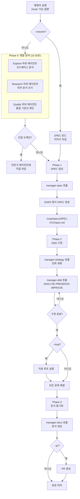

# /moai

완전 자율 자동화 명령어입니다. 사용자가 목표를 제공하면 MoAI가 **plan → run →
sync** 파이프라인을 자율적으로 실행합니다.


  **한 줄 요약**: `/moai`는 "완전 자율 자동화" 명령어입니다. 사용자는 원하는
  기능을 자연어로 설명하기만 하면, MoAI가 SPEC 생성부터 구현, 문서화까지 **모든
  과정을 자동으로** 수행합니다.



**슬래시 커맨드 지원**: MoAI의 모든 서브커맨드는 스킬로 래핑되어 있어, `/moai`만 입력하면 사용 가능한 서브커맨드 목록이 표시됩니다. 각 서브커맨드는 `/moai:fix`, `/moai:loop`, `/moai:review` 등의 형식으로 바로 실행할 수도 있습니다.


## 개요

`/moai`는 MoAI-ADK의 **완전 자율 자동화 워크플로우** 명령어입니다. 하위 명령어를
따로 실행할 필요 없이, 단 한 번의 명령으로 전체 개발 프로세스가 자동화됩니다:

1. **SPEC 생성** (manager-spec)
2. **DDD 구현** (manager-ddd)
3. **문서 동기화** (manager-docs)

## 사용법

```bash
# 기본 사용법
> /moai "구현하고 싶은 기능 설명"

# 워크트리와 함께
> /moai "기능 설명" --worktree

# 브랜치와 함께
> /moai "기능 설명" --branch

# 루프 모드 활성화
> /moai "기능 설명" --loop

# 기존 SPEC 재개
> /moai --resume SPEC-AUTH-001
```

## 지원 플래그

| 플래그              | 설명                             | 예시                           |
| ------------------- | -------------------------------- | ------------------------------ |
| `--loop`            | 구현 후 자동 반복 수정 활성화    | `/moai "기능" --loop`          |
| `--max N`           | 최대 반복 횟수 지정 (기본값 100) | `/moai "기능" --loop --max 10` |
| `--branch`          | 자동 feature 브랜치 생성         | `/moai "기능" --branch`        |
| `--pr`              | 완료 후 자동 PR 생성             | `/moai "기능" --pr`            |
| `--resume SPEC-XXX` | 기존 SPEC 작업 재개              | `/moai --resume SPEC-AUTH-001` |
| `--team`            | 에이전트 팀 모드 강제            | `/moai "기능" --team`          |
| `--solo`            | 하위 에이전트 모드 강제          | `/moai "기능" --solo`          |

### --loop 플래그

구현이 완료된 후 자동으로 반복 수정을 실행하여 모든 오류를 수정합니다:

```bash
> /moai "JWT 인증 시스템" --loop
```

이 옵션을 사용하면:

1. SPEC 생성
2. DDD 구현
3. **자동 루프 실행** (LSP 오류, 테스트 실패, 커버리지 부족 해결)
4. 문서 동기화
5. PR 생성


  `--loop` 옵션은 **구현 후 정리 작업을 완전히 자동화**하여 생산성을
  극대화합니다.


### --team / --solo 플래그

`--team` 플래그는 에이전트 팀 모드를 강제하여 여러 전문 에이전트가 **병렬로 협업**합니다:

```bash
> /moai "기능 설명" --team
```

#### 전제 조건

에이전트 팀 모드를 사용하려면 다음 두 가지 조건이 모두 충족되어야 합니다:

1. 환경 변수: `CLAUDE_CODE_EXPERIMENTAL_AGENT_TEAMS=1` (settings.json에서 설정)
2. 설정 파일: `workflow.team.enabled: true` (`.moai/config/sections/workflow.yaml`)

#### 모드 선택

| 플래그 | 동작 |
| ------ | ---- |
| `--team` | 에이전트 팀 모드 강제 (병렬 실행) |
| `--solo` | 하위 에이전트 모드 강제 (순차 실행) |
| (없음) | 복잡도 기반 자동 선택 |

**자동 선택 기준** (플래그 없을 때):

- 영향 도메인 >= 3개 → 팀 모드
- 수정 파일 >= 10개 → 팀 모드
- 복잡도 점수 >= 7 → 팀 모드
- 그 외 → 하위 에이전트 모드

#### 팀 구성

**Plan 단계 팀:**

| 에이전트 | 역할 | 주요 작업 |
| -------- | ---- | --------- |
| **researcher** | 코드베이스 탐색 | 관련 코드, 참조 구현, 의존성 분석 |
| **analyst** | 요구사항 분석 | 유저 스토리, 인수 기준, 엣지 케이스 |
| **architect** | 기술 설계 | 아키텍처 결정, 대안 평가, 트레이드오프 |

**Run 단계 팀:**

| 에이전트 | 역할 | 주요 작업 |
| -------- | ---- | --------- |
| **backend-dev** | 백엔드 구현 | API, 비즈니스 로직, 데이터베이스 |
| **frontend-dev** | 프론트엔드 구현 | UI 컴포넌트, 상태 관리, 스타일링 |
| **tester** | 테스트 작성 | 단위, 통합, E2E 테스트 |

#### 파일 소유권

팀 모드에서는 각 에이전트가 특정 파일 패턴을 **독점적으로** 소유하여 충돌을 방지합니다:

| 에이전트 | 소유 파일 패턴 |
| -------- | -------------- |
| backend-dev | `src/**/*.go`, `internal/**`, `pkg/**` |
| frontend-dev | `src/**/*.tsx`, `src/**/*.css`, `public/**` |
| tester | `**/*_test.go`, `**/*.test.ts`, `**/*.spec.ts` |

#### 토큰 비용

에이전트 팀은 각 에이전트가 독립적인 컨텍스트 윈도우를 사용하므로 토큰 사용량이 증가합니다:

| 팀 패턴 | 에이전트 수 | 예상 배수 |
| -------- | ----------- | --------- |
| Plan 연구 | 3 | ~3x |
| 구현 | 3 | ~3x |
| 조사 | 3 | ~2x (haiku) |


  `--team` 모드는 실험적 기능입니다. 복잡한 크로스 레이어 작업에서 가장
  효과적이며, 단순한 단일 도메인 작업에는 `--solo` 모드가 더 효율적입니다.


## 실행 과정

`/moai`가 내부적으로 수행하는 전체 과정입니다:



**핵심 포인트:**

- **Phase 0 (병렬 탐색)**: 세 에이전트가 동시에 실행되어 2-3배 속도 향상
- **단일 도메인 라우팅**: 단순 작업은 전문가 에이전트에 직접 위임하여 SPEC
  건너뜀
- **완료 마커**: 작업 완료 시 `<moai>DONE</moai>` 또는 `<moai>COMPLETE</moai>`
  출력

## Phase별 상세

### Phase 0: 병렬 탐색 (선택적)

세 에이전트가 **동시에** 실행되어 프로젝트 맥락을 빠르게 파악합니다:

| 에이전트     | 역할            | 작업                                     |
| ------------ | --------------- | ---------------------------------------- |
| **Explore**  | 코드베이스 분석 | 관련 파일, 아키텍처 패턴, 기존 구현 발견 |
| **Research** | 외부 문서 조사  | 공식 문서, API 문서, 유사 구현 예시      |
| **Quality**  | 품질 기준선     | 테스트 커버리지, 린트 상태, 기술 부채    |

**속도 향상:** 병렬 실행으로 순차 실행 대비 2-3배 빠름 (15-30초 vs 45-90초)

**단일 도메인 라우팅:**

- 단일 도메인 작업 (예: "SQL 최적화"): SPEC 생성 없이 전문가 에이전트에 직접
  위임
- 다중 도메인 작업: 전체 워크플로우 진행

### Phase 1: SPEC 생성

**manager-spec** 하위 에이전트가 EARS 형식 SPEC 문서를 생성합니다:

- .moai/specs/SPEC-XXX/spec.md
- EARS 형식 요구사항
- Given-When-Then 인수 기준
- conversation_language로 작성된 콘텐츠

### Phase 2: DDD 구현 루프

**[HARD] 에이전트 위임 규정:** 모든 구현 작업은 전문화된 에이전트에 위임해야
합니다. 자동 컴팩트 후에도 직접 구현을 금지합니다.

**전문가 에이전트 선택:**

| 작업 유형           | 에이전트                         |
| ------------------- | -------------------------------- |
| 백엔드 로직         | expert-backend 하위 에이전트     |
| 프론트엔드 컴포넌트 | expert-frontend 하위 에이전트    |
| 테스트 생성         | expert-testing 하위 에이전트     |
| 버그 수정           | expert-debug 하위 에이전트       |
| 리팩토링            | expert-refactoring 하위 에이전트 |
| 보안 수정           | expert-security 하위 에이전트    |

**루프 동작 (--loop 또는 ralph.yaml loop.enabled가 true일 때):**

```
문제가 존재 AND 반복 < 최대값:
  1. 진단 실행 (기본 병렬)
  2. 적절한 전문가 에이전트에 수정 위임
  3. 수정 결과 검증
  4. 완료 마커 확인
  5. 마커 발견 시 루프 종료
```

### Phase 3: 문서 동기화

**manager-docs** 하위 에이전트가 구현과 문서를 동기화합니다:

- API 문서 생성
- README 업데이트
- CHANGELOG 추가
- 성공 시 완료 마커 추가

## TODO 관리

**[HARD] TodoWrite 도구 필수:** 모든 작업 추적으로 TodoWrite 사용 필수

- 이슈 발견 시: TodoWrite (pending 상태)
- 작업 시작 전: TodoWrite (in_progress 상태)
- 작업 완료 후: TodoWrite (completed 상태)
- TODO 목록을 텍스트로 출력 금지

## 완료 마커

AI는 작업 완료 시 마커를 추가합니다:

- `<moai>DONE</moai>` - 작업 완료
- `<moai>COMPLETE</moai>` - 전체 완료
- `<moai:done />` - XML 형식

## LLM 모드 라우팅

llm.yaml 설정에 따라 자동 라우팅:

| 모드          | Plan 단계      | Run 단계       |
| ------------- | -------------- | -------------- |
| `claude-only` | Claude         | Claude         |
| `hybrid`      | Claude         | GLM (worktree) |
| `glm-only`    | GLM (worktree) | GLM (worktree) |

## 실전 예시

### 예시: JWT 인증 시스템 완전 자동화

**1단계: 명령어 실행**

```bash
> /moai "JWT 기반 사용자 인증 시스템: 회원가입, 로그인, 토큰 갱신" --worktree --loop --pr
```

**2단계: Phase 0 - 병렬 탐색**

```
[병렬 탐색 시작]
  Explore 하위 에이전트: src/auth/ 분석 중...
  Research 하위 에이전트: JWT best practices 조사 중...
  Quality 하위 에이전트: 테스트 커버리지 32% 확인...

[탐색 완료 - 23초]
  발견 파일: 4개
  권장 라이브러리: PyJWT, bcrypt
  기준선: LSP 0 오류, 커버리지 32%
```

**3단계: Phase 1 - SPEC 생성**

```
[manager-spec 호출]
  SPEC ID: SPEC-AUTH-001
  요구사항: 5개 (EARS 형식)
  인수 기준: 3개 시나리오

  사용자 승인: 완료
```

**4단계: Phase 2 - DDD 구현**

```
[manager-strategy]
  작업 분해: 7개 태스크
  전략 계획 완료

[manager-ddd]
  ANALYZE: 코드 구조 분석 완료
  PRESERVE: 특성화 테스트 12개 작성
  IMPROVE: 7개 태스크 구현 완료

[manager-quality]
  TRUST 5: 모든 기둥 통과
  커버리지: 89%
  상태: PASS
```

**5단계: 자동 루프 (--loop)**

```
[루프 시작 - 반복 1/100]
  진단: 타입 오류 2개 발견
  수정: expert-backend 하위 에이전트에 위임
  검증: 모든 오류 해결됨

[루프 종료 - 1회 반복]
  완료 조건 충족!
```

**6단계: Phase 3 - 문서 동기화**

```
[manager-docs]
  API 문서: docs/api/auth.md 생성
  README: 사용법 섹션 업데이트
  CHANGELOG: v1.1.0 항목 추가
  SPEC-AUTH-001: ACTIVE → COMPLETED
```

**7단계: 완료**

```
[완료]
  SPEC: SPEC-AUTH-001
  커밋: 7개
  테스트: 36/36 통과
  커버리지: 89%
  PR: #42 생성 (Draft → Ready)

<moai:COMPLETE />
```

## 자주 묻는 질문

### Q: `/moai`와 하위 명령어의 차이는 무엇인가요?

| 명령어       | 범위        | 사용 시점                    |
| ------------ | ----------- | ---------------------------- |
| `/moai`      | 전체 자동화 | 빠른 완전 자동화 원할 때     |
| `/moai plan` | SPEC 생성만 | SPEC을 먼저 검토하고 싶을 때 |
| `/moai run`  | 구현만      | SPEC이 이미 있을 때          |
| `/moai sync` | 문서화만    | 구현 후 문서만 업데이트할 때 |

### Q: --loop 플래그를 언제 사용해야 하나요?

구현 후 자동으로 모든 오류를 수정하고 싶을 때 사용합니다. 특히 대규모 리팩토링
후 정리 작업에 유용합니다.

### Q: 단일 도메인 라우팅이란 무엇인가요?

단일 도메인 작업 (예: "SQL 쿼리 최적화")은 SPEC 생성 없이 해당 도메인 전문가
에이전트에 직접 위임하여 시간을 절약합니다.

## 관련 문서

- [/moai plan](/workflow-commands/moai-plan) - SPEC 생성 상세
- [/moai run](/workflow-commands/moai-run) - DDD 구현 상세
- [/moai sync](/workflow-commands/moai-sync) - 문서 동기화 상세
- [/moai loop](/utility-commands/moai-loop) - 반복 수정 루프 상세
- [/moai fix](/utility-commands/moai-fix) - 일회성 자동 수정 상세
