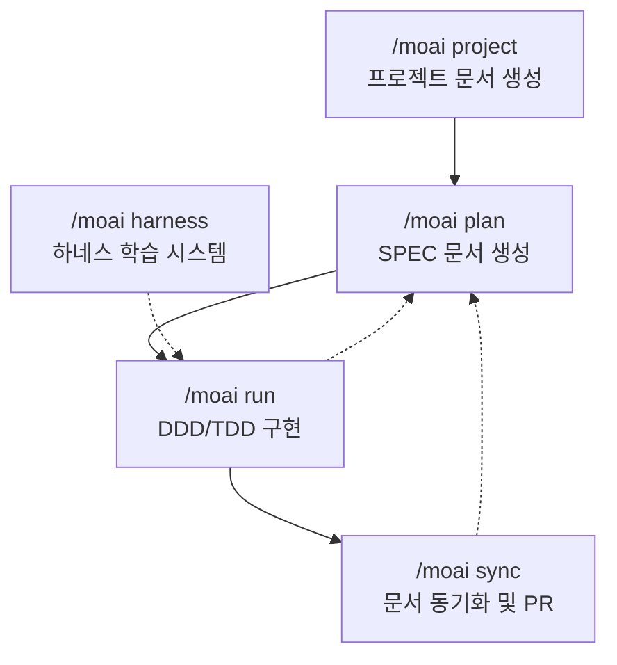

MoAI-ADK의 워크플로우 명령어로 체계적인 개발 사이클을 완성하세요.

## 개발 사이클 개요

MoAI-ADK는 **워크플로우 명령어**를 통해 프로젝트 초기화부터 배포 준비까지 전 과정을 지원합니다. 각 명령어는 전문화된 AI 에이전트가 담당하며, 순서대로 실행하면 품질 높은 소프트웨어를 안정적으로 만들 수 있습니다.



## 명령어 요약

| 명령어 | 단계 | 담당 에이전트 | 토큰 예산 | 목적 |
|--------|------|---------------|-----------|------|
| [`/moai project`](./moai-project) | Phase 0 | manager-docs | - | 프로젝트 문서 자동 생성 |
| [`/moai plan`](./moai-plan) | Phase 1 | manager-spec | 30K | SPEC 문서 생성 |
| [`/moai run`](./moai-run) | Phase 2 | manager-develop | 180K | DDD/TDD 방식 구현 |
| [`/moai sync`](./moai-sync) | Phase 3 | manager-docs | 40K | 문서 동기화 및 PR 생성 |
| [`/moai harness`](./moai-harness) | 보조 | builder-harness | - | 하네스 학습 라이프사이클 관리 |


처음 사용하신다면 `/moai project`부터 시작하세요. 프로젝트 문서가 있어야 이후 단계에서 AI가 프로젝트를 정확히 이해하고 작업할 수 있습니다.

`/moai harness`는 하네스 학습 서브시스템 관리용 보조 명령어입니다 — CLAUDE.md 변경을 모니터링하고 티어 기반 자동 업데이트를 제안합니다.


## 빠른 시작

```bash
# Phase 0: 프로젝트 문서 생성 (최초 1회)
> /moai project

# Phase 1: SPEC 생성
> /moai plan "사용자 인증 기능 구현"
> /clear

# Phase 2: DDD 구현
> /moai run SPEC-AUTH-001
> /clear

# Phase 3: 문서 동기화 및 PR
> /moai sync SPEC-AUTH-001

# 보조: 하네스 학습 관리 (선택)
> /moai harness status
> /moai harness apply
```

## 관련 문서

- [SPEC 기반 개발](/core-concepts/spec-based-dev) - SPEC과 EARS 형식 상세 설명
- [DDD 방법론](/core-concepts/ddd) - ANALYZE-PRESERVE-IMPROVE 사이클 상세 설명
- [TRUST 5 품질 시스템](/core-concepts/trust-5) - 품질 게이트 상세 설명
- [하네스 엔지니어링](/core-concepts/harness-engineering) - 하네스 학습 서브시스템 개요
- [빠른 시작](/getting-started/quickstart) - 처음부터 따라하는 튜토리얼
