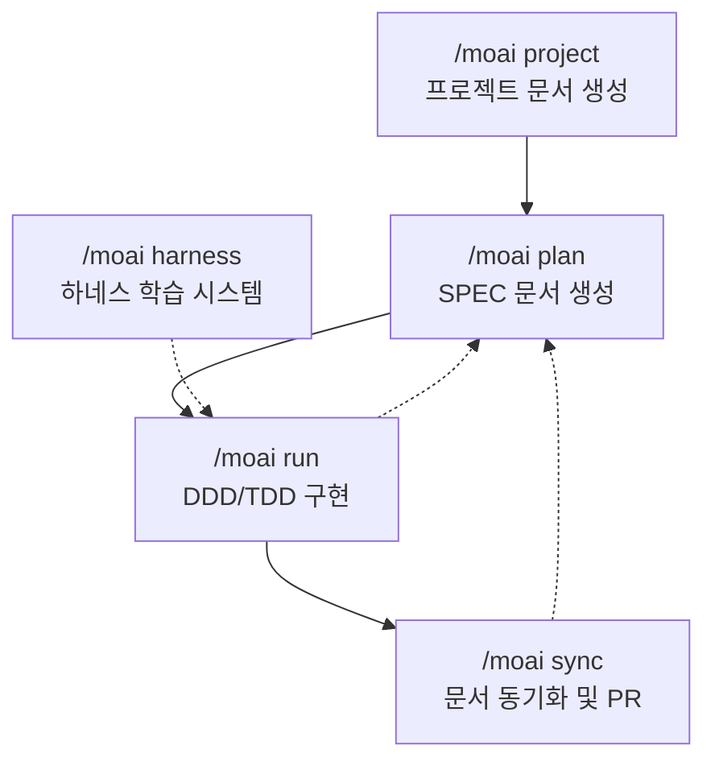

 <strong>소속 가치</strong>: 에이전틱 하네스

<!-- @value: agentic-harness -->


SPEC 기반 3-Phase 라이프사이클 (plan → run → sync)을 실행하는 명령어 모음입니다.


## 에이전틱 하네스의 중심 — 3-Phase 라이프사이클

MoAI-ADK v3의 세 가지 핵심 중 하나가 **에이전틱 하네스** (Agentic Harness)입니다. 코드를 직접 쓰는 대신, 에이전트가 일을 잘할 수 있는 환경(SPEC 문서, 품질 게이트, 피드백 루프)을 짜 둔다는 뜻입니다. 워크플로우 명령어는 이 하네스의 중심인 **plan → run → sync** 파이프라인을 돌립니다.

단계마다 담당 에이전트가 따로 있고, 만든 쪽이 스스로 채점하지 않도록 **계획과 감사를 분리**해 두었습니다. plan 단계의 산출물은 plan-auditor가 따로 감사하고, sync 단계의 결과물은 sync-auditor가 4차원(Functionality·Security·Craft·Consistency)으로 평가합니다. run 단계로 넘어가기 직전에는 **구현 착수 승인** (휴먼 게이트)에서 결정권이 반드시 사용자에게 돌아옵니다.


```mermaid
flowchart TD
    A["/moai project<br>프로젝트 문서 생성"] --> B["/moai plan<br>SPEC 문서 생성"]
    B --> D["/moai run<br>DDD/TDD 구현"]
    D --> E["/moai sync<br>문서 동기화 및 PR"]
    E -.-> B
    D -.-> B
    F["/moai harness<br>하네스 학습 시스템"] -.-> D
```

## 명령어 요약

| 명령어 | 단계 | 담당 에이전트 | 토큰 예산 | 목적 |
|--------|------|---------------|-----------|------|
| [`/moai project`](./moai-project) | Phase 0 | manager-docs | - | 프로젝트 문서 자동 생성 |
| [`/moai plan`](./moai-plan) | Phase 1 | manager-spec | 30K | SPEC 문서 생성 |
| [`/moai run`](./moai-run) | Phase 2 | manager-develop | 180K | DDD/TDD 방식 구현 |
| [`/moai sync`](./moai-sync) | Phase 3 | manager-docs | 40K | 문서 동기화 및 PR 생성 |
| [`/moai goal`](./moai-goal)  | 자율 연속 | stop-goal 평가기 | - | 조건 선언형 자율 루프 (v3.1) |
| [`/moai design`](./moai-design) | 조건부 | manager-design | - | UI SPEC을 위한 디자인 단계 협업 |
| [`/moai harness`](./moai-harness) | 보조 | builder-harness | - | 하네스 생성 및 학습 라이프사이클 관리 |

단계마다 토큰 예산이 다른 것도 v3의 비용 절감(토크노믹스) 설계에서 나온 결과입니다. 계획은 추론이 깊게 들어가는 대신 산출물이 작고 (30K), 구현은 코드량이 많아 예산을 넉넉히 잡아야 하며 (180K), 문서 동기화는 그 중간쯤 (40K)입니다. 단계 사이에 `/clear`로 컨텍스트를 비우는 관행도 같은 이유에서 나왔습니다. 앞 단계의 대화를 뒤로 끌고 가지 않아야 각 단계가 제 예산을 온전히 씁니다. 그래서 페이즈 경계에서 `/clear`를 하는 것은 단순한 관행이 아니라 토크노믹스 설계의 일부입니다.


처음 사용하신다면 `/moai project`부터 시작하세요. 프로젝트 문서가 있어야 이후 단계에서 AI가 프로젝트를 정확히 이해하고 작업할 수 있습니다.

`/moai harness`는 하네스 학습 서브시스템을 관리하는 보조 명령어입니다 — CLAUDE.md 변경을 지켜보다가 티어 기반 자동 업데이트를 제안합니다.


## 전체 서브커맨드 (16개)

`/moai` 오케스트레이터는 16개 서브커맨드를 라우팅합니다. 이 섹션(워크플로우)에서는 SPEC 3-Phase 라이프사이클 명령어를 다루고, 자동화·수정 루프·코드 관리·피드백 명령어는 [유틸리티 명령어](/ko/utility-commands/) 섹션에 있습니다.

**워크플로우 명령어 (이 섹션):**

| 서브커맨드 | 목적 |
|-----------|------|
| [`/moai plan`](./moai-plan) | SPEC 문서 생성 |
| [`/moai run`](./moai-run) | DDD/TDD 구현 |
| [`/moai sync`](./moai-sync) | 문서 동기화 및 PR |
| [`/moai project`](./moai-project) | 프로젝트 문서 생성 |
| [`/moai goal`](./moai-goal) | 조건 선언형 자율 루프 (v3.1) |
| [`/moai design`](./moai-design) | 디자인 단계 협업 (manager-design D1-D5) |
| [`/moai harness`](./moai-harness) | 하네스 생성 및 학습 라이프사이클 |

**유틸리티 명령어 ([유틸리티 섹션](/ko/utility-commands/)):**

| 서브커맨드 | 목적 |
|-----------|------|
| [`/moai fix`](/ko/utility-commands/moai-fix) | 일회성 자동 수정 |
| [`/moai loop`](/ko/utility-commands/moai-loop) | 반복 수정 루프 |
| [`/moai mx`](/ko/utility-commands/moai-mx) | @MX 코드 주석 |
| [`/moai feedback`](/ko/utility-commands/moai-feedback) | GitHub 이슈 피드백 |
| [`/moai review`](/ko/utility-commands/moai-review) | 다관점 코드 리뷰 (보안·@MX) |
| [`/moai clean`](/ko/utility-commands/moai-clean) | 데드 코드 제거 |
| [`/moai codemaps`](/ko/utility-commands/moai-codemaps) | 아키텍처 코드맵 생성 |
| [`/moai gate`](/ko/utility-commands/moai-gate) | 커밋 전 품질 게이트 |
| [`/moai e2e`](/ko/utility-commands/moai-e2e) | 멀티 플랫폼 E2E 테스트 |

## 빠른 시작

```bash
# Phase 0: 프로젝트 문서 생성 (최초 1회)
> /moai project

# Phase 1: SPEC 생성
> /moai plan "사용자 인증 기능 구현"
> /clear

# Phase 2: DDD 구현
> /moai run SPEC-AUTH-001
> /clear

# Phase 3: 문서 동기화 및 PR
> /moai sync SPEC-AUTH-001

# 보조: 하네스 학습 관리 (선택)
> /moai harness status
> /moai harness apply
```

자연어로 바로 요청해도 됩니다. `/moai "로그인 버그 고쳐줘"`처럼 서브커맨드 없이 입력하면 **Analyze-First 라우팅**이 의도를 읽고 알맞은 워크플로우로 넘겨줍니다.

## 관련 문서

- [SPEC 기반 개발](/ko/core-concepts/spec-based-dev) - SPEC과 EARS/GEARS 형식 상세 설명
- [DDD 방법론](/ko/core-concepts/ddd) - ANALYZE-PRESERVE-IMPROVE 사이클 상세 설명
- [TRUST 5 품질 시스템](/ko/core-concepts/trust-5) - 품질 게이트 상세 설명
- [하네스 엔지니어링](/ko/core-concepts/harness-engineering) - 하네스 학습 서브시스템 개요
- [빠른 시작](/ko/getting-started/quickstart) - 처음부터 따라하는 튜토리얼
